## 개요

다음은 한국시장에서의 검색엔진 점유율이다.

<p align='left'>
    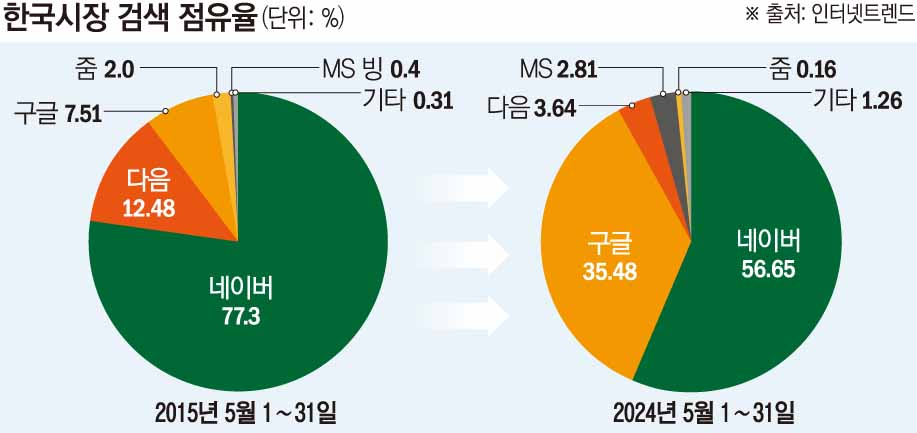
</p>

구글이 가파르게 성장하고는 있으나 여전히 Naver를 사용하는 사람이 반수 이상임을 알 수 있다.  
하지만 난 **Google**을 애용하는 한 사람으로써, 그리고 블로그 특성상 Google 이용률이 높은 개발자 분들이 많이  
찾아주실 것 같아 포스트 썸네일은 구글 로고로 해두었다.

이번 포스트에선 대한민국 1~3등 검색엔진
1. **네이버**

2. **구글**

3. **다음**

3곳에 본 블로그가 노출될 수 있도록 등록 해보려고 한다.

> 본래 지금보다 포스트 수가 더 쌓이면<sub> (뭐 한 50개 정도?)</sub> 진행하려고 했는데,  
> 의외로 글 쓰는게 시간을 엄청나게 잡아먹는다.  
> 가끔은 소스코드 작성보다도 이게 더 오래 걸린다.  
> 이러다 올해 다 갈때까지 등록 못 할 것 같아서 여유 있을때 처리 해두려고 한다.

<br>

## 블로그 설정 파일 수정

사이트를 등록하기 위해선 `robots.txt`, `sitemap.xml` 이 2개의 파일이 필요하다.  
`config.toml`파일에 해당 설정을 추가 해줘야 한다.

```toml
# robots.txt 파일 생성
enableRobotsTXT = true

# sitemap.xml 파일 생성
[sitemap]
changefreq = "daily" # always, hourly daily, weekly, monthly, yearly, never
filename = "sitemap.xml"
priority = 0.5
```

<br>

## Naver 검색엔진에 노출시키기


1. [네이버 서치어드바이저](https://searchadvisor.naver.com/)에 접속한다.

2. 네이버 계정으로 로그인 한다.

3. 상단의 `웹마스터 도구`로 들어간다.

    <p align='left'>
        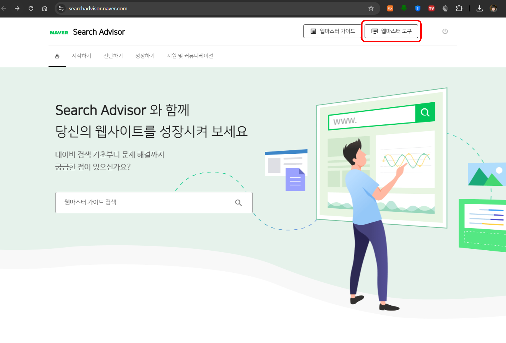
    </p>

4. 블로그의 주소를 입력한다. 내 경우 `https://blog.ayteneve93.com`이었다.  

    이는 Cloudflare 도메인을 GitHub Page의 커스텀 도메인으로 추가해서 그런 것이다.

    <p align='left'>
        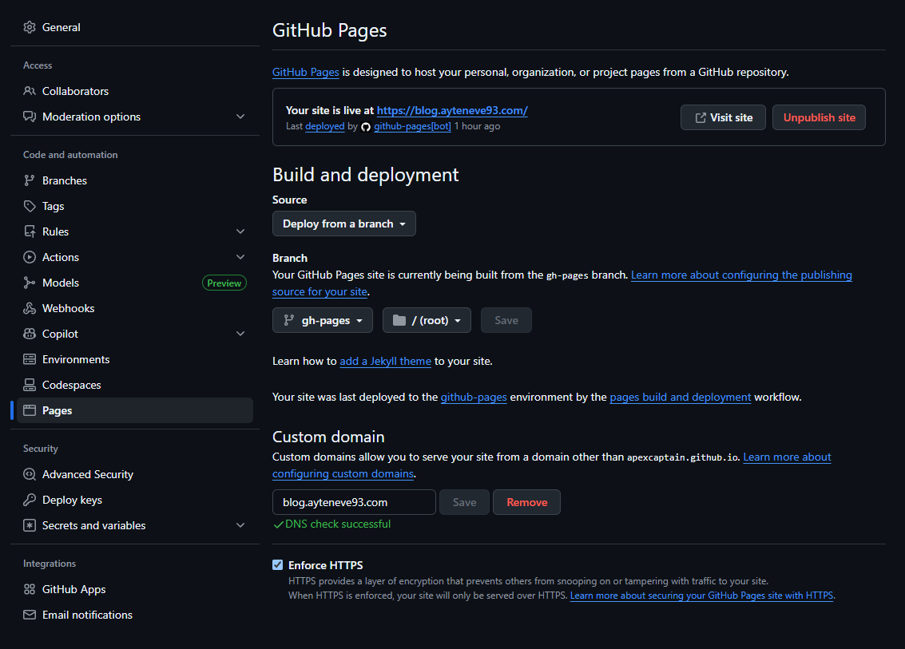
    </p>

    보통은 `https://your-github-username.github.io`로 입력하면 된다.

5. `Site Verification`을 위한 html을 등록하라고 한다.  
    Naver에서 제공하는 html 파일을 다운로드 받은 후 Hugo 프로젝트의 `static` 폴더에 넣고 github에 push한다. 

    <p align='left'>
        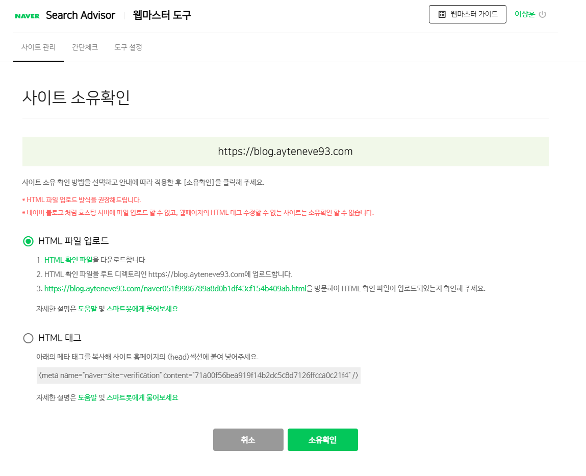
    </p>

6. 사이트 목록에서 등록한 사이트로 들어가보자.

    <p align='left'>
        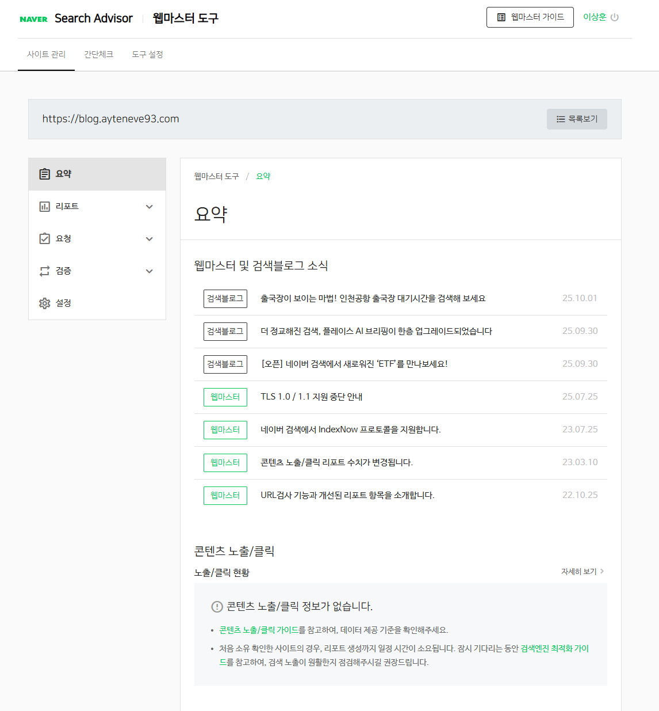
    </p>

    여기까지 무리없이 왔다면 사이트 소유권은 확인 된 것이다.

7. 로봇룰 검증

    `검증` -> `robots.txt`으로 들어가 `수집요청`을 눌러 로봇룰 검증을 실시한다.

    <p align='left'>
        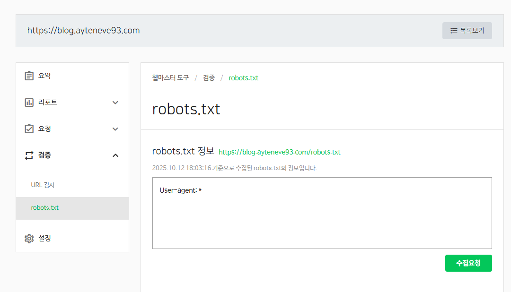
    </p>

8. 사이트맵 제출

    `요청` -> `사이트맵 제출`로 들어가 `블로그 주소/sitemap.xml`을 입력한다.

    <p align='left'>
        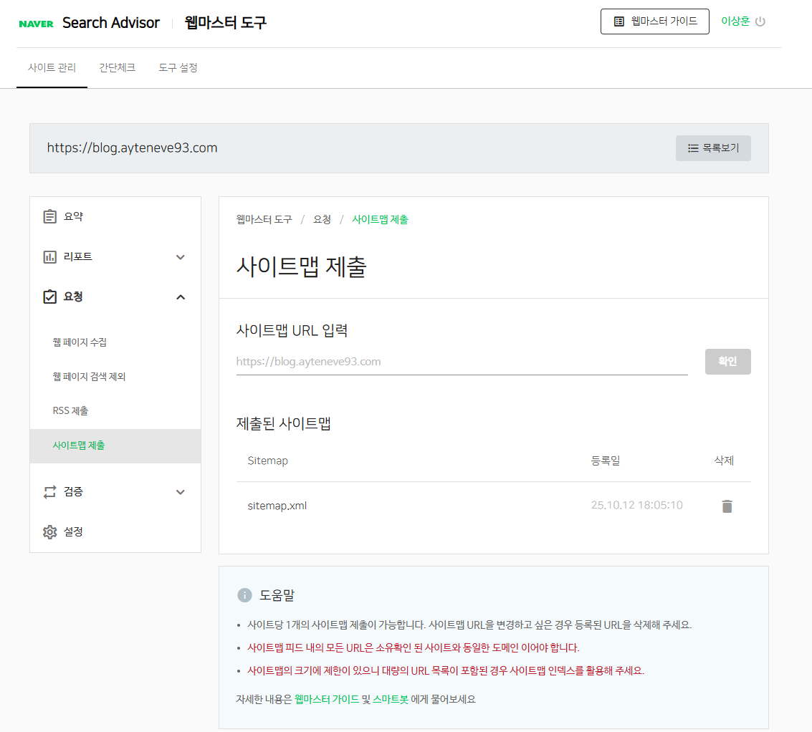
    </p>

9. RSS 제출

    `요청` -> `RSS 제출`로 들어가 `블로그 주소/index.xml`을 입력한다.

    <p align='left'>
        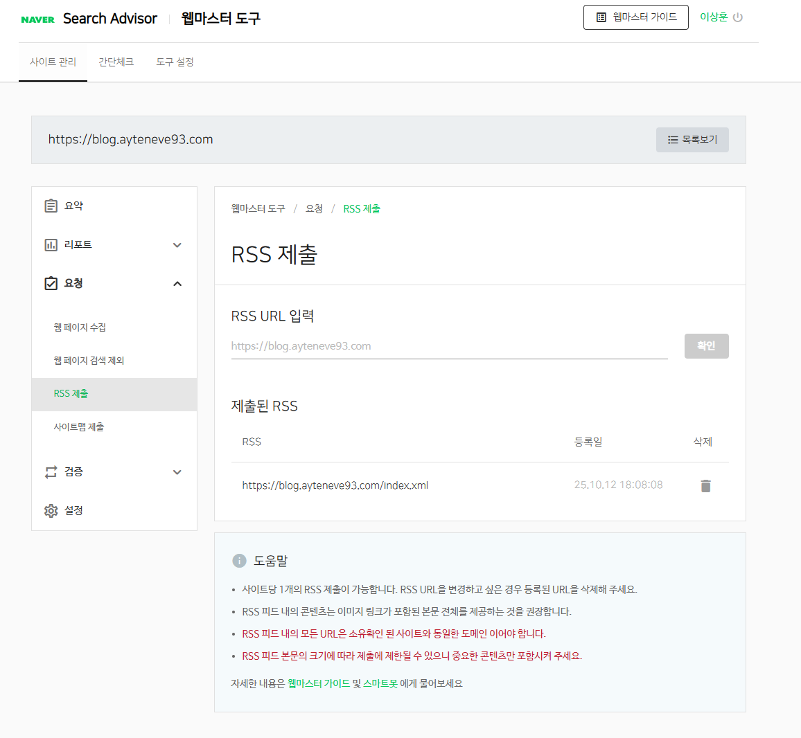
    </p>


<br>

## Google 검색엔진에 노출시키기

1. [구글 서치 콘솔](https://search.google.com/search-console/about?hl=ko)로 접속 -> `시작하기`버튼을 누른다.

2. 사이트 등록

    `새 요소 추가` -> URL 접두어에 블로그 주소를 입력한다.

    <p align='left'>
        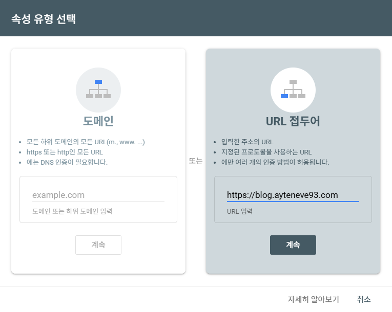
    </p>

2. `Site Verification`을 위한 html을 등록하라고 한다.  
    Naver와 마찬가지로 Hugo 프로젝트의 `static` 디렉토리 밑에 다운받은 html 파일을 넣고 github에 push 해주자.

    여담으로 나는 이 부분에서 문제가 발생했었다. 사이트 소유권 검증이 안 되었던 것이다.  
    확인 결과 Cloudflare rullset 설정 떄문이란 걸 알았다.
    ```typescript
    firewallRules = this.provide(Ruleset, 'firewallRules', id => ({
        zoneId: this.cloudflareZoneStack.dataAyteneve93Zone.element.zoneId,
        name: id,
        description: dedent`
            Allow ArgoCD webhooks and all traffic to Blog.
            Otherwise, block countries except Korea and Japan.
        `,
        kind: 'zone',
        phase: 'http_request_firewall_custom',
        rules: [
            {
                description: 'Allow all traffic to blog',
                enabled: true,
                action: 'skip',
                expression: `http.host eq "${this.cloudflareRecordStack.blogRecord.element.name}"`,
                actionParameters: {
                ruleset: 'current',
                },
            },
            {
                description: 'Allow ArgoCD webhooks',
                enabled: true,
                action: 'skip',
                logging: {
                enabled: true,
                },
                expression: `http.host eq "${this.cloudflareRecordStack.argoCdRecord.element.name}" and http.request.uri.path contains "/api/webhook"`,
                actionParameters: {
                ruleset: 'current',
                },
            },
            {
                description: 'Block countries except Korea and Japan',
                enabled: true,
                action: 'block',
                expression: '(ip.geoip.country ne "KR" and ip.geoip.country ne "JP")',
            },
        ],
    }));
    ```
    위는 CDK for Terraform으로 작성한 Cloudflare 설정 코드의 일부이다.

    기본적으로 `한국`과 `일본`에서만 접속할 수 있도록 해두었는데(규칙 3번),  
    Google은 국내 기업이 아니어서 생긴 문제였다.  
    어떻게 할까 하다가 그냥 `blog` 레코드는 차단에서 제외했다(규칙 1번).  
    비슷한 이슈가 있는 사람이라면 참고하길 바란다.

3. 사이트맵, RSS 제출

    `속성` -> `Sitemaps`로 들어가 `새 사이트맵 추가`에 그대로  
    `sitemap.xml`과 `index.xml`을 입력해 제출한다.

    <p align='left'>
        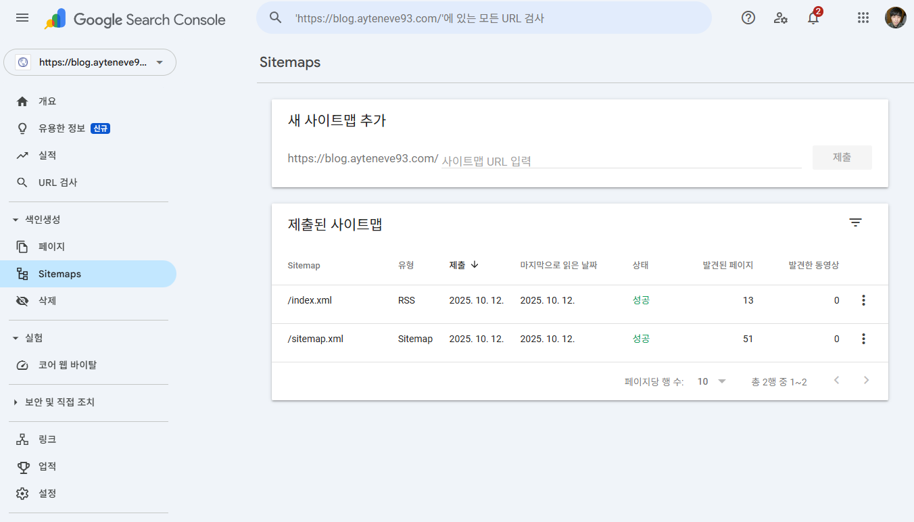
    </p>


<br>

## Daum 검색엔진에 노출시키기

1. [다음 검색등록 페이지](https://register.search.daum.net/index.daum)로 이동한다.

2. `블로그 등록`을 체크하고 블로그 주소를 입력한다.

    `http`라고 적혀있는 건 신경 쓸 필요 없다.

    <p align='left'>
        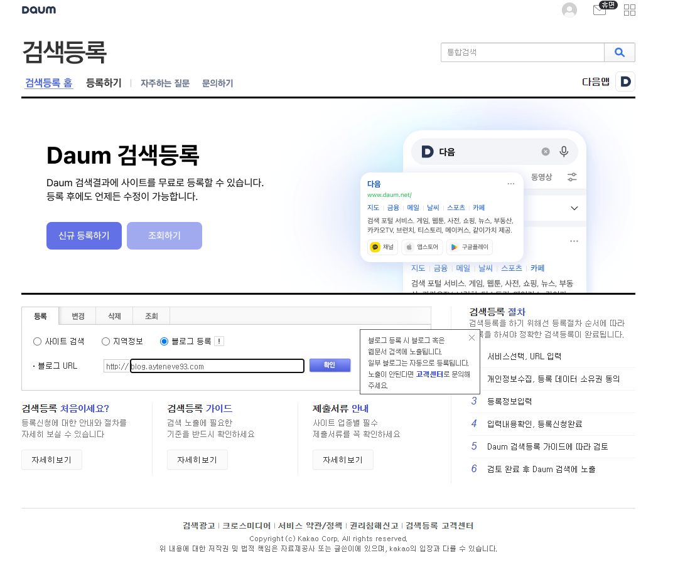
    </p>

3. 개인정보 관련 규정 페이지가 나온다. 동의 후 확인을 눌러주자.

    <p align='left'>
        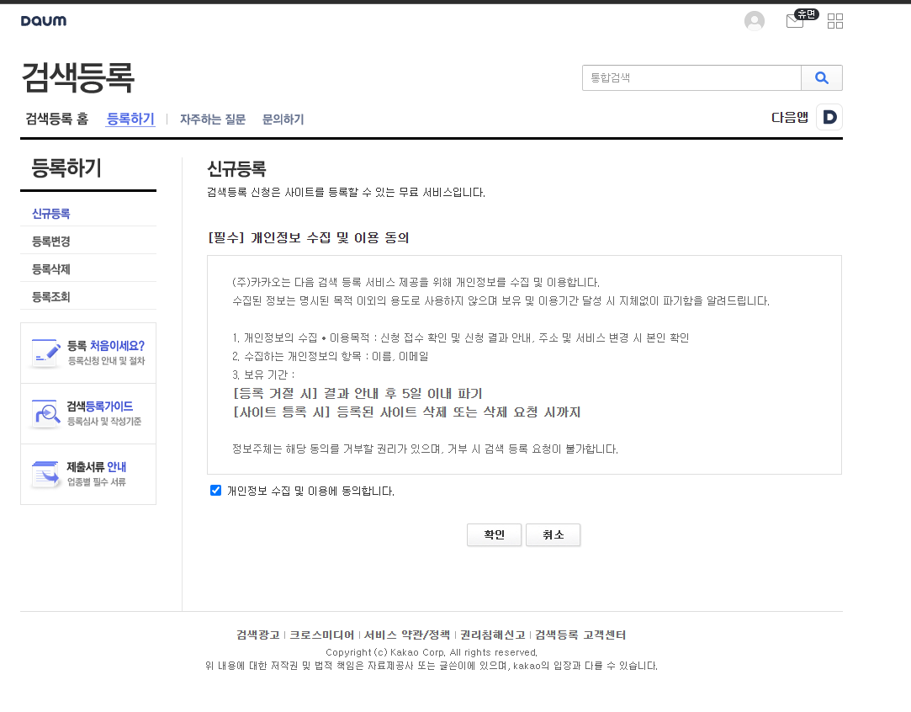
    </p>

4. 이메일 주소를 입력하라고 한다. 입력 해주자.

5. 등록이 완료되면 다음과 같이 나온다.

    <p align='left'>
        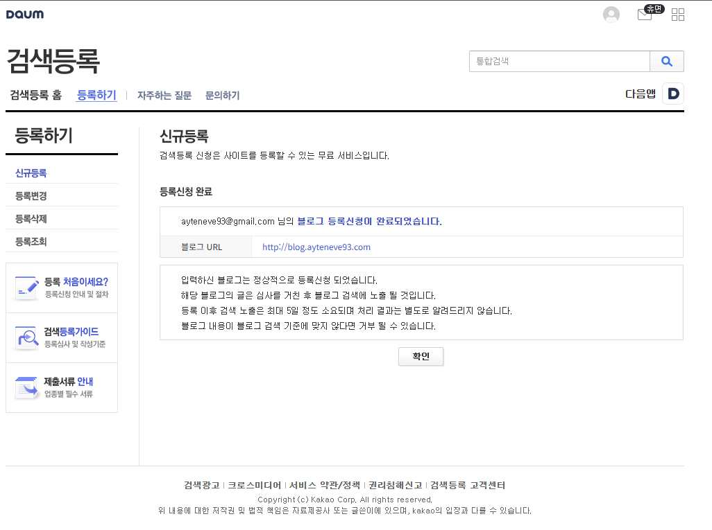
    </p>