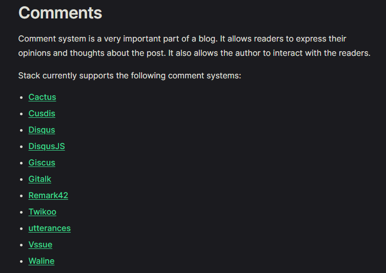
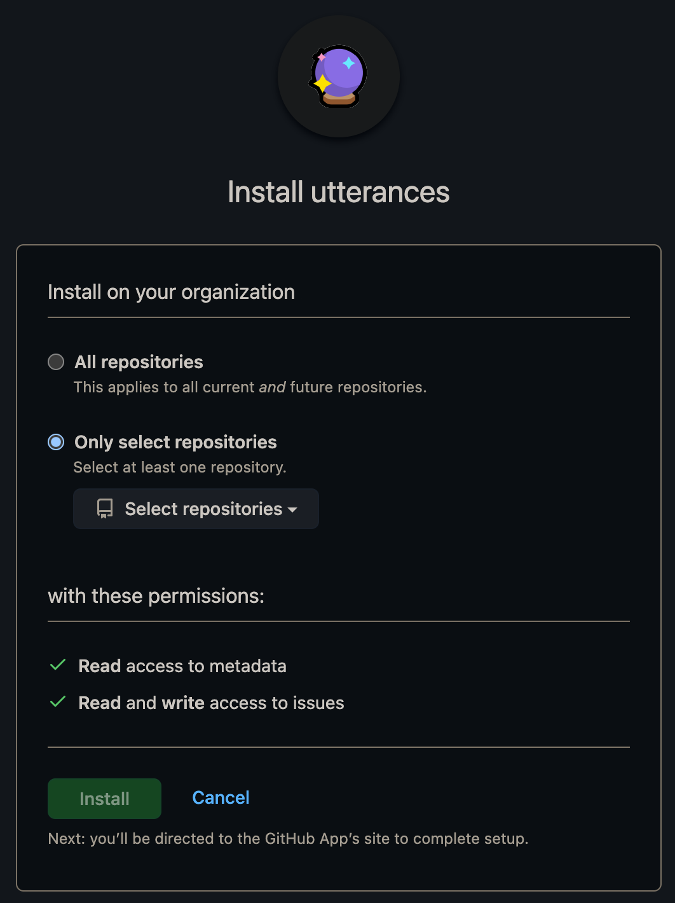
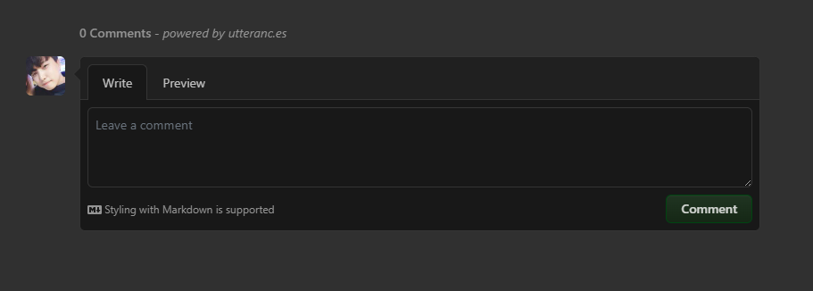
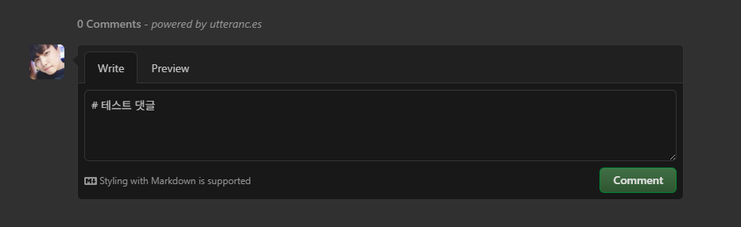
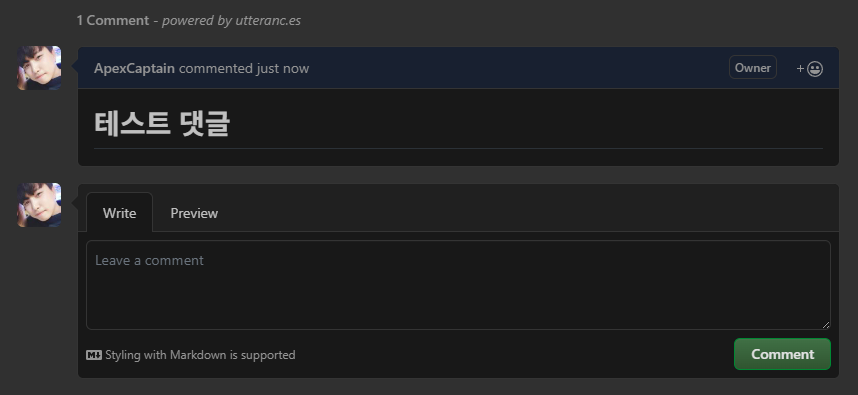
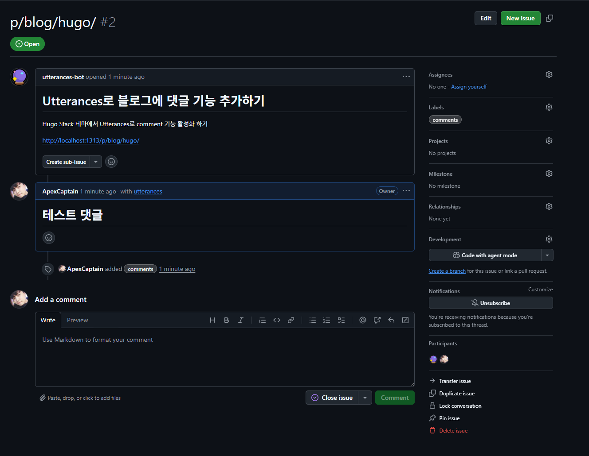

## 개요

현재 이 블로그는 [Hugo](https://gohugo.io/) 프레임워크의 [Stack Theme](https://github.com/CaiJimmy/hugo-theme-stack)을 적용해서 빌드 되었다.

이 글을 쓰고 있는 시간 기준으로 아직까지 포스트 된 글의 수가 많지는 않지만 추후 방문자 분들과 소통 해야 할 필요성이 있어 댓글 기능을 추가하고자 한다.

<br>

## 댓글 시스템의 종류

[Hugo Stack Theme의 가이드라인](https://stack.jimmycai.com/config/comments)에 따르면 지원되는 댓글 시스템은 다음과 같다.

<p align='center'>
    
</p>

<br>

| 시스템 | 데이터 저장소 | 주요 장점 | 주요 단점 |
| :--- | :--- | :--- | :--- |
| **Disqus** | Disqus 서버 | 기능 풍부, 사용자 익숙도 높음, 스팸 방지. | **광고 (무료)**, 로딩 지연 가능성, 데이터 종속. |
| **DisqusJS** | Disqus 서버 | Disqus 기능 + **성능 개선 (클릭 시 로드).** | 설정 복잡, 결국 Disqus에 의존. |
| **Cusdis** | Cusdis 서버/자체 호스팅 | **매우 경량**, **프라이버시 우선 (광고/추적 없음).** | 기능 단순, UI 커스터마이징 제한. |
| **Twikoo** | 서버리스 DB | 다양한 기능(이미지/Katex), **쉬운 서버리스 배포.** | 별도 서버리스 환경 구성 필요. |
| **Remark42** | 내 서버 (Boltdb) | **K8s/Docker에 최적화**, **데이터 완전 소유**, 프라이버시 보호. | 초기 **서버 설치 및 관리 필요**. |
| **Cactus** | Matrix 네트워크 | **탈중앙화**, 데이터 호스팅 주체 선택 가능. | Matrix 계정 필요, 낮은 인지도. |
| **Giscus** | **GitHub Discussions** | **서버 불필요**, **GitHub 리액션** 활용, 경량. | **GitHub 계정 필수**, 비기술 사용자 접근 어려움. |
| **Gitalk** | **GitHub Issues** | **서버 불필요**, 경량, 데이터 소유권. | **GitHub 계정 필수**, 기능 단순. |
| **utterances** | **GitHub Issues** | **가장 경량화**, 깔끔한 GitHub 스타일 UI. | **GitHub 계정 필수**, 기능 단순. |
| **Vssue** | **다중 Git 플랫폼** | **GitHub 외 GitLab/Bitbucket 지원**, 서버 불필요. | Git 계정 필수. |
| **Waline** | 서버리스 DB | 라이트웨이트, 쉬운 배포, 다양한 형식 지원. | 별도의 서버리스 백엔드 필요. |


이 중 가장 경량화 된 방식인 `utterances`를 사용해서 댓글 시스템을 추가하고자 한다.

추후 여유가 되면 `Remark42` 방식으로 k8s에 자체 호스팅을 할 계획이다.

<br><br>

## 적용

### Utterances 앱 설치

[GitHub Marketplace 링크](https://github.com/apps/utterances)로 들어가 애플리케이션을 설치한다.

`Only select repositories` 선택 → 댓글을 저장할 Public Repository (보통 블로그 repo와 동일한 것으로 한다.)

<p align='center'>
    
</p>

<br><br>

### 블로그 설정 파일 수정

`Stack` 테마의 경우 `config/_default/params.toml` 파일을 다음과 같이 수정해주면 된다.

```toml
# config/_default/params.toml
[comments]
enabled = true
provider = "utterances"

[comments.utterances]
repo = "ApexCaptain/ApexCaptain.github.io" # utterances 댓글이 저장될 저장소
issueTerm = "pathname"
label = "comments"
```

### 로컬에서 블로그 가동 및 테스트

- hugo 커맨드로 로컬 서버를 구동한다

    `--cleanDestinationDir` 플래그를 함께 넣어줘서 기존에 생성된 `public`, `resources` 폴더를 지우고 재생성 해주자.

    ```bash
    hugo server --cleanDestinationDir
    ```

<br>

- `localhost:1313`으로 접속해 아무 포스트나 들어가서 하단을 보면 다음과 같이 나온다.

    <p align='center'>
        
    </p>

<br>

- 테스트로 댓글 하나를 달아보자.

    <p align='center'>
        
    </p>

<br>

- 그러면 다음과 같이 `markdown`이 적용되어 h1 크기의 큼지막한 댓글이 달린 걸 확인 할 수 있다.

    <p align='center'>
        
    </p>

<br>

- 위에서 지정한 대상 Repository의 Issue 탭을 확인 해보면 다음과 같이 Issue에 댓글이 추가되어 있다.

    <p align='center'>
        
    </p>
