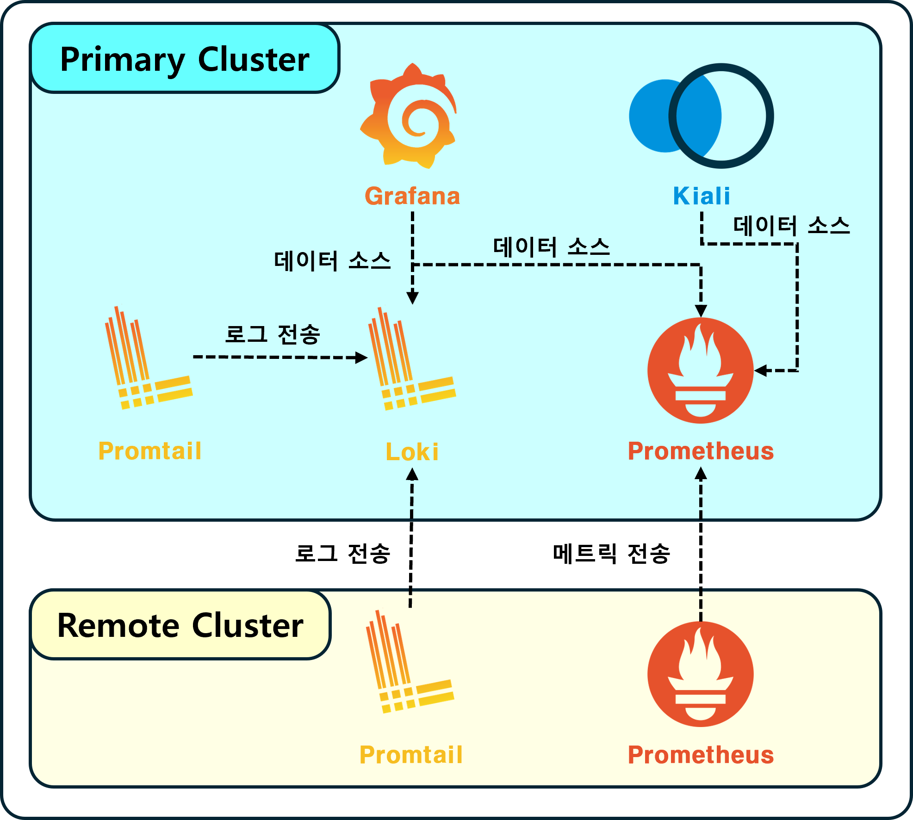
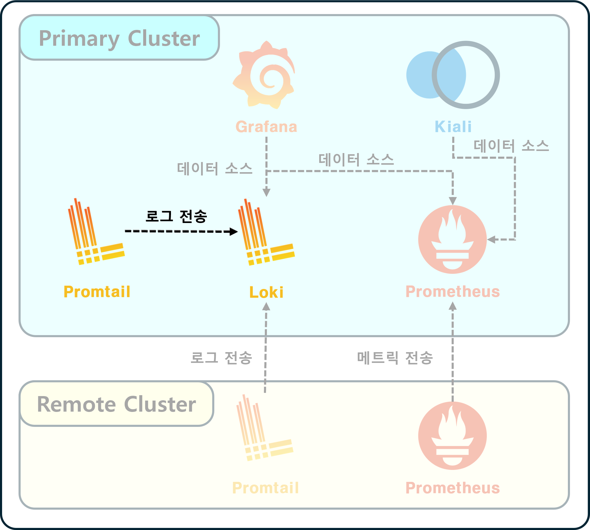
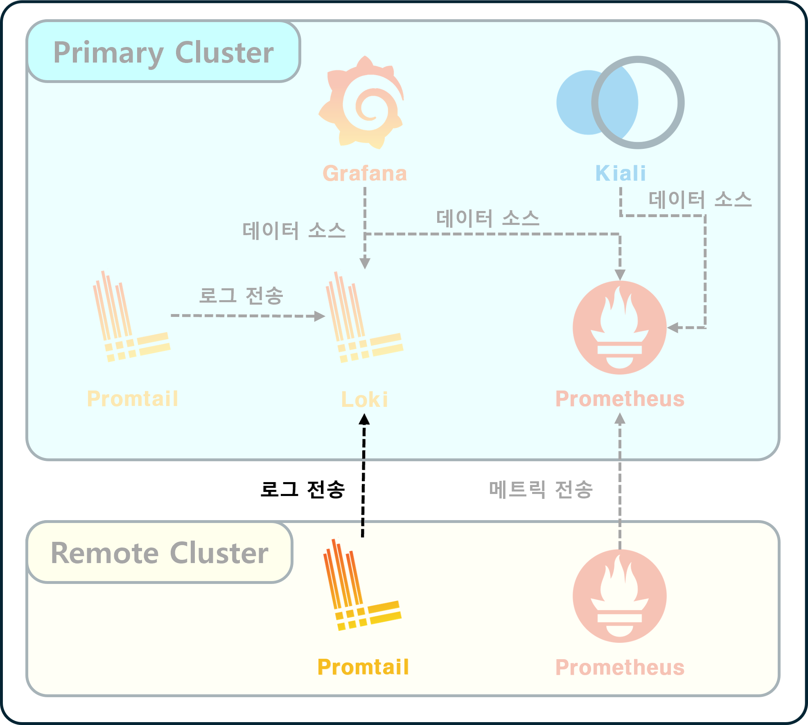
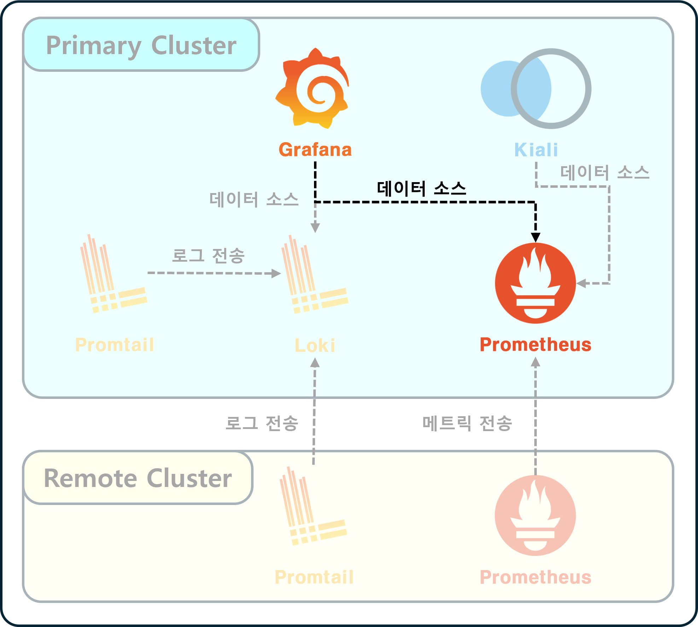
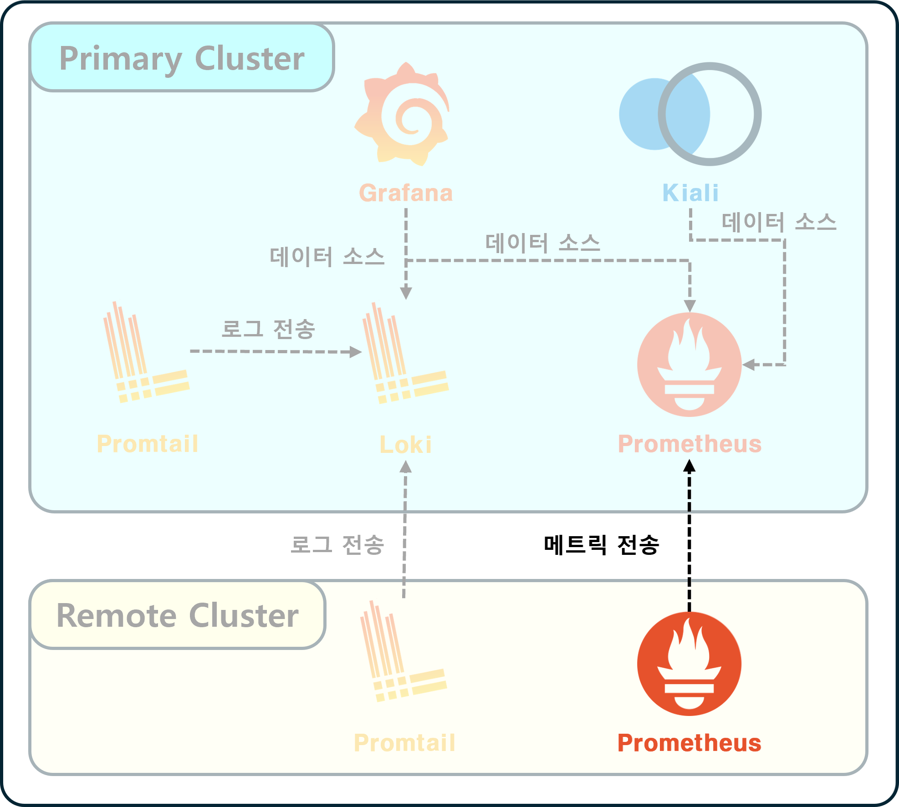
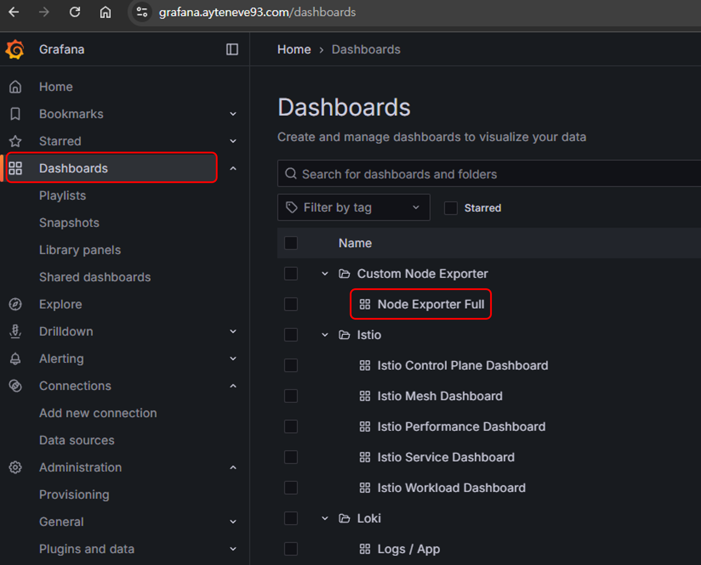
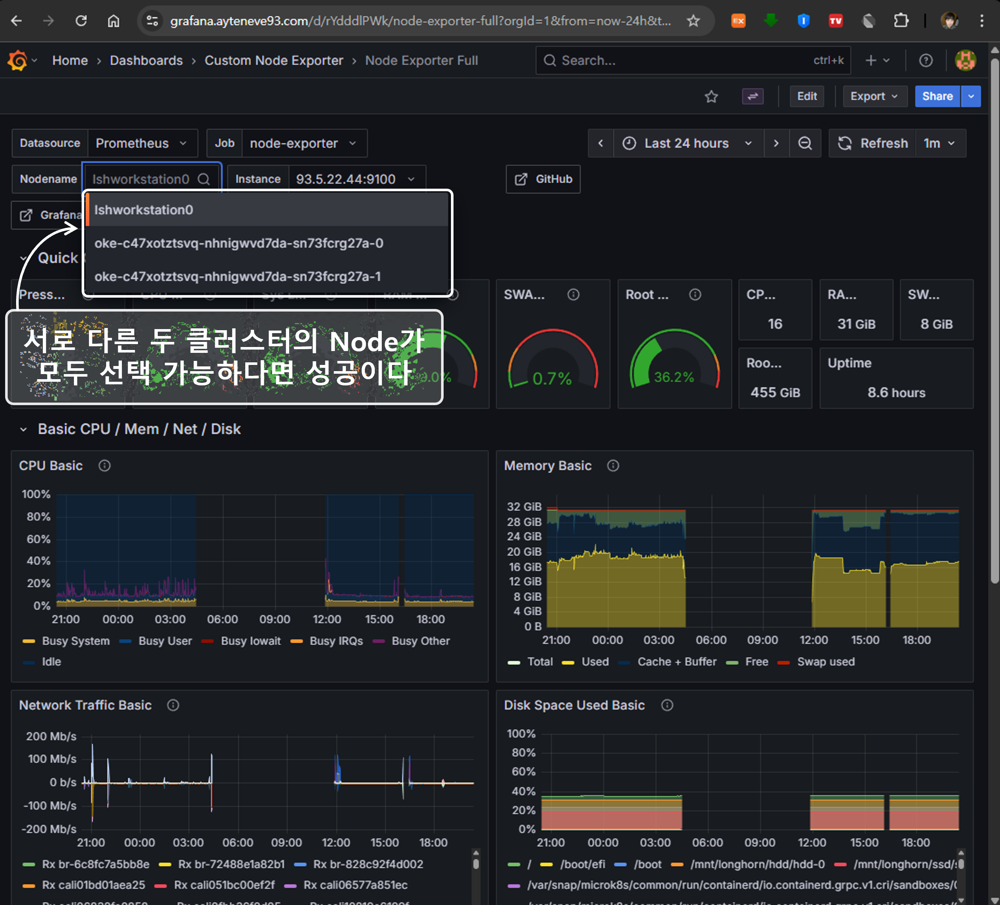
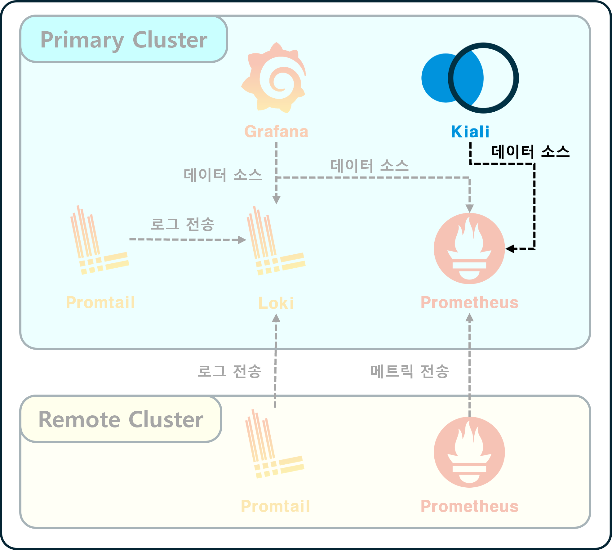
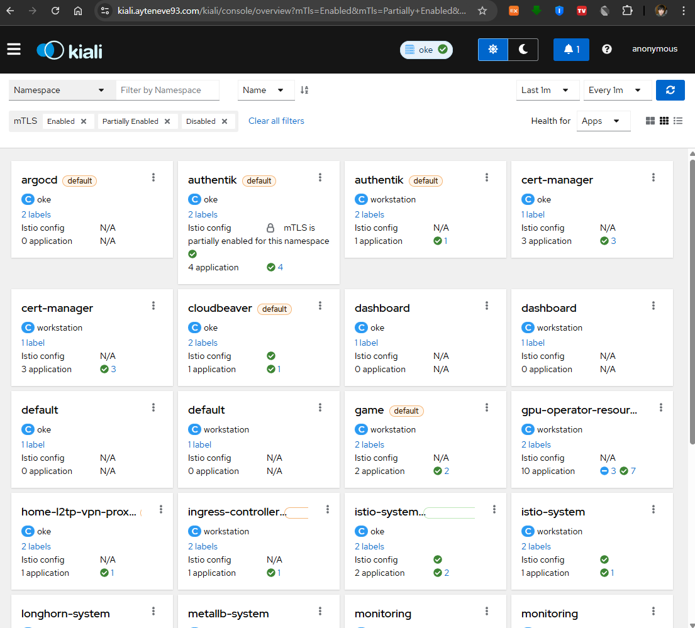
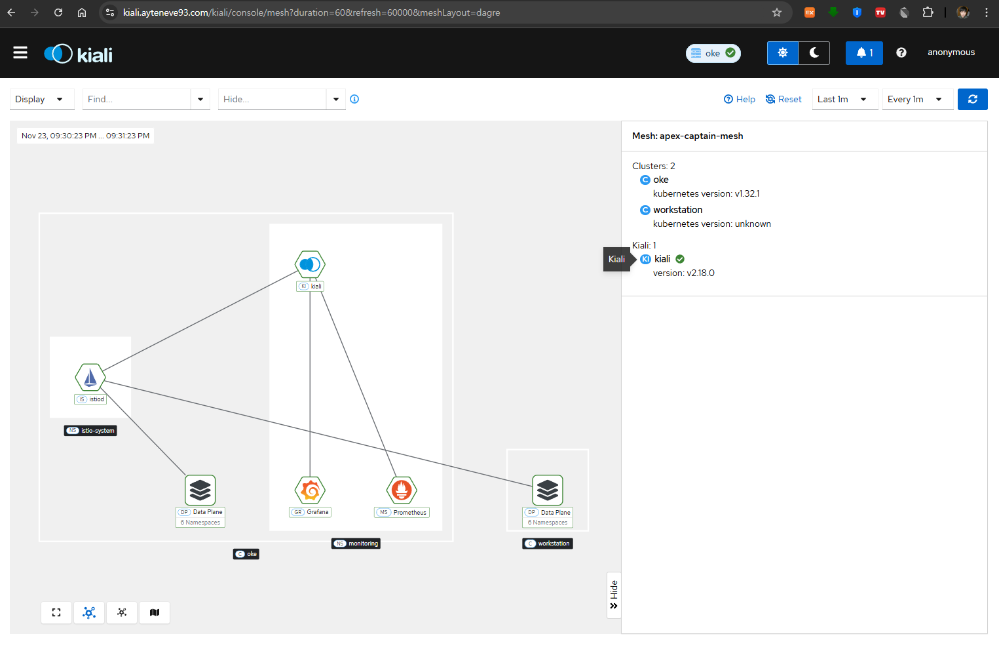

## 들어가기 앞서

며칠 전에 건강검진을 받고 왔다.

피도 뽑고, 혈압도 재고, 환청이 들리진 않는지, 눈이 멀진 않았는지 등등 이런저런 점검을 수행한다.  
행여나 무슨 큰 병이 나기 전에 미리 미리 체크하고 대응할 여지를 만들어 주기 위함이다.

> 서버도 마찬가지로 주기적인 건강검진이 필요하다.  

클러스터 안에서는 동시에 수많은 로직이 동작하고,  
각 워크로드는 클러스터 내 다른 서비스들과 협력하며 크고 복잡한 작업을 수행한다. 

앱이 1~2개 정도라면 직접 `kubectl logs`나 `kubectl top` 커맨드로 안에서 무슨 일이 일어나고 있는지,   
리소스는 얼마나 소모 중인지 파악할 수 있지만, 그 수가 많아지면 인간이 감당하는 것이 불가능해진다.

안색만 살피면 무슨 병을 앓고 있는지 알 수 있을 정도로 실력이 뛰어난 의사가 아니라면,  
X-Ray, CT와 같은 전문적인 장비와 거기서 산출된 일련의 차트 정보를 바탕으로 판단하는 것이 합리적일 것이다.

이번 포스트에선 `Prometheus`, `Loki`, `Kiali`, `Grafana`를 통해 멀티 클러스터 환경에서  
기본적인 모니터링 스택을 구축하는 방법에 대해 공유한다.

<br>

## 시스템 개요

<p align='left'>
    
</p>

전체 시스템의 개요는 위와 같다.

설치되는 컴포넌트 수가 많은 만큼 최종 결과물이 굉장히 다양할 수밖에 없다.    
예를 들어 총 5개의 옵션이 있는 3개의 선택지가 있다면, 발생할 수 있는 경우의 수는 **125**가지나 된다.  
당연히 그 모든 경우에 대해 빠짐없이 기술하는 것은 한계가 있다.  

Multi Cluster 모니터링 스택에 대해 최대한 간략하게 정의한 요구사항은 다음과 같다.

1. **2개 이상의 클러스터**에서

2. **메트릭 / 서비스 메시 / 애플리케이션 로그** 데이터를 수집하여

3. **통합된 대시보드**<sub>(Grafana, Kiali)</sub>로 확인 가능할 것

<br>

### ELK 대신 Loki를 택한 이유

이번 작업에선 ELK<sub>(Elasticsearch, Logstash, Kibana)</sub> 대신 Loki를 사용했다.  
이유는 단순하다.

> ELK의 리소스 소모량이 감당이 안 된다.

Oracle에서 무료로 사용 중인 클러스터에 ELK를 설치했다간 배보다 배꼽이 더 커지는 상황이 연출될 것이다.  
이런저런 대체재를 알아봤는데, **Loki**가 k8s에 경량으로 쓰기 좋다는 소식을 들었다.

Elasticsearch의 검색 기능이 매우 훌륭하긴 하나, 샤드 관리하기도 복잡하고 저장 공간도 엄청나게 잡아먹는다.  
Logstash 역시 CPU/메모리 사용량이 굉장히 높다.

Loki는 Elasticsearch와 달리 데이터를 인덱싱하지 않고 레이블을 기반으로 저장한다.  
인덱스 저장 공간이 별도로 필요한 것이 아니므로 저장 공간을 크게 절약할 수 있다.  
당연히 샤드 관리 같은 것도 필요 없다.

<br>

## 공통 네임스페이스 구성

각 섹션의 앞에는 ["Istio를 활용해 다중 Cluster에 Service Mesh 구성하기"](../istio-multi-cluster-service-mesh/) 포스트에서와 마찬가지로  
**어떤 Kubernetes Context**에서 작업하는 것인지 명시했다.

> 사용하는 k8s가 1개라면 `Context : Remote` 레이블이 붙은 섹션은 무시하도록 하자.  

우선 공통적으로 컴포넌트가 배포될 Namespace는 `monitoring`이다.  
각 클러스터에 네임스페이스를 만들어준다.

<span style="background-color:yellow; color:black">**ㅤ⚠️ Context : Primaryㅤ**</span>

```bash
kubectl create namespace monitoring
```

<span style="background-color:lightgreen; color:black">**ㅤ⚠️ Context : Remoteㅤ**</span>

```bash
kubectl create namespace monitoring
```

<br><br>

## Loki & Promtail

### Primary에 Loki & Promtail 설치

<p align='left'>
    
</p>

<span style="background-color:yellow; color:black">**ㅤ⚠️ Context : Primaryㅤ**</span>

Primary Cluster에 `Loki`와 `Promtail`을 설치한다.  
배포는 ["loki-stack"](https://artifacthub.io/packages/helm/grafana/loki-stack) Helm 차트를 사용한다.

#### Helm Chart 가져오기

```bash
helm repo add grafana https://grafana.github.io/helm-charts
```

<br>

#### Helm Values 정의

```yml
# Primary-Loki-Stack.values.yml

# Grafana 설정
grafana:
  # 다른 Helm 차트를 통해 설치할 것이므로 비활성화
  enabled: false

# Loki 설정
# 로그 데이터가 저장되는 일종의 DB이다
# ELK의 Elasticsearch와 유사
loki:
  config:
    limits_config:
      ingestion_burst_size_mb: 200
      ingestion_rate_mb: 100
      max_streams_per_user: 10000
  enabled: true
  persistence:
    accessModes:
    - ReadWriteOnce
    enabled: true
    size: 20Gi
    storageClassName: <사용할 StorageClass 명>
  resources:
    limits:
      cpu: 500m
      memory: 1024Mi
    requests:
      cpu: 300m
      memory: 512Mi

# Promtail 설정
# 로그 수집기이다.
# ELK의 Logstash와 유사
promtail:
  enabled: true
  config:
    clients:
    - external_labels:
        # Primary Cluster의 이름을 적어주자
        # 단일 k8s일 경우 clients 설정 전체를 생략해도 된다
        cluster: oke
      url: http://loki-stack.monitoring.svc.cluster.local:3100/loki/api/v1/push
  resources:
    limits:
      cpu: 200m
      memory: 256Mi
    requests:
      cpu: 100m
      memory: 128Mi
```

<br>

#### Helm 차트 배포

```bash
helm install loki-stack grafana/loki-stack \
    -n monitoring \
    -f Primary-Loki-Stack.values.yml
```

<br>

#### 배포 상태 확인

```bash
kubectl get all \
    -l app.kubernetes.io/instance=loki-stack \
    -n monitoring
```

다음과 같이 출력되면 정상이다.

```bash
NAME                            READY   STATUS    RESTARTS   AGE
pod/loki-stack-promtail-gckgr   1/1     Running   0          4d4h
pod/loki-stack-promtail-tnnrz   1/1     Running   0          4d4h

NAME                                 DESIRED   CURRENT   READY   UP-TO-DATE   AVAILABLE   NODE SELECTOR   AGE
daemonset.apps/loki-stack-promtail   2         2         2       2            2           <none>          4d4h
```

<br><br>

### Primary Loki 외부 진입점 설정

<span style="background-color:yellow; color:black">**ㅤ⚠️ Context : Primaryㅤ**</span>

Ingress 혹은 VirtualService 등을 사용해 Loki 외부 진입점을 만들어 줘야 한다.  
이는 Remote Cluster에 추후 설치할 Promtail이 Primary의 Loki에 데이터를 밀어넣을 수 있도록 하기 위함이다.

단일 클러스터를 운영 중이라면 이 부분은 생략하도록 하자.

내 경우 VirtualService를 통해 외부로 노출하였다.

#### VirtualService 정의

```yaml
# Primary-Loki-VS.yml
apiVersion: networking.istio.io/v1
kind: VirtualService
metadata:
  name: monitoring-loki-virtual-service
  namespace: monitoring
spec:
  gateways:
    - <사용할 Istio Gateway. 가령, istio-system/my-istio-gateway>
  hosts:
    - <사용할 Domain Host. 가령, my-primary-loki.example.com>
  http:
    - match:
        - port: 3100
      route:
        - destination:
            host: loki-stack
            port:
              number: 3100


```

#### VirtualService 배포

```bash
kubectl apply -f Primary-Loki-VS.yml
```

<br><br>

### Remote에 Promtail 설치

<p align='left'>
    
</p>


<span style="background-color:lightgreen; color:black">**ㅤ⚠️ Context : Remoteㅤ**</span>

"Loki"는 이미 Primary에 설치되어 있으므로, Remote Cluster에는 Promtail만 설치하면 된다.  
Promtail 단일 컴포넌트만 배포해도 상관 없지만, 편의를 위해 동일한 Helm Chart를 사용하였다.


#### Helm Values 정의

```yaml
# Remote-Loki-Stack.values.yml

# Grafana 설정
grafana:
  # Primary와 마찬가지 이유로 Grafana 비활성화
  enabled: false

# Loki 설정
loki:
  # Primary의 Loki를 쓸 예정이므로 이것도 비활성화
  enabled: false

# Promtail 설정
promtail:
  config:
    clients:
    - external_labels:
        # Remote Cluster의 이름을 적어주자
        cluster: workstation
      url: https://<앞서 설정한 Primary Loki의 도메인, 가령 my-primary-loki.example.com>/loki/api/v1/push
  enabled: true
  resources:
    limits:
      cpu: 400m
      memory: 1Gi
    requests:
      cpu: 200m
      memory: 512Mi

```

#### Helm 차트 배포

```bash
helm install loki-stack grafana/loki-stack \
    -n monitoring \
    -f Remote-Loki-Stack.values.yml
```

<br>

#### 배포 상태 확인

```bash
kubectl get all \
    -l app.kubernetes.io/instance=loki-stack \
    -n monitoring
```

다음과 같이 출력되면 정상이다.

```bash
NAME                            READY   STATUS    RESTARTS   AGE
pod/loki-stack-promtail-22vvg   1/1     Running   15         4d4h

NAME                                 DESIRED   CURRENT   READY   UP-TO-DATE   AVAILABLE   NODE SELECTOR   AGE
daemonset.apps/loki-stack-promtail   1         1         1       1            1           <none>          4d5h
```

Primary와 다르게 Promtail만 설치된 모습이다.

<br><br>

## Prometheus & Grafana

### Primary에 Prometheus & Grafana 설치


<p align='left'>
    
</p>

<span style="background-color:yellow; color:black">**ㅤ⚠️ Context : Primaryㅤ**</span>

Primary Cluster에 `Prometheus`와 `Grafana`를 설치한다.  
배포는 [kube-prometheus-stack](https://github.com/prometheus-community/helm-charts/tree/main/charts/kube-prometheus-stack) Helm 차트를 사용한다.

#### Helm Chart 가져오기

```bash
helm repo add prometheus-community https://prometheus-community.github.io/helm-charts
```

<br>

#### Helm Values 정의

```yml
# Primary-Kube-Prometheus-Stack.values.yml

# AlertManager 설정
alertmanager:
  # 비활성화
  # 이 부분은 추후 다른 포스트를 통해 다루도록 하겠다.
  enabled: false

# Grafana 설정
grafana:
  enabled: true

  # Primary Cluster에 배포한 Loki를 데이터 소스에 추가해주자
  additionalDataSources:
  - access: proxy
    isDefault: false
    jsonData:
      maxLines: 1000
    name: Loki
    type: loki
    url: http://loki-stack.monitoring.svc.cluster.local:3100

  adminPassword: <관리자 비밀번호>
  adminUser: <관리자 ID>
  defaultDashboardsTimezone: Asia/Seoul

  persistence:
    accessModes:
    - ReadWriteOnce
    enabled: true
    finalizers:
    - kubernetes.io/pvc-protection
    size: 20Gi
    storageClassName: <사용할 StorageClass 명>
    type: sts

  # Grafana Dashboard 설정
  # 미리 각종 Dashboard를 추가해두었다.
  # dashboardProviders, dashboards 모두 비워두고 추후 웹에서 추가해도 된다.
  dashboardProviders:
    dashboardproviders.yaml:
      apiVersion: 1
      providers:
      - folder: Custom Node Exporter
        name: custom-node-exporter
        options:
          path: /var/lib/grafana/dashboards/custom-node-exporter
        type: file
      - folder: Istio
        name: istio
        options:
          path: /var/lib/grafana/dashboards/istio
        type: file
      - folder: Loki
        name: loki
        options:
          path: /var/lib/grafana/dashboards/loki
        type: file

  dashboards:
    custom-node-exporter:
      node-exporter-full:
        datasource: Prometheus
        gnetId: 1860
        revision: 42
    istio:
      istio-control-plane-dashboard:
        datasource: Prometheus
        gnetId: 7645
        revision: 278
      istio-mesh-dashboard:
        datasource: Prometheus
        gnetId: 7639
        revision: 278
      istio-performance-dashboard:
        datasource: Prometheus
        gnetId: 11829
        revision: 278
      istio-service-dashboard:
        datasource: Prometheus
        gnetId: 7636
        revision: 278
      istio-workload-dashboard:
        datasource: Prometheus
        gnetId: 7630
        revision: 278
    loki:
      logs-app:
        datasource: Loki
        gnetId: 13639
        revision: 2

# Prometheus 설정
prometheus:
  enabled: true
  prometheusSpec:
    enableRemoteWriteReceiver: true
    externalLabels:
      cluster: oke
    resources:
      limits:
        cpu: "1"
        memory: 2Gi
      requests:
        cpu: 300m
        memory: 512Mi
    storageSpec:
      volumeClaimTemplate:
        spec:
          accessModes:
          - ReadWriteOnce
          resources:
            requests:
              storage: 50Gi
          storageClassName: <사용할 StorageClass 명>
```

<br>

#### Helm 차트 배포

```bash
helm install kube-prometheus-stack prometheus-community/kube-prometheus-stack \
    -n monitoring \
    -f Primary-Kube-Prometheus-Stack.values.yml
```

<br>

#### 배포 상태 확인

```bash
kubectl get all \
    -l app.kubernetes.io/instance=kube-prometheus-stack \
    -n monitoring
```

다음과 같이 출력되면 정상이다.

```bash
NAME                                                            READY   STATUS    RESTARTS   AGE
pod/kube-prometheus-stack-grafana-0                             3/3     Running   0          5d3h
pod/kube-prometheus-stack-kube-state-metrics-787d55fc86-9j42s   1/1     Running   0          6d4h
pod/kube-prometheus-stack-operator-79df675c88-s6rnj             1/1     Running   0          6d4h
pod/kube-prometheus-stack-prometheus-node-exporter-24rdg        1/1     Running   0          6d4h
pod/kube-prometheus-stack-prometheus-node-exporter-q8tcb        1/1     Running   0          6d4h

NAME                                                     TYPE        CLUSTER-IP      EXTERNAL-IP   PORT(S)             AGE
service/kube-prometheus-stack-grafana                    ClusterIP   10.96.147.47    <none>        80/TCP              6d4h
service/kube-prometheus-stack-grafana-headless           ClusterIP   None            <none>        9094/TCP            5d21h
service/kube-prometheus-stack-kube-state-metrics         ClusterIP   10.96.216.187   <none>        8080/TCP            6d4h
service/kube-prometheus-stack-operator                   ClusterIP   10.96.244.110   <none>        443/TCP             6d4h
service/kube-prometheus-stack-prometheus                 ClusterIP   10.96.134.158   <none>        9090/TCP,8080/TCP   6d4h
service/kube-prometheus-stack-prometheus-node-exporter   ClusterIP   10.96.255.80    <none>        9100/TCP            6d4h

NAME                                                            DESIRED   CURRENT   READY   UP-TO-DATE   AVAILABLE   NODE SELECTOR            AGE
daemonset.apps/kube-prometheus-stack-prometheus-node-exporter   2         2         2       2            2           kubernetes.io/os=linux   6d4h

NAME                                                       READY   UP-TO-DATE   AVAILABLE   AGE
deployment.apps/kube-prometheus-stack-kube-state-metrics   1/1     1            1           6d4h
deployment.apps/kube-prometheus-stack-operator             1/1     1            1           6d4h

NAME                                                                  DESIRED   CURRENT   READY   AGE
replicaset.apps/kube-prometheus-stack-kube-state-metrics-787d55fc86   1         1         1       6d4h
replicaset.apps/kube-prometheus-stack-operator-79df675c88             1         1         1       6d4h

NAME                                             READY   AGE
statefulset.apps/kube-prometheus-stack-grafana   1/1     5d21h
```

<br><br>

### Primary Prometheus 외부 진입점 설정

Loki와 마찬가지로 Prometheus도 Ingress 혹은 VirtualService로 외부 진입점을 만들어줘야 한다.  
내 경우 VirtualService로 작성했다.

#### VirtualService 정의

```yaml
# Primary-Prometheus-VS.yml
apiVersion: networking.istio.io/v1
kind: VirtualService
metadata:
  name: monitoring-prometheus-virtual-service
  namespace: monitoring
spec:
  gateways:
    - <사용할 Istio Gateway. 가령, istio-system/my-istio-gateway>
  hosts:
    - <사용할 Domain Host. 가령, my-primary-prometheus.example.com>
  http:
  - match:
    - port: 9090
    route:
    - destination:
        host: kube-prometheus-stack-prometheus
        port:
          number: 9090

```

#### VirtualService 배포

```bash
kubectl apply -f Primary-Prometheus-VS.yml
```

<br><br>

### Primary에 Istiod Service Monitor 설치

<span style="background-color:yellow; color:black">**ㅤ⚠️ Context : Primaryㅤ**</span>

Prometheus가 Istio 제어 평면의 메트릭을 수집할 수 있도록 Service Monitor 배포

#### ServiceMonitor 정의

```yaml
# Primary-Istiod-ServiceMonitor.yml
apiVersion: monitoring.coreos.com/v1
kind: ServiceMonitor
metadata:
  labels:
    monitoring: istio-control-plane
    release: kube-prometheus-stack
  name: monitoring-istiod-service-monitor
  namespace: monitoring
spec:
  endpoints:
    - interval: 15s
      port: http-monitoring
  jobLabel: istiod
  namespaceSelector:
    matchNames:
      - istio-system
  selector:
    matchExpressions:
      - key: istio
        operator: In
        values:
          - pilot
  targetLabels:
    - app
```

<br>

#### ServiceMonitor 배포

```bash
kubectl apply -f Primary-Istiod-ServiceMonitor.yml
```

<br><br>

### Primary에 Istio Envoy Pod Monitor 설치

<span style="background-color:yellow; color:black">**ㅤ⚠️ Context : Primaryㅤ**</span>

Prometheus가 Istio Envoy Sidecar의 메트릭 정보를 수집할 수 있도록 Pod Monitor 배포

#### PodMonitor 정의

```yaml
# Primary-Istio-Envoy-PodMonitor.yml
apiVersion: monitoring.coreos.com/v1
kind: PodMonitor
metadata:
  labels:
    monitoring: istio-envoy-proxies
    release: kube-prometheus-stack
  name: monitoring-istio-envoy-stats-pod-monitor
  namespace: monitoring
spec:
  jobLabel: envoy-stats
  namespaceSelector:
    any: true
  podMetricsEndpoints:
    - interval: 15s
      path: /stats/prometheus
      port: http-envoy-prom
  selector:
    matchExpressions:
      - key: service.istio.io/canonical-revision
        operator: Exists

```

<br>

#### PodMonitor 배포

```bash
kubectl apply -f Primary-Istio-Envoy-PodMonitor.yml
```

<br><br>

### Remote에 Prometheus 설치

<p align='left'>
    
</p>

<span style="background-color:lightgreen; color:black">**ㅤ⚠️ Context : Remoteㅤ**</span>

"Grafana"는 이미 Primary에 설치되어 있으므로, Remote Cluster에는 Prometheus만 설치하면 된다.

#### Helm Values 정의

```yaml
# Remote-Kube-Prometheus-Stack.values.yml

# AlertManager 설정
alertmanager:
  # 비활성화
  enabled: false

# Grafana 설정
grafana:
  # 비활성화
  enabled: false

# Prometheus 설정
prometheus:
  enabled: true
  prometheusSpec:
    externalLabels:
      # Remote Cluster의 이름을 적어주자
      cluster: workstation
    remoteWrite:
      - url: https://<앞서 설정한 Primary Prometheus의 도메인, 가령 my-primary-prometheus.example.com>/api/v1/write
    resources:
      limits:
        cpu: '1'
        memory: 2Gi
      requests:
        cpu: 500m
        memory: 1024Mi
```

#### Helm 차트 배포

```bash
helm install kube-prometheus-stack prometheus-community/kube-prometheus-stack \
    -n monitoring \
    -f Remote-Kube-Prometheus-Stack.values.yml
```

<br>

#### 배포 상태 확인

```bash
kubectl get all \
    -l app.kubernetes.io/instance=kube-prometheus-stack \
    -n monitoring
```

다음과 같이 출력되면 정상이다.

```bash
NAME                                                            READY   STATUS    RESTARTS   AGE
pod/kube-prometheus-stack-kube-state-metrics-787d55fc86-dnlzf   1/1     Running   15         4d5h
pod/kube-prometheus-stack-operator-79df675c88-xpdxw             1/1     Running   15         4d5h
pod/kube-prometheus-stack-prometheus-node-exporter-sjwml        1/1     Running   15         4d5h

NAME                                                     TYPE        CLUSTER-IP       EXTERNAL-IP   PORT(S)             AGE
service/kube-prometheus-stack-kube-state-metrics         ClusterIP   10.152.183.231   <none>        8080/TCP            4d5h
service/kube-prometheus-stack-operator                   ClusterIP   10.152.183.227   <none>        443/TCP             4d5h
service/kube-prometheus-stack-prometheus                 ClusterIP   10.152.183.185   <none>        9090/TCP,8080/TCP   4d5h
service/kube-prometheus-stack-prometheus-node-exporter   ClusterIP   10.152.183.205   <none>        9100/TCP            4d5h

NAME                                                            DESIRED   CURRENT   READY   UP-TO-DATE   AVAILABLE   NODE SELECTOR            AGE
daemonset.apps/kube-prometheus-stack-prometheus-node-exporter   1         1         1       1            1           kubernetes.io/os=linux   4d5h

NAME                                                       READY   UP-TO-DATE   AVAILABLE   AGE
deployment.apps/kube-prometheus-stack-kube-state-metrics   1/1     1            1           4d5h
deployment.apps/kube-prometheus-stack-operator             1/1     1            1           4d5h

NAME                                                                  DESIRED   CURRENT   READY   AGE
replicaset.apps/kube-prometheus-stack-kube-state-metrics-787d55fc86   1         1         1       4d5h
replicaset.apps/kube-prometheus-stack-operator-79df675c88             1         1         1       4d5h
```

<br><br>

### Remote에 Istio Envoy Pod Monitor 설치

<span style="background-color:lightgreen; color:black">**ㅤ⚠️ Context : Remoteㅤ**</span>

Prometheus가 Istio Envoy Sidecar의 메트릭 정보를 수집할 수 있도록 Pod Monitor 배포

#### PodMonitor 정의

```yaml
# Remote-Istio-Envoy-PodMonitor.yml
apiVersion: monitoring.coreos.com/v1
kind: PodMonitor
metadata:
  labels:
    monitoring: istio-envoy-proxies
    release: kube-prometheus-stack
  name: monitoring-istio-envoy-stats-pod-monitor
  namespace: monitoring
spec:
  jobLabel: envoy-stats
  namespaceSelector:
    any: true
  podMetricsEndpoints:
    - interval: 15s
      path: /stats/prometheus
      port: http-envoy-prom
  selector:
    matchExpressions:
      - key: service.istio.io/canonical-revision
        operator: Exists

```

<br>

#### PodMonitor 배포

```bash
kubectl apply -f Remote-Istio-Envoy-PodMonitor.yml
```

<br><br>

### Primary Grafana 외부 진입점 설정

<span style="background-color:yellow; color:black">**ㅤ⚠️ Context : Primaryㅤ**</span>

이제 Grafana의 외부 진입점을 설정해 웹 페이지를 통해 확인해볼 차례이다.

#### VirtualService 정의

```yaml
# Primary-Grafana-VS.yml
apiVersion: networking.istio.io/v1
kind: VirtualService
metadata:
  name: monitoring-grafana-virtual-service
  namespace: monitoring
spec:
  gateways:
    - <사용할 Istio Gateway. 가령, istio-system/my-istio-gateway>
  hosts:
    - <사용할 Domain Host. 가령, my-primary-grafana.example.com>
  http:
    - route:
        - destination:
            host: kube-prometheus-stack-grafana
            port:
              number: 80

```

#### VirtualService 배포

```bash
kubectl apply -f Primary-Grafana-VS.yml
```

<br>

#### Grafana 페이지 접속

Ingress 혹은 VirtualService로 설정한 Host에 접속해보자.  

Primary Cluster에 kube-prometheus-stack 배포 시,  
Grafana의 대시보드 값을 넣어줬다면, 설정한 대시보드가 미리 프로비저닝되어 있을 것이다.

<p align='center'>
    
</p>

> `Dashboard` -> `Custom Node Exporter` -> `Node Exporter Full`로 접속해보자

<p align='center'>
    
</p>

두 클러스터의 정보를 모두 확인 가능하다면 기본적인 Grafana 설정은 완료되었다.

<br><br>

## Kiali

### Primary에 Kiali Operator 설치

<p align='left'>
    
</p>

<span style="background-color:yellow; color:black">**ㅤ⚠️ Context : Primaryㅤ**</span>

Kiali는 Operator Pattern을 사용하는 것이 일반적이다.  

별도 네임스페이스에 kiali-operator를 helm으로 설치하고,  
배포된 CRD와 Operator를 통해 monitoring 네임스페이스에 실제 Kiali CR을 배포한다.

<br>

#### 네임스페이스 생성

```bash
kubectl create namespace kiali-operator
```

#### Helm Chart 가져오기

```bash
helm repo add kiali https://kiali.org/helm-charts
```

<br>

#### Helm Values 정의

```yml
# Primary-Kiali-Operator.values.yml
cr:
  create: false
```

<br>

#### Helm 차트 배포

```bash
helm install kiali-operator kiali/kiali-operator \
    -n kiali-operator \
    -f Primary-Kiali-Operator.values.yml
```

<br>

#### 배포 상태 확인

```bash
kubectl get all \
    -l app.kubernetes.io/instance=kiali-operator \
    -n kiali-operator
```

다음과 같이 출력되면 정상이다.

```bash
NAME                                  READY   STATUS    RESTARTS   AGE
pod/kiali-operator-8647f4d94c-x75fp   1/1     Running   0          5d18h

NAME                             READY   UP-TO-DATE   AVAILABLE   AGE
deployment.apps/kiali-operator   1/1     1            1           5d18h

NAME                                        DESIRED   CURRENT   READY   AGE
replicaset.apps/kiali-operator-8647f4d94c   1         1         1       5d18h
```

<br><br>

### Remote에 Kiali용 Service Account 생성

<span style="background-color:lightgreen; color:black">**ㅤ⚠️ Context : Remoteㅤ**</span>

Primary에 설치되는 Kiali가 Remote Cluster에 접근할 수 있도록  
Remote에 `Service Account`와 `Cluster Role`, `Cluster Role Binding`을 만들어줘야 한다.

이 부분은 하나의 yml 파일로 정리하도록 하겠다.

#### Manifest 정의

```yaml
# Remote-Kiali-Account-Info.yml
---
apiVersion: v1
kind: ServiceAccount
metadata:
  name: kiali-remote-access-service-account
  namespace: istio-system
secrets:
  - name: kiali-remote-access-service-account-token
---
apiVersion: rbac.authorization.k8s.io/v1
kind: ClusterRole
metadata:
  name: kiali-remote-access-cluster-role
rules:
  - apiGroups:
      - '*'
    resources:
      - '*'
    verbs:
      - get
      - list
      - watch
  - nonResourceURLs:
      - '*'
    verbs:
      - get
---
apiVersion: rbac.authorization.k8s.io/v1
kind: ClusterRoleBinding
metadata:
  name: kiali-remote-access-cluster-role-binding
roleRef:
  apiGroup: rbac.authorization.k8s.io
  kind: ClusterRole
  name: kiali-remote-access-cluster-role
subjects:
  - kind: ServiceAccount
    name: kiali-remote-access-service-account
    namespace: istio-system
---
apiVersion: v1
kind: Secret
metadata:
  name: kiali-remote-access-service-account-token
  namespace: istio-system
  annotations:
    kubernetes.io/service-account.name: kiali-remote-access-service-account
type: kubernetes.io/service-account-token
```

<br>

#### Manifest 배포

```bash
kubectl apply -f Remote-Kiali-Account-Info.yml
```

<br><br>

### Remote ServiceAccount를 기반으로 kubeconfig 작성

<span style="background-color:lightgreen; color:black">**ㅤ⚠️ Context : Remoteㅤ**</span>

#### ca.crt 값 확인

```bash
kubectl get secret kiali-remote-access-service-account-token \
    -n istio-system \
    -o jsonpath='{.data.ca\.crt}'
```

#### token 값 확인

```bash
kubectl get secret kiali-remote-access-service-account-token \
    -n istio-system \
    -o jsonpath='{.data.token}' | base64 -d
```

#### KubeConfig 파일 작성

```yaml
# Kiali-Remote-Kubeconfig.yml
apiVersion: v1
kind: Config
clusters:
  - name: workstation
    cluster:
      server: <Remote Cluster URL>
      certificate-authority-data: <위에서 추출한 ca.crt 값>
users:
  - name: kiali-remote-access-service-account
    user:
      token: <위에서 추출한 token 값>
contexts:
  - name: workstation-context
    context:
      cluster: workstation
      user: kiali-remote-access-service-account
current-context: workstation-context
```
<br><br>

### Primary Kiali -> Remote Cluster에 접속 가능하도록 Secret 생성

<span style="background-color:yellow; color:black">**ㅤ⚠️ Context : Primaryㅤ**</span>

#### Secret 정의

```yaml
# Primary-Kiali-Multi-Cluster-Secret.yml
apiVersion: v1
data:
  workstation: <위에서 생성한 Kiali-Remote-Kubeconfig.yml을 base64로 인코딩한 값>
kind: Secret
metadata:
  annotations:
    kiali.io/cluster: workstation
  labels:
    kiali.io/multiCluster: 'true'
  name: monitoring-kiali-workstation-cluster-secret
  namespace: monitoring
type: Opaque
```

`workstation`은 내가 쓰는 Remote Cluster의 이름이다.

#### Secret 배포

```bash
kubectl apply -f Primary-Kiali-Multi-Cluster-Secret.yml
```

<br>

### Primary에 Kiali 설치

<span style="background-color:yellow; color:black">**ㅤ⚠️ Context : Primaryㅤ**</span>

#### Kiali 정의

```yaml
# Primary-Kiali.yml
apiVersion: kiali.io/v1alpha1
kind: Kiali
metadata:
  name: monitoring-kiali
  namespace: monitoring
spec:
  auth:
    # ⚠️ 인증절차 X
    # 테스트를 위한 것으로 Production에서 사용할 때는 반드시 인증 절차를 구축하도록 하자
    strategy: anonymous
  deployment:
    namespace: monitoring
    accessible_namespaces:
      - '*'
  external_services:
    prometheus:
      url: http://kube-prometheus-stack-prometheus.monitoring.svc.cluster.local:9090
```

<br>

#### Kiali 배포

```bash
kubectl apply -f Primary-Kiali.yml
```

<br><br>

### Primary Kiali 외부 진입점 설정

<span style="background-color:yellow; color:black">**ㅤ⚠️ Context : Primaryㅤ**</span>

이제 Kiali의 외부 진입점을 설정해 웹 페이지를 통해 확인해볼 차례이다.

#### VirtualService 정의

```yaml
# Primary-Kiali-VS.yml
apiVersion: networking.istio.io/v1
kind: VirtualService
metadata:
  name: monitoring-kiali-virtual-service
  namespace: monitoring
spec:
  gateways:
    - <사용할 Istio Gateway. 가령, istio-system/my-istio-gateway>
  hosts:
    - <사용할 Domain Host. 가령, my-primary-kiali.example.com>
  http:
    - route:
        - destination:
            host: kiali
            port:
              number: 20001

```

#### VirtualService 배포

```bash
kubectl apply -f Primary-Kiali-VS.yml
```

<br>

#### Kiali 페이지 접속

Ingress 혹은 VirtualService로 설정한 Host에 접속해보자.

<p align='center'>
    
    <em>두 클러스터의 워크로드들이 모두 표시된다면 성공이다.</em>
</p>


<p align='center'>
    
</p>

Istio Primary-Remote Multi Cluster Mesh 시나리오에 따라  
OKE(Primary)에 단일 제어 평면(Control Plane),  
그리고 각 클러스터에 1개씩의 데이터 평면(Data Plane)이 구성된 모습이다.

## 마치며

이번 포스트에서는 Multi-Cluster 환경에서 모니터링 스택을 구축하는 방법을 다뤘다.

Primary Cluster에는 데이터를 수집/시각화하는 컴포넌트들<sub>(Grafana, Loki, Prometheus, Kiali)</sub>을 배포했고,  
Remote Cluster에는 데이터를 수집하여 Primary로 전송하는 컴포넌트들<sub>(Promtail, Prometheus)</sub>만 배포하여 리소스 사용을 최적화했다.

이를 통해 여러 클러스터에 분산된 워크로드의 메트릭, 로그, 서비스 메시 정보를 하나의 대시보드에서 통합하여 확인할 수 있게 되었다.

멀티 클러스터 모니터링 스택 구현 자체에 집중하느라 다소 생략된 부분이 있다.  
예를 들어:
1. AlertManager를 통한 알림 설정
2. 리소스 튜닝
3. 보안 설정(인증/인가)
4. 트러블슈팅 가이드
5. 네트워크 정책
6. 백업 전략 

이들은 추후 별도의 포스트를 통해 내용을 추가하도록 하겠다.

클러스터의 건강 상태를 지속적으로 모니터링하고 이상 징후를 조기에 발견하는 것은 안정적인 서비스 운영을 위한 필수 요소다.  
이번에 구축한 모니터링 스택이 기반이 되어 당신이 운영하는 클러스터의 건강검진을 수행하는 데 부디 도움이 되길 바란다.