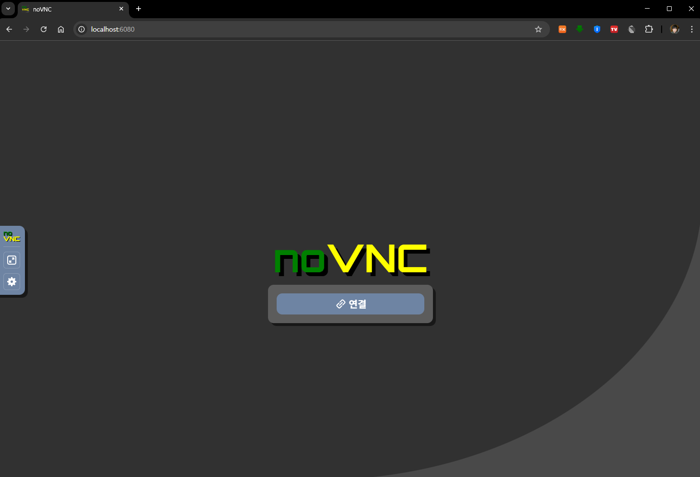
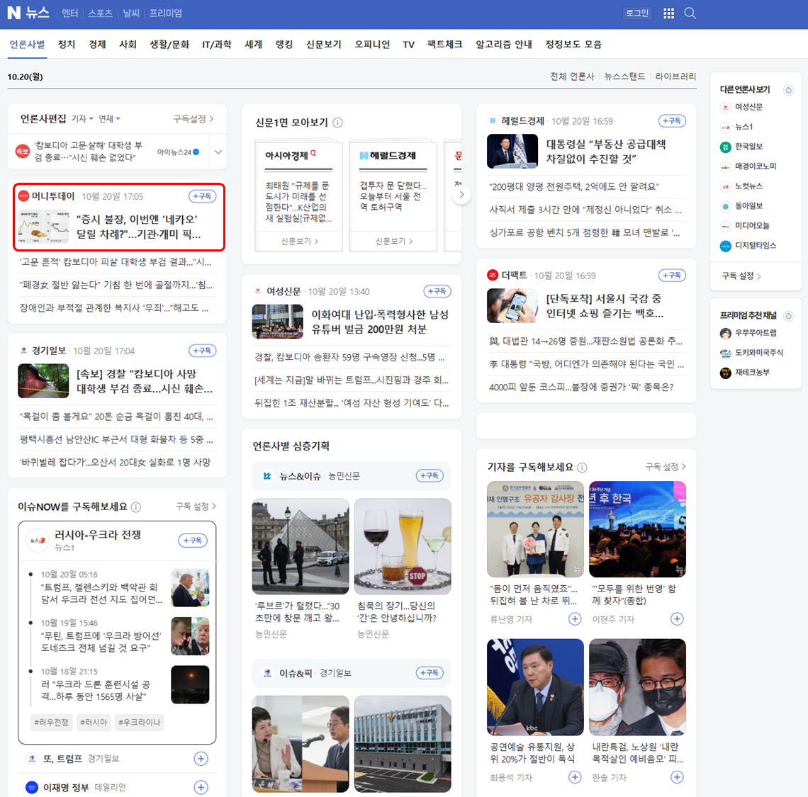
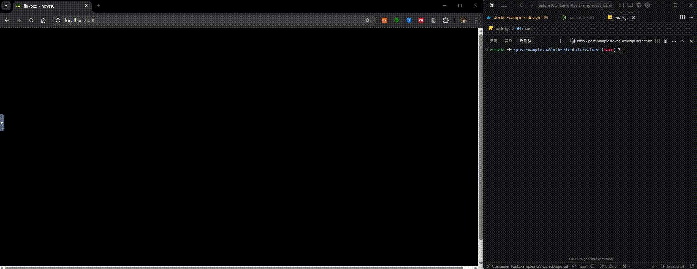
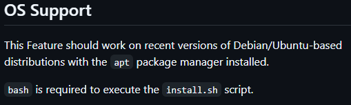

# 연관 포스트
- [DevContainer 톺아보기](../what-is-devcontainer/)

# 예제 프로젝트 GitHub 링크
- [postExample.noVncDesktopLiteFeature](https://github.com/ApexCaptain/postExample.noVncDesktopLiteFeature)

<br>

## 들어가기 앞서

얼마 전에<sub>(어제)</sub> [**"DevContainer 톺아보기"**](../what-is-devcontainer/)라는 제목의 포스트를 올렸다.

주된 내용을 요약하면 다음과 같다.
- 개발 환경 구축 시 겪는 어려움<sub>(일관성, 재현성, 격리성)</sub> 소개

- DevContainer를 사용해서 이런 문제를 극복할 수 있다는 것

- 기본적인 설치 방법과 약간의 심화 과정

본래 이번 포스트를 먼저 작성하고 있었는데,  
쓰다보니 **DevContainer 자체에 대한 내용이 지나치게 장황하다**라는 것을 깨달았다.  
고로 내용을 둘로 나눠 [DevContainer에 대해 정리하는 포스트](../what-is-devcontainer/)를 먼저 올린 것이다.   
<sub>~~이거 보여주려고 어그로 끌었다~~</sub>

<br>

## 문제의 시작

### 내겐 너무 무거운 Docker

<p align='left'>
    
</p>

내가 작업할 때 사용하는 PC는 총 3대이다.
1. 회사에 있는 `Windows Desktop`

2. 집에 있는 `Windows Desktop`

3. 회사에서 지원받은 `맥북`

처음에 DevContainer를 구성했을 때는 각 PC에 Native하게 Docker 환경을 구축해서 사용했었다.  
Windows는 WSL과 DockerDesktop, Mac은 DockerDesktop만 설치하면 되는 아주 간단한 작업이다.

그러다 이슈가 발생했다.  

> **이 Docker라는 녀석... 컴퓨터의 자원을 엄청나게 소모한다.**

그도 그럴 것이 내가 실행하길 원하는 건 어디까지나 `Linux Container`이고 근본적으로 OS Level부터 다른  
Mac이나 Windows에서는 **어떤 방식으로든 Linux를 가상화**시켜 Container를 띄워야만 한다.

> 다시 말해 Linux와 Docker가 `하이퍼바이저` 위에서 동작한다는 의미이다.  

그나마 Windows PC는 둘 다 Desktop이고 WSL을 통해서 하는 거라 비교적 견딜만 하다.

진짜 문제는 Mac이다.  

나름 MacBook Pro인데도 불구, 조금 무거운 DevContainer 2~3개 정도만 띄워도  
방열 팬에서 당장이라도 이륙할듯한 기세로 고열의 제트를 내뿜는다. <sub>F-35가 따로 없다.</sub>  
심한 날은 격한 스로틀링 끝에 아예 Mac이 Docker를 *죽여버리는*😱 경우도 심심찮게 발생한다.


내 개인적인 평은 `"Abstraction Layer가 쌓일 수록 자연스레 발생하는 오버헤드"`이다.

요컨대

> **사람이 편해지면 기계가 고생한다**

<br>

### 별도 Linux 서버를 사용하기로 함

사실 이런 문제는 특별히 `Mac`이라 그런 것은 아니다. <sub>애플은 억울합니다</sub>   
그보단 `노트북`이라는 환경 자체가 발열 해소에 취약할 수 밖에 없다는 `구조적 이슈`이다.

해결책은 의외로 심플하다. 그냥 **개발용 Linux 서버 하나를 구축**하면 그만이다.

추후 기회가 되면 그 구체적인 과정에 대해 포스트 하겠지만 아주 간단하게 요약하면 다음과 같다.

1. 안 쓰는 Desktop PC 1대를 준비한다.

2. 원하는 Linux OS를 설치한다.

3. Docker와 Docker Compose를 설치한다.

4. 외부에서 접속 가능하도록 SSH 서버를 설치한다.

5. WOL을 통해 원격으로 전원을 켤 수 있도록 설정한다. (선택)

<br>

이렇게 해두면 사용하는 로컬 PC에는 vsCode나 Cursor 정도만 설치하면 그만이다.  

> IDE에서 SSH로 원격 개발 서버에 연결 -> 프로젝트를 Clone하고 -> 개발 컨테이너 시작!

실질적인 작업은 모두 원격 개발 서버에서 실행되므로 내가 지금 사용하는 PC에는 아무런 부담도 없는 것이다.

그러다... 새로운 문제에 직면했다.

<br>

### 크롤링(Crawling)

<p align='center'>
    
</p>

크롤링은 웹상의 정보를 탐색하고 수집하는 작업이다.  

데이터 소스를 가지고 있는 외부 서버에서 데이터를 가져오고 싶다.  
별도 API를 제공해준다면 아무런 문제가 없겠지만  
애석하게도 그렇지 않은 경우가 아주 많다.

일반적인 URL을 통해 접근할 수 있는 페이지가 있고,  
거기서 데이터를 추출하고 싶다고 생각해보자. 

1. GET 요청을 날려<sub>(curl, ajax, axios 등등...)</sub> HTML 페이지를 가져온다

2. HTML 분석을 통해 데이터를 추출한다

이 정도로 끝나면 다행이다.

> 웹상의 모든 페이지가 단순히 URL만으로 접근 할 수 있는 건 아니다.

React로 만든 SPA가 하나 있다고 생각해보자. 여기엔 `A탭`, `B탭`이 있다.  
기본 페이지에선 `A탭`만 보여주도록 만들어져 있다.  
`B탭`에 있는 데이터를 가져오려면 어떻게 해야할까?

문자 그대로 SPA, `Single Page Application`이다.  
URL을 통한 페이지 구분이 안 된다.

이런 그야말로 최악의 최악인 상황을 해결할 수 있는 유일한 방법은  
`가상 브라우져를 사용한 Crawling`인 것이다.

본 포스트의 주제에서 크게 벗어날 수 있으므로, 간단하게 요약하면 다음과 같이 동작한다.

1. 프로그램을 통해 `브라우저를 실행`한다.

2. `원하는 페이지로 이동`한다.

3. `B탭 버튼을 찾아 클릭`한다.

4. 페이지의 내용을 추출한다.

요컨대 `사람이 하는 행동을 모방`해서 `진짜 브라우저를 통해 페이지를 방문`하는 것이다.  

> 그런데 돌연 이게 DevContainer와 무슨 관계가 있다는 걸까?

<br>

### GUI를 볼 수가 없다
<p align='left'>
    
</p>

DevContainer에서 GUI가 포함된 어떤 프로그램을 실행해야 하는 경우가 아주 간혹 있다.  
그리고 그 중에서도 가장 번거로운 것이 `가상 브라우저를 통한 크롤링`이다.

회사에서 맡게 되는 작업 중에는 이렇게 가상 브라우저로 외부 웹 페이지를 방문해서 데이터를 추출해야 하는 때가 있는데, 크롤링 자체는 DevContainer건 서버에 올린 Production Container건 별 문제 없이 아주 잘 동작한다.  

문제는 디버깅이다.

`브라우저`라는 것은 일종의 GUI 프로그램이다.  
스크립트가 `가상 브라우저`를 띄울 때는 대개 `headless`모드로 동작하는데,   
이는 브라우저 그래픽은 띄우지 말고 백그라운드에서 실행하라는 의미이다.

`개발`을 할 때는 이 `headless` 모드를 꺼놓고 작업을 해야한다.  
직접 브라우저에서 Bot이 동작하는 모습을 보면서 스크립트를 짜야 하니까...

> 그런데 DevContainer에서는 **가상 브라우저의 GUI를 볼 수가 없다.**

내 기억이 맞다면 WSL 위에 올린 DevContainer에서는 가능 했던 거 같은데, 정확하지 않다.  
확실한 건 지금 사용하는 방식, `원격 개발 서버의 DevContainer`에서는 `GUI를 볼 방법이 없다`는 것이다.


<br>

## 해결방안

**"문제의 시작"** 섹션을 길게 쓴 것에 비하면 해결방안은 의외로 매우 심플하다.

[기존 포스트](../what-is-devcontainer/)의 ["Features로 개발도구 설치하기"](../what-is-devcontainer/#features로-개발도구-설치하기) 단락에 보면  
여러가지 개발 도구들을 간편하게 설치할 수 있다는 걸 알 수 있다.

[사용 가능한 기능 목록](https://containers.dev/features) 페이지에 있는 ["Lite-weight Desktop"](https://github.com/devcontainers/features/tree/main/src/desktop-lite)을 설치해서 브라우저를 통해 DevContainer에서 실행되는 GUI 프로그램을<sub>(이 경우, 브라우저)</sub> 눈으로 확인할 수 있도록 해보겠다.

<br>

### DevContainer 구성


이번 포스트에선 이 문제를 해결하는 [예시 소스가 담긴 GitHub Repository](https://github.com/ApexCaptain/postExample.noVncDesktopLiteFeature)를 아예 따로 만들었다.  
직접 작업하기 귀찮으면 Clone해서 살펴보도록 하자.

- `devcontainer.json`

    [Lite-weight Desktop Feature](https://github.com/devcontainers/features/tree/main/src/desktop-lite)에 따르면 사용 가능한 옵션은 다음과 같다.

    | Options Id | Description | Type | Default Value |
    |-----|-----|-----|-----|
    | version | Currently Unused! | string | latest |
    | noVncVersion | The noVNC version to use | string | 1.2.0 |
    | password | Enter a password for desktop connections. If "noPassword", connections from the local host can be established without entering a password | string | vscode |
    | webPort | Enter a port for the VNC web client (noVNC) | string | 6080 |
    | vncPort | Enter a port for the desktop VNC server (TigerVNC) | string | 5901 |

    이에 따라 `.devcontainer/devcontainer.json` 파일을 다음과 같이 구성해보자.

    ```json
    // .devcontainer/devcontainer.json
    {
        // Basic
        "name": "PostExample.noVncDesktopLiteFeature Dev Container",
        "dockerComposeFile": "docker-compose.dev.yml",
        "service": "workspace",
        "workspaceFolder": "/home/vscode/postExample.noVncDesktopLiteFeature",
        // 혹은 다음과 같이 적어도 된다
        // "workspaceFolder": "/home/vscode/${localWorkspaceFolderBasename}",
    
        // Featuring
        "features": {

            // https://github.com/devcontainers/features/tree/main/src/desktop-lite
            "ghcr.io/devcontainers/features/desktop-lite:1": {
                // 기본 설정값들
                // "version": "latest",
                // "noVncVersion": "1.2.0",
                // "password": "password",
                // "webPort": "6080",
                // "vncPort": "5901"
            },

            // https://github.com/devcontainers/features/tree/main/src/node
            // Puppeteer로 테스트 할 예정이므로 nodejs를 설치
            "ghcr.io/devcontainers/features/node:1": {}
        },
    
        // Ports
        // Desktop Lite의 기본 WebSocket 포트를 포워딩
        "forwardPorts": [
            6080
        ],
        "portsAttributes": {
            "6080": {
                "label": "Desktop (noVNC)"
            }
        }
    }
    
    ```

- `docker-compose.dev.yml`
    ```yml
    # .devcontainer/docker-compose.dev.yml
    services:
        workspace:
            container_name: post_example_novnc_desktoplitefeature_devcon_workspace
            image: mcr.microsoft.com/devcontainers/base:bullseye
            # Shared Memory의 크기를 1GB로 설정
            shm_size: '1gb'
            volumes:
                # Workspace Cache
                - ..:/home/vscode/postExample.noVncDesktopLiteFeature:cached
            command: sleep infinity

    ```

이걸로 DevContainer 구성은 끝났다.

`F1` 키를 누르고 `Dev Containers: Rebuild Container`를 실행하자.

DevContainer 빌드가 끝났다면,  
Host PC에서 브라우저를 열고 `localhost:6080`으로 접속해보자.

<p align='center'>
    
    <em>이 화면까지 봤다면 성공이다 🎉</em>
</p>

좀 전에 설치한 Desktop Lite에 웹을 통해 접속한 것이다. 여기서 **연결** 버튼을 눌러주자.  
DevContainer 내부에서 실행되는 GUI를 볼 수 있을 것이다.


<br>

### 크롤링 예제 프로젝트

이번 예시에선 [**네이버 뉴스 페이지**](https://news.naver.com/)에 접속해서  
가장 좌측 상단에 있는 칼럼의 `타이틀`과 `내용`을 추출하는 간단한 크롤링 스크립트를 짜보도록 하겠다.

<p align='center'>
    
</p>

- 프로젝트 초기화 및 의존성 설치

    1. yarn 명령어로 nodejs 프로젝트를 초기화한다.

        ```bash
        yarn init -y
        ```

    2. 생성된 `package.json`의 `type`을 `module`로 설정한다.
        ```json
        {
            "name": "post-example.no-vnc-desktop-lite-feature",
            "version": "1.0.0",
            "type": "module", // Type을 Module로 지정
            "main": "index.js"
        }

        ```

    3. [Puppeteer](https://pptr.dev/)와 [Cheerio](https://cheerio.js.org/)를 설치한다.
        ```bash
        yarn add \
            puppeteer \
            cheerio
        ```


- 스크립트 작성

    `index.js` 파일 하나를 만들고 다음의 스크립트를 복사해보자.

    ```javascript
    // index.js
    import puppeteer from 'puppeteer';
    import * as cheerio from 'cheerio';

    const main = async () => {
        let browser;
        
        try {
            // #1 Puppeteer 인스턴스 생성
            browser = await puppeteer.launch({
                // Browser를 GUI 없이 사용할지 여부, 운영 환경에선 true로 설정 해주자
                headless: false, 
                args: [
                    '--no-sandbox',
                    '--disable-setuid-sandbox',
                ],
            });

            // #2 새로운 페이지 (탭) 생성
            const page = await browser.newPage();

            // #3 네이버 뉴스 페이지 이동
            await page.goto('https://news.naver.com/', { 
                waitUntil: 'networkidle0',
                timeout: 30000  // 30초 타임아웃
            });

            // #4 대상 뉴스 카드 element selector를 선언하고 화면에 보이면 클릭
            const newsCardElementSelector = '#ct > div > section.main_content > div.main_brick > div > div:nth-child(1)'
            // 확실히 화면에 들어올 때까지 대기 (10초 타임아웃)
            await page.waitForSelector(newsCardElementSelector, { 
                visible: true,
                timeout: 10000
            }); 
            await page.click(newsCardElementSelector);

            // #5 대상 뉴스의 제목과 본문의 텍스트를 추출
            const titleElementSelector = '#title_area > span'
            const articleElementSelector = '#newsct_article'
            await page.waitForSelector(titleElementSelector, {
                visible: true,
                timeout: 10000
            });
            const $ = cheerio.load(await page.content());
            const title = $(titleElementSelector).text();
            const article = $(articleElementSelector).text();

            // #6 제목과 본문의 텍스트를 콘솔에 출력
            console.log({ title, article })

        } catch (error) {
            console.error('에러가 발생했습니다:', error.message);
        } finally {
            // #7 브라우저 인스턴스 종료 (에러가 나도 반드시 실행)
            if (browser) {
                await browser.close();
            }
        }
    };
    main();
    ```

### 실행

이제 작성한 스크립트를 실행해보자.

```bash
node index.js
```

출력되는 결과 자체는 그때마다 다를 것이다. 

이제 Desktop Lite를 통해 보면 어떠한지 확인해보자.

<p align='center'>
    
    <br>
    <em>브라우저를 통해 브라우저가 실행되는 걸 바라보는 모습이다</em> 
    <br>
    <sub>그리고 그걸 녹화해서 또 다른 브라우저로 보고있는 나</sub>
</p>

<br>

## 주의사항

### 호환성

나온 지 얼마 안 된 기능이라 그런지 OS 및 하드웨어 제약사항이 있다

- Container Image 제약

    예시에서 사용한 DevContainer Docker Image는 `Ubuntu 기반`이다.  
    `desktop lite` feature는 현재 `Debian/Ubuntu` 기반의 이미지만 지원한다.  
    `Alpine` 이미지에서는 사용할 수 없다.

    <p align='left'>
        
    </p>

    <br>

- CPU Architecture 제약

    `desktop lite` feature를 적용하려면 DevContainer를 동작하는 PC의  
    CPU Architecture가 `AMD64`여야만 한다.

    **Intel**이나 **AMD**에서 만든 CPU라면 관계 없으나,  
    **Arm**을 사용하고 있다면 이 기능은 사용할 수 없다.

    대표적으로 `Apple Silicon 칩이 장착된 Mac`은 안 된다.

<br>

### 패스워드 설정

`desktop lite` feature는 내부적으로 `VNC 서버`와  
그 위에 얹혀 있는 `noVnc` 웹 클라이언트를 사용해서 GUI 화면을 노출시킨다.

```plaintext
+---------------------------+
|       Web Browser         |
| (noVNC Client over 6080)  |
+------------▲--------------+
             │ WebSocket
             ▼
+---------------------------+
|   noVNC (Websockify)      |
+------------▲--------------+
             │ VNC Protocol
             ▼
+---------------------------+
|     Xvfb + Fluxbox        |
|  (Virtual Display Server) |
+------------▲--------------+
             │
             ▼
+---------------------------+
| GUI Application (ex: Chrome) |
+---------------------------+
```

그리고 `.devcontainer/devcontainer.json`에서 해당 포트를<sub>(6080)</sub> 그대로 포워딩 한다.
```json
// .devcontainer/devcontainer.json
{
    // ...
    "forwardPorts": [
      6080
    ],
    "portsAttributes": {
      "6080": {
        "label": "Desktop (noVNC)"
      }
    }
}
```

로컬 PC에 DevContainer를 실행중이라면 큰 문제가 되진 않겠지만,  
`Remote Devcontainer`를 사용하는 경우, 가령
- SSH (자체 호스팅 혹은 클라우드 서버)
- Codespaces

vsCode 혹은 Cursor는 원격 서버의 `6080` 포트를 **"클라이언트 측으로 포워딩"** 한다.

**만일 서버 방화벽에서 허용되어 있다면 외부에서도 noVnc로 접근할 수 있다. (!!)**

사실 실제 그렇게 되어있을 가능성은 희박하지만, 그래도 안전하게 해서 나쁠 건 없다.  
다음의 예시처럼 패스워드 설정을 확실하게 해두도록 하자.

```json
// .devcontainer/devcontainer.json
{
    // ...
    "features": {

        // https://github.com/devcontainers/features/tree/main/src/desktop-lite
        "ghcr.io/devcontainers/features/desktop-lite:1": {
            "password": "my-extremely-complex-password"
        },

    }
    // ...
}
```

<br>

Git 저장소에 패스워드가 올라가는 게 꺼려진다면 다음과 같이 설정해도 된다.

```env
# .devcontainer/.env
NOVNC_PASSWORD=my-extremely-complex-password
```

<br>

```json
// .devcontainer/devcontainer.json
{
    // ...
    "features": {

        // https://github.com/devcontainers/features/tree/main/src/desktop-lite
        "ghcr.io/devcontainers/features/desktop-lite:1": {
            "password": "${localEnv:NOVNC_PASSWORD}"
        },

    }
    // ...
}
```

`.env` 파일은 `.gitignore`에 추가 해두도록 하자.


<br>

## 마치며

이번 포스트에서는 DevContainer에서 GUI 프로그램을 실행할 때 겪는 문제와 그 해결책에 대해 다뤄봤다.

처음에는 단순히 Docker의 무거움 때문에 원격 개발 서버를 구축했는데,  
그 과정에서 크롤링 작업을 할 때 GUI를 볼 수 없다는 새로운 문제에 직면하게 되었다.

다행히 DevContainer의 Features 시스템 덕분에 `Desktop Lite`를 통해 이 문제를 깔끔하게 해결할 수 있었다.  
noVNC를 통해 웹 브라우저로 DevContainer 내부의 GUI에 접근할 수 있게 된 것이다.

이제 원격 개발 서버의 장점을 그대로 유지하면서도,  
필요할 때는 GUI 프로그램을 시각적으로 확인하며 개발할 수 있게 되었다.

> 이번에는 **사람도 편하고 기계도 편한** 해결책을 찾은 것 같다 😊

당장 마땅한 GUI 프로그램이 없어서 크롤링을 예시로 들었다.  
예상컨데 이외에도 활용할 수 있는 여지는 많을 것으로 보인다.

혹시나 비슷한 고민을 겪고 있는 분들이 있었다면 부디 도움이 되었길 바란다.

### 참고자료
- [Dev Containers Features Spec – desktop-lite](https://github.com/devcontainers/features/tree/main/src/desktop-lite)
- [VS Code Remote Containers Documentation](https://code.visualstudio.com/docs/devcontainers/containers)
- [noVNC project site](https://novnc.com/info.html)