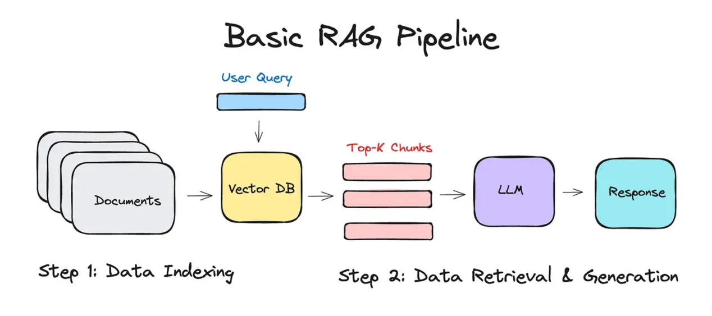
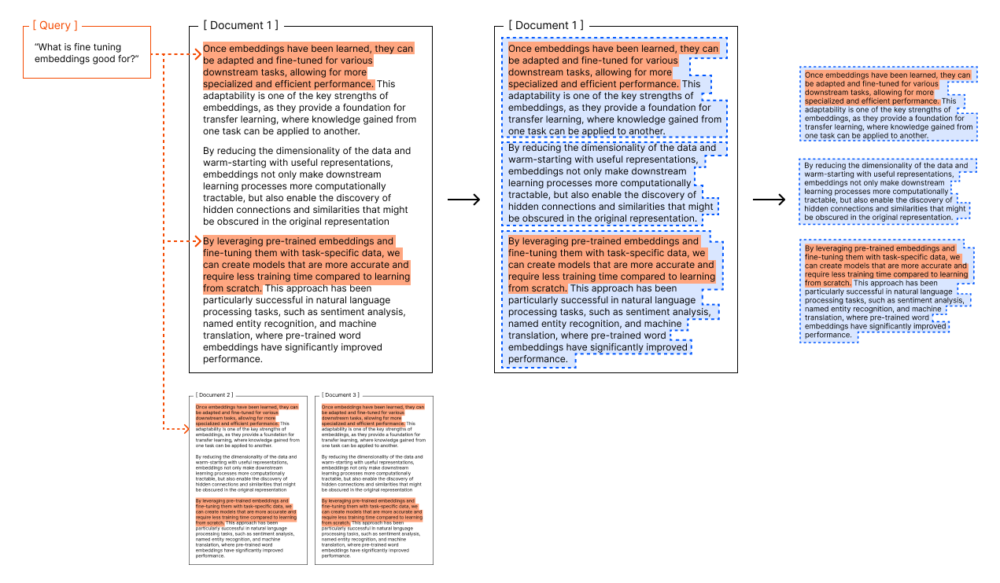
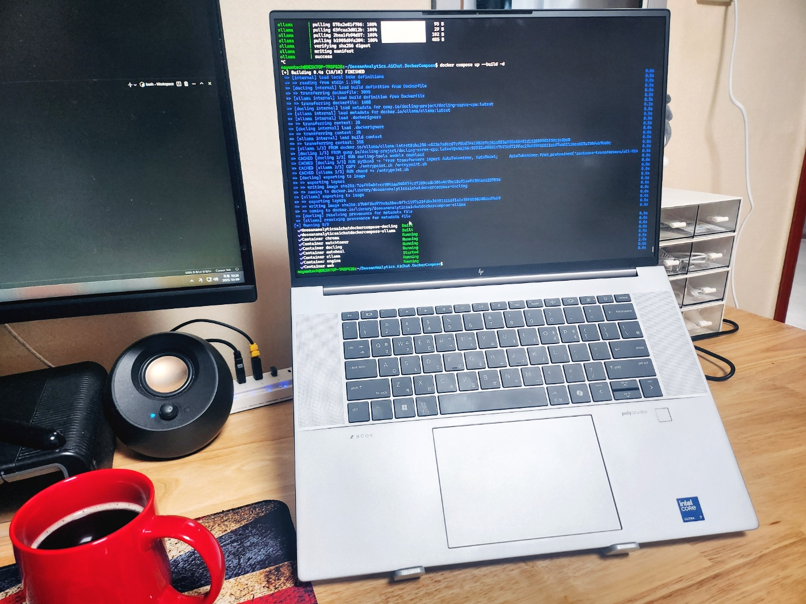
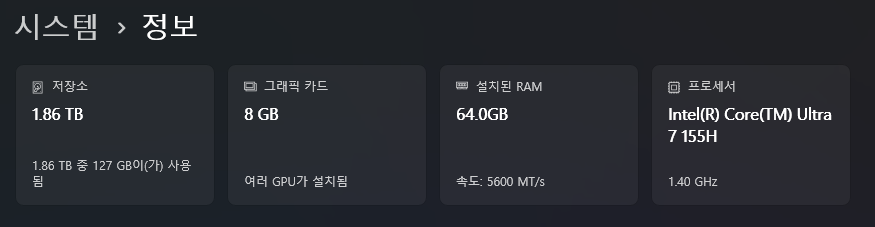
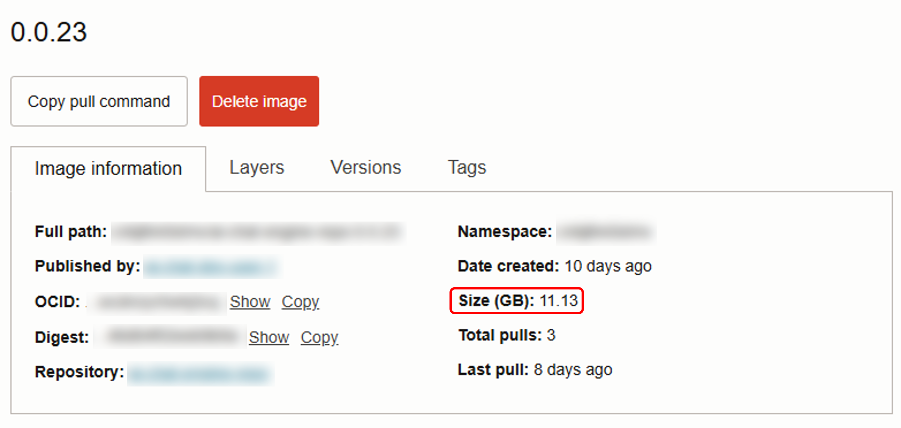
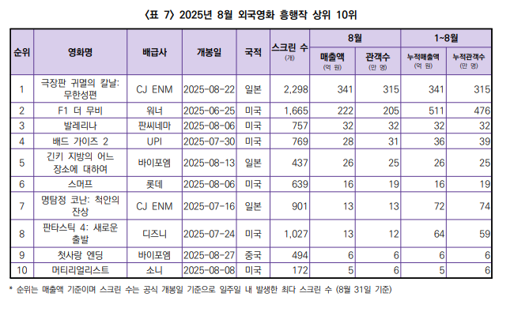

## 들어가기 앞서

### RAG(Retrieval-Augmented Generation, 검색 증강 생성)

어떤 인공지능 시스템을 구축할 때 AI 모델에게 학습되지 않은 정보, 가령 회사 내부 문서 등을 활용한 답변을 기대한다고 생각해보자.  

1~2개 정도의 PDF 파일 정도라면 통째로 첨부해서 사용해도 상관 없겠지만,  
수십 수백개의 문서들을 모조리 LLM에게 입력할 수는 없는 노릇이다.

이 문제를 해결하고자 나온 방법론 중 하나가 바로 RAG이다.  
RAG의 정의는 다음과 같다.
- LLM의 출력을 최적화하여 응답을 생성하기 전에 훈련 데이터 소스 외부의 신뢰할 수 있는 기술 자료를 참조하도록 하는 프로세스


소스가 되는 문서(가령 PDF파일)를 AI가 쉽고 빠르게 이해할 수 있는 형태의 데이터(Vector)로 변환하고 사용자의 질문(query)에 맞춰 검색된 데이터를 가져와 prompt의 context로 넣어서 동작한다.

<p align='center'>
    
</p>

<br>

### Embedding 전처리

Embedding 모델이 Vector로부터 문서 데이터를 가져올 때, 가져온 결과 하나 하나는 특별한 이유가 없는 한 LLM에 그대로 전달된다.  

만일 텍스트로만 이루어진 어떤 문서의 글자 수가 5,000개이고 이 5,000개가 한 덩어리로 Vector에 저장되어 있다면 LLM은 엄청난 크기의 Context에 부담을 지게 될 것이다. <sub>(혹은 당신의 지갑이...)</sub>

이에 따라 Vector에 문서를 저장할 땐 어떠한 방식으로든 원문을 잘게 잘라(chunking) 사용자 Query와의 관련성은 유지하면서, 불필요하게 많은 Context가 사용되는 일은 피하게 할 필요가 있다.  

```json
[
    {
        "pageContent": "하지만 무작정 글자 수나 Token 수에 맞춰"
    },
    {
        "pageContent": "잘랐다가는, 이렇게 하나의 문장이 다 끝나"
    },
    {
        "pageContent": "기도 전에 잘려진 조각이 만들어질 것이다."
    }
]
```

이와 같은 문제를 막겠다고 조각들 간 겹치는 부분을 써서 해결하기도 하는데 근본적인 해결책은 아니다.

더욱이 원문이 PDF와 같이 구조화 된 형태일 경우(이미지, 그래프, 테이블, 수식 등), 단순하게 텍스트만 추출하고 구조는 무시해버린다면
최종적으로 LLM이 답변을 낼 때 전혀 엉뚱한 소리를 하는 경우가 생긴다.

<p align='center'>
    
    <em>이런식으로 Text로만 이루어진 경우는 오히려 드물다</em>
</p>

Embedding 과정은 전통적으로
1. 원본 파일에서 `Text`만 추출
2. `Token 수에 맞춰` 쪼개기
3. Text를 Vectorizing
4. VectorStore에 저장

이렇게 단순하게 이루어져 왔었다. 3/4번은 Embedding 모델이 하는 것이므로 여기선 논하지 않겠다.  
문제는 1/2번인데, 앞서 언급했듯 이렇게 텍스트만 추출하게 되면 원본 문서가 가지고 있던 구조적 특징이 유실되는 문제가 있다.

PDF Parser나 OCR같은 도구들을 활용해서 보완할 수는 있겠으나, PDF는 일반적으로 생각하는 것 보다 훨씬 복잡한 형태가 많고 이를 완벽하게 추출해내는 것은 아직도 매우 어렵다.

<br>

### Docling(도클링)이란?

[Docling](https://github.com/docling-project/docling)은 IBM에서 개발한 생성형 AI 애플리케이션을 위한 문서 처리 및 변화을 위한 오픈소스 툴킷이다.  

<p align='center'>
    
</p>

앞서 얘기한 Embedding 전처리 과정에서 생기는 문제점을 해결하고자 나온 오픈소스로, 자체적인 인공지능 모델을 활용해 원본 문서를 분석/변환/Chunking 해준다.

제공해주는 기능은 [GitHub](https://github.com/docling-project/docling)에 보다 잘 정리되어 있다.  
기본적으로 다양한 문서 포맷을 지원하고, `Page Layout`, `Order`, `Table`등을 해석할 수 있으며, LangChain과 쉽게 통합 가능한 것이 특징이다.

현재 이 글을 쓰고 있는 시점을 기준으로 언급된 기능들은 다음과 같다. 

* 🗂️ Parsing of [multiple document formats][supported_formats] incl. PDF, DOCX, PPTX, XLSX, HTML, WAV, MP3, VTT, images (PNG, TIFF, JPEG, ...), and more
* 📑 Advanced PDF understanding incl. page layout, reading order, table structure, code, formulas, image classification, and more
* 🧬 Unified, expressive [DoclingDocument][docling_document] representation format
* ↪️ Various [export formats][supported_formats] and options, including Markdown, HTML, [DocTags](https://arxiv.org/abs/2503.11576) and lossless JSON
* 🔒 Local execution capabilities for sensitive data and air-gapped environments
* 🤖 Plug-and-play [integrations][integrations] incl. LangChain, LlamaIndex, Crew AI & Haystack for agentic AI
* 🔍 Extensive OCR support for scanned PDFs and images
* 👓 Support of several Visual Language Models ([GraniteDocling](https://huggingface.co/ibm-granite/granite-docling-258M))
* 🎙️ Audio support with Automatic Speech Recognition (ASR) models
* 🔌 Connect to any agent using the [MCP server](https://docling-project.github.io/docling/usage/mcp/)
* 💻 Simple and convenient CLI

<br><br>

## 문제의 시작

회사에서 _간단한 RAG 애플리케이션_ 을 하나 만들라는 지시를 받았다.

여기엔 몇 가지 단서조항이 포함되어 있었는데, 그중 문제가 되는 부분은 다음과 같다.

1. 운영 환경은 **`Windows 11 노트북`**

2. **`네트워크에 연결되지 않은 상태`** 에서 동작해야 함

<p align='center'>
    
    <em>추석 연휴동안 작업 하려고 허락 받고 아예 집에 가져왔다...</em>
</p>

<br>

### 노트북 사양

<p align='center'>
    
</p>

- CPU/메모리는 괜찮다. 특히 메모리는 무려 64GB나 된다!
- 문제는 그래픽 카드인데, VRAM이 8GB 밖에 되지 않는다.

<br>

### 폐쇄망

이번 프로젝트에서 가장 큰 걸림돌이 바로 이것이다. 

> 네트워크가 안 되는 환경에서 구동 되어야 할 것

Ollama처럼 단순히 LLM을 설치하고 명령 받아서 처리만 해주는 컨테이너의 경우 외부에서 제어만 잘 해주면 별다른 문제가 없겠으나, 
Docling처럼 AI가 애플리케이션 내부로 들어가서 겉에서 한 번 Wrapping 된 형태라면 Offline 기능을 제공해 주지 않는 이상 구현이 요원해진다.


<br>

## 해결방안

### 컨테이너 구성

우선 전체적으로 컨테이너가 어떻게 구성되어 있는지 정리 해두었다.

Host OS가 Windows인 관계로, WSL 및 Docker와 Docker-Compse를 사용해서 컨테이너 환경을 마련했다.

그런데 Docker Desktop은 또 쓰면 안된다길래 Ubuntu위에 직접 설치했다.

- **Application**
    - **Web**: React 기반의 웹 애플리케이션
    - **Backend**: NestJs 기반의 API 서버
- **Infrastructure**
    - **Ollama**
        - Image: [ollama/ollama](https://hub.docker.com/r/ollama/ollama)
        - 용도: 텍스트 생성 / Embedding
        - 사용된 모델
            - 텍스트 생성: [joonoh/HyperCLOVAX-SEED-Text-Instruct-1.5B:latest](https://ollama.com/joonoh/HyperCLOVAX-SEED-Text-Instruct-1.5B:latest)
            - 임베딩: [bona/bge-m3-korean:latest](https://ollama.com/bona/bge-m3-korean)
        - GPU 가속 : O
    - **Chroma**
        - Image: [chromadb/chroma](https://hub.docker.com/r/chromadb/chroma)
        - 용도: VectorStore
    - **Docling**
        - Image: [quay.io/docling-project/docling-serve](https://quay.io/repository/docling-project/docling-serve)  

            이 이미지는 CPU Only 모드로만 동작하는 Docling 컨테이너 이미지이다.  
            GPU 가속이 가능한 이미지로도 써봤는데, VRAM 제한 때문에 `CUDA Out of Memory` 이슈와 함께 먹통이 되버렸다.

            결국 이 프로젝트에서 GPU는 Ollama 컨테이너만 쓰는 것으로 타협을 봤다.  
            VRAM에 여유가 있다면 다음의 Docker Image중 하나를 골라 쓰면 된다.
            - [quay.io/docling-project/docling-serve-cu126](https://quay.io/repository/docling-project/docling-serve-cu126): CUDA 12.6
            - [quay.io/docling-project/docling-serve-cu128](https://quay.io/repository/docling-project/docling-serve-cu128): CUDA 12.8
        - 용도: Embedding 전처리
        - 사용된 모델
            - [ds4sd/CodeFormulaV2](https://huggingface.co/ds4sd/CodeFormulaV2): 수학 공식 분석
            - [HuggingFaceTB/SmolVLM-256M-Instruct](https://huggingface.co/HuggingFaceTB/SmolVLM-256M-Instruct): 이미지 분석
            - [sentence-transformers/all-MiniLM-L6-v2](https://huggingface.co/sentence-transformers/all-MiniLM-L6-v2): 문서 Chunking
- **Management**
    - **Watchtower**: 컨테이너 자동 업데이트
    - **AutoHeal**: HealthCheck Fail시 컨테이너 자동 리스타트

<br>

### 이미지에 AI Model을 내장하기

이번 문제의 핵심을 다시 한 번 요약하면 다음과 같다.

1. RAG 애플리케이션을 `Offline 상태`의 노트북 1개에서 동작시켜야 한다.

2. 여기서 핵심이 되는 컨테이너는 `Ollama`와 `Docling`이다.

3. 두 컨테이너는 모두 AI 모델을 동적으로 다운받아 동작하는 것을 기본으로 한다.

그럼, Ollama와 Docling에서 사용할 모델을 Docker Image에 내장하면 그만인 것 아닐까?

<br>

#### 모델이 너무 크다

우선 아예 모델 다운로드가 포함된 Image를 만들어서 Registry에 올려보았다.

<p align='center'>
    
    <em>10GB가 넘는다. 심지어 필요한 모든 모델을 다 담은 것도 아니다.</em>
</p>

이게 단순히 이미지 크기가 좀 커진다의 문제가 아니다.
1. CI/CD 파이프라인이 전반적으로 다 느려진다.
2. 이렇게 생성된 Docker Image는 클라우드에서 제공하는 Container Registry에 올라가는데, 용량 때문에 비용 걱정도 해야한다.

<br>

#### 빌드 타임에 AI 모델을 다운받도록 변경

생각해보니, 굳이 Image Registry에 올릴 필요는 없었다.

`Offline 환경에서 동작해야 한다`이지 `Offline 환경에서 설치 해야한다`의 개념은 아니지 않은가.

Docker Compose에 `image` 대신 `build`를 넣고 아예 Dockerfile 자체를 정의해주면 그만이다. 

그렇게 해서 나온 결과는 다음과 같다.

```yml
# docker-compose.yml
services:
  # ...... #
  # Infrastructure Services
  ollama:
    build:
      context: ./build/ollama
      dockerfile: Dockerfile
    container_name: ollama
    restart: unless-stopped
    deploy:
      resources:
        reservations:
          devices:
            - driver: nvidia
              count: all
              capabilities: [gpu]
    logging:
      options:
        max-size: 50m

  docling:
    container_name: docling
    build:
      context: ./build/docling
      dockerfile: Dockerfile
    restart: unless-stopped
    environment:
      DOCLING_SERVE_ENABLE_UI: 'false'

      # (매우 중요!) 이 항목이 없으면 모델을 내장시켜도 Offline에서 자꾸 에러가 난다.
      HF_HUB_OFFLINE: 1 
    logging:
      options:
        max-size: 50m
  # ...... #
```

`build` 디렉토리는 `docker-compose.yml`과 같은 경로에 배치 해두었다.  
`build` 디렉토리 내부 구조는 다음과 같다.
```bash
build
├── docling
│   └── Dockerfile
└── ollama
    ├── Dockerfile
    └── entrypoint.sh
```

각 파일들은 다음과 같이 작성했다.

1. `build/docling/Dockerfile`
    ```dockerfile
    FROM quay.io/docling-project/docling-serve-cpu

    # Docling의 기본 모델 다운로드
    RUN docling-tools models download

    # Hybrid Chunker용 추가 모델 다운로드
    RUN python3 -c "from transformers import AutoTokenizer, AutoModel; \
        AutoTokenizer.from_pretrained('sentence-transformers/all-MiniLM-L6-v2'); \
        AutoModel.from_pretrained('sentence-transformers/all-MiniLM-L6-v2');"

    # 공식/이미지 분석용 모델 다운로드
    RUN docling-tools models \
        download-hf-repo  \
            ds4sd/CodeFormulaV2 \
            HuggingFaceTB/SmolVLM-256M-Instruct 
    ```

2. `build/ollama/Dockerfile`
    ```dockerfile
    FROM ollama/ollama

    COPY ./entrypoint.sh /entrypoint.sh

    RUN chmod +x /entrypoint.sh

    ENTRYPOINT ["/entrypoint.sh"]

    EXPOSE 11434
    ```
    Ollama는 `Ollama` 서버가 실행되고 나서야 모델을 받을 수 있으므로 별도의 Entrypoint를 추가해줬다.

3. `build/ollama/entrypoint.sh`
    ```bash
    #!/bin/bash

    set -e

    echo "Starting Ollama server..."
    ollama serve & # 백그라운드에서 Ollama 실행
    SERVER_PID=$!

    echo "Waiting for Ollama server to be active..."
    until ollama list >/dev/null 2>&1; do # Ollama process가 정상적으로 동작 될 때까지 대기
    sleep 1
    done

    echo "Pulling models..."
    # For embedding
    ollama pull bona/bge-m3-korean:latest || true 
    # For text generation
    ollama pull joonoh/HyperCLOVAX-SEED-Text-Instruct-1.5B:latest || true

    trap "kill -TERM $SERVER_PID" SIGTERM SIGINT
    wait $SERVER_PID
    ```

<br>

### 동작 테스트

실제 오프라인 환경에서 잘 동작하는지 임베딩부터 간단한 채팅까지 테스트 해보았다.


- 테스트 파일

    테스트 한 파일은 [영화진흥위원회](https://www.kofic.or.kr/kofic/business/board/selectBoardList.do?boardNumber=2)에서 공개한 25년 8월 한국 영화산업 결산 보고서 PDF의 일부이다.

    <p align='center'>
        
    </p>

- 임베딩
    <p align='center'>
        <video width="480" controls>
            <source src="videos/embedding.mp4" type="video/mp4">
        </video>
    </p>

- 텍스트 생성 테스트
    <p align='center'>
        <video width="480"  controls>
            <source src="videos/chatting.mp4" type="video/mp4">
        </video>
    </p>

## 마치며

프로젝트 제한사항으로 인해 Docling에서 GPU 가속을 못 쓰다보니, 전반적으로 만족스러운 속도는 아니었다.  
하지만, 표 등이 포함된 소스 파일에서 단순한 텍스트 추출만 해서는 LLM이 이해할 수 있는 형태로 전달되지 않았던 문제를 해결할 수 있는 좋은 방법이라고 생각한다.

이제까지 pdf parser같은 기본적인 라이브러리만 사용해봤다면, 한 번 결과를 보고 도입을 고려해 봐도 괜찮을 것 같다.

이번 포스트에선 Docling을 Docker Container로 만들어서 사용했으나, 사용환경에 따라 Python에서 모듈을 import해서 사용하거나 CLI로 동작시키는 것도 가능하다.

