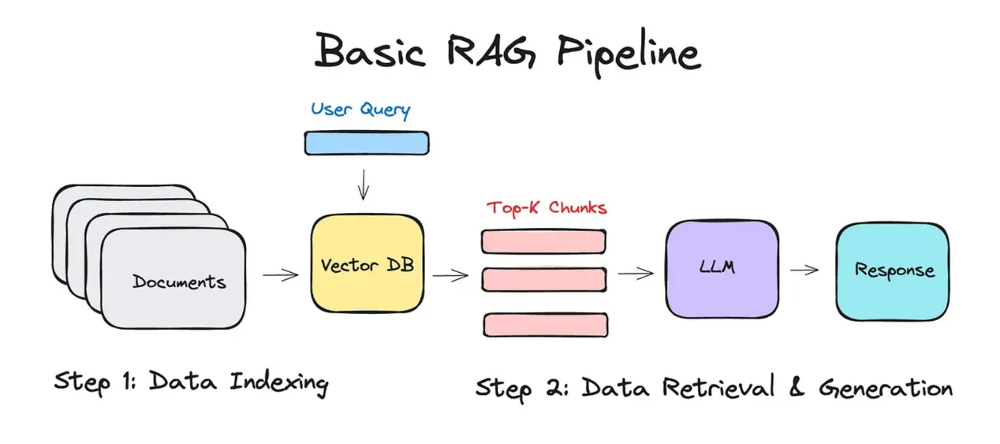
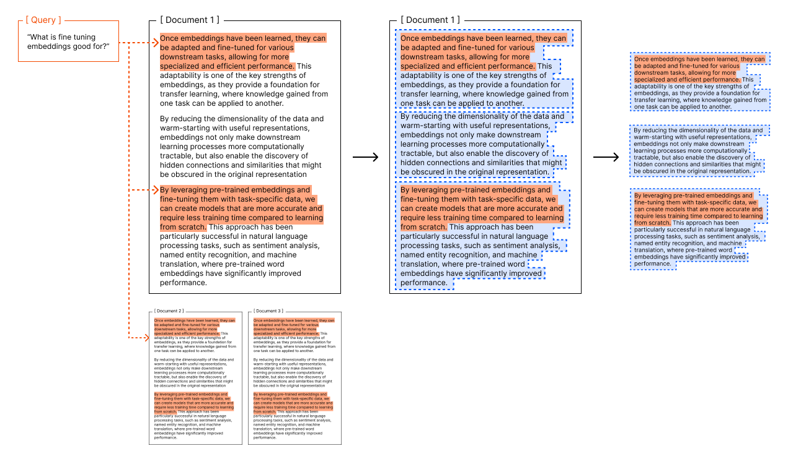

# 연관 포스트
- [오프라인 환경에서 RAG 앱 동작시키기](../rag-app-in-an-offline-env/)

<br>

## RAG(Retrieval-Augmented Generation, 검색 증강 생성)

인공지능 시스템을 구축할 때, AI 모델(이하 LLM)에게 회사 내부 문서와 같이 사전에 학습되지 않은 정보를 활용한 답변을 기대한다고 생각해보자.  

1~2개 정도의 PDF 파일이라면 통째로 첨부해서 사용해도 상관 없겠지만,  
수십, 수백 개의 문서들을 모조리 LLM에게 입력할 수는 없는 노릇이다.

이 문제를 해결하고자 나온 방법론 중 하나가 바로 RAG이다.  
RAG의 정의는 다음과 같다.
- LLM의 출력을 최적화하여 응답을 생성하기 전에 훈련 데이터 소스 외부의 신뢰할 수 있는 기술 자료를 참조하도록 하는 프로세스

소스가 되는 문서(가령 PDF 파일)를 AI가 쉽고 빠르게 관련성을 유추할 수 있는 형태의 데이터(vector)로 변환하고, 
사용자의 질문(query)에 맞춰 검색된 데이터를 가져와(retrieving) prompt의 context로 넣어서 동작한다.

<p align='center'>
    
</p>

이렇게 문자나 이미지같은 복잡한 데이터를 LLM이 이해하고 처리하기 쉬운 숫자 형태의 Vector로 변환하는 과정 혹은 변환된 결과물 그 자체를 `Embedding`이라고 하며,
그러한 작업을 수행하는 AI Model을 `Embedding Model`이라고 한다.

Embedding Model이 하는 일은 다음과 같다.
1. 텍스트/이미지 등을 Vector로 변환, `VectorStore`<sub>(혹은 Vector DB라고도 한다)</sub> 에 저장
2. 사용자의 Query를 Vector로 변환, VectorStore에서 유사한 값들을 검색(Retrieval)

<br>

## Embedding 전처리

### Chunking

Embedding Model이 VectorStore에서 문서 데이터를 가져올 때, 가져온 결과 하나하나는 특별한 사유가 없는 한 있는 그대로 LLM에 전달된다.  

만일 텍스트로만 이루어진 어떤 문서의 글자 수가 5,000개이고, 이 5,000개가 한 덩어리로 VectorStore에 저장되어 
있다면 LLM은 엄청난 크기의 Context에 적지 않은 부담을 지게 될 것이다. <sub>(혹은 당신의 지갑이...)</sub>

이에 따라 VectorStore에 문서를 저장할 땐 어떠한 방식으로든 원문을 잘게 잘라(chunking),  
사용자 Query와의 관련성은 유지하면서 불필요하게 많은 Context가 사용되는 일은 피하게 할 필요가 있다.  

```json
[
    {
        "pageContent": "하지만 무작정 글자 수나 Token 수에 맞춰"
    },
    {
        "pageContent": "잘랐다가는, 이렇게 하나의 문장이 다 끝나"
    },
    {
        "pageContent": "기도 전에 잘려진 조각이 만들어질 것이다."
    }
]
```

이와 같은 문제를 막겠다고 일부러 각 조각들 간 `겹치는 부분`을 만드는 게 일반적이나, 근본적인 해결책은 아니다.

### 구조 분석

더욱이 원문이 PDF와 같이 구조화된 형태일 경우(이미지, 그래프, 테이블, 수식 등), 단순하게 텍스트만 추출하고  
구조는 무시해버린다면 최종적으로 LLM이 답변을 낼 때 전혀 엉뚱한 소리를 하는 경우가 생긴다.

<p align='center'>
    
    <em>이런 식으로 Text로만 이루어진 경우는 오히려 드물다</em>
</p>

Embedding 과정은 전통적으로
1. 원본 파일에서 `Text`만 추출
2. `Token 수에 맞춰` 쪼개기
3. Text를 Vectorizing
4. VectorStore에 저장

이렇게 단순하게 이루어져 왔었다. 3/4번은 Embedding 모델이 하는 것이므로 여기선 논하지 않겠다.  
문제는 1/2번인데, 앞서 언급했듯 이렇게 텍스트만 추출하게 되면 원본 문서가 가지고 있던 구조적 특징이 유실되는 문제가 있다.

PDF Parser나 OCR 같은 도구들을 활용해서 보완할 수는 있겠으나, PDF는 일반적으로 생각하는 것보다  
훨씬 복잡한 형태가 많고, 이를 완벽하게 추출해내는 것은 아직도 매우 어렵다.

<br>

## Docling(도클링)이란?

[Docling](https://github.com/docling-project/docling)은 IBM Research에서 개발한 생성형 AI 애플리케이션을 위한 문서 처리 및 변환을 위한 오픈소스 툴킷이다.  
MIT 라이선스로 공개되어 있어 상업적으로도 자유롭게 활용할 수 있다.

<p align='center'>
    
</p>

앞서 얘기한 Embedding 전처리 과정에서 생기는 문제점을 해결하고자 나온 오픈소스로,  
자체적인 인공지능 모델을 활용해 원본 문서를 분석/변환/Chunking 해준다.

제공해주는 기능은 [GitHub](https://github.com/docling-project/docling)에 보다 잘 정리되어 있다.  
기본적으로 다양한 문서 포맷을 지원하고, `Page Layout`, `Order`, `Table` 등을 해석할 수 있으며, LangChain과 쉽게 통합 가능한 것이 특징이다.

현재 이 글을 쓰고 있는 시점을 기준으로 언급된 기능들은 다음과 같다. 

* 🗂️ Parsing of [multiple document formats][supported_formats] incl. PDF, DOCX, PPTX, XLSX, HTML, WAV, MP3, VTT, images (PNG, TIFF, JPEG, ...), and more
* 📑 Advanced PDF understanding incl. page layout, reading order, table structure, code, formulas, image classification, and more
* 🧬 Unified, expressive [DoclingDocument][docling_document] representation format
* ↪️ Various [export formats][supported_formats] and options, including Markdown, HTML, [DocTags](https://arxiv.org/abs/2503.11576) and lossless JSON
* 🔒 Local execution capabilities for sensitive data and air-gapped environments
* 🤖 Plug-and-play [integrations][integrations] incl. LangChain, LlamaIndex, Crew AI & Haystack for agentic AI
* 🔍 Extensive OCR support for scanned PDFs and images
* 👓 Support of several Visual Language Models ([GraniteDocling](https://huggingface.co/ibm-granite/granite-docling-258M))
* 🎙️ Audio support with Automatic Speech Recognition (ASR) models
* 🔌 Connect to any agent using the [MCP server](https://docling-project.github.io/docling/usage/mcp/)
* 💻 Simple and convenient CLI


### 다른 솔루션들과의 비교

문서 변환은 오랫동안 논의된 주제로, 이미 많은 솔루션이 존재한다. 최근 널리 사용되는 방식은 크게 두 가지로 나뉜다.

#### 1. VLM(Visual Language Model) 기반 솔루션
- **Closed-source**: GPT-4, Claude, Gemini
- **Open-source**: LLaVA 기반 모델들

이러한 생성 모델 기반 솔루션은 강력하지만 다음과 같은 문제점이 있다:
- **할루시네이션(Hallucination)**: 문서 변환 시 정확성이 중요한데, 모델이 존재하지 않는 내용을 생성할 수 있다
- **높은 계산 비용**: 대규모 모델을 사용하기 때문에 비용이 매우 비싸고 비효율적이다

#### 2. Task-specific 모델 기반 솔루션
- **대표 사례**: Adobe Acrobat, Grobid, Marker, MinerU, Unstructured
- **Docling의 접근 방식**도 여기에 해당

이 방식은 OCR, 레이아웃 분석, 테이블 인식 등 특화된 모델들을 조합하여 사용한다.
- **장점**: 할루시네이션 문제가 적고, 정확하고 예측 가능한 변환 결과를 보장
- **단점**: 상대적으로 커버리지가 작고, 다양한 특화 모델을 유지해야 하는 복잡성

<br>

### Docling의 아키텍처

Docling은 크게 3가지 주요 컴포넌트로 구성되어 있다:
1. **Pipelines**: 문서 처리 파이프라인
2. **Parser Backends**: 다양한 문서 형식 처리기
3. **DoclingDocument**: Pydantic 기반의 통합 문서 표현 모델

#### Pipeline의 종류

**1. StandardPdfPipeline**
- PDF 및 이미지 입력을 DoclingDocument 형태로 변환하는 파이프라인
- 여러 AI 모델들을 단계적으로 사용하여 정보를 구조화
- 다음과 같은 특화 모델들을 활용:
  - **Layout Analysis Model**: 페이지 내 각 요소들의 위치와 레이아웃 분석
  - **TableFormer**: 테이블 구조를 인식하고 복원 (행/열 정보 보존)
  - **OCR Engine**: 스캔된 문서나 이미지 내 텍스트 추출

**2. SimplePipeline**
- PDF를 제외한 다른 문서 형식(DOCX, PPTX, HTML 등)을 처리
- 상대적으로 단순한 구조로, 빠른 처리가 가능

이러한 모듈 형태의 설계 덕분에 필요에 따라 각 단계를 교체하거나 확장할 수 있는 유연성을 제공한다.

<br><br>


## 동작 테스트

[오프라인 환경에서 RAG 앱 동작시키기](../rag-app-in-an-offline-env/) 포스트에서 작업한 내용을 이쪽으로 가져왔다.


-  테스트에 사용된 파일은 [영화진흥위원회](https://www.kofic.or.kr/kofic/business/board/selectBoardList.do?boardNumber=2)에서 공개한 25년 8월 영화산업 결산 보고서 PDF의 일부이다.

    <p align='center'>
        
    </p>

    텍스트 생성에 쓰인 LLM은 [joonoh/HyperCLOVAX-SEED-Text-Instruct-1.5B:latest](https://ollama.com/joonoh/HyperCLOVAX-SEED-Text-Instruct-1.5B:latest)로  
    예시로 쓰인 `2025년 8월 대한민국 외국영화 흥행작 상위 10위`에 대한 정보는 모델에 사전 학습되어 있는 것이 아니다.

- 임베딩
    <p align='center'>
        <video controls>
            <source src="videos/embedding.mp4" type="video/mp4">
        </video>
    </p>

- 텍스트 생성 테스트
    <p align='center'>
        <video controls>
            <source src="videos/chatting.mp4" type="video/mp4">
        </video>
    </p>

## 마치며

[프로젝트](../rag-app-in-an-offline-env/) 제한사항으로 인해 Docling에서 GPU 가속을 못 쓰다 보니, 전반적으로 만족스러운 속도는 아니었다.  
하지만, 표 등이 포함된 소스 파일에서 단순한 텍스트 추출만 해서는 LLM이 이해할 수 있는 형태로  
전달되지 않았던 문제를 해결할 수 있는 좋은 방법이라고 생각한다.

### 장단점 정리

**장점:**
- VLM 기반 솔루션 대비 훨씬 저렴한 비용
- MIT 라이선스로 상업적 활용 자유
- LangChain, LlamaIndex 등 주요 프레임워크와의 쉬운 통합
- 오프라인 환경(Air-gapped)에서도 사용 가능
- Mac에서 MPS device를 활용한 빠른 처리 지원

**단점:**
- Runtime에 실시간으로 사용하기보단 RAG 인덱싱용으로 적합
- VLM 대비 상대적으로 제한적인 커버리지

### 권장 사용 사례

Docling은 다음과 같은 경우에 특히 유용하다:
- RAG 시스템을 위한 문서 인덱싱 작업
- 테이블이나 복잡한 레이아웃이 포함된 PDF 처리
- 정확성이 중요한 문서 변환 작업
- 비용 효율적인 문서 처리 파이프라인 구축

이제까지 PDF Parser 같은 기본적인 라이브러리만 사용해봤다면, 한 번 결과를 보고 도입을 고려해봐도 괜찮을 것 같다.

취향에 따라 Docker Container로 혹은 Python script에 모듈을 설치해 Import할 수도 있고, 아예 CLI로 동작시킬 수도 있다.

<br>

[supported_formats]: https://docling-project.github.io/docling/usage/supported_formats/
[docling_document]: https://docling-project.github.io/docling/concepts/docling_document/
[integrations]: https://docling-project.github.io/docling/integrations/
[extraction]: https://docling-project.github.io/docling/examples/extraction/