## 들어가기 앞서

<p align='left'>
    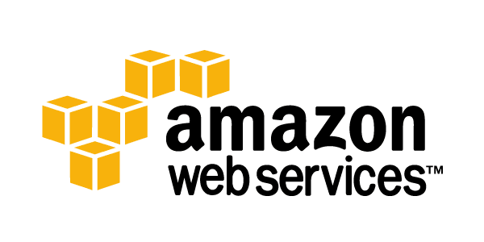
</p>

얼마 전에 ["k8s에 Ollama AI 서버 올려보기"](../install-ollama-to-k8s/)라는 포스트를 통해  
"**GPU가 너무 비싸 인프라 구축을 어떻게 해야 할지 고민이다**"라는 내용을 토로했다.

얼핏 GPU 얘기에만 매몰된 것처럼 보였을 수도 있으나,  
당연하게도 **클라우드 비용은 GPU만의 문제가 아니다.**

클라우드에는 **컴퓨트**, **스토리지**, **네트워크** 등 다양한 카테고리의  
서비스가 존재하고, 상황에 따라 비용을 최적화할 수 있는 방법들도 제각각이다.  
이번 포스트에서는 AWS를 중심으로 클라우드 비용 절약 팁을 공유하고자 한다.

> **왜 AWS?** 🤔
>
> GCP, Azure, OCI 등 다양한 클라우드가 있지만, 전부 다 다루기엔 한계가 있다.  
> 다행히 대부분 기본 개념은 유사하므로 이 포스트에서는 공통된 원칙을 중심으로 다루도록 하겠다.  

<br>

## 문제의 시작

### On-Premise 서버 구축의 어려움

<p align='left'>
    
</p>

서버를 구축하는 일은 힘들다.  
CPU, 메모리, 용도에 맞는 각종 스토리지, PSU<sub>(파워 서플라이)</sub>, 메인보드, 가끔 GPU같은 PCI-E 확장 카드.  
구매해야 하는 게 한두 가지가 아니다.

컴퓨터를 구매한다고 끝나는 것도 아니다.  
정전을 대비한 외부 UPS, 끊김 걱정 없는 튼튼한 회선 역시 필요하다.

그 외에도 OS, RAID 구성, 각종 네트워크 / 방화벽 설정 등등...  

> 그런데 이런 일은 보통 IDC <sub>(Internet Data Center)</sub>에서 알아서 다 해주는 거 아닌가?

<p align='center'>
    
    <em>결코 그렇지 않다</em>
</p>

막상 해보면 서버 도입부터 실제 센터에 설치/설정하는 일련의 과정 동안  
하루에도 수십통씩 이메일과 전화, SMS 등을 보내고 받게 될 것이다. <sub>나도 알고싶지 않았다.</sub>

그렇다고 IDC 직원이 뭔가를 잘못 했다는 건 아니다.  
꼼꼼하게 하나하나 확인하면서 클라이언트에게 확인 받는 건 시스템 엔지니어로서 당연하다.

<br>

### 클라우드 서비스를 사용하는 이유

바로 위 섹션의 문제점 극복을 포함해서 기업들이 클라우드를 사용하는 이유는 여러 가지가 있다.

예를 들어:
- **유연성과 확장성**  

    IDC에 데이터 서버를 구축한다고 생각해보자.
    <p align='left'>
        
    </p>

    위 제품은 Seagate IronWolf Pro 7200rpm, 512MB 캐시 모델이다.   
    용량은 30TB, 가격은 작성일 기준 120만원 정도이다.

    > 서버에 필요한 디스크 크기가 아직 미정인 상황이다.
    >
    > 1. 바로 제일 크고 아름다운 `30TB HDD를 구매`  
    > 2. 더 작은 디스크를 우선 구매 -> 추후 `점진적으로 늘리기`

    후자를 택하는 게 합리적이긴 한데,  
    이러면 나중에 HDD를 장착할 물리적인 `공간이나 포트가 부족`해질 수도 있다.
    
    > 그렇담 클라우드는?

    클라우드 서비스를 통해 구축한다면 이러한 고민에서 해방된다.   
    물리적 제약에 신경 쓸 필요 없이 `지금 필요한 만큼의 서버를 구성` 할 수 있고  
    원하면 `언제든, 원하는 만큼 스펙을 조절`할 수 있다.

- **보안**

    민감한 정보를 안전하게 보호하는 것은 비즈니스를 성공적으로 운영하기 위한 기본적인 요소이다.  

    간단하게는 보안그룹 인바운드/아웃바운드 규칙부터, <sub>(단일 서버 기준으로 하면 firewall에 해당)</sub>  
    IAM을 통한 단일화된 그룹 / 사용자 관리, KMS와 같은 별도 Key 관리 서비스 등 클라우드의  
    고급 보안 조치를 통해 보다 쉽게 관리하고 안심하고 사용할 수 있다.

- **IaC를 통한 신속한 배포**

    [Terraform](https://developer.hashicorp.com/terraform), [Pulumi](https://www.pulumi.com/), [CloudFormation](https://aws.amazon.com/ko/cloudformation/) 등 클라우드 서비스에 대한  
    **인프라를 코드로 관리할 수 있는 도구**들을 사용하면 새로운 환경을 빠르게 구축할 수 있다.

    또한, 그 자체로 일련의 정리된 문서의 역할도 겸하므로 현재 어떤 서비스가 어떻게 구성되어 있는지,  
    혹은 Git과 같은 버전 관리 도구로 인프라의 변경 이력을 추적하는 것도 용이하다.

    On-Premise 환경에서도 [OpenStack](https://www.redhat.com/ko/topics/openstack)을 통해 비슷한 작업이 가능하지만,  
    이는 엄연히 이야기하면 그 자체로 IaC 도구는 아니고, OS 혹은 플랫폼에 가까운 물건이다.


> 그래 그럼 클라우드 서비스가 최고다 이건가?

<br>

### 클라우드 서비스를 쓰면 생기는 문제

> 그럴 리가 있나. 세상만사 **명**이 있으면 **암**도 있는 법이다.  

이번에도 몇 가지 예시를 들어보면 다음과 같다.

- **의존성**

    특정 클라우드의 생태계에 지나치게 의존하다보면 그 자체로 기업의 비즈니스 운영에 영향을 줄 수 있다.  

    예를 들어 `AWS`의 `ECS`를 사용해 컨테이너 클러스터를 구성했다고 가정해보자.  
    심지어 EC2가 아닌 `Fargate`를 컴퓨팅 엔진으로 사용했고 `ALB`로 고유한 라우팅 규칙,  
    `CloudWatch`를 사용한 모니터링 등등이 포함된 그야말로 **AWS 환경에 특화된 클러스터**를 만들어 냈다.

    그런데 어느 날 당신의 상사가 "**AWS 이거 너무 비싸**"라며 자체적인 k8s 클러스터를 만들거나 아니면 다른 클라우드로의 마이그레이션을 지시했다.  

    대체 이 토폴로지를 어떻게 k8s 방식에 맞춰 이전해야 하는가?  
    사실상 처음부터 다시 만드는 게 현명하다.

- **기술적 허들**

    클라우드 서비스를 통해 인프라 환경을 설정하고 운영하는 것은 굉장히 난해한 일이다.  
    "**클라우드 그거 마우스 딸깍 딸깍 아니냐?**" 라는 비아냥도 몇 번 들은 적 있는데,  
    이게 보기보다 굉장히 방대하고 복잡한 기술/지식이 필요한 분야이다.

    더욱이 클라우드마다 장단점도 있어서 2~3개의 클라우드에 걸쳐 인프라를 구축하는 경우도 많다.  
    요컨대, 해당 분야에 능통한 전문 인력을 고용해야 한다는 것이다.  

    On-Premise에 서버를 구축/운영할 때는 적어도 전문가의 서포트를 받을 수 있다.  
    24시간 언제나 상주하는 직원들이 사용자가 **멍멍이 떡처럼 질문을 해도, 찰떡처럼 알아채고** 문제 해결을 도와준다.

    하지만 클라우드 서비스에서 그런 수준의 친절과 수고를 기대하긴 어렵다.  
    <sub>(물론 CSP가 대시보드 페이지만 띄워놓고 사용자에게 서버 임대료만 따박 따박 받아내는 자동사냥 시스템을 만들었단 소린 아니다.)</sub>

- **비용**

    바로 위 `기술적 허들`에서 이어지는 문제이자 이번 포스트의 주제이다.  
    
    아이러니하게도 "비용"이라는 항목은 클라우드 서비스의 **장점**으로 더 많이 언급된다.  
    구축하려는 시스템의 **성격**에 맞춰 **필요한 서비스와 자원**을 정확하게 선택하면  
    효율성을 극대화할 수 있고, 결과적으로 비용을 최적화할 수 있다는 논리이다.

    그런데 문제는 "`그걸 대체 어떻게 하냐?`"이다.
    
    실제로 클라우드 비용 관리를 해보면 예상치 못한 지출이 발생하기 쉽다.  
    사용한 만큼만 지불한다는 `Pay-as-you-go` 모델의 양면성인 셈이다.  
    리소스를 제대로 관리하지 않으면 **사용하지 않는 인스턴스**가 계속 돌아가고,  
    **네트워크 트래픽**이나 **스토리지 I/O** 같은 숨겨진 비용까지 합쳐져서  
    결국 고정 비용이 거의 없는 IDC 대비 오히려 더 많은 비용이 나올 수도 있다.
    
    그래서 클라우드를 효과적으로 사용하려면 **체계적인 비용 최적화 전략**이 필요하다.

<br>

## 공통사항

### (클라우드) 리소스 태깅

<p align='left'>
    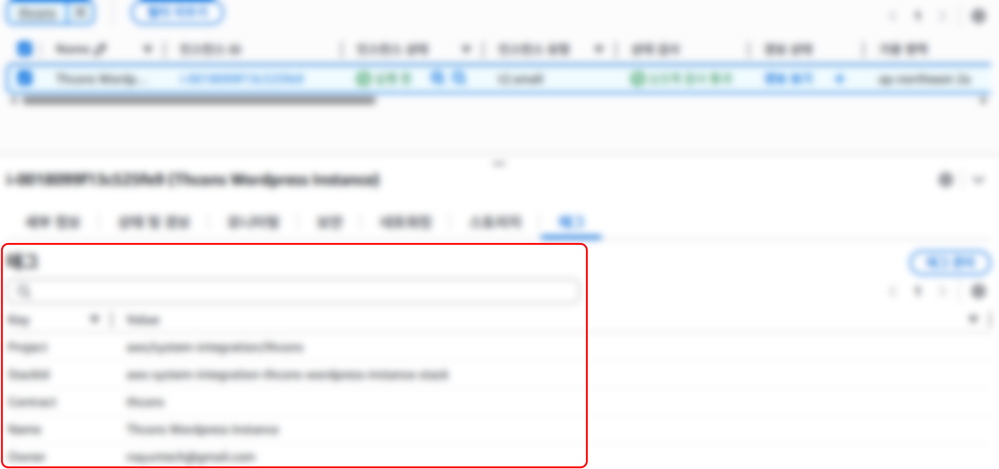
</p>

AWS에는 ["비용 할당 태그"](https://docs.aws.amazon.com/ko_kr/awsaccountbilling/latest/aboutv2/cost-alloc-tags.html)를 통해 조직의 태그 할당 정책에 따라  
Cost Explorer로 비용 분석/추적이 가능하다. 일단 어디에 얼마를 쓰는지 알아야 절약을 할 수 있다.

**개인 가계부에 비유하자면 사용한 돈에 "범주"를 붙이는 것과 같다.**  

가령 여자/남자 친구와 주말에 롯데월드에 가서 놀았다면,  
이때 사용한 비용들에는 다음과 같은 태그를 붙일 수 있다.

| 키 | 값 | 비고 |
| --- | --- | --- |
| Purpose | Personal-Date | 무엇을 위한 지출인가? |
| Partner | Girlfriend 혹은 Boyfriend | 누구에게 할당된 비용인가? |
| Location | LotteWorld | 어디서 발생한 비용인가? |

**클라우드 리소스도 마찬가지다.**  

예를 들어 `프로젝트 A`의 `개발팀 A`가 사용한 EC2 인스턴스에는 다음과 같은 태그를 붙일 수 있다.

| 키 | 값 | 비고 |
| --- | --- | --- |
| Project | Project-A | 어떤 프로젝트의 비용인가? |
| Team | Dev-Team-A | 어느 팀이 사용하는가? |
| Environment | Development | 어떤 환경인가? (Dev/Staging/Prod) |

다만, AWS의 태그 값은 기본적으로 원자값만 사용할 수 있다.  
CSV 형태, 예를 들어 `"Managers" : "Aron,Ted,James"` 이렇게는 쓸 수 없다.  
정확히는 **사용 자체는 가능하나, AWS 네이티브 기능의 한계로 이런 태그의 필터링이 불가능**하다.  
반드시 그렇게 사용해야 하는 경우 [DataDog](https://www.datadoghq.com/)과 같은 외부 서비스를 알아보도록 하자.

<br>

### 전사적 지원

클라우드 비용 절약은 단순히 담당 엔지니어 1명, 혹은 DevOps팀만의 노력으로 달성하는 데 한계가 있다.  

<p align='left'>
    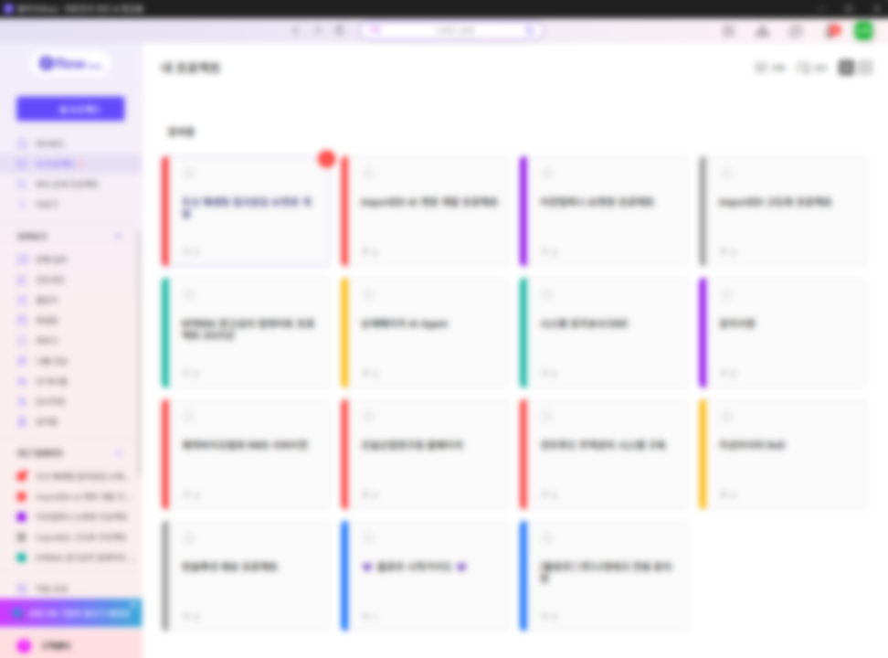
</p>

아마 대부분 회사에서 프로젝트/일정 관리, 커뮤니케이션의 역할 등을 하는 협업 툴을 사용할 것이다.  
이를 통해 관련된 모든 인원들에게 클라우드 비용에 대한 지속적인 관심을 환기시키고 소통을 통해 해결해 나가고자 하는 노력이 필요하다. 
  
<br>

### (애플리케이션) 리소스 모니터링

한 명의 개발자가 인프라도 관리하면서 거기에 올라가는 모든 앱을 전부 다 만드는 경우는 없을 것이다.  
애플리케이션을 빌드하는 건 결국 다른 팀, 다른 개발자일 확률이 높은데, 문제는 인프라에 올라간 리소스를  
얼마나 잘 활용하는가는 그들의 손에 달려있다는 것이다.

**조금 극단적인 예시를 하나 들어보겠다.**

`개발팀 A`가 구축한 `프로젝트 A`가 있다.  

이 프로젝트에는 RDS에 쿼리를 날려 데이터를 조회하고 분석한 뒤 다시 다른 테이블에 저장하는 프로세스가 있다. 
만일 조회/분석해야 하는 데이터 튜플의 수가 1,000만개인데 별 생각 없이 한꺼번에 가져와서 작업하도록 만들었다면 어떻게 될까?

pod나 container에 리소스 제한을 걸어뒀다면 해당 서비스가 종료될 것이고, 그렇지 않았다면 물리적 한계까지 자원을 소모하게 될 것이다.

해당 로직을 만들어 사단을 낸 직원을 추적/섬멸하든, 조용히 타이르든 그것은 회사 내규에 따라 다르겠으나, 
굳이 이런 극단적인 예시가 아니어도 크고 작은 메모리 누수는 제법 빈번하다.
<p align='left'>
    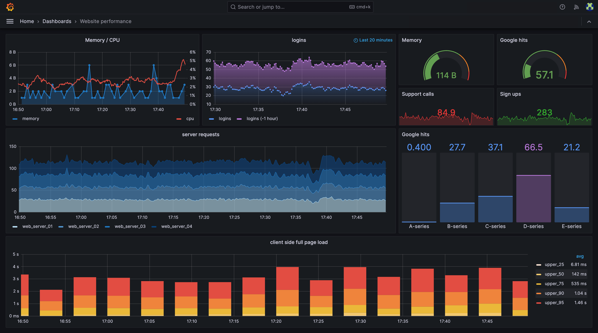
</p>

[Prometheus](https://prometheus.io/), [Grafana](https://grafana.com/)등을 활용해 리소스를 모니터링 하고 사전에 알람을 보내게 구축하도록 하자.

<br>

## 컴퓨팅

AWS는 EC2(Elastic Computing Cloud)가 이 파트에 해당한다.  
무슨 VM, Core Instance 등등 클라우드마다 부르는 방식은 다양한데 실제 앱이 동작하는 서버 컴퓨터를 대여해주는 서비스이다.

특별한 경우가 아니라면 클라우드 비용의 거진 대부분은 여기서 발생한다. 

<br>

### Arm CPU

EC2 구성 요소 중 GPU를 제외하면 가장 많은 비용을 차지하는 것이 바로 CPU이다.  
CPU 아키텍처는 보통 `AMD64(혹은 x86_64)`와 `Arm64(혹은 aarch64)`가 가장 많이 사용된다.

<p align='left'>
    
</p>

이런 일반적으로 생각하는 PC나 서버에 들어가던 것이 `AMD(x86)`이고

<br>

<p align='left'>
    
</p>

이런 스마트폰이나 태블릿같은 모바일 장치에 들어가던 것이 `Arm`이다.

초고사양 모바일 게임을 즐기는 유저가 아니라면 스마트폰에 쿨링 팬을 다는 경우는 없을 것이다.  
Arm 계열의 CPU는 AMD(x86)에 비해 **저전력**, **저발열**, **고효율**이라는 특징을 가진다.

본래 서버용 CPU는 AMD(x86) 계열을 사용하는 것이 일반적이었는데,  
내 기억이 맞다면 애플의 M1 칩을 탑재한 맥북을 공개한 이후로 상황이 많이 바뀌었다.

요즘은 Arm CPU를 사용하는 서버 인스턴스를 어느 클라우드에서나 기본적으로 제공한다.

<p align='left'>
    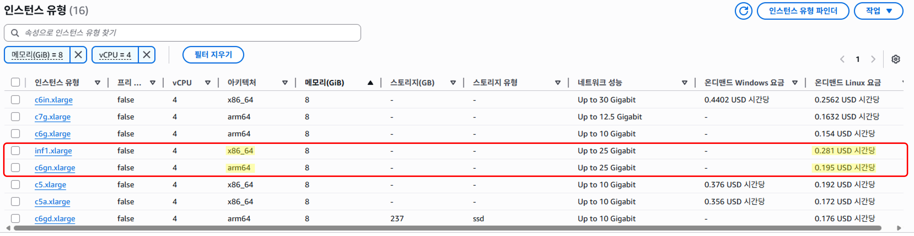
</p>

위 사진에서 vCPU 4, 메모리 8GiB로 통일하고 시간당 On-Demand 요금을 보면,  
AMD(x86)의 경우 시간당 $ 0.281, Arm은 시간당 $ 0.195이다.

> CPU 아키텍처를 Arm으로 바꾸면 대략 30% 정도 비용을 절감할 수 있다.

현재 근무중인 회사에서도 실제 Arm CPU를 굉장히 활발하게 사용하고 있다.  
신규로 생성하는 서비스는 물론 기존 AMD(x86)으로 동작중인 것들도 하나씩 마이그레이션 중이다.  
실제 수치상으로도 2~30% 정도의 비용 절감 효과를 보고 있다.


다만, 이 경우 애플리케이션을 빌드할 때 Arm CPU 아키텍처에 맞춰서 빌드해야 한다.  
아무래도 이게 걸림돌이 되어서 전환을 망설이는 경우도 있을 것이다.

현재 Docker로 애플리케이션을 패키징 하고 있다면 [Docker buildx](https://docs.docker.com/reference/cli/docker/buildx/)를 사용 해보는 것을 추천한다.

예를들어 다음은 실제 현재 회사에서 사용하고 있는 GitHub Action Workflow CI 스크립트의 일부이다.  
조금 특이하게도 대상 환경이 `Production`일 경우엔 `arm64`, `Stage`일 경우엔 `amd64`에 맞춰 빌드한다.

```yml
# ...... #
jobs:
  # ...... #   
  release_ocir:
    name: Publish to OCIR Repository
    needs: release
    runs-on: ubuntu-latest
    permissions:
      contents: read
    steps:
      # ...... #   
      - name: Restore build artifact permissions
        run: cd dist && setfacl --restore=permissions-backup.acl
        continue-on-error: true

      - name: Get OCIR repo
        id: get-ocir-repo
        uses: oracle-actions/get-ocir-repository@v1.3.0
        with:
          name: ${{ vars.REPO_NAME }}
          compartment: ${{ secrets.OCI_COMPARTMENT_OCID  }}

      - name: Read version
        id: get-version
        run: echo "version=$(cat dist/version.txt)" >> $GITHUB_OUTPUT

      - name: Get OCIR region
        id: get-ocir-region
        uses: actions/github-script@v7.0.1
        env:
          repo_path: ${{ steps.get-ocir-repo.outputs.repo_path }}
        with:
          result-encoding: string
          script: return `${process.env.repo_path}`.split('.')[0]

      # 이 작업까지 끝나면 대상 Container Registry에 접근 권한을 얻게 된다.
      - name: Login to OCIR repo
        uses: docker/login-action@v3.5.0
        with:
          registry: ${{ steps.get-ocir-region.outputs.result }}.ocir.io
          username: ${{ secrets.OCI_TENANCY_NAMESPACE }}/${{ secrets.OCI_CLI_USER_NAME }}
          password: ${{ secrets.OCI_AUTH_TOKEN }}

      # 목표 환경 (prod/stage)에 따라 platform(CPU 아키텍처) 값 지정 
      - name: Resolve target platforms
        id: resolve-platforms
        run: |-
          TARGET="${{ inputs.target }}"
          if [ -z "$TARGET" ]; then TARGET="stage"; fi
          if [ "$TARGET" = "prod" ]; then
            echo "platforms=linux/arm64" >> $GITHUB_OUTPUT
          else
            echo "platforms=linux/amd64" >> $GITHUB_OUTPUT
          fi
          
      # Docker Buildx 설정
      - name: Set up Buildx
        id: docker-buildx
        uses: docker/setup-buildx-action@v3.11.1
        with:
          driver-opts: |-
            image=moby/buildkit:master
            network=host
          platforms: ${{ steps.resolve-platforms.outputs.platforms }}
          
      # 이미지를 빌드하고 대상 Registry에 Push  
      - name: Build Container image and push
        uses: docker/build-push-action@v6.18.0
        with:
          push: true
          context: .
          file: ./Dockerfile
          platforms: ${{ steps.resolve-platforms.outputs.platforms }}
          tags: ${{ steps.get-ocir-repo.outputs.repo_path }}:${{ inputs.target || 'stage' }}-latest,${{ steps.get-ocir-repo.outputs.repo_path }}:${{ inputs.target || 'stage' }}-${{ steps.get-version.outputs.version }}
          builder: ${{ steps.docker-buildx.outputs.name }}
   # ...... #

```

Docker Buildx로 대부분의 호환성 이슈는 대응 가능하지만,    
이미지 내부에 설치하는 라이브러리 수준에서의 호환성 이슈의 경우는 Dockerfile에 분기를 넣어 해결하자.
```Dockerfile
# ...... #

RUN if [ "$TARGETARCH" = "arm64" ]; then \
    # 아키텍처가 Arm64인 경우만 이 안의 코드를 실행
    fi

# ...... #
```

단순 분기 처리로는 대응이 불가능할 경우, 아예 파일을 나눠 사용하도록 하자.

```bash
.
├── Dockerfile.amd64
└── Dockerfile.arm64
```


<br>

### Serverless 프레임워크

AWS에는 ["Lambda"](https://aws.amazon.com/ko/lambda/)라는 서비스가 있다.

<p align='left'>
    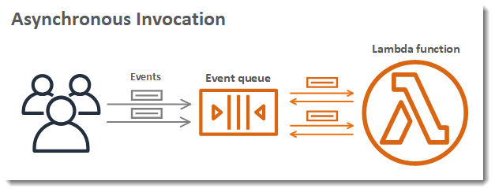
</p>


24시간 실행되며 지속적으로 과금되는 EC2와 달리 Lambda는 서버 관리가 필요 없는 `Serverless` 방식이다.  
**특정 코드가 실행될 때만 비용이 부과**되어 새벽 시간대처럼 사용자가 거의 없는 유휴 시간에는 비용 부과가 되지 않는다.

주요 특징은 다음과 같다:
- **이벤트 기반(Event-Driven) 방식**: 

    CloudWatch, API Gateway와 연동하여 특정 이벤트,  
    가령 **API 호출**, **일정 시간 경과**, **파일이 업로드** 등이 발생할 때만 코드가 실행된다.

- **서버 관리 불필요**:

    문자 그대로 `Serverless` 방식이다.  
    EC2처럼 OS, H/W 용량 계획, 서버 프로비저닝, 스케일링 정책 등의 **인프라 관리에 신경 쓸 필요가 없다.**

- **실행 기반 과금**:

    코드가 **실제로 실행되는 동안에만** 비용이 부과된다.  
    사용자가 있든 없든 지속적으로 시간당 비용을 부과하는 EC2와의 가장 큰 차이점이다.

<br>

다만 몇 가지 단점도 있다:
- **콜드 스타트 지연**:

    Lambda 함수가 장시간 호출되지 않았다면 AWS가 런타임 환경을 준비하고 코드를 불러오는 초기 지연 시간이 발생한다.

- **리소스 제약**:

    Lambda 함수는 **최대 15분**까지만 실행 될 수 있고 메모리는 **10GB**가 한계이다.

<br>

전반적으로 요약하면:
1. 사용자 호출에 즉각적인 반응성을 요구하지 않으며

2. 한 번의 호출시 필요한 시간, 리소스가 많지 않은 경우

Lambda 도입을 고려해보도록 하자.

<br>

### 스팟 인스턴스

스팟 인스턴스는 AWS에서 `현재 사용되지 않고 남아있는 여유 컴퓨팅 용량`이다.

이게 무슨 소리냐면 다른 사용자, 그러니까 다른 기업이 사용하고 있는 EC2 리소스 중  
현재 놀고있는 분량만큼을 `빌려와서` 사용한다는 개념이다.

당연히 원래 주인이 내놓으라고 하면 돌려줘야 한다.  

> 비용은 기존 EC2 대비 최대 무려 90%나 저렴하다!

좋아 보이긴 하는데 신뢰성에 의심이 가서 나도 개념만 들었지 실 도입은 못 해봤다.  
그래도 시의적절하게 잘 활용하면 괜찮은 대안이 될 것이다.

장점:
1. 비용 절감:

    가장 큰 장점이다. On-Demand EC2 방식에 비해 **70~90%까지** 비용을 절약할 수 있다.

2. 대규모 컴퓨팅:

    낮은 비용으로 병렬 컴퓨팅 자원을 신속하게 확보할 수 있다.

단점:
1. 회수 위험:

    AWS가 용량을 회수하면 `언제든지 인스턴스가 중지 될 수 있다`.  
    일반적으로 중단 약 2분 전 `Interruption Notice`가 제공되고, 사전 분산을 위한 `Rebalance Recommendation` 신호도 제공된다.

2. 관리의 어려움:

    중단 가능성이 상시 존재하므로 체크포인트 저장, 워크 큐(재시도 가능),  
    중간 결과를 S3/DynamoDB 등에 저장하는 설계가 필요하다.


활용처:

1. 배치 처리, 빅데이터 분석, 머신 러닝

2. 기타 Stateless 서버의 부하 분산

3. 이미지/비디오 렌더링

<br>

### 예약 인스턴스

EC2의 **기본 요금**은 흔히 On-Demand 방식이라고 한다.  
간단히 한국식으로 표현하면 `후불 요금제`이다.

내가 어렸을 때는 PC방 1시간 사용료가 1,000원이었다.  
고로 5시간 게임을 하고 나서 요금 정산을 하면 5,000원을 내야했다.  
하지만 **처음부터 5,000원을 내고 계정에 등록하면 6시간**을 할 수 있었다.

예약 인스턴스는 이와 유사한 방식이다.

예약 인스턴스(Reserved Instance, RI)는 **1년** 혹은 **3년**동안  
`특정 인스턴스` 유형과 리전을 사용할 것을 미리 약정하고 선결제 혹은 부분 선결제 함으로써  
On-Demand 방식에 비해 상당한 할인을 받는 방식의 요금 모델이다.

마침 [기존 포스트](../install-ollama-to-k8s/)에서 조사한 정보가 있으니 여기에서 활용 해보겠다.  
다음은 AWS **g5g.16xlarge** 인스턴스의 비용 비교 표이다.

| 비용모델 | 월 평균 사용료 (서울 리전전 / 단위 : USD) |
| --- | --- |
| On-Demand | $ 2388.29 |
| Spot | $ 672.59 |
| 1년 예약 분할 지불 | $ 1559.73 |
| 1년 예약 일시불 | $ 1455.74 |
| 3년 예약 분할 지불 | $ 1102.4 |
| 3년 예약 일시불 | $ 959.5 |

비교를 위해 On-Demand와 Spot도 추가 하였다.  
**On-Demand와 비교하면 3년 RI 일시불 방식이 60%가량 저렴하다.**

장점:
1. 비용 절감:

    Spot과 마찬가지로 엄청난 할인을 받을 수 있다.

2. AZ 선점:

    이건 좀 특이한 케이스인데, 인스턴스 확보가 어려운 특정 AZ(가용 영역)에  
    미리 용량 사용을 보장받을 수 있다.

단점:
1. 장기 약정:

    1년 / 3년 이 2가지 옵션 밖에 없다. 그 기간 동안은 계속 써야한다.  

2. 초기 비용 부담:

    할인을 받기 위해 처음 도입 시 엄청난 양의 비용을 지불해야 할 수도 있다.

3. 유연성 부족:

    Standard RI의 경우 인스턴스 유형을 변경할 수 없다.  
    Convertible RI는 유형/패밀리 전환은 가능한데 할인율은 더 낮다. (On-Demand 대비 최대 72% -> 54%)

활용처:
1. 장기적으로 운영 해온, 혹은 운영 될 것으로 예측되는 서비스

2. k8s의 베이스 용량 확보:

    k8s 클러스터를 사용하고 있다면 **상시 필요한 최소한의 용량**이라는 것이 있을 것이다.  
    보수적으로 접근해 최소 용량 수준에 맞춰 RI를 쓰면 비용 절감에 도움이 된다. 

<br>

### 절약 플랜

절약 플랜(Savings Plan)은 RI의 단점을 극복하기 위해 나온 요금제이다.   
기본적으로 RI와 유사한 비용 절감 효과는 최대한 제공하면서 부족한 유연성 제약을 완화한다.

회사 근처 구내식당에서 점심 한 끼를 먹으려면 10,000원이라고 하자.  
직원이 10명 정도이고 한 달에 20일씩 출근을 한다면 한 사람이 최대 200,000원,  
10명이니 200만원 정도의 식비가 소모 될 것이다.  
만일 회사 차원에서 매달 100만원을 구내식당에 지불하면, 직원들의 식사를 무료로 해주겠다고 하면 어떠한가?

절약 플랜은 이와 유사한 개념이다.

다만 디테일하게 들어가면 굉장히 길고 복잡해서 이 부분만 추후 별도로 포스트 하도록 하겠다.  
기본적으로는 다음의 전제를 기억하자.

> 리전, OS, 인스턴스 유형 패밀리 등의 제약이 많아질수록, 다시 말해  
> **유연성을 포기할수록 -> 비용이 절감된다**

종류:

1. **Compute Savings Plans**  
    EC2, Fargate, Lambda 등 `컴퓨트 전반`에 적용된다.  
    리전/인스턴스 패밀리/OS 제약이 비교적 적어 `유연성`이 높다.

2. **EC2 Instance Savings Plans**  
    특정 `인스턴스 패밀리 + 리전`에 묶는 대신 `할인율`이 더 크다.

주의사항:

1. 약정은 `시간당 약정 금액` 기준이다. 미사용 약정은 그대로 비용 처리된다.  

2. 약정 기간은 `1년/3년`, 선결제 정도에 따라 할인율이 달라진다.  

3. RI보다 유연하지만, `약정 초과분`은 온디맨드로 과금된다.

<p align='left'>
    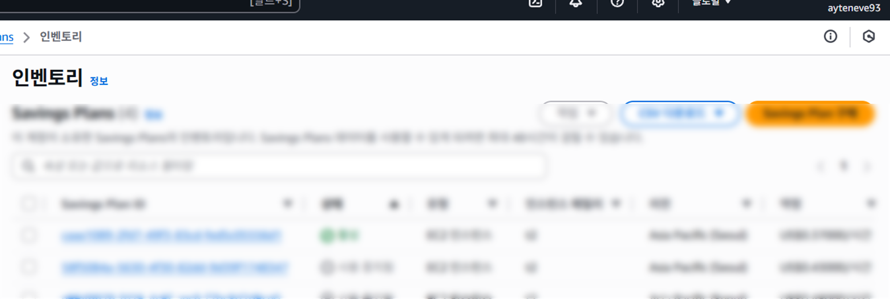
</p>

RI처럼 `일시불` / `특정 인스턴스 장기 계약`과 같은 부담되는 제약이 없어서인지,  
경영진을 설득해 도입하는 게 비교적 쉬웠던 것으로 기억한다. 

특히나 절약 플랜은 인스턴스 패밀리가 일치하는 모든 EC2에 일괄 적용되기 때문에  
바로 다음달부터 즉각적으로 회사에서 소비되는 인스턴스 비용이 2~30% 정도 줄어들었다.

다만 이는 특정 인스턴스 패밀리에 해당하는 경우에만 그렇다.  

구내식당 비유를 계속 들자면 본래 매일 점심 식사 하라고 회사에서 10,000원씩 지급 해주다가  
어느날부터 우리가 "지정한 구내식당 가서 식사하면 무료니까 그쪽으로 가라" 라고 하는 것과 같다.

> 이제 점심에 햄버거 먹고 싶으면 본인 돈으로 사야한다.

<br>

## 스토리지

여기서 말 하는 스토리지는 블록 볼륨이나 RDS가 아닌 파일 저장소<sub>(일명 Bucket)</sub>를 의미한다.  
AWS의 경우 S3(Simple Storage Service)가 이에 해당된다.

S3 비용을 절감하는 핵심 전략은 데이터의 **접근 빈도에 따라 적절한 스토리지 클래스를 선택**,
**수명 주기(Lifecycle) 규칙을 활용하여 불필요한 데이터를 관리**하는 것이다.

### 스토리지 클래스 최적화

데이터 액세스 패턴에 맞는 스토리지 클래스를 선택하면 저장 비용을 크게 절감할 수 있다.

| 클래스 | 주요 용도 | 특징/주의 |
| --- | --- | --- |
| S3 Intelligent-Tiering | 접근 패턴이 불명확·변동이 잦은 데이터 | 계층 자동 이동(Frequent, Infrequent, Archive Instant, Archive, Deep Archive), 모니터링/자동화에 소액 월 비용 발생 |
| S3 Standard-IA | 드물게 접근하지만 밀리초 단위 즉시 조회 필요 | 장기 보관용, 백업/DR에 적합 |
| S3 One Zone-IA | 재생성 가능 데이터, 2차 백업 | 단일 AZ 저장으로 더 저렴, 내구성은 동일하나 가용성 리스크가 있음 |
| S3 Glacier Instant Retrieval | 1년에 몇 번 수준 접근 + 즉시 조회 필요 | 빠르게 조회 가능, 보관 단가 저렴 |
| S3 Glacier Flexible Retrieval / Deep Archive | 매우 드문 접근의 장기 아카이브 | 가장 저렴(Deep Archive), 검색 시간 느림 |


주의사항:

1. 적절한 주기 설정:

    IA/Glacier 계열은 최소 저장 기간(대략 30~180일 수준)과 조기 삭제 위약, 조회/복원 비용이 존재한다.  
    전환 주기가 너무 짧으면 오히려 총비용이 증가할 수 있다.

2. 파일 크기:

    Intelligent-Tiering은 객체 크기/보관기간/접근 패턴에 따라 모니터링 비용 대비 이점이 작을 수 있다.  
    작은 객체를 단기적으로 보관하는 것은 효율적이지 못하다.

<br>

### S3 수명 주기(Lifecycle) 규칙 활용

S3 수명 주기 규칙을 설정하여 자동으로 객체를 관리함으로써 비용을 절감할 수 있다.  
요컨대, 과거 데이터를 지우거나 압축하거나 액세스 빈도가 낮은 백업 스토리지로 옮기는 것을 의미한다.

객체가 일정 기간이 지나면 액세스 빈도가 낮아질 것으로 예상하고, S3 Standard에서 Standard-IA, Glacier 등 저렴한 스토리지 클래스로 자동 전환되도록 규칙을 설정해주자.

**불필요한 객체 자동 삭제/만료:**
- **만료된 객체(Object Expiration):** 더 이상 필요 없는 데이터(예: 오래된 로그 파일, 임시 파일)를 일정 기간 후 자동으로 삭제하도록 설정한다.
- **이전 버전 정리 (Versioning 활성화 시):** 객체 버전을 활성화한 경우, 불필요하게 남아있는 이전 버전들을 일정 기간 후 영구 삭제하도록 설정한다.
- **불완전한 멀티파트 업로드 정리:** 완료되지 않은 멀티파트 업로드 조각들이 남아있지 않도록 일정 기간 후 정리하는 규칙을 설정한다.

<br>

## 네트워크 (Data Transfer)

<p align='left'>
    
</p>

AWS를 포함해서 클라우드 서비스에서 네트워크 사용 비용이란 건 기본적으로

1. `밖` -> `안`(Inbound)으로 들어올 때는 문제가 없지만,  
2. `안` -> `밖`(Outbound)으로 데이터가 전송되어 나갈 때 부과된다.

따라서 네트워크 비용을 낮추는 것은  
**아웃바운드 데이터 전송(Data Transfer Out, DTO)을 줄이는 게 포인트**이다.

<br>

### CDN 활용

CDN을 통해 컨텐츠를 캐싱하여 최종 사용자<sub>(ex: 페이지 방문자)</sub>에게 가장 가까운 엣지 로케이션을 제공함으로써  
서비스 품질도 올리고 비용도 줄이는 일거양득을 누릴 수 있다.

AWS의 경우 [CloudFront](https://aws.amazon.com/ko/cloudfront/)라는 서비스가 이에 해당한다.  


리전에서 직접 인터넷으로 데이터를 전송하는 것 보다 CloudFront를 통한 전송이 훨씬 저렴하다.  
캐싱된 데이터는 S3나 EC2에서 다시 전송할 필요가 없으므로 원본 서버의 DTO가 줄어든다.

다만 CloudFront는 후술할 비용 이슈가 별도로 있다.  
개인적으로 CloudFront 이외의 다른 CDN을 활용하는 걸 추천한다.  
<sub>(어차피 요즘 CDN 성능이야 다 거기서 거기다)</sub>

<br>

### 압축 전송

<p align='left'>
    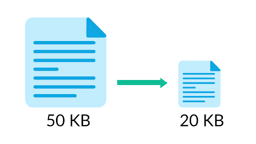
</p>

S3나 EC2에서 데이터를 전송할 때 **Gzip**이나 **Brotli** 등을 이용해 데이터를 압축해서 보내는 것이 좋다.  

CloudFront를 사용한다면 CloudFront에서 자동 압축을 켜는 것이 가장 간단하다.  

<p align='left'>
    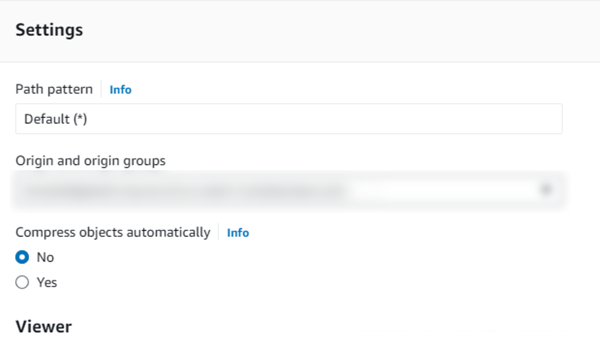
</p>

CloudFront의 동작 설정에서 압축(Compress Objects Automatically) 옵션을 "Yes"로 설정해주자.


별도 CDN이 없거나 보다 세밀한 제어가 필요하다면 Origin<sub>(EC2, ALB 뒤의 웹 서버나 S3 등)</sub>에서 처리 해줘야 한다.  
이는 인프라 관리자가 할 일은 아니고, 각 애플리케이션을 만든 개발자의 몫이다. 

다행히 방법이 어렵진 않다.  
예를들어 Docker 빌드시 사용할 nginx 파일을 다음과 같이 작성 할 수 있다.

```nginx
gzip on;
gzip_static on;            # filename.gz 존재 시, 클라이언트가 gzip 지원하면 직접 제공

brotli on;
brotli_static on;          # filename.br 존재 시, 클라이언트가 br 지원하면 직접 제공
brotli_comp_level 6;
brotli_types text/plain text/css application/javascript application/json image/svg+xml;

# 클라이언트 지원에 따라 우선 확장자 결정 (br > gzip)
map $http_accept_encoding $precompress {
  ~*\bbr\b   ".br";
  ~*\bgzip\b ".gz";
  default     "";
}

location / {
  try_files $uri$precompress $uri =404;  # 지원 포맷 우선 제공, 없으면 원본
  add_header Vary "Accept-Encoding";
  expires 7d;
}
```


<br>

### 내부 전송 최적화

클라우드 `내부적으로` 이루어지는 통신 비용도 절약 할 필요가 있다.

1. **동일 가용 영역(AZ)에 리소스 배치**

    동일 리전 내에서도 가용 영역(AZ)이 다르면 전송 요금이 붙는다.   
    통신이 잦은 EC2, 데이터베이스, 캐시 등은 가급적 같은 AZ에 배치하자.  
    클라우드 서비스 제공자마다 약간의 차이는 있지만 동일 AZ 내 트래픽은 대체로 무료거나 매우 저렴하다.


2. **VPC 내부 통신 활용**

    EC2 인스턴스간 통신을 할 때 대상의 `Public IP`를 목적지로 해서 보낸다고 생각해보자.  
    이는 마치 옆 집 사는 사람에게 물건을 전달하기 위해 우편을 붙이는 것과 같다.  

    이 경우 통신 패킷 자체가 IGW<sub>(Internet Gateway)</sub>를 경유해 클라우드 밖으로 나갔다가  
    다시 들어오는 게 되어 **사실상 외부 통신**으로 간주된다. 비용 부과는 물론 지연까지 발생한다.

    심지어 호출을 요청한 EC2가 **Private Subnet**에 있다면 문제는 더 심각해진다.  
    이 때는 NGW<sub>(NAT Gateway)</sub>를 경유하게 되는데, 시간당 요금과 전송량 요금이 함께 부과된다.  
    
    이는 `월간 비용 누수의 최상위 원인`이 되기 쉽다.

    S3, DynamoDB 등에 접근할 때도 마찬가지다.  
    반드시 `VPC 엔드포인트(Gateway Endpoint)`를 사용해 내부망으로 우회하자.  


3. **리전 간 전송 최소화**

    가장 비싼 내부 전송은 리전 간(Region to Region)의 통신이다.  
    데이터와 데이터를 소비하는 서비스를 가까운 리전에 두어 리전 간 복제 및 액세스를 최소화 하도록 하자.

4. **비용 모니터링/관리**

    Cost Explorer로 전송 비용을 서비스/리전/AZ 기준으로 추적하고,  
    앞서 기술한 비용 할당 태그로 프로젝트 및 팀에 귀속시켜 원인을 파악하자.  

<br>

## 기타 서비스

### Elastic Kubernetes Service (EKS)

AWS에서 제공하는 KaaS<sub>(Kubernetes as a Service, 서비스형 k8s)</sub>이다.  
서비스 자체는 훌륭한데 역시나 `가격`이 문제다.

| Kubernetes 버전 지원 티어 | 요금 |
| --- | --- |
| 표준 Kubernetes 버전 지원 | 시간 & 클러스터당 0.10 USD |
| 확장 Kubernetes 버전 지원 | 시간 & 클러스터당 0.60 USD |

원화로 바꾸면 표준형의 경우 1달에 약 10만원, 확장형은 60만원(!!)이 넘게 부과된다.  
지금 이건 Node 하나 없는 클러스터 1개의 자체적인 가격이다.

**대응전략:**

Arm CPU, Spot, Savings Plan등 앞서 언급했던 내용들과 중복되는 것을 제외하겠다.

1. **클러스터 수 조절**

    EKS 클러스터의 비용은 `클러스터 개수`에 비례한다.  
    당연한 얘기지만, 사용하지 않는 클러스터에 대해서도 비용이 부과된다.

    특별한 이유가 있는게 아니라면  
    하나의 리전에는 k8s 1~2개(환경 분리 목적) 정도만 배치하도록 하자.

2. **표준형(Standard)을 사용**

    `표준형`과 `확장형` 가격 차를(6배) 보고 확장형에 엄청난 어드밴티지가 있겠거니 생각하겠지만,  
    사실 둘의 차이는 `Kubernetes API의 지원 기간` 정도가 전부다.

    보통 k8s는 3개의 마이너 버전에 대한 패치를 제공하는데 EKS는 이 지원 정책을 따라간다.  
    표준형은 k8s에 대한 보안 패치, 버그 수정, 컨트롤 플레인 관리등을 표준 k8s 업데이트 사이클에 맞춰 하고,  
    확장형은 여기서 1년을 더 사용할 수 있도록 연장해준다. 

    EKS를 운영하는 가장 좋은 방법은 `표준 지원 기간 내에 k8s 버전을 최신화` 하는 것이다.  
    확장형으로 돈 더 내면서 1년 유예를 둔다고 해도 그 기간마저 지나면 API 지원이 중단된다.

    그대로 방치해버리면 새로운 k8s 기능을 사용하지 못하거나 보안 위험에 노출 될 수도 있다.  
    관심을 가지고 부지런하게 대응 해주도록 하자.

<br>

### CloudFront

앞서 얘기했듯 AWS의 CDN 서비스이다.  
`HTML / CSS / JS` 같은 파일을 S3에 두고 웹사이트를 호스팅해주는 데 주로 사용한다.  

이 역시 서비스 자체는 문제가 없는데 역시나 가격이 발목을 잡는다.

<p align='left'>
    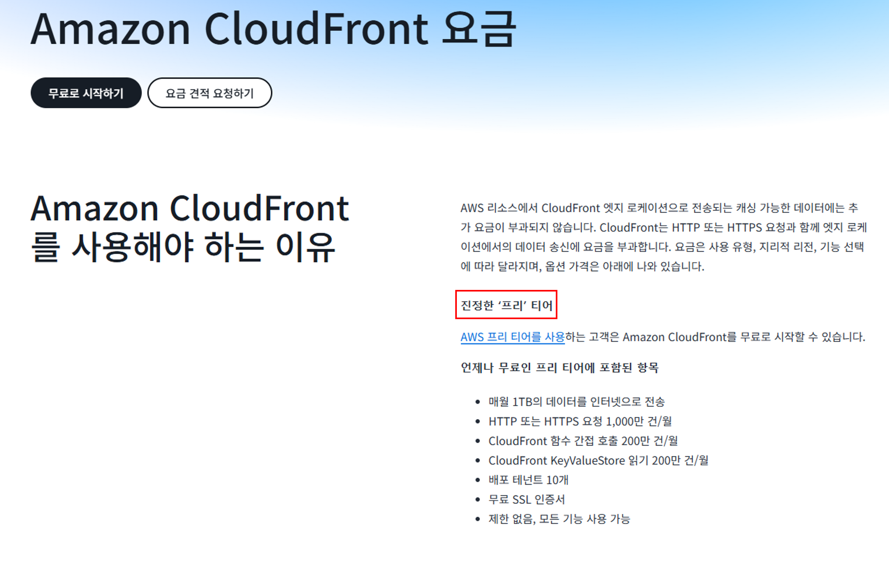
</p>

[요금 페이지](https://aws.amazon.com/ko/cloudfront/pricing/) 첫 장부터 `진정한 '프리' 티어` 어쩌구 하면서 유혹한다.  
조금만 더 내려보면 다음과 같다.

<p align='left'>
    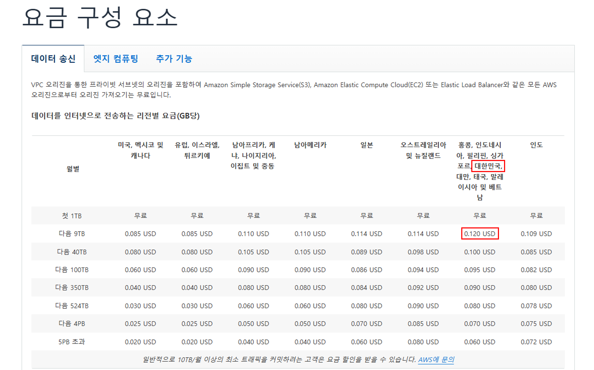
</p>

CloudFront는 상시 무료(Always Free) 혜택으로 `월 1TB 데이터 전송 아웃`이 무료이며, 초과분부터 과금된다.

대한민국이 인도 칼럼 옆에 다른 국가들과 함께 낑겨있는 걸 볼 수 있는데, GB당 $0.12라고 적혀있다.  
예시로 한국에 위치한 Cloudfront에서 한국에 있는 소비자들에게 `1달에 3TB` 정도의 데이터를 전송한다고 생각해보자.

> 기본 1TB는 무료니 2,000 * 0.12
>
> 계산해보면 달에 약 **$240**가 부과될 것임을 알 수 있다.

**대응전략:**

1. **캐시 관리**

    자주 바뀌지 않는 자산(기업 로고 등)은 TTL을 길게,  
    자주 바뀌는 컨텐츠는 짧게 혹은 `no-cache`로 설정을 해주자.

    CloudFront는 요청 URL, 헤더, 쿼리 문자열 등을 기반으로 캐시 키를 생성한다.  
    캐시 키에 불필요한 Query String이나 Header는 제외해서 하나의 키로 적중 될 수 있게 단순화 하자.

2. **원본 요청(Origin Fetch) 줄이기**

    엣지에서 캐시 미스가 나도 원본에 곧장 가지 않도록 중앙 캐시 계층을 둬 부하를 줄이자.      
    

3. **압축**

    앞서 네트워크 섹션에도 기술했듯 Gzip등을 활용해 전송 데이터를 압축해서 보내도록 하자.  

4. **다른 CDN을 고려하자**

    위 방법들 이외에도 전략은 많지만,  
    꼭 CloudFront에 매몰될 필요가 없다면 다른 CDN 서비스를 도입하는 것도 좋다.

    <p align='left'>
        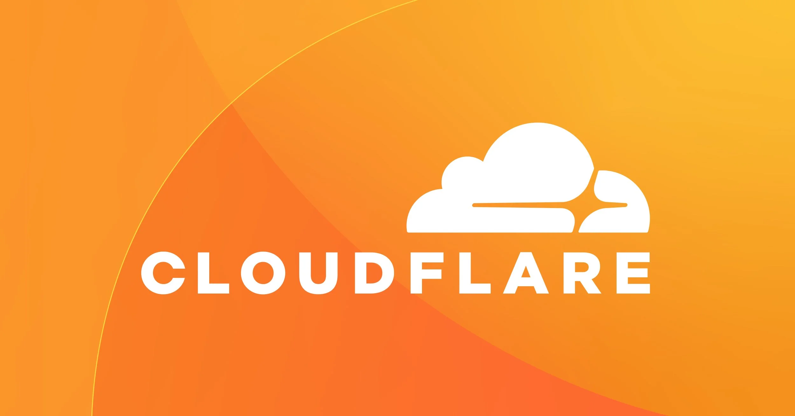
    </p>

    개인적으로 CDN은 [CloudFlare](https://www.cloudflare.com/ko-kr/)를 추천한다.

<br>

### ElasticIP (EIP)

[ElasticIP](https://docs.aws.amazon.com/AWSEC2/latest/UserGuide/elastic-ip-addresses-eip.html)는 AWS에서 제공하는 고정 IP 리소스이다. 별 건 없고 EC2 Public IP를 고정할 때 주로 쓴다.  

문제는 AWS에서 Public IPv4 EIP의 경우,  
현재 할당을 했는지 안 했는지 여부에 관계 없이 `시간당 $0.005를 부과`한다는 것이다.

<p align='left'>
    
</p>

> 계산해보면 한 달에 $3.6 ~ $3.72, `대략 $4 정도` 부과된다. <sub>(그게 무슨 소리니 애떱아...)</sub>

뭐, 자기들 말로는 IPv4 주소가 전 세계적으로 고갈 되어감에 따라 내놓은 정책이라고 한다.  
주소 하나당 1달에 4달러가 별 거 아닌 거 같아도 이런게 많아지면 은근히 도트딜이 아프게 들어온다.

**대응전략:**

1. 안 쓰는 ElasticIP는 지우도록 하자

2. IPv6 주소를 발급받아 쓰자

    IPv6는 무료다. 워낙 대역폭이 넓어서 인류가 멸망할 때까지 써도 남아 돌 것이다.  
    다만 [IPv6 할당이 가능한 리소스](https://docs.aws.amazon.com/ko_kr/vpc/latest/userguide/aws-ipv6-support.html)는 한정되어 있다. 이 점을 유의하자.

IPv4 문제는 다른 클라우드 서비스들도 대체로 상황은 비슷하다.

<br>

## 마치며

최대한 간략하게 쓰려고 했는데, 하다보니 한도 끝도 없이 늘어져 버렸다. <sub>(분량 조절 실패)</sub>  

AWS에는 워낙 `예상치 못한 숨겨진 추가 비용`이 많아서 관리하는데 이만저만 품이 드는 것이 아니다.

가장 좋은 접근법은 AWS에 너무 얽매이지 말고 AWS 이외의 다른 클라우드 서비스,  
혹은 On-Premise의 인프라를 한데 묶어 `멀티 & 하이브리드 클라우드 인프라`로 전환하는 것이다.

다만 그러면서 따라오는 문제점도 있다.  
멀티/하이브리드 전환은 다음의 교환비용을 수반한다.

1. 벤더 종속성 감소 -> 관리 복잡성 증가(관제, 알림, 보안정책, 빌링 통합)

2. 비용 최적화 옵션 확대 -> 아키텍처/데이터 일관성 유지 비용 상승

3. 장애 내성·거점 다양성 -> 운영 인력/플랫폼 역량 요구 수준 상승

현실적인 실행 순서는 아래와 같이 추천한다.

 - [ ] 비용 가시성 표준화: 

    비용 할당 태그 강제와 팀별 Cost 대시보드 고정 배치

 - [ ] 낭비 차단 가드레일: 

    미사용 리소스 자동 종료·알림, EIP·스냅샷 정리 정기화

 - [ ] 컴퓨팅 포트폴리오: 

    Arm 전환 검토 -> Serverless/스팟/RI·절약 플랜 혼합 적용

 - [ ] 데이터 등급화: 

    S3 스토리지 클래스/라이프사이클로 자동 이전·만료 정책화

 - [ ] DTO 최소화: 

    VPC 엔드포인트, 동일 AZ 배치, 압축·CDN 캐시 키/TTL 최적화

 - [ ] 멀티·하이브리드 파일럿: 

    단일 워크로드부터 이중화, 관제·빌링 통합 방식 검증

결국 원칙은 단순하다.  

`측정 → 표준화 → 자동화`를 반복하며, 특정 환경에 과도하게 속박되지 않는 것이다.  
각 조직의 위험 허용도와 인력 역량에 맞춰 작은 실험부터 시작해보자. 

<br>
 
---

> **참고 자료**  
> - [AWS 비용 할당 태그 (Cost Allocation Tags)](https://docs.aws.amazon.com/ko_kr/awsaccountbilling/latest/aboutv2/cost-alloc-tags.html)  
> - [AWS EC2 스팟 인스턴스 개요](https://docs.aws.amazon.com/AWSEC2/latest/UserGuide/spot-requests.html)  
> - [AWS EC2 예약 인스턴스(Reserved Instances)](https://docs.aws.amazon.com/AWSEC2/latest/UserGuide/reserved-instances-scope.html)  
> - [AWS Savings Plans 개요](https://docs.aws.amazon.com/savingsplans/latest/userguide/)  
> - [AWS Lambda 개요](https://aws.amazon.com/ko/lambda/)  
> - [Docker Buildx 문서](https://docs.docker.com/reference/cli/docker/buildx/)  
> - [AWS S3 스토리지 클래스 개요](https://docs.aws.amazon.com/ko_kr/AmazonS3/latest/userguide/storage-class-intro.html)  
> - [AWS S3 수명 주기(Lifecycle) 관리](https://docs.aws.amazon.com/ko_kr/AmazonS3/latest/userguide/object-lifecycle-mgmt.html)  
> - [AWS VPC 엔드포인트(Gateway/Interface) 개요](https://docs.aws.amazon.com/ko_kr/vpc/latest/privatelink/vpc-endpoints.html)  
> - [AWS NAT 게이트웨이 요금](https://aws.amazon.com/ko/vpc/pricing/)  
> - [AWS EKS 요금](https://aws.amazon.com/ko/eks/pricing/)  
> - [AWS CloudFront 요금](https://aws.amazon.com/ko/cloudfront/pricing/)  
> - [AWS Elastic IP(IPv4) 문서](https://docs.aws.amazon.com/AWSEC2/latest/UserGuide/elastic-ip-addresses-eip.html)  
> - [Prometheus](https://prometheus.io/)  
> - [Grafana](https://grafana.com/)  
> - [Cloudflare CDN](https://www.cloudflare.com/ko-kr/)  