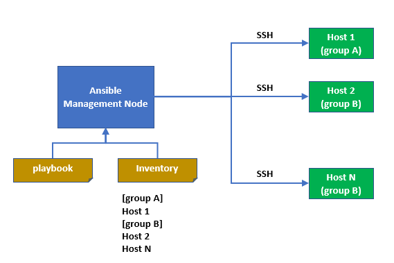
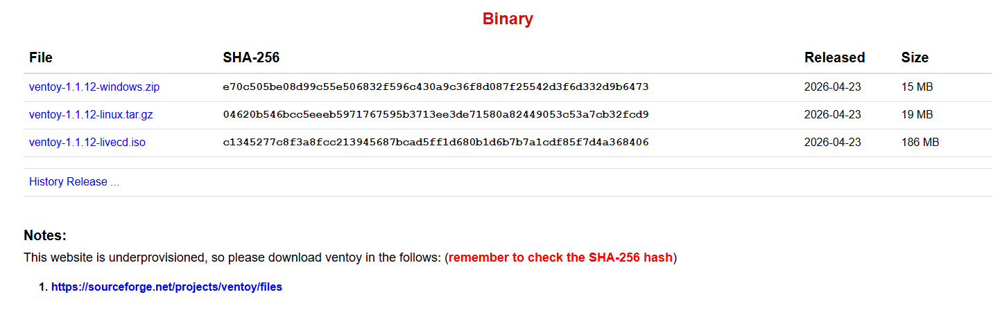
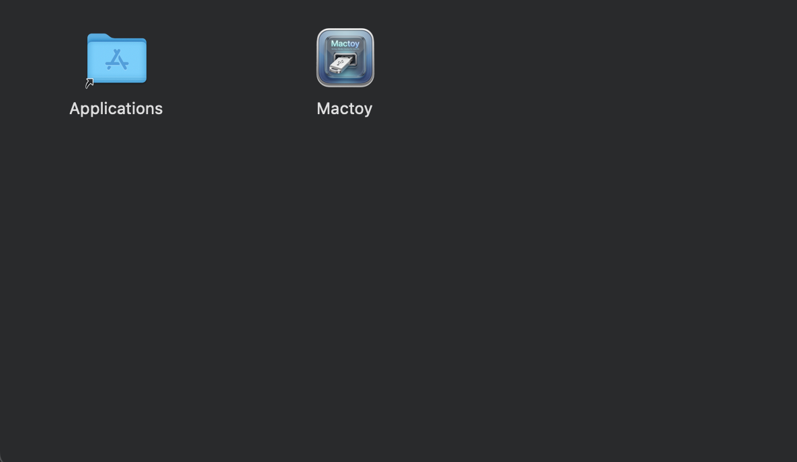
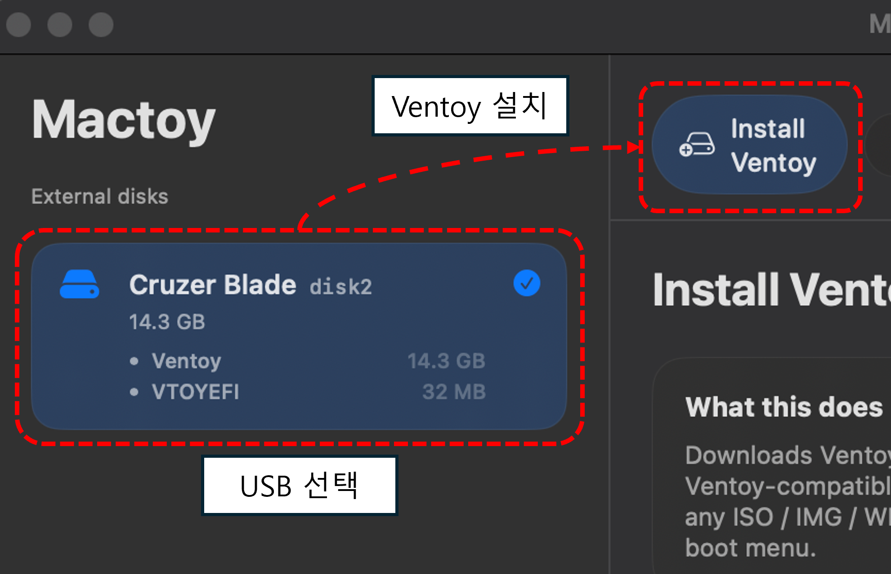
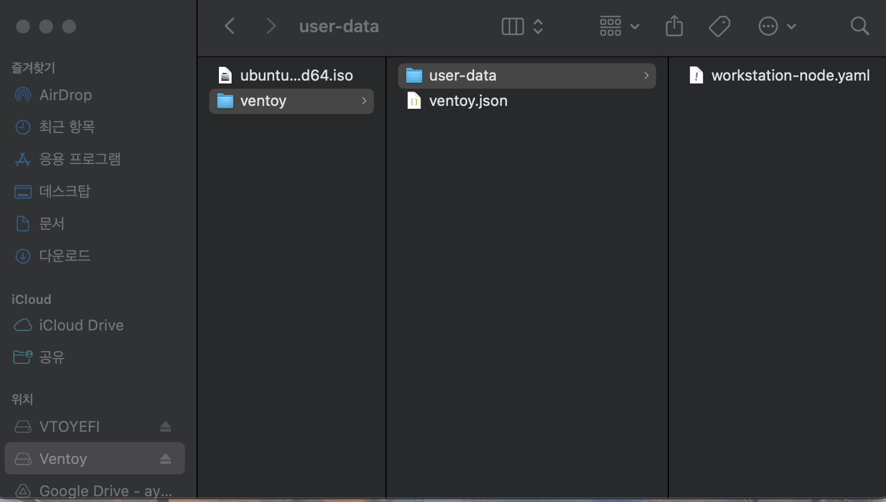

## 들어가기 앞서

k8s 클러스터를 운영할 때는 `Node 레벨에서의 작업`이 필요한 경우가 왕왕 있다.

클러스터를 구성하고 운영하는 방식은 여러가지가 있겠지만,  
우선 현재 회사에서 사용하는 EKS의 경우 k8s API나 kubelet version  
혹은 Node 자체(EC2)의 OS를 업데이트하거나 하는 작업이 생각보다 자주 있는 편이다.

다행히 EKS와 같은 KaaS를 사용할 때는 EKS 서비스 자체적으로 혹은 Karpenter Node Autoscaler를 통해  
이런 기능들이 지원되기 때문에 복잡하게 생각할 거 없이 자연스럽고 신뢰성 높게 작업을 수행할 수 있다.

> 그렇담 On-Premise는?

**당연히 Karpenter 같은 친절한 도구가 있을 리 만무하다.**  
Node Autoscaling은 고사하고 방금 산 따끈따끈한 컴퓨터에 마치 마법처럼 OS에서부터 각종 패키지, k8s가 설치되고 그게 저절로 기존 클러스터에 Join 하길 기대하긴 힘들다.  
<sub>(진짜 이게 그냥 되면 정말 좋겠지만...)</sub>

본래 이런 작업은 수동으로 진행하곤 했는데,  
이를 보다 일관적이고 신뢰성 높게 구성하고자 `Ansible`을 통한 k8s 구성을 하기로 마음 먹었다.

<br>

> 갑자기 왠 `Ansible`?  
> 내용이 제목이랑 다른데?

Terraform이나 Pulumi와 같은 도구의 역할이 `이미 존재하는 k8s 위에 서비스를 배포`하는 것이라면,  
여기서 Ansible의 역할은 `깡통 컴퓨터들을 모아다가 k8s를 최초 구성`하는 것이다.

Ansible은 기본적으로 다음과 같이 동작한다.

<p align='center'>
    
</p>

- 대상 컴퓨터의 SSH(리눅스) 혹은 Winrm(윈도우) 서비스를 통해 접속
- 사전에 지정한 작업을 수행. 가령, 어떤 패키지를 설치한다거나 특정 서비스를 활성화 한다거나 등등

`깡통 컴퓨터`라고는 했으나, 그래도 최소한의 조건은 있다.

- 우선 연결하고자 하는 컴퓨터에 `SSHD`가 동작 중이어야 한다.
- 당연히 `IP, Username, SSH Private Key File 혹은 패스워드`가 필요하다.

> 요컨대, 진짜 아무리 깡통 옵션이라고 해도 최소한 열쇠 놓고 돌리면 시동은 걸려야 한다는 거다.

전체 인프라 구성을 시간 순서대로 보면 다음과 같다.

1. Node가 될 컴퓨터에 Linux OS 설치, SSH 설정, IP 고정
2. Ansible을 통해 k8s 구성
3. Helm / Terraform / Pulumi 등으로 서비스 배포

여기서 `1`의 작업을 자동화하고 싶다는 생각이 들었다.

<br><br>

## 문제의 시작

앞서 어느정도 문제 상황을 제시했지만, 한번 더 요약하자면 다음과 같다.

Kubernetes 위에 올릴 애플리케이션은 Helm이나 Pulumi로 자동화할 수 있지만,  
**그 기저에 존재하는 Linux OS 설치 작업**은 여전히 손이 많이 간다.

- 설치 USB를 Rufus로 매번 새로 굽기
- IP, SSH key, hostname등을 설치 화면에서 일일이 입력
- 같은 설정으로 재설치할 때마다 무한 반복

> OS 설치 및 초기화라는 게 별 것도 아닌데 은근히 귀찮고 시간을 많이 잡아 먹는다.  
> 거의 유일하게 원격 작업이 불가능한 영역이기도 하다.

이번 포스트에서는 **Ventoy**와 **Ubuntu Autoinstall**을 조합해서,  
USB 한 장으로 **질문 없이 Ubuntu Server가 설치**되도록 만든 과정을 정리한다.

> 왜 하필 Ubuntu?

k8s 노드 OS로는 Rocky, Debian 등도 충분히 쓸 만하지만,  
이번 작업의 목표가 **"설치 질문 없이 SSH까지 열어 두고 Ansible에 넘기기"**였기 때문에 OS 선택의 기준은 **무인 설치 가능 여부**가 됐다.

Ubuntu Server는 **Autoinstall(Subiquity + cloud-init)** 을 공식 지원하고, `user-data` 한 파일로 IP·SSH key·디스크 레이아웃까지 선언할 수 있다.

kubeadm·containerd로 노드를 맞출 때도 문서와 Ansible 예제가 가장 많고, **24.04 LTS**면 지원 기간도 넉넉하다.

실제로 Ventoy의 Auto Install 플러그인도 Ubuntu autoinstall 조합으로 쓰는 사례가 많아, on-prem 노드를 반복해서 포맷·재설치하는 흐름에 맞았다.

그리고 무엇보다 내가 가장 오랫동안 써서 익숙하기도 하다.

<br>

### 기존 방식의 한계

물리 PC에 Ubuntu Server를 깔 때 흔히 쓰는 방법은 대략 네 가지다.

| 방식 | USB 1장 | 설정 수정 | ISO 여러 개 |
|------|---------|-----------|-------------|
| **Rufus + 원본 ISO** | ✅ | ❌ 매번 재플래시 | ❌ |
| **커스텀 ISO** (autoinstall 내장) | ✅ | ❌ ISO 재빌드 | ❌ |
| **Rufus + cidata 파티션** | ✅ | △ 파일만 교체 | ❌ |
| **Ventoy** | ✅ | ✅ 파일만 교체 | ✅ |

**Rufus + 원본 ISO**는 가장 단순하지만, autoinstall 설정을 넣으려면  
같은 USB에 **`cidata` 라벨 FAT 파티션**을 추가로 만들어 `user-data` / `meta-data`를 넣어야 한다.  
파티션 작업이 번거롭고, USB 용량도 ISO + cidata를 동시에 담을 만큼 넉넉해야 한다.

**커스텀 ISO**는 [ubuntu-autoinstall-generator](https://github.com/linuxrrze/ubuntu-24.04-autoinstall-generator) 같은 도구로  
설정을 ISO 안에 박아 넣은 뒤 Rufus로 굽는 방식이다. USB 1장으로 끝나지만,  
IP나 SSH key를 바꿀 때마다 **ISO를 다시 빌드**해야 한다.

나는 on-prem k8s 노드를 포맷하고 다시 깔아보는 실험을 반복할 예정이었고,  
**설정만 고치면 되는 USB**가 필요했다. 그래서 **Ventoy**를 선택했다.

<br>

## Ventoy란 무엇인가

[Ventoy](https://www.ventoy.net)는 USB를 **한 번만 초기화**해 두면,  
이후에는 ISO 파일을 **그냥 복사**만 해도 부팅 USB로 쓸 수 있게 해 주는 오픈소스 도구다.

Rufus처럼 ISO를 디스크에 **덮어쓰는** 방식이 아니라, 구조는 대략 이렇다.

```
16GB USB
├── [작은 Ventoy 부팅 파티션]
└── [큰 데이터 파티션 exFAT]   ← "남는 공간" 전체
      ├── ubuntu-24.04.3-live-server-amd64.iso   (파일 ~3GB)
      └── ventoy/
            ├── ventoy.json
            └── user-data/
                  └── node.yaml
```

ISO도 **파일 하나**로 복사하고, autoinstall 설정도 **같은 파티션**에 같이 둔다.  
16GB USB면 ISO 하나 + 설정 파일 여러 개를 넣기에 충분하다.

<br>

## Ubuntu Autoinstall

Ubuntu Server **24.04 LTS**(`ubuntu-24.04.3-live-server-amd64.iso`)는 **Autoinstall(Subiquity + cloud-init)** 을 지원한다.  
설치 USB가 부팅될 때 **`user-data`**(설치 설정)를 읽어 **질문 없이 설치**한다.

```
Ubuntu Server ISO 부팅
    → autoinstall + nocloud 데이터 소스
        → user-data: IP, SSH key, hostname, 디스크, 패키지
        → (선택) meta-data: 인스턴스 ID
```

`user-data` 파일의 첫 줄에는 반드시 `#cloud-config`가 와야 하고,  
그 아래에 `autoinstall:` 블록을 작성한다.

Ventoy의 **Auto Install** 플러그인을 쓰면,  
`ventoy.json`에서 **ISO ↔ user-data**를 연결해 줄 수 있다.  
이 방식에서는 파일명이 `user-data`일 필요는 없다.  
`node.yaml`처럼 **자유로운 이름**을 써도 된다.

<br>

## Ventoy USB 구성

### ventoy.json

ISO **파일명**과 `image` 경로가 **정확히 일치**해야 한다.

```json
{
  "auto_install": [
    { 
      "image": "/ubuntu-24.04.3-live-server-amd64.iso",
      "template": "/ventoy/user-data/node.yaml",
      "autosel": 1
    }
  ],
  "control": [
    { "VTOY_MENU_TIMEOUT": "5" },
    { "VTOY_DEFAULT_IMAGE": "/ubuntu-24.04.3-live-server-amd64.iso" },
    { "VTOY_SECONDARY_BOOT_MENU": "1" },
    { "VTOY_SECONDARY_TIMEOUT": "5" }
  ]
}
```

| 키 | 역할 |
|----|------|
| `auto_install[].image` | 부팅할 ISO 파일 경로 (USB 루트 기준) |
| `auto_install[].template` | autoinstall에 넘길 user-data 파일(다음 섹션 참고) |
| `auto_install[].autosel` | `1`이면 해당 ISO 선택 시 template 자동 적용 |
| `control` | Ventoy 메뉴 타임아웃, 기본 ISO 등 |

`ventoy.json`은 **Ventoy 설정**이고,  
`node.yaml`은 **Ubuntu autoinstall 내용**이다. 역할이 다르다.

> **경로 정리** — Ventoy는 `ventoy/ventoy.json` 위치를 고정으로 읽는다.  
> `image`·`template`에 적는 `/...` 경로는 **USB 데이터 파티션 루트** 기준이며, ISO는 루트에, autoinstall YAML은 `ventoy/user-data/` 아래에 둔다.

<br>

### user-data 핵심

on-prem k8s 노드 여러 대를 **USB 한 장**으로 깔려면,  
`user-data` **하나**에 **NIC MAC별 netplan**을 넣는 방식이 깔끔하다.

```yaml
#cloud-config
x-static-net: &static-net
  dhcp4: no
  routes:
    - to: default
      via: <GW 주소, 예를 들어 192.168.0.1>
  nameservers:
    addresses:
      - 1.1.1.1 # Nameserver 입력
      - 8.8.8.8

autoinstall:
  version: 1
  locale: en_US.UTF-8

  identity:
    # 기본 호스트명으로 k8s 구성을 하려면 각 node별로 다르게 지정해야 하는데
    # hostname은 추후 Ansible을 통해 변경하고자 한다. 이건 지금 뭐로 적든 무관하다.
    hostname: k8s-node 
    username: ubuntu
    password: <mkpasswd --method=SHA-512 --rounds=4096 "myPassword"의 결과 입력>

  ssh:
    install-server: true # SSH 서버를 설치
    allow-pw: false # 패스워드를 통한 접속 X
    authorized-keys:
      - 'ssh-ed25519 AAAA...' # 사용할 SSH PublicKey 입력

  network:
    network:
      version: 2
      ethernets:
        node0:
          <<: *static-net
          match:
            macaddress: 'aa:bb:cc:dd:ee:01' # 이 Mac Address에 맞는 컴퓨터면
          addresses:
            - <할당할 ip 주소/24, ex: 192.168.0.100/24> # 이 IP가 할당되고
        node1:
          <<: *static-net
          match:
            macaddress: 'aa:bb:cc:dd:ee:02' # 이 Mac Address에 맞는 컴퓨터면
          addresses:
            - <할당할 ip 주소/24, ex: 192.168.0.101/24> # 이 IP가 할당된다

  # (옵션)
  # OS가 설치될 디스크를 선택한다.
  # 이 블록 전체를 제외할 경우 Storage 선택은 수동으로 해야 한다.
  # 아래 match 목록에 있는 디스크 중, 해당 머신에 실제로 존재하는 것을 대상으로 한다.
  # (여러 개가 동시에 잡히면 레이아웃 정책에 따라 동작이 달라질 수 있으니, 단일 디스크 환경을 전제로 썼다.)
  storage:
    layout:
      name: direct # LVM 없이 디스크 전체 사용
      match:
        - path: /dev/nvme0n1
        - path: /dev/nvme1n1
        - path: /dev/nvme2n1
        # 위 목록 어디에도 해당 디스크가 없으면 설치가 실패한다

  updates: security # 보안 업데이트만 자동 적용

  # ── 아래부터는 "이런 것도 가능하다" 수준의 참고 예시 (필수 아님) ──
  # 설치 중 /target 안을 건드릴 때 — 예: sudo NOPASSWD
  late-commands:
    - curtin in-target -- sh -c "echo 'ubuntu ALL=(ALL) NOPASSWD:ALL' > /etc/sudoers.d/ubuntu"
    - curtin in-target -- chmod 440 /etc/sudoers.d/ubuntu

  # 첫 부팅 후 실행 — 예: Slack 알림 
  user-data:
    runcmd:
      - |
        SLACK_WEBHOOK_URL='<Slack Webhook URL을 입력한다. https://hooks.slack.com/services...>'
        IP=$(hostname -I | awk '{print $1}')
        curl -sS -X POST "$SLACK_WEBHOOK_URL" \
          -H 'Content-Type: application/json' \
          -d "$(printf '{"text":"✅ Autoinstall complete\n• IP: %s"}' "$IP")" \
          || true
```

몇 가지 포인트만 짚어두자.

> 위 YAML에서 **`identity` · `ssh` · `network`가 핵심**이다.  
> `storage`를 빼면 디스크 선택 화면이 뜰 수 있어, 완전 무인 설치를 원하면 넣는 편이 낫다.  
> `late-commands`와 `user-data.runcmd`는 autoinstall로 **뭘 더 할 수 있는지** 보여 주는 참고 예시일 뿐이고, 빼도 SSH 접속까지는 문제없다.

**1. `ethernets` 아래 키 이름 (`node0` 등)은 아무거나 OK**  
YAML 블록 라벨일 뿐이고, 실제 NIC 이름과는 무관하다.  
어떤 PC에 설치하든 **MAC이 match되면** 해당 IP 블록만 적용된다.

**2. `identity.hostname`은 MAC별로 나눌 수 없다**  
`network`는 MAC별 분기가 되지만, `identity.hostname`은 **값 하나**다.  
노드마다 hostname을 다르게 쓰려면 Ventoy `template`을 여러 개 두거나,  
`late-commands` 등으로 설치 중에 바꾸는 방식을 쓴다.  
내 경우 주석에도 달아 놨듯, 추후 Ansible을 통해 관리하고자 한다.

**3. MAC이 안 맞으면 고정 IP가 통째로 스킵된다**  
OS와 SSH key는 설치될 수 있지만 **`지정한 IP`로 SSH 접속은 안 된다.**  
설치 전 `user-data`의 MAC 주소가 **유선 NIC**와 일치하는지 꼭 확인하자.

**4. k8s 준비는 autoinstall에서 하지 않는다**  
containerd, kubeadm 같은 패키지는 **Ansible** 쪽에서 설치한다.  
autoinstall은 **SSH + IP**까지만 맞춰 주면 된다.

**5. `late-commands` / `user-data.runcmd`는 타이밍만 기억하면 된다**  
설치 **중**에 installed system(`/target`)을 건드리려면 `late-commands`, **첫 부팅 이후**에 돌리려면 `autoinstall.user-data.runcmd`를 쓴다.  
YAML에 넣은 sudo·Slack 예시는 그냥 “이런 것도 된다”는 샘플이다.

<br>

## IaC 프로젝트로 정리하기

처음에는 `user-data`를 손으로 작성해서 USB에 복사해 테스트했다.  
IP, MAC, SSH key, password hash를 직접 넣고 Ventoy로 부팅해 접속까지 확인했다.

하지만 설정이 늘어나면 **매번 YAML을 손으로 고치기**가 번거로워졌다.  
그래서 [ApexCaptain.IaC.Pulumi](https://github.com/ApexCaptain/ApexCaptain.IaC.Pulumi/tree/develop) 레포에 `ventoy/` 디렉토리를 두고 **projen + Handlebars 템플릿**으로 생성하도록 바꿨다.

```
ventoy/                                  ← 레포 디렉터리
├── ventoy.json                          ← projen 생성 → USB의 ventoy/ventoy.json
├── templates/
│   └── node.yaml.tpl                    ← Handlebars 템플릿 (수동 편집, USB에 복사 안 함)
└── user-data/
    └── node.yaml                        ← projen 생성 → USB의 ventoy/user-data/node.yaml
```

레포의 `ventoy/` 폴더를 USB에 옮길 때는 **`templates/`를 제외**하고,  
`ventoy.json`과 `user-data/`만 `ventoy/` 아래에 그대로 두면 된다.

템플릿에서 변수는 `'{{ variable }}'`처럼 **작은따옴표로 감싼다.**  
YAML 포맷터가 `{{ }}`를 flow mapping으로 오해하지 않게 하기 위함이다.

password hash처럼 `=` 문자가 많은 값은 Handlebars **`{{{ passwordHash }}}`** (triple mustache)로 넣어야 한다.  
`{{ passwordHash }}`는 HTML 이스케이프 때문에 `=`가 `&#x3D;`로 깨진다.

```yaml
# templates/node.yaml.tpl
identity:
  password: '{{{ passwordHash }}}'
```

생성된 파일을 USB에 옮기기 전, devcontainer 안에서 한 번 더 projen을 돌려 **`user-data/node.yaml`이 최신인지** 확인한다.

<br><br>

## Mac에서 USB 만들기

애석하게도 나는 지금 모니터가 한 대밖에 없어서(...), 메인 PC(개발용)와  
설치 대상이 되는 서버 컴퓨터를 동시에 화면에 띄울 수가 없다.

고로 OS 설치 상황을 확인하기 위해 집에 있는 모니터는 서버에 양보하고,  
대신 Ventoy로 USB를 굽는 건 MacBook으로 진행하기로 했다.

다만 [Ventoy 다운로드 페이지](https://www.ventoy.net/en/download.html)를 보면 알겠지만,  
Windows랑 Linux 버전만 있고 macOS용은 없다.

<p align='center'>
    
</p>

다행히 [Mactoy](https://github.com/cashcon57/mactoy/releases)라는 도구가 있는데, Ventoy를 Mac에서도 구성 가능하도록 만든 툴이다.

[Mactoy Release Page](https://github.com/cashcon57/mactoy/releases)에 접속해서  
가장 최신 버전의 dmg 파일을 다운받아 설치한다.

> Ventoy **1.1.11**은 Ubuntu autoinstall 관련 버그가 있었다.  
> Mactoy로 설치할 때 **1.1.10** 또는 **1.1.12+** 를 선택하자.

1. Mactoy 설치
  <p align='center'>
    
    <br>
    <em>Applications로 드래그</em>
  </p>


2. **`Install Ventoy`** 탭 → USB에 Ventoy 설치
  <p align='center'>
    
    <br>
    <em>`Flash Image`는 사용하지 않는다 — ISO를 raw로 굽는 모드라 Ventoy가 사라진다</em>
  </p>

<br>

Ventoy가 한 번 깔린 USB가 있으면, 이후에는 **Finder로 드래그 앤 드롭**만 하면 된다.  
새로 다른 USB를 산 게 아니라면 더 이상 쓸 일이 없다.

  <p align='center'>
    
  </p>

1. `ubuntu-24.04.3-live-server-amd64.iso` → USB **루트**에 복사
2. 레포 `ventoy/`에서 `ventoy.json`, `user-data/` → USB **`ventoy/`**에 복사 (`templates/`는 제외)
3. `ventoy/ventoy.json`의 `image`와 ISO **파일명** 일치 확인

<br>

## 설치 절차

```
USB 부팅
  → Ventoy 메뉴에서 ISO 선택
  → Boot in normal mode
  → Try or Install Ubuntu Server
  → autoinstall 진행 (질문 없음)
  → 재부팅
  → ssh ubuntu@<user-data에 적은 IP>
```

실제로 테스트했을 때, MAC만 맞으면 **고정 IP + SSH key 로그인**까지 한 번에 성공했다.  
OS 설치 후에는 Ansible로 k8s 노드 join을 이어가고, Longhorn·MetalLB 같은 애드온은 Helm 등으로 구성하면 된다.

<br>

## 주의사항 정리

| 항목 | 내용 |
|------|------|
| Ventoy 버전 | **1.1.12+** 권장 (1.1.11 autoinstall 버그) |
| ISO | `ubuntu-24.04.3-live-server-amd64.iso` (**Desktop** 말고 **live-server**) |
| `ventoy.json` ↔ ISO | `ventoy/ventoy.json`의 `image`와 ISO **파일명 정확히 일치** |
| MAC 주소 | `user-data`의 MAC과 **실제 유선 NIC** 일치 필수 |
| `#cloud-config` | `user-data` **첫 줄** (projen 주석이 위에 끼면 autoinstall 실패) |
| Handlebars | password hash는 **`{{{ }}}`** (triple mustache) 사용 |
| Mactoy `Flash Image` | **쓰지 않기** — Ventoy 파티션이 덮어써진다 |
| autoinstall 안 될 때 | Ventoy 부팅 메뉴 **F5** → plugin json / auto install 설정 확인 |

<br>

## 마치며

Ventoy + Ubuntu Autoinstall 조합으로 **USB 한 장**에 다음을 모두 담을 수 있었다.

- Ubuntu Server ISO
- 노드별 MAC/IP 설정이 들어간 autoinstall 프리셋
- ISO 추가·설정 수정 시 **파일 복사만**으로 반영

Rufus로 ISO를 매번 굽거나, cidata 파티션을 손으로 파는 것보다 훨씬 덜 귀찮았다.  
특히 on-prem k8s 노드를 **포맷 후 재설치**하는 실험을 반복할 때 체감이 크다.

설정 파일과 템플릿은 [ApexCaptain.IaC.Pulumi/ventoy](https://github.com/ApexCaptain/ApexCaptain.IaC.Pulumi/tree/develop/ventoy)에 올려 두었다.

**참고 자료**
- [Ventoy 공식 사이트](https://www.ventoy.net)
- [Ventoy Auto Install 문서](https://www.ventoy.net/en/doc_plugin_autoinstall.html)
- [Ubuntu Autoinstall](https://ubuntu.com/server/docs/install/autoinstall)
- [ApexCaptain.IaC.Pulumi — ventoy/](https://github.com/ApexCaptain/ApexCaptain.IaC.Pulumi/tree/develop/ventoy)
