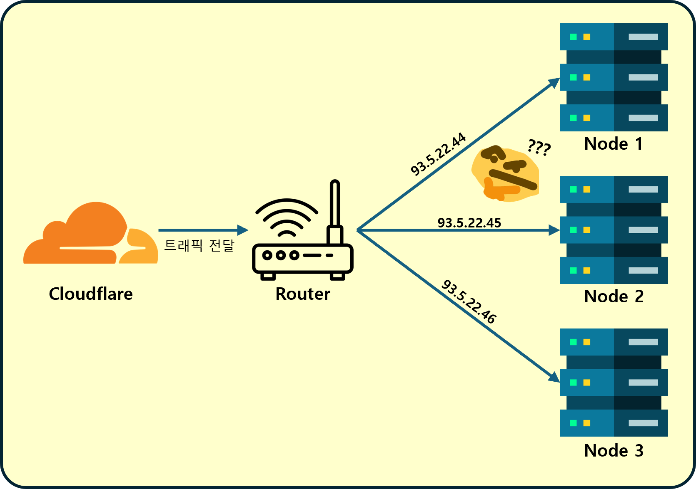

## 들어가기 앞서

- **회사와 무관하게 개인적으로 관리하는 k8s 클러스터는 다음과 같다.**
  - 클라우드: OKE(EKS/GKE와 유사)처럼 기본 L4/L7 Load Balancer 제공
  - 온프레미스: 집에서 운영하는 싱글 노드로 시작한 k8s, 리소스 집약적 워크로드 배치(Jellyfin, 7 Days To Die, Ollama, QBittorrent 등)
  <br>
  <p align='center'>
      
      <em>Jellyfin같은 앱은 클라우드에 설치하기엔 자원 소모량이 너무 크다.</em>
  </p>

  - 내부망 대역: `93.5.22.0/24`
  - 초기 Worker Node: `93.5.22.44`
  - 공유기 포트포워딩: 외부 `80/443` → `93.5.22.44:80/443`, 클러스터 내 Nginx Ingress Controller가 도메인 기반 라우팅

- **로드밸런서란?**
  - 트래픽을 여러 노드/파드로 분산하고, 가상 IP(VIP)를 통해 단일 진입점을 제공
  - 하드웨어 전용 장비도 있으나, 온프레미스 k8s에서는 소프트웨어 방식이 일반적
  - Bare Metal 환경에서는 `Metallb`가 사실상 표준 솔루션

- **Metallb 핵심 개념**
  - 데몬셋 `speaker`가 호스트 네트워크로 동작하며 외부 IP를 네트워크에 광고
  - LoadBalancer 서비스의 External IP 전파에 표준 프로토콜 사용: `ARP(IPv4)`, `NDP(IPv6)`, `BGP`
  - 두 가지 모드
    - L2(ARP/NDP): 같은 서브넷에서 VIP를 광고 — 가정/소규모 환경에 적합
    - BGP: 라우터와 경로를 교환 — 데이터센터/고급 네트워크에 적합
  - 관련 개념
    - GARP(Gratuitous ARP): 자신의 IP-MAC 정보를 네트워크에 알리는 ARP, VIP 전환 시 필수
    - Strict ARP: 노드가 소유하지 않은 IP에 응답하지 않도록 제한, L2 모드와 IPVS에서 안전성 향상

## 문제의 시작


- 초기에는 단일 노드(`93.5.22.44`)로 포워딩하면 충분했지만, 노드가 추가되면 단일 대상 포워딩만으로는 고가용성/확장성 확보 불가
  <p align='center'>
    
    <em>이런 상황이라면 공유기는 대체 어느 Node로 포워딩을 해야하는가?</em>
  </p>
- Kubernetes의 `LoadBalancer` 타입이 클라우드 밖에서는 기본 제공되지 않아, 외부에서 접근 가능한 VIP가 부재
- 결과적으로, 인입 트래픽을 안정적으로 받아 서비스로 라우팅할 수 있는 소프트웨어 로드밸런서가 필요


<br><br>

## 해결방안 — Metallb(L2 모드) 도입

- 같은 서브넷(`93.5.22.0/24`)에서 VIP를 광고하는 L2 모드로 간단하게 시작
- 예시 VIP: `93.5.22.100` (공유기 포트포워딩은 이 VIP로 설정)

<br><br>

### 설치(Helm)

```bash
helm repo add metallb https://metallb.github.io/metallb
helm repo update
kubectl create namespace metallb-system
helm upgrade --install metallb metallb/metallb -n metallb-system --wait
```

<br><br>

설치 후 CRD 확인:

```bash
kubectl get crd | grep metallb.io
```
- 다음과 같이 출력되면 정상이다.
  ```bash
  bfdprofiles.metallb.io                                2025-08-03T16:07:22Z
  bgpadvertisements.metallb.io                          2025-08-03T16:07:22Z
  bgppeers.metallb.io                                   2025-08-03T16:07:22Z
  communities.metallb.io                                2025-08-03T16:07:22Z
  ipaddresspools.metallb.io                             2025-08-03T16:07:22Z
  l2advertisements.metallb.io                           2025-08-03T16:07:22Z
  servicebgpstatuses.metallb.io                         2025-08-03T16:07:22Z
  servicel2statuses.metallb.io                          2025-08-03T16:07:22Z
  ```
 - 이중 `IPAddressPool`과 `L2Advertisement` CRD를 Manifest로 생성 해줘야 한다.
    - `IPAddressPool`: Metallb이 할당할 수 있는 IP 주소(VIP) 풀이다.
    - `L2Advertisement`: Layer2 광고 정의. L2 모드에서 Metallb이 IP 주소를 어떻게 광고하는가를 설정한다. 

<br><br>

### IP 풀/광고 리소스 생성

`ipaddresspool.yaml`:

```yaml
apiVersion: metallb.io/v1beta1
kind: IPAddressPool
metadata:
  name: workstation-ip-pool
  namespace: metallb-system
spec:
  addresses:
    - 93.5.22.100
```

> **Note**: addresses는 범위로 지정할 수도 있다. 예를들면 `192.168.0.100-192.168.0.104`

적용:

```bash
kubectl apply -f ipaddresspool.yaml
```

`l2advertisement.yaml`:

```yaml
apiVersion: metallb.io/v1beta1
kind: L2Advertisement
metadata:
  name: workstation-l2adv
  namespace: metallb-system
spec:
  ipAddressPools:
    - workstation-ip-pool
```

적용:

```bash
kubectl apply -f l2advertisement.yaml
```

<br><br>

### 동작 확인 체크리스트

```bash
# 컨트롤러/스피커 파드 상태
kubectl get pods -n metallb-system -o wide

# 풀/광고 리소스 상태
kubectl get ipaddresspools.metallb.io,l2advertisements.metallb.io -n metallb-system

# LoadBalancer 서비스의 외부 IP 할당 여부
kubectl get svc -A | grep LoadBalancer || true
```

<br><br>

### 공유기 포트포워딩


- 외부 `80/443` → VIP `93.5.22.100:80/443`로 설정
  <p align='left'>
    
  </p>


## 참고(안전한 네트워킹을 위해)

- Strict ARP를 활성화하면, 노드가 소유하지 않은 IP에 응답하지 않아 ARP 오류를 방지
- `kube-proxy` IPVS 모드 사용 시에도 Strict ARP는 중요
- BGP 모드는 외부 라우터와의 동적 라우팅이 필요할 때 선택
-  추가로 Nginx Ingress Controller가 VIP로 들어온 요청을 각 서비스로 라우팅하도록 설정했다

## 마무리

온프레미스 k8s에서 `Metallb`는 외부 트래픽을 받는 가장 간단하고 표준적인 방법이다. 같은 서브넷에서는 L2 모드만으로도 VIP를 안전하게 광고하여, 노드 수가 늘어나도 일관된 진입점을 유지할 수 있다.


