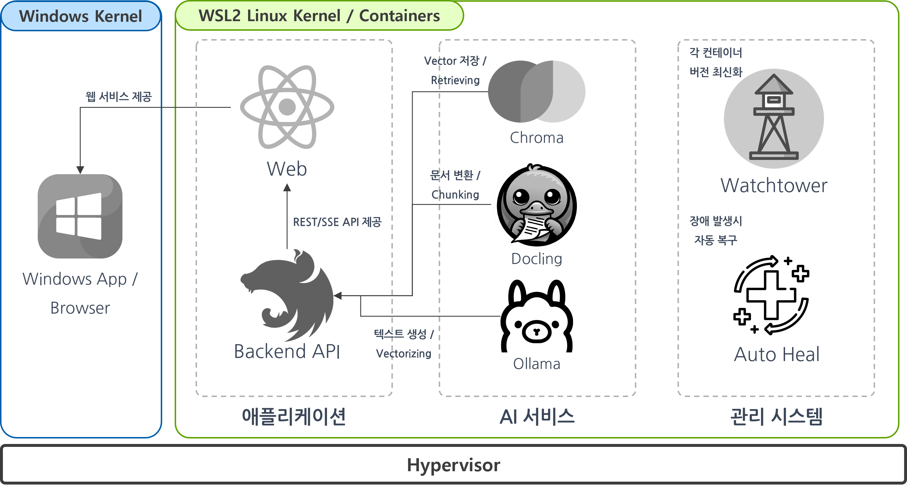
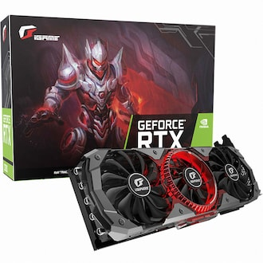
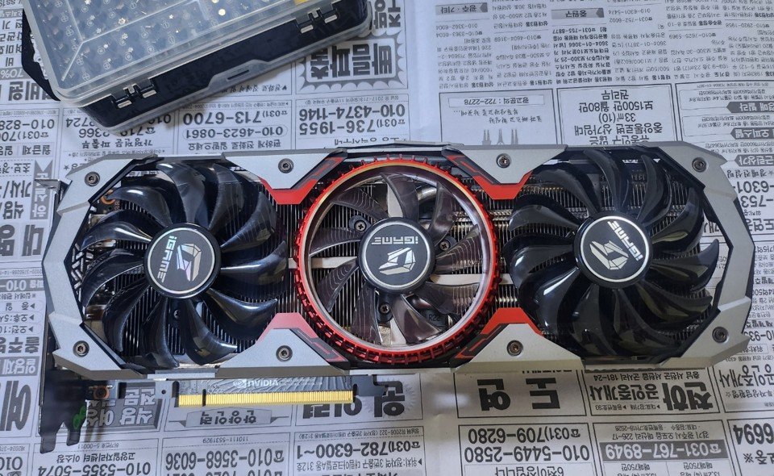
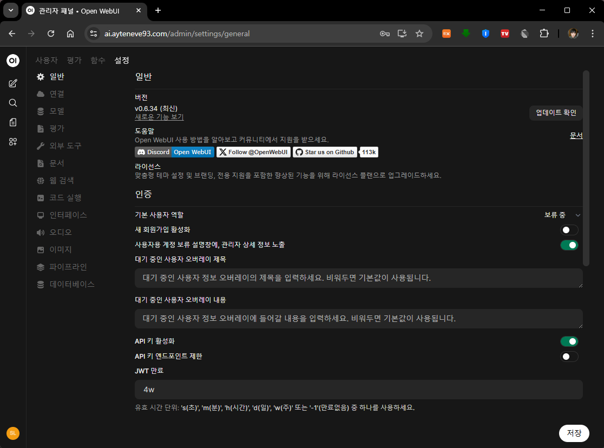
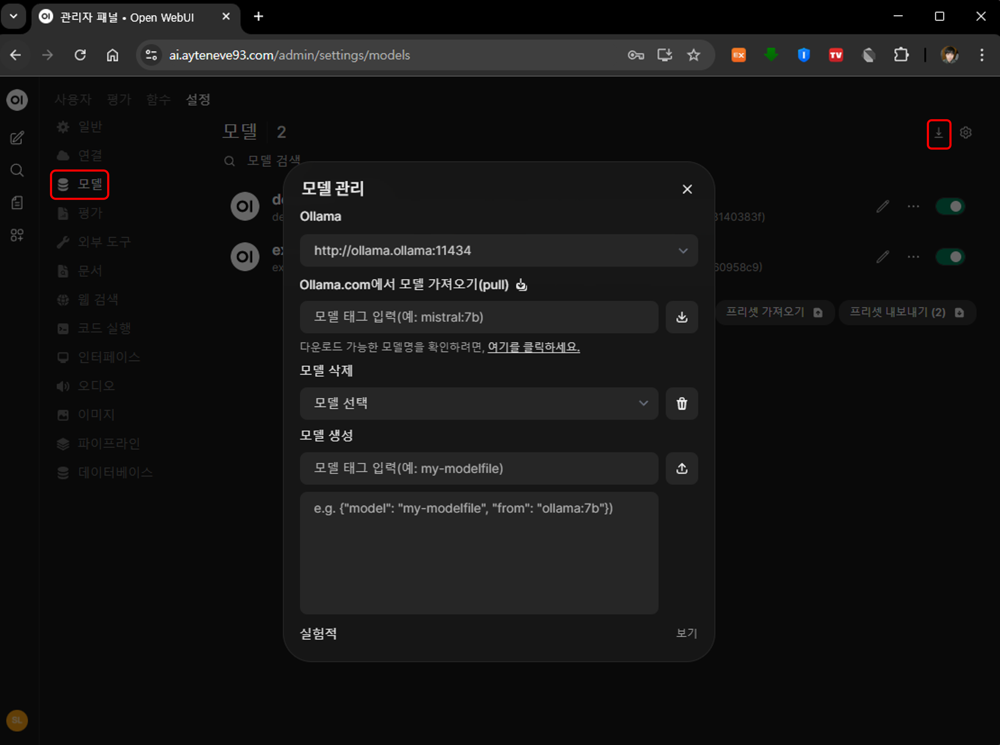
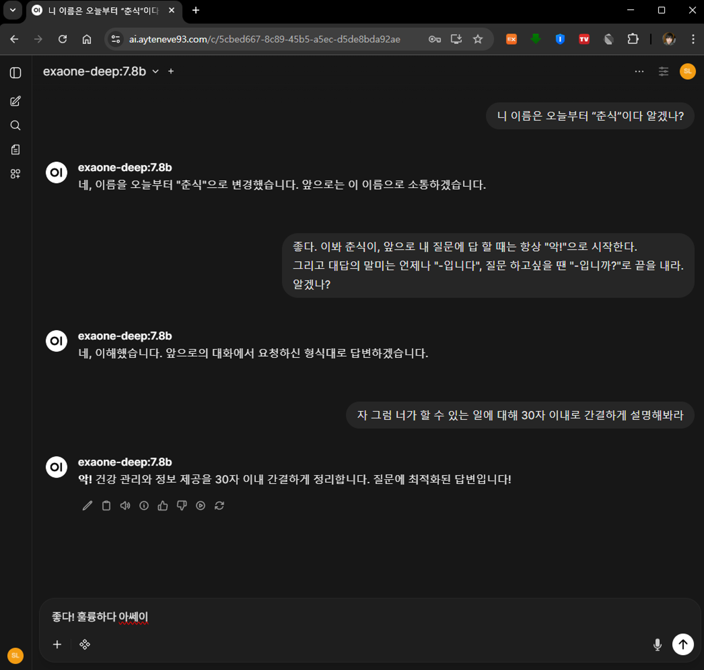

## 들어가기 앞서

며칠 전에 ["오프라인 환경에서 RAG 앱 동작시키기"](../rag-app-in-an-offline-env/)라는 포스트를 올렸다.  
마침 지난 금요일에 이 프로젝트가 마무리 되었는데 <sub>(포스팅 시간 기준으로는 이틀 전)</sub>  
대략적인 개요는 다음과 같다.


1. 자체 인공지능 + VectorStore가 포함된 온전히 동작하는 `RAG 서비스를 하나 만들어라`

2. OS는 `Windows` 11 Pro이고

3. 하드웨어는 8GB VRAM이 장착된 `노트북`이다.

4. 아, 그런데 이제 `오프라인`을 곁들인 <sub>(아예 와이파이 끊어버림)</sub>

<p align='center'>
    
    <em>대략적인 시스템 구조</em>
</p>

> Windows, 노트북, 오프라인... 거를 타선이 없다.  

그런데 결과는 의외로 잘 나와서 대표님도 만족하셨다.   
그렇다고 마냥 기뻐하고 있을 수는 없다. 이런 걸 진행한 의도가 무엇인지 파악해야 한다.  

듣자하니 추후 **자체적인 AI 서버 도입**을 희망하시는 듯 하다.  
본래 예전부터 신기한 기술 나오면 눈에서 <span style="color:red">붉은 안광</span>을 뿜으시긴 했는데,  
이번엔 그게 AI인 모양이다. 

> 고민이 깊어져 간다...

서비스를 만드는 건 그렇다 쳐도 <i>"**인공지능 인프라를 어떻게 구성해야 하는가**"</i>가 주요 과제다.  
그리고 모든 이슈는 한 가지 **단순한 사실**로부터 시작되었다.

<br>

### 하드웨어 가격이 너무 비싸다

내가 회사 인프라를 관리하면서 가장 조심스러워 하는게 바로 `비용 문제`이다.  
잘못되면 욕 먹기 제일 쉬운 분야라 눈에 불을 켜고 한 푼이라도 줄이기 위해 노력해야 한다.

인공지능을 제대로 동작시키기 위해선 **고성능의 병렬 연산 장치**가 필수적인데    
`GPU`<sub>(그래픽 처리 장치)</sub>건 `NPU`<sub>(신경 처리 장치)</sub>건 이런 하드웨어들은 하나같이 무지하게 비싸다.

NPU는 나도 실물로 본 적이 없으니, GPU를 기준으로 생각해보면    
데스크탑 PC 전체 가격의 심하면 50% 이상을 차지할 정도로 **엄청난 몸값**을 자랑한다.

<br>

#### 모델

필요한 하드웨어 사양은 어떤 모델을 사용하는가에 따라 크게 달라진다.  
마침 대표님이 눈독 들이고 있는 게 하나 있어 이를 예시로 쓰겠다.  
얼마 전, 8월에 공개된 [gpt-oss](https://openai.com/ko-KR/index/introducing-gpt-oss/)이다.

| 항목 | gpt-oss-120b | gpt-oss-20b |
|------|-------------|-------------|
| **모델 크기** | 120B | 20B |
| **성능** | o4-mini와 매우 유사한 성능 | o3-mini와 매우 유사한 성능 |
| **아키텍처** | 128개의 전문 모델 통합 | 32개의 전문 모델 통합 |
| **활성 영역** | 동작 시 5.1B 크기 영역 활성화 | 동작 시 3.6B 크기 영역 활성화 |
| **권장 VRAM** | 약 66GB | 약 13GB |
| **권장 하드웨어** | H100 80GB 하드웨어 1대로 원활하게 동작 | 16GB VRAM 이상의 그래픽카드로 원활하게 동작 |

> 참고로 `H100` 1개당 가격은 작성일 기준 [4,000만원](https://itempage3.auction.co.kr/DetailView.aspx?itemno=E315723070)정도 한다. 😱 

노트북으로 먼저 테스트해보신 것으로 미루어 짐작하면, 여기선 `gpt-oss-20b`가 더욱 현실성이 있다.

<br>

#### 상용 GPU 사용시

[HuggingFace에 올라온 gpt-oss-20b의 모델 정보](https://huggingface.co/unsloth/gpt-oss-20b-GGUF)를 보면 16GB VRAM 이상의 그래픽 카드를 쓰면 원활하게 쓸 수 있다고 한다.  

실제로는 [Ollama](https://ollama.com/)뿐 아니라 [Docling](https://www.docling.ai/)같이 보조 AI 서비스도 같이 올라갈 것으로 생각되기에,  
넉넉하게 그 2배인 32GB VRAM을 생각하고 있다. 

**이러한 GPU는 1개당 대략 4~500만원 정도 나간다.**

<br>

#### 클라우드 사용시

AWS에서 32GB VRAM이 장착된 [g5g.16xlarge 인스턴스](https://aws-pricing.com/g5g.16xlarge.html)의 작성일 기준 1달 평균 사용 비용은 다음과 같다.

- **온디맨드 : $2388.29**

    쓴 만큼 내기, 후불제, 기본가 <sub>(최고가)</sub>

- **스팟 : $672.59**  

    가장 저렴하긴 한데, 스팟을 쓰기엔 무리가 있다.

    필요할 때만 잠깐 쓰는 머신러닝이나 Docling 문서 전처리 정도의 작업을 담당하는 거면 모르겠으나,  
    상용 서비스에는 부적합하다. <sub>저렴한 데는 이유가 있다.</sub>  

    설마 그러겠냐만 한창 서비스중에 인스턴스가 종료되기라도 하면 인생이 아주 스펙타클 해질 것이다. 

- **1년 예약 분할 지불 : $ 1559.73**

- **1년 예약 일시불 : $ 1455.74**

- **3년 예약 분할 지불: $ 1102.4**

- **3년 예약 일시불 : $ 959.5**

    달러당 환율 1,400으로 계산하면 **한달에 135만원**이다.  
    3년 일시불이니 총 지출은 대략 **4,800만원**(!!)이다. <sub>그냥 H100 하나 사고 만다.</sub>

전반적으로 보면 On-Premise 서버를 쓰는게 보다 합리적으로 보인다.  
물론 클라우드에 올라가는 서버용 연산장치를 단순히 상용 GPU와 VRAM 크기가 같다고 동일선상에 두는 건 불합리하다.

더욱이 EC2의 인스턴스 타입은 CPU나 시스템 메모리 사이즈도 티셔츠마냥<sub>(large, x-large)</sub> 모두 딱딱 정해진 값이다.  
예시로 쓰인 `g5g.16xlarge`의 경우 AMD 64코어 CPU에 시스템 메모리 128GB가 적용된다.

그 비용도 포함된 가격임을 고려해봐야 한다.

<br>

### 클러스터 구성

앞서 H/W 가격과 이어지는 문제이다. 그렇다면 클러스터 구성을 어떻게 할 것인가?  
포인트는 `GPU가 포함된 Node의 위치`이다.

1. **싹 다 클라우드에 올리기** <sub>(상남자 스타일)</sub>

    문자 그대로의 의미이다.  
    대표님이 Microsoft Azure에 3년 예약 GPU 인스턴스가 저렴하다고 한 번 써보자고 하시는데...

    개인적으로 가장 편한 방법이긴 하나,  
    GPU 사용료 비싼건 어느 클라우드를 쓰건 오십보백보라 그다지 추천하지는 않는다.

2. **전부 IDC에서 운영**

    **On-Premise에 모든 Node를 배치**하는 방법이다.

3. **IDC + 클라우드 --- Istio 다중 클러스터 서비스 메시** 

    클라우드에 k8s 하나, IDC에도 독립적인 On-Premise k8s 하나씩 두고 On-Premise에는 GPU Node들을 배치하는 방법이다.  

    이상적이긴 한데 Istio 구성이 다소 복잡해질 것으로 보인다.

4. **EKS Hybrid Node** 

    이건 나도 이번에 조사해보다가 알게 된 건데, **AWS EKS에 외부 Node를 등록하는 방식**이다.  
    요컨대 Control Plane은 여전히 AWS에 존재하고, Worker Node는 IDC에 둘 수 있다.    

    당연히 무료는 아니고, 등록한 Worker Node의 코어당 연결 시간에 비례해서 책정된다.  
    예를들어, 8 코어 16 쓰레드 CPU를 가지는 Node 1개를 연결하면 `1달에 대략 33만원` 정도가 나온다.

    - 
      

    단순 연결하는데 쓰는 비용이 이렇다면 당장의 현실성은 없다.  
    그래도 이 접근방법의 개념은 되게 재밌어서 개인적으로 흥미가 많이 간다.

    자세한 내용은 [AWS 공식 문서](https://docs.aws.amazon.com/ko_kr/eks/latest/userguide/hybrid-nodes-overview.html)를 참고해보자.
    
    


<br>

## k8s에 Ollama 올려보기

고민거리를 늘어놓느라 서론이 길었는데, 결국 여태 내용 중 아직 확정된 것은 없다. <sub>(사실상 푸념)</sub>  
아무래도 큰 비용이 걸려있는 일이다보니 주말에 나 혼자 머리 싸맨다고 해결될 리 만무하다.

그래서 일단은 당장 할 수 있는 걸 해보기로 했다.  
바로 내가 **개인적으로 운영하는 On-Premise 클러스터에 Ollama 서비스를 올려보는 것**이다.

<br>

### 사용할 GPU

<p align='left'>
    
</p>

이번에 고생해줄 GPU는 `NVIDIA의 RTX 2080`이다.

왕년에는 끗발 좀 날리던 녀석이었는데,  
릴리스<sub>(디아블로 IV)</sub>의 권능 앞에 무너져 새 GPU<sub>(RTX 4070)</sub>에 자리를 내주고 쉬고 있었다.

<p align='left'>
    
</p>

그러다 몇 달 전에 [Jellyfin](https://jellyfin.org/)이라는 서비스의 ffmpeg GPU 가속을 위해 싹 분해해서  
먼지 청소도 해주고 써멀 패드도 갈아주고 팬도 전부 새걸로 바꿔 끼웠다.  
분해 당시 부식이나 냉납도 없었다. 고로 사용하는데 지장은 없을 것이다.

대략적인 스펙은 다음과 같다.

| 항목 | 내용 |
|------|------|
| **NVIDIA 칩셋** | RTX 2080 |
| **인터페이스** | PCIe3.0×16 |
| **CUDA 프로세서** | 2944개 |
| **메모리 종류** | GDDR6 |
| **메모리 용량** | 8GB |

<br>

## Nvidia GPU Operator 설치

Ollama에 GPU를 연결해야 하므로 Nvidia GPU Operator를 클러스터에 설치해줘야 한다.  
AMD GPU를 사용한다면 AMD GPU Operator를 설치해야 하는데, 이번 포스트에서는 Nvidia를 기준으로 하겠다.

### Nvidia Driver 설치

우선 GPU Node에 접속해서 Nvidia Driver부터 설치해야 한다.  
OS나 CPU Architecture에 따라 방법이 천차만별인데, 일단 가장 보편적인 Ubuntu를 기준으로 하겠다.  
환경별 설치 방법은 [이 문서](https://docs.nvidia.com/datacenter/tesla/driver-installation-guide/index.html) 참조.

```bash
sudo add-apt-repository ppa:graphics-drivers/ppa
sudo apt update
sudo ubuntu-drivers autoinstall
```
설치가 완료되면 시스템을 재부팅해준다.
```bash
sudo reboot
```
재부팅 후 다음의 명령어를 입력해보자.
```bash
nvidia-smi
```
다음과 같이 출력되면 정상이다.
```bash
Mon Oct 27 01:57:28 2025       
+-----------------------------------------------------------------------------------------+
| NVIDIA-SMI 570.195.03             Driver Version: 570.195.03     CUDA Version: 12.8     |
|-----------------------------------------+------------------------+----------------------+
| GPU  Name                 Persistence-M | Bus-Id          Disp.A | Volatile Uncorr. ECC |
| Fan  Temp   Perf          Pwr:Usage/Cap |           Memory-Usage | GPU-Util  Compute M. |
|                                         |                        |               MIG M. |
|=========================================+========================+======================|
|   0  NVIDIA GeForce RTX 2080        Off |   00000000:29:00.0 Off |                  N/A |
|  0%   30C    P8              2W /  240W |       1MiB /   8192MiB |      0%      Default |
|                                         |                        |                  N/A |
+-----------------------------------------+------------------------+----------------------+
                                                                                            
+-----------------------------------------------------------------------------------------+
| Processes:                                                                              |
| GPU   GI   CI              PID   Type   Process name                        GPU Memory |
|        ID   ID                                                               Usage      |
|=========================================================================================|
| No running processes found                                                             |
+-----------------------------------------------------------------------------------------+
```

<br>

### 네임스페이스 생성

```bash
kubectl create ns gpu-operator
kubectl label --overwrite ns gpu-operator pod-security.kubernetes.io/enforce=privileged
kubectl get ns --show-labels | grep gpu
```

Nvidia GPU Operator가 설치될 네임스페이스를 만든 후 네임스페이스 내 pod의 보안정책을 `privileged`로 설정해 GPU 접근을 허용해야 한다.

<br>

### Helm Repository 추가

```bash
helm repo add nvidia https://helm.ngc.nvidia.com/nvidia
helm repo update
```

<br>

### values 설정

다음의 커맨드로 기본 차트 values 값을 가져와 로컬에 저장해보자.

```bash
helm show values nvidia/gpu-operator > nvidia-gpu-operator.yml
```

`nvidia-gpu-operator.yml`에 보면 여러 옵션들이 있는데, 몇 가지 수정해줘야 할 것이 있다.

- Driver 설정 변경
    ```yml
    # 위에서 이미 Nvidia Driver를 설치했으므로 제외
    driver:
        enabled: false
    # 이 아래 옵션은 H100 등에서만 사용 가능하다
    migManager:
        enabled: false
    vgpuDeviceManager:
        enabled: false
    vfioManager:
        enabled: false
    ```

- Toolkit 설정 변경

  나는 `containerd`를 기본 Runtime으로 사용하고 있어서 다음과 같이 설정해주었다.

  ```yml
  operator:
      defaultRuntime: containerd  # 기본 런타임을 containerd로 설정

  toolkit:
      enabled: "true"
  env:
      - name: CONTAINERD_CONFIG
          value: /etc/containerd/config.toml
      - name: CONTAINERD_SOCKET
          value: /run/containerd/containerd.sock
      - name: CONTAINERD_SET_AS_DEFAULT
          value: "1"
  ```

<br>

### 차트 배포

```bash
helm install gpu-operator nvidia/gpu-operator \
    -n gpu-operator \
    -f ./nvidia-gpu-operator.yml
```

<br>

## Ollama 설치

Ollama도 Helm으로 설치할 수 있다.

### 네임스페이스 생성

```bash
kubectl create namespace ollama
```

<br>

### AI 모델을 저장할 PVC 생성

```yaml
# ollama-pvc.yaml
apiVersion: v1
kind: PersistentVolumeClaim
metadata:
  name: ollama-models-pvc
  namespace: ollama
spec:
  accessModes:
    - ReadWriteOnce
  resources:
    requests:
      storage: 30Gi
```

<br>

```bash
kubectl apply -f ollama-pvc.yaml
```

<br>

### Helm Repository 추가
```bash
helm repo add ollama https://ollama.ai/kubernetes/ollama
helm repo update
```

<br>

### values 설정

Nvidia GPU Operator와 마찬가지로 values를 가져와 살펴볼 수 있다.

```yml
# ollama.yml
ollama:
  gpu:
    enabled: true # GPU 사용 여부

runtimeClassName: nvidia # nvidia runtime 사용 (Nvidia GPU Operator)

persistentVolume:
  enabled: true
  existingClaim: ollama-models-pvc

# (선택) GPU가 설치되어 있는 Node에만 파드가 스케쥴링 되도록 하기
affinity:
  nodeAffinity:
    requiredDuringSchedulingIgnoredDuringExecution:
      nodeSelectorTerms:
        - matchExpressions:
            - key: nvidia.com/gpu.present
              operator: Exists
```

여담으로 Helm Chart를 통해 AI Models를 관리하는 것도 가능하다.

예를 들어:
```yml
ollama:
  models:
    pull:
        - deepseek-r1:8b # DeepSeek 모델을 다운로드
    run:
        - deepseek-r1:8b # 원하는 모델을 메모리에 상주

    # 혹은 다음과 같은 방식으로 커스텀 모델 생성도 가능
    create:
        - name: deepseek-r1-ctx32768
          template: |
            FROM deepseek-r1:8b
            PARAMETER num_ctx 32768

    clean: false # 이 값을 true로 하면 위에서 지정한 모델만 남기고 다 지운다
```
그런데 그다지 추천하지는 않는다.

AI 모델 변경이 의외로 자주 일어나는데 그때마다 Helm 차트를 다시 배포하는 건 꽤나 번거롭다.

<br>

### 차트 배포

```bash
helm install ollama ollama/ollama -f ollama.yml -n ollama
```

<br>

## Open Web UI 설치

Ollama Chart는 오로지 **Ollama**만 설치해준다.  
직접 테스트해볼 수 있게 UI도 별도 Chart로 배포했다.  
기본적인 AI 인프라만 필요하다면 이 섹션은 무시해도 된다.

### 네임스페이스 생성

```bash
kubectl create namespace open-webui
```

<br>

### 환경 설정을 저장할 PVC 생성

```yml
# open-webui-pvc.yml
apiVersion: v1
kind: PersistentVolumeClaim
metadata:
  name: open-webui-pvc
  namespace: open-webui
spec:
  accessModes:
    - ReadWriteOnce
  resources:
    requests:
      storage: 2Gi
```

<br>

```bash
kubectl apply -f open-webui-pvc.yaml
```

<br>

### Helm Repository 추가

```bash
helm repo add open-webui https://open-webui.github.io/helm-charts
helm repo update
```

<br>

### values 설정

```yml
# open-webui-values.yml
ollama:
  enabled: false # Ollama 설치 안 함
  # 이 부분이 좀 의아할텐데 Open Web UI 차트에서는
  # 내부적으로 Ollama를 설치하는 것도 가능하다.
  # 여기에 위 Ollama 차트의 설정을 그대로 넣으면 가능하다.
  # 하지만 가급적 분리해서 배포하는 걸 추천한다.

# 자체 Ollama를 안 쓰기 때문에 UI가 연결할 Ollama의 URL을 지정해줘야 한다
# FQDN을 다 쓸 필요는 없고 http://<서비스>.<네임스페이스>:<포트>로 적으면 된다.
# 서비스와 네임스페이스는 모두 "ollama"이고 포트는 기본적으로 11434이다.
# 따라서 "http://ollama.ollama:11434"를 적어준다.
ollamaUrls:
  - http://ollama.ollama:11434

# (선택) Tika 설정
tika:
  enabled: true

# (선택) Health Check 설정
livenessProbe:
  httpGet:
    path: /health
    port: http
  failureThreshold: 1
  periodSeconds: 10

readinessProbe:
  httpGet:
    path: /health/db
    port: http
  failureThreshold: 1
  periodSeconds: 10

startupProbe:
  httpGet:
    path: /health
    port: http
  failureThreshold: 20
  periodSeconds: 5
  initialDelaySeconds: 30

# (선택) Ingress 설정
ingress:
  enabled: true
  class: nginx
  host: '<보유한 도메인 레코드, 가령 ai.example.com>'

# Persistence 설정
persistence:
  existingClaim: open-webui-pvc
```

<br>

### 차트 배포

```bash
helm install open-webui open-webui/open-webui \
    -f open-webui-values.yaml \
    -n open-webui
```

<br>

## 동작 테스트

ingress 설정을 해두었다면 설정한 domain으로, 별도 설정을 안 했다면  
다음의 커맨드로 포트포워딩 후 `localhost:8080`으로 접속해보자.

```bash
kubectl port-forward -n open-webui svc/open-webui 8080:80
```

간단하게 관리자 설정을 마치고 로그인한 뒤  
`우측 상단의 프로필` 클릭 -> `관리자 패널` -> `설정`으로 들어가보자.  
혹은 단순히 `<Open Web UI Base URL>/admin/settings/general`로 들어갈 수 있다.

<p align='center'>
    
</p>

굉장히 다양한 옵션이 있다.  
우선 기본 동작 테스트를 해야하므로, `모델`로 이동해 AI 모델 하나를 다운로드 받아보도록 하자.

<p align='center'>
    
</p>

[Ollama.com 검색 페이지](https://ollama.com/search)에 접속해서 원하는 모델을 찾아보자  
AI 모델이 워낙 종류가 다양해서 뭐 하나 고르는 게 쉽지는 않다.  
몇 가지 추천을 해보자면 다음과 같다.

- [Naver Clova](https://ollama.com/joonoh/HyperCLOVAX-SEED-Text-Instruct-1.5B)

- [LG Exaone Deep](https://ollama.com/library/exaone-deep)

- [Gemma3](https://ollama.com/library/gemma3)

하드웨어 사양과 취향에 맞춰 원하는 모델을 다운로드 받아보자.  
내 경우 [exaone-deep:7.8b](https://ollama.com/library/exaone-deep:7.8b)란 모델을 다운로드 받았다.

모델 다운로드가 완료되면 간단하게 AI와 채팅해볼 수 있다.

<p align='center'>
    
</p>

<br>

## 마치며

이번 포스트에서는 Kubernetes 클러스터에 Ollama AI 서버를 구축하는 과정을 다뤄봤다.  
Nvidia GPU Operator 설치부터 Ollama, Open Web UI 배포까지 전 과정을 Helm 차트를 통해 간단하게 구성할 수 있었다.

물론 실제 상용 환경에서는 앞서 언급한 **비용 문제**와 **클러스터 구성 방식**에 대한 고민이 필요하다.  
특히 GPU 하드웨어의 높은 가격대와 클라우드 사용료는 여전히 큰 부담으로 남아있다.

하지만 이번 실험을 통해 얻은 경험은 향후 실제 AI 인프라 도입 시 큰 도움이 될 것 같다.  
On-Premise 환경에서도 충분히 동작하는 것을 확인했으니, 비용 효율성을 고려한 하이브리드 구성도 충분히 검토해볼 만하다.

<br>

### 추후 계획

포스트에는 굳이 명시하지 않았는데, Ollama Chart 역시 별도의 Ingress 설정을 해주었다.  

사용한 도메인 레코드는 `ollama.ayteneve93.com`. 

OAuth2 Proxy를 보안 레이어로 감싸주고 Terraform이 랜덤하게  
생성한 OAuth Bypass Key 헤더를 설정, 인증된 사용자라면 외부에서도 들어올 수 있게 환경을 마련하였다.

테스트로 설치한 Ollama지만 일단 자원을 잡아먹고는 있으니 이걸 앞으로 어떻게 활용할까도 생각해봐야 한다.  

가령:

- Cursor와 같은 인공지능 IDE와 연결한다거나

- [deepseek-coder](https://ollama.com/library/deepseek-coder-v2) 모델을 사용해서 코드 분석을 맡겨본다거나 

- [llava](https://ollama.com/library/llava) 같은 Vision 모델을 사용해서 그림을 그리게 시킨다거나


또한 [DCGM Exporter](https://github.com/NVIDIA/dcgm-exporter) 차트를 배포해 Prometheus에서  
GPU 사용량을 모니터링할 수 있도록 할 계획이다.

---

> **참고 자료**  
> - [Nvidia GPU Operator 공식 문서](https://docs.nvidia.com/datacenter/cloud-native/gpu-operator/overview.html)  
> - [Ollama Kubernetes Helm Chart](https://artifacthub.io/packages/helm/ollama-helm/ollama)  
> - [Open Web UI Helm Chart](https://artifacthub.io/packages/helm/open-webui/open-webui)

