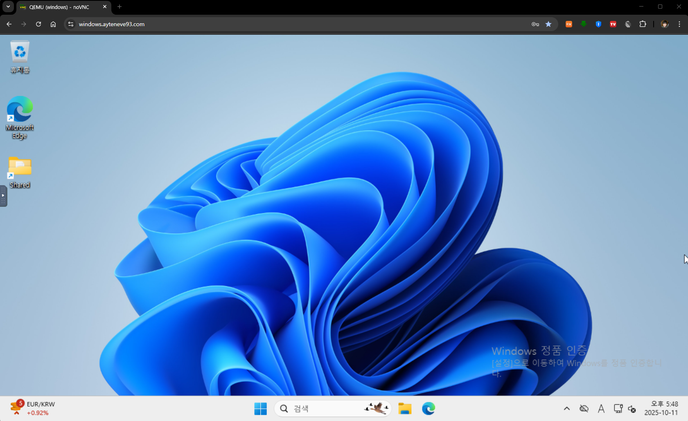

> **⚠ 주의** : 본 포스트에서는 k8s에 `Windows`를 설치하는 방법에 대한 정보를 담고 있습니다.
>
> **MS 법무팀과 평생 기억에 남을 찐한 티 타임**을 가지고 싶은게 아니라면
> [Windows Container](https://github.com/dockur/windows)나 [Mac OS Container](https://github.com/dockur/macos) 페이지에도 나와있듯,
> 별도 라이센스 없이 상업적으로 사용하는 것은 삼가도록 합시다.

<br>

## 문제의 시작

나는 깔끔한 걸 굉장히 좋아하는 성격이다.  
회사에서나 집에서나 컴퓨터 바탕화면에는 항상 필요한 최소한의 아이콘만 배치하고 있다.

<p align='center'>
    
</p>

특히나 Docker를 접하게 된 이후로는 개발자 컴퓨터라면 응당 설치되어 있을법한 python이나 nodejs, java
심지어 Database Client 같은 것들도 모두 컨테이너를 통해 사용하고 있다.

하지만 반드시 Windows 혹은 Mac에서만 동작하도록 만들어진 프로그램들도 있기 마련이다.  
예컨대 카카오톡의 경우 Docker Container로 사용하기가 대단히 어렵거나 하더라도 매끄럽게 동작하질 않는다.

이러한 것들 중 내가 특히나 불편하게 여기는 게 있는데 바로 `은행 보안 프로그램`이다.

<br>

<p align='center'>
    
    <em>로그인 하려면 이것들부터 설치해야 한다</em>
</p>

한 달에 한 번씩 정기적으로 가계부를 정리하는 습관을 가지고 있는데,  
금융 관련 보안에 대해서는 굉장히 민감한 편이라 반드시 집에 있는 메인 PC로만 작업하곤 한다.

문제는 다음과 같다.

1. 매번 은행업무 볼 때마다 각종 은행 보안 프로그램이 설치 / 업데이트 / 실행 된다.
2. 은행들끼리 통일도 안 되어 있는 건지 다들 사용하는 프로그램이 조금씩 다 다르다.
3. 개인적으로 사용하는 보안 프로그램과 충돌나는 경우가 잦다.
4. 은근히 컴퓨터 자원을 많이 잡아 먹는다.

더 이상 메인 PC에 이런 자질구레한 보안 프로그램들이 설치되는 걸 용납할 수가 없었다.  
그렇다고 은행업무 전용 PC를 산다는 건 지나친 투자이다. 빈대 잡자고 초가삼간 태울 순 없는 노릇 아닌가.

> 그렇담 가상화는?

이 생각도 안 해본 건 아니다. 아니 생각 정도가 아니라 실제로 VMWare로 시도도 해봤다. 동작도 잘 한다.  
그런데, 메인 PC에 은행업무 하나 보자고 가상환경 설치하는 것 자체가 너무나도 번거럽고 부담스러운 일이었다.

<br>

## 해결방안 - k8s에 Windows를 설치하자

이번에 설치할 컨테이너 이미지는 [dockurr/windows](https://hub.docker.com/r/dockurr/windows)이다.

> 이게 그 Windows 컨테이너라는 건가?

싶을 수도 있는데, 아니다.

`Windows Container`는 Host OS가 Windows일 때 Windows App을 격리하여 실행하기 위해 있는 것으로,
우리가 흔히 **Container**라고 부르는 것은 십중팔구 `Linux Container`를 의미한다.
Linux Container와 Windows Container는 근본적으로 다르다.

- Linux Container는 `Linux OS` 위에서만 동작한다.
- Unix Container라는 것도 있다. `Unix OS`에서만 동작한다.
- 마찬가지로 Windows Container는 `Windows` 위에서만 동작한다.

<p align='center'>
    
</p>

같은 개발자분이 작성한 [다른 이미지들](https://hub.docker.com/u/dockurr)을 보면 Windows 이외에도 [MacOS](https://hub.docker.com/r/dockurr/macos), [Casa](https://hub.docker.com/r/dockurr/casa)등 다양하게 준비되어 있는 걸 볼 수 있는데, 이 이미지들은 모두 **Linux** 시스템 위에서 동작하는 걸 전제로 만들어져 있다.

이런게 가능한 이유는 `Container 수준`이 아니라 아예 커널 레벨에서의 가상화를 쓰기 때문이다.  
핵심 컴포넌트는 `KVM(kernel-based Virtual Machine)`이다.

<br>

### KVM (kernel-based Virtual Machine)

KVM은 Linux Kernel을 하이퍼바이저로 변환하는 가상화 기술로, 단일 물리적 컴퓨터에서 여러 개의 격리된 가상 머신(VM), 즉 "게스트" 운영체제를 실행할 수 있게 해준다.

각 VM을 메모리, 스토리지, 네트워크 카드와 같은 가상화된 하드웨어 구성 요소를 갖춘 일반 Linux 프로세스로 처리함으로써 효율적이고 고성능의 가상화를 제공한다.

#### 동작 원리

- **Linux Kernel 통합**: KVM은 Linux Kernel 자체 내의 모듈이기 때문에 하이퍼바이저 역할을 하기 위한 별도의 운영체제가 필요하지 않다.

- **하드웨어 가상화**: KVM은 Intel VT-x 또는 AMD-V와 같은 하드웨어 가상화 확장 기능을 활용하여 완전한 하드웨어 수준의 가상화를 제공한다.

- **QEMU**: KVM이 핵심 가상화 기능을 제공하는 반면, QEMU 에뮬레이터와 함께 작동하여 게스트 VM에 하드웨어 에뮬레이션 및 가상 장치를 제공한다.

- **가상 머신**: 각 게스트 OS는 자체 전용 가상 하드웨어를 갖춘 별도의 Linux 프로세스로 실행되어 다른 VM과의 격리를 보장한다.

#### 주요 특징

- **오픈소스 및 무료**: KVM은 오픈소스이며 무료로 사용할 수 있다.

- **성능**: Linux Kernel과의 깊은 통합으로 인해 높은 성능과 효율성을 자랑한다.

- **유연성**: Linux와 Windows를 포함한 다양한 운영체제를 게스트 VM으로 실행할 수 있다.

- **비용 효율성**: Linux의 구성 요소로서 값비싼 라이선스 비용이 필요하지 않다.

#### 일반적인 사용 사례

- **클라우드 컴퓨팅**: KVM은 많은 퍼블릭 및 프라이빗 클라우드 인프라의 핵심 기술로, 확장 가능한 온디맨드 컴퓨팅 리소스를 제공한다.

- **소프트웨어 개발 및 테스트**: 개발자들은 KVM을 사용하여 다양한 운영체제에서 소프트웨어를 테스트하기 위한 격리된 환경을 만든다.

- **서버 통합**: 조직에서는 KVM을 사용하여 여러 서버를 더 적은 수의 물리적 머신으로 통합하여 비용과 에너지를 절약한다.

<br>

### 사전준비

말이 길었는데, 결국 k8s를 구성하는 Node에서 kvm을 지원 해줘야 OS(Linux)의 한계를 뛰어넘는 Container를 사용해 볼 수 있다.

#### KVM 지원 확인

KVM 자체는 Linux Kernel에 이미 있기 때문에 하드웨어 가상화만 지원하면 된다. k8s Node에 터미널로 접속해 다음 명령어를 입력해보자.
```bash
lsmod | grep kvm
```

다음과 같이 출력된다면 이미 활성화가 되어 있는 것이다. 
```bash
kvm_amd               208896  4
kvm                  1409024  3 kvm_amd
irqbypass              12288  1 kvm
ccp                   143360  4 kvm_amd
```
Intel의 CPU를 사용한다면 `kvm_intel`이라고 출력될 것이다.

출력이 안 되었다면, VMWare나 VirtualBox 설치할 때 처럼 해당 노드의 `Bios`에서 활성화를 해줘야 한다. 

<br>

### Windows 컨테이너 정보

Windows 11을 설치할 것이다. 사양은 [Windows 11 시스템 요구사항](https://www.microsoft.com/ko-kr/windows/windows-11-specifications)에 맞춰 구성했다.

<p align='center'>
    
</p>

- 운영체제 : Windows 11
- CPU Core : 2
- 메모리 : 4GB
- 저장공간 : 64GB

<br>

### kubernetes 구성

실제 구현은 [CDK for Terraform Single Stack](https://github.com/ApexCaptain/ApexCaptain.IaC/blob/main/src/terraform/stacks/k8s/workstation/apps/windows.stack.ts)으로 작업했다.

#### Namespace 생성

```bash
kubectl create namespace windows
```

<br><br>

#### Windows 사용자 로그인 정보 Secret 생성

```bash
kubectl create secret generic windows-user-credential-secret \
  -n windows \
  --from-literal=username=<Windows 유저명> \
  --from-literal=password=<Windows 패스워드>
```

<br><br>

#### 추가 Installation Script Configmap 생성 (선택사항)
Container에 Windows가 처음 설치된 이후 1번 실행될 스크립트이다.  
Container의 `/oem/install.bat`파일이 실행된다.

```bash
.
├── install.bat
└── remove-unnecessary-apps.ps1
```

이렇게 2개의 파일로 구성되어 있다. 각 파일의 내용은 다음과 같다.

1. `install.bat`

    밑의 `2`번 PowerShell 파일을 실행하는 `bat`파일이다.

    ```bat
    @echo off

    echo Running initial installation scripts...

    powershell -ExecutionPolicy Bypass -File "%~dp0remove-unnecessary-apps.ps1"
    ```

<br>

2. `remove-unnecessary-apps.ps1`


    불필요한 Windows 기본 앱들을 제거해주는 PowerShell 스크립트이다.

    ```ps1
    C:\WINDOWS\System32\OneDriveSetup.exe /uninstall
    $appNamesToDelete = @(
        "Clipchamp.Clipchamp",
        "Microsoft.BingNews",
        "Microsoft.BingSearch",
        "Microsoft.BingWeather",
        "Microsoft.GamingApp",
        "Microsoft.MicrosoftOfficeHub",
        "Microsoft.MicrosoftSolitaireCollection",
        "Microsoft.MicrosoftStickyNotes",
        "Microsoft.OutlookForWindows",
        "Microsoft.PowerAutomateDesktop",
        "Microsoft.Todos",
        "Microsoft.WebMediaExtensions",
        "Microsoft.Windows.Photos",
        "Microsoft.WindowsAlarms",
        "Microsoft.WindowsCalculator",
        "Microsoft.WindowsCamera",
        "Microsoft.WindowsFeedbackHub",
        "Microsoft.WindowsSoundRecorder",
        "Microsoft.Xbox.TCUI",
        "MicrosoftCorporationII.QuickAssist",
        "MSTeams",
        "Microsoft.Copilot",
        "Microsoft.ZuneMusic",
        "Microsoft.ScreenSketch",
        "Microsoft.WindowsAppRuntime.1.3",
        "Microsoft.Paint",
        "Microsoft.YourPhone",
        "Microsoft.Windows.DevHome",
        "Microsoft.XboxGamingOverlay",
        "Microsoft.XboxSpeechToTextOverlay",
        "Microsoft.WindowsStore",
        "Microsoft.XboxIdentityProvider"
    )
    Write-Host 'Removing unnecessary apps...'
    foreach ($eachAppNameToDelete in $appNamesToDelete) {
        Get-AppxPackage | Where-Object { $_.Name -eq $eachAppNameToDelete } | Remove-AppxPackage
    }
    Write-Host 'Unnecessary apps removal completed.'
    ```

이는 예시로, 원하는 대로 설치 스크립트를 구성할 수 있다.

이 두 파일을 담는 `ConfigMap`을 생성한다.

```bash
kubectl create configmap windows-oem-assets-configmap \
    -n windows \
    --from-file=install.bat \
    --from-file=remove-unnecessary-apps.ps1
```

<br><br>

#### PersistentVolumeClaim 메니페스트 파일

```yaml
# pvc.yml
apiVersion: v1
kind: PersistentVolumeClaim
metadata:
  name: windows-persistent-volume-claim
  namespace: windows
spec:
  accessModes:
    - ReadWriteOnce
  resources:
    requests:
      storage: 64Gi
```

<br><br>

#### Deployment 메니페스트 파일

```yaml
# deployment.yml
apiVersion: apps/v1
kind: Deployment
metadata:
  name: windows-deployment
  namespace: windows
spec:
  replicas: 1
  selector:
    matchLabels:
      app: windows
  template:
    metadata:
      labels:
        app: windows
    spec:
      terminationGracePeriodSeconds: 120
      containers:
        - name: windows
          image: dockurr/windows
          env:
            - name: VERSION
              value: '11'
            - name: CPU_CORES
              value: '2'
            - name: RAM_SIZE
              value: '4G'
            - name: DISK_SIZE
              value: '64G'
            - name: LANGUAGE
              value: 'Korean'
            - name: REGION
              value: 'ko-KR'
            - name: KEYBOARD
              value: 'ko-KR'
            - name: USERNAME
              valueFrom:
                secretKeyRef:
                  name: windows-user-credential-secret
                  key: username
            - name: PASSWORD
              valueFrom:
                secretKeyRef:
                  name: windows-user-credential-secret
                  key: password
          ports:
            - name: http
              containerPort: 8006
              protocol: TCP
            - name: rdp-tcp
              containerPort: 3389
              protocol: TCP
            - name: rdp-udp
              containerPort: 3389
              protocol: UDP
            - name: vnc
              containerPort: 5900
              protocol: TCP
          securityContext:
            privileged: true
            capabilities:
              add:
                - NET_ADMIN
          volumeMounts:
            - name: windows-persistent-volume-claim
              mountPath: /storage
            - name: windows-oem-assets-configmap
              mountPath: /oem
            - name: dev-kvm
              mountPath: /dev/kvm
            - name: dev-tun
              mountPath: /dev/net/tun
      volumes:
        - name: windows-persistent-volume-claim
          persistentVolumeClaim:
            claimName: windows-persistent-volume-claim
        - name: windows-oem-assets-configmap
          configMap:
            name: windows-oem-assets-configmap
        - name: dev-kvm
          hostPath:
            path: /dev/kvm
        - name: dev-tun
          hostPath:
            path: /dev/net/tun
            type: CharDevice
```

<br><br>

#### Service 메니페스트 파일

```yaml
# service.yml
apiVersion: v1
kind: Service
metadata:
  name: windows-service
  namespace: windows
spec:
  selector:
    app: windows
  ports:
    - name: http
      port: 8006
      targetPort: 8006
      protocol: TCP
    - name: rdp-tcp
      port: 3389
      targetPort: 3389
      protocol: TCP
    - name: rdp-udp
      port: 3389
      targetPort: 3389
      protocol: UDP
    - name: vnc
      port: 5900
      targetPort: 5900
      protocol: TCP
```

<br><br>

#### Ingress 메니페스트 파일 (선택)

```yaml
# ingress.yml
apiVersion: networking.k8s.io/v1
kind: Ingress
metadata:
  name: windows-ingress
  namespace: windows
  annotations:
    nginx.ingress.kubernetes.io/backend-protocol: 'HTTP'
    nginx.ingress.kubernetes.io/rewrite-target: '/'
    # OAuth2 Proxy 사용 시 아래 주석 해제
    # nginx.ingress.kubernetes.io/auth-url: "https://oauth2-proxy.example.com/oauth2/auth"
    # nginx.ingress.kubernetes.io/auth-signin: "https://oauth2-proxy.example.com/oauth2/start?rd=$scheme://$host$request_uri"
spec:
  ingressClassName: nginx
  rules:
    - host: windows.yourdomain.com # 도메인으로 변경
      http:
        paths:
          - path: /
            pathType: Prefix
            backend:
              service:
                name: windows-service
                port:
                  number: 8006
```

<br><br>

#### 매니페스트 배포

```bash
kubectl apply -f pvc.yml
kubectl apply -f deployment.yml
kubectl apply -f service.yml
kubectl apply -f ingress.yml
```

<br>

#### 배포 상태 확인

```bash
kubectl get pods -n windows
kubectl logs -n windows -l app=windows -f
```

<br><br>

## 동작 테스트

### 웹 접속

ingress 설정까지 마쳤다면 연결한 도메인으로 접속해보자.  
별도 도메인이 없다면, 다음의 커맨드로 포트포워딩 후 `localhost:8006`으로 접속하자.

```bash
kubectl port-forward \
    -n windows \
    --address localhost \
    svc/windows-service 8006:8006
```

<br>

<p align='center'>
    
    <em>처음에 Windows 설치파일을 다운로드 받는다</em>
</p>

<br>

<p align='center'>
    
    <em>다운로드가 완료되면 설치가 시작된다</em>
</p>

> 여기서 제법 시간이 오래 소요된다. 커피라도 한 잔 하고 오자.

<br>

<p align='center'>
    
    <em>설치가 끝나면 Windows 바탕화면이 반겨준다</em>
</p>

<p align='center'>
    
    <em>OEM 스크립트가 정상 동작했다면, 대부분의 불필요한 앱들이 삭제되었을 것이다.</em>
</p>

<br>

### 원격 데스크탑(RDP) 접속

웹으로 보는 건 속도랑 반응성이 처참하므로 실 사용에서는 원격 데스크탑을 사용하는 것을 추천한다.

Service 구성에서 아예 NodePort로 `3389` 포트를 빼주거나 포트포워딩 해서 접속하는 것도 가능하다.

포스트에 굳이 명시하진 않았는데, 내 경우 Nginx Ingress Controller가 LoadBalancer의 특정 포트를 할당하는 형태로 마무리 했다.

<p align='center'>
    
    <em>원격 데스크톱 연결</em>
</p>

<br><br>

## 리소스 소모량

Linux와는 근본적으로 상이한 OS가 컨테이너로 올라가다 보니 구체적으로 클러스터에 얼마나 부담이 되는지가 궁금해졌다.

### 스토리지

`LongHorn` Volume 탭을 확인해보니니, 할당한 크기 `64GB`중 `34GB` 사용중으로 나온다. 
<p align='center'>
    
    <em>이 정도면 큰 문제는 없어 보인다</em>
</p>

<br>

### CPU / RAM

`Prometheus` 기록상으론 CPU는 처음 설치 시점에만 높고 이후에는 잠잠해진다.
<p align='center'>
    
</p>

근데 메모리는 할당한 `4GB`가 전부 로드되어 있다.

<br>

<p align='center'>
    
</p>

Windows Container 내부에서도 메모리는 제법 많이 소모되고 있다.

Windows 11 자체가 idle 상태에서도 생각보다 많은 메모리가 필요한 모양이다.  
좀 더 지켜봐야겠지만, 대처방안은 고려 해야겠다.

1. 필요할 때만 잠깐 배포하거나

2. 메모리 할당량을 늘리거나

3. 메모리를 잡아먹는 프로세스를 비활성화 하거나

당장 생각할 수 있는 건 이 정도이다.

<br><br>

## 마치며

### 보안에 대해
Windows라는 OS는 기본적으로 `사용자명`과 `비밀번호` 이 2가지로 인증 처리를 한다.  
따라서 어떤 형태든 추가적인 보안 레이어를 마련해 둘 필요가 있다.  
가장 좋은 방법은 애초에 외부 접근을 아예 못 하도록 설정하는 것이다.

`Service`를 보면 총 3개의 포트를 쓰는 것을 볼 수 있다. 
- **http**
- **rdp**
- **vnc**

http의 경우 내부적으로 `noVNC`로 서비스 되는데, 내 경우 ingress annotation에 oauth2 proxy를 설정해서 외부에서 아무나 들어올 수 없도록 추가적인 보안 레이어를 마련해두었다.

문제는 RDP와 VNC이다. Public으로 이 2가지 프로토콜을 열어두는 건 아루미 생각해도 너무 꺼림칙해 아예 VPN을 통해서만 들어올 수 있도록 설정 해두었다.

> **요컨대 Windows에 원격으로 접속/인증하는 방식이 근원적으로 안전하지 않기 때문에 반드시 이 점을 충분히 고려해서 서비스 네트워크를 구성하길 바란다.**

<br>

### 개인적인 의견

위 리소스 소모량 섹션에도 나와있듯이, idle 상태에서도 windows가 필요로 하는 메모리가 제법 많다는 걸 고려하면 비용 최적화 측면에서 그다지 현명한 접근 방법은 아니라고 본다.

그렇다고 마냥 삐딱하게 볼 건 아니다.  

Windows나 MacOS에서만 동작하는 어떤 프로그램이 있다고 생각해보자.  
당신의 상사가 이를 k8s에 올려서 서비스 하라고 지시했다.  
만일 무슨 짓을 써도 매끄럽게 컨테이너화가 불가능한 상황이 온다면-

KVM 기반의 컨테이너가 구원의 손길이 될지도 모른다. <sub>(물론 정식 라이센스 쓰고)</sub>