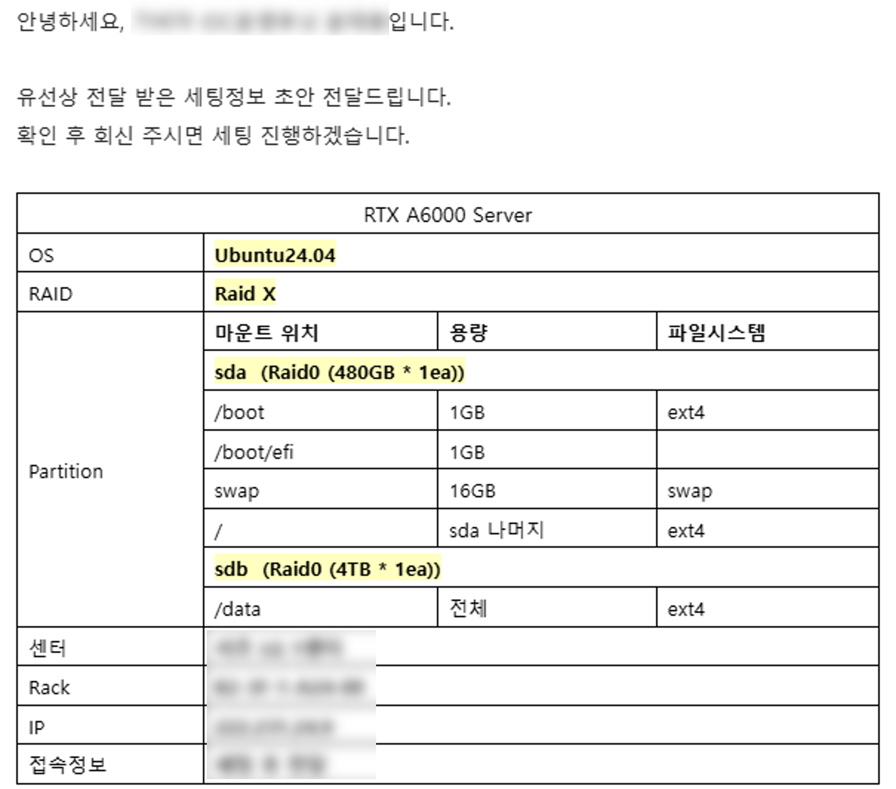
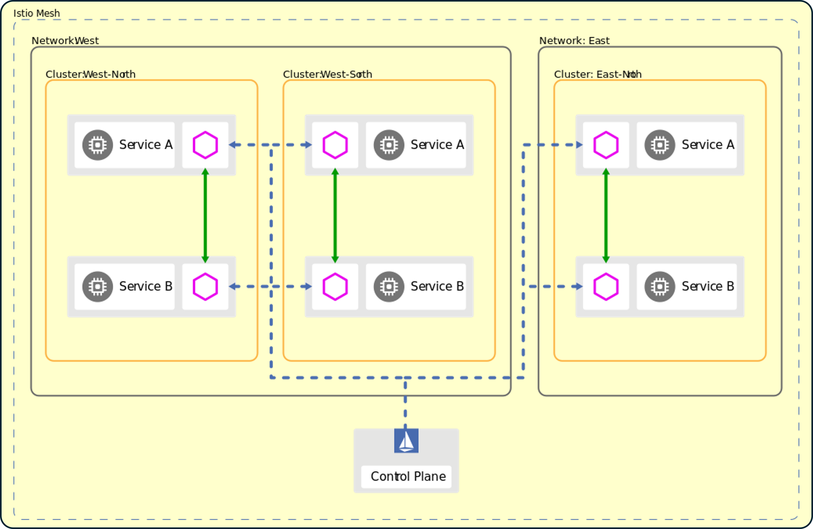
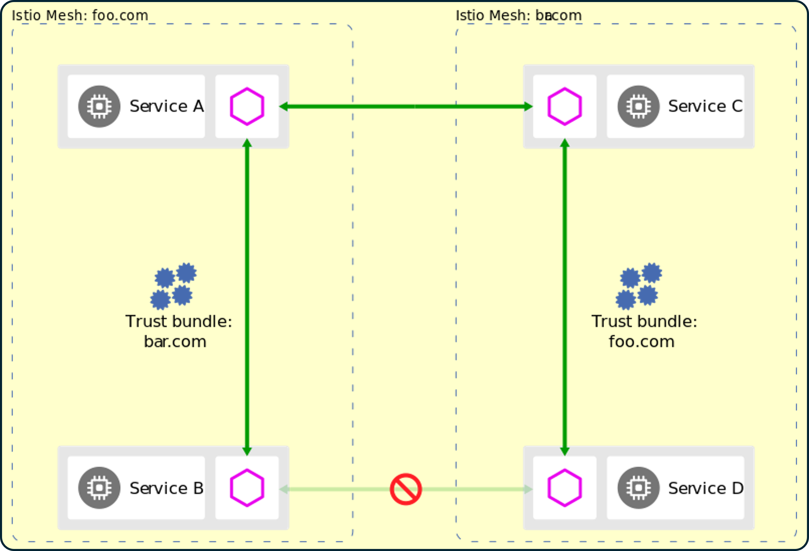
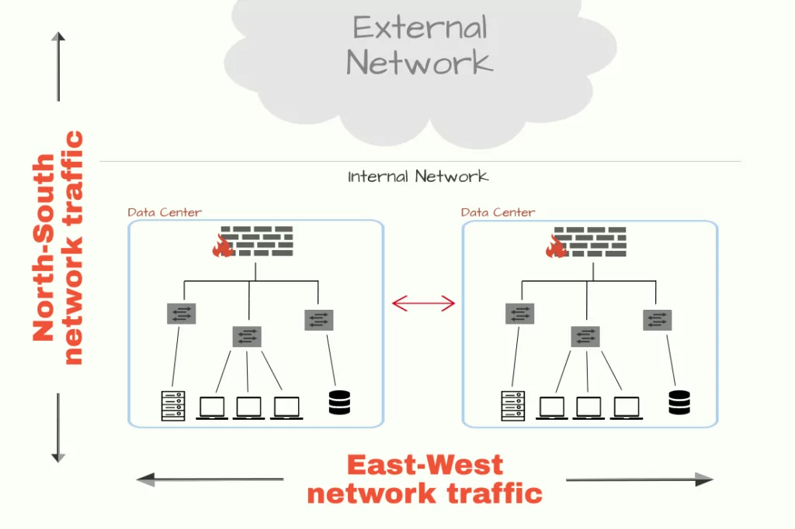
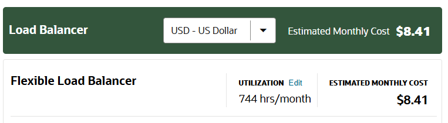
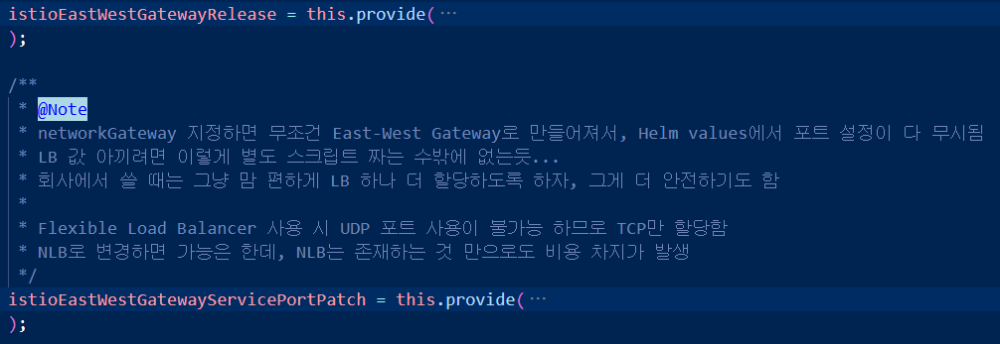
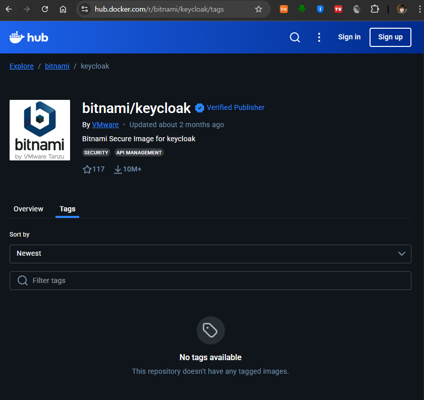

## 들어가기 앞서

지난 달 말에 ["k8s에 Ollama AI 서버 올려보기"](../install-ollama-to-k8s/)라는 포스트를 통해  
"**GPU가 포함된 인프라 구축에 대해 고민 중**"이라는 내용을 언급했다.

<p align='center'>
    
    <em>GPU 서버 스펙</em>
</p>

이리저리 정보를 취합해 비교/토의한 결과,  
결국 **독립된 GPU 서버를 IDC 센터에 설치하는 형태**로 마무리 되었다.

그냥 GPU 서버를 클라우드에 올려 준다면야 나는 매우 편하고 좋겠지만,  
클라우드의 엄청난 비용 부담을 고려하면 이 방식이 가장 합리적인 판단이라고 생각한다.

RTX A6000 GPU의 성능이 지금 당장은 충분해 보이나,  
향후 확장성을 고려하면 GPU 서버 역시 k8s 클러스터로 구성해야 한다.

하지만 실제 서비스를 사용자에게 제공할 때는 클라우드에 있는 k8s를 사용한다.  
GPU 클러스터는 GPU 중심의 워크로드만 담당하고 각종 인증, 데이터 처리, 웹 서비스 등은 클라우드에서 제공한다는 의미이다. 

> 요컨대 **클러스터 간의 통신을 구축할** 필요성이 생겼다.

사실 이런 시나리오를 전혀 예측하지 못한 것은 아니다.

현대적인 인프라 아키텍처에서는 점차 여러 개의 k8s 클러스터를 운영하는 것이 일반적인 관습이 되어가고 있다. 처음에 k8s를 사용할 때는 하나의 클러스터로도 필요한 모든 서비스를 처리하는 게 가능해 보이지만, 확장성이나 장애 시 복원 탄력성 등 머지 않아 그 한계에 부딪히게 된다.

이번 GPU 케이스의 경우 "클라우드에 올리기에 너무 비싸 자체적으로 운영한다"라는 **물리적인 확장성 이슈**이다.  

Istio는 이런 상황에 대응할 수 있도록 **다수의 클러스터를 하나의 서비스 메시로 통합**해 여러 클러스터에 걸친 워크로드 간 통신을 안전하고<sub>(mTLS, Authorization Policy)</sub>, 일관된 방식<sub>(트래픽 제어)</sub>으로 구성할 수 있는 기능을 제공한다.

<br>

### Service Mesh 확장 방식

[Istio Deployment Models 공식 문서](https://istio.io/latest/docs/ops/deployment/deployment-models)에 따르면 서비스 메시 확장은 크게 2가지 모델이 존재한다.

1. [Multiple Clusters](https://istio.io/latest/docs/ops/deployment/deployment-models/#multiple-clusters)

    동일한 Service Mesh가 여러 k8s 클러스터에 걸쳐 뻗어있는 방식이다. <sub>~~(클러스터 클러스터)~~</sub>  
    여러 클러스터의 서비스들이 **하나의 통합된 메시**로 관리되며, 클러스터 간 자동 서비스 발견 및 로드 밸런싱이 가능하다.

    Multiple Clusters 모델의 주요 특징:

    - **서비스 발견 (Service Discovery)**: 여러 클러스터의 서비스 엔드포인트를 자동으로 통합
    - **크로스 클러스터 로드 밸런싱**: 요청을 여러 클러스터의 엔드포인트에 자동 분산
    - **네트워크 구성**: 단일 네트워크 또는 다중 네트워크(지리적 분산, 보안 격리) 구성 가능
    - **제어 평면 (Control Plane)**: 단일 제어 평면으로 여러 클러스터 관리 혹은 각 클러스터에 독립적으로 배치

    클러스터 간 엔드포인트 발견을 위해서는 각 제어 평면에 **remote secret**을 배포하여 다른 클러스터의 API 서버에 접근할 수 있도록 구성해야 한다.

    <p align='center'>
        
    </p>

    > 하나의 국가 내에 존재하는 여러 도시들을 생각해보자, 예를 들면 **대한민국**의 **서울/부산/대구**.
    >
    > 지리적 위치는 물론 수도, 가스, 전기, 하다못해 지하철 노선 등등 분명 독립된 인프라가 존재한다.  
    > 하지만 모든 도시는 "대한민국"이라는 국가 내에서 동일한 법률, 정부, 화폐, 신분증 체계를 공유한다.  
    > 도시 간 이동은 상당히 자유로우며, 다른 도시에 있는 사람을 같은 국가의 시민으로 인식한다.

2. [Multiple Meshes](https://istio.io/latest/docs/ops/deployment/deployment-models/#multiple-meshes)

    여러 개의 독립적인 서비스 메시를 연합(Mesh Federation)하는 방식이다. <sub>~~(클러스터 클러스터 클러스터)~~</sub>  
    각 메시는 고유한 **mesh ID**를 가지며, 서비스 이름이나 네임스페이스 이름을 재사용할 수 있다.

    Multiple Meshes 모델은 다음과 같은 상황에서 유용하다:

    - **조직 경계**: 서로 다른 조직이나 사업부가 독립적인 메시를 운영
    - **강한 격리**: 테스트 워크로드와 프로덕션 워크로드 간 완전한 격리

    메시 간 통신을 위해서는 **Mesh Federation**을 구성해야 하며, 서로 다른 trust domain을 가진 메시 간 통신을 위해서는 **trust bundle 교환**이 필요하다.

    <p align='center'>
        
    </p>

    > 세상에는 여러 개의 나라가 있다. 예를 들면 대한민국, 일본, 미국 등등.
    >
    > 각각의 국가는 기본적인 인프라는 물론 저마다 다른 법률, 정부, 통화, 언어 및 신분증 체계를 가지고 있다.  
    > 국가 간 이동은 **여권**과 **비자**가 필요하며, 행동에 상당한 제약이 따른다.  
    > 가령, 미국에 여행 간 사람이 총기를 구매한다거나 투표를 한다거나 하는 것은 불가능하다. 

<br>

### 멀티 클러스터 서비스 메시 시나리오

위 언급한 2가지 모델 중 이번에 사용할 것은 **멀티 클러스터**이다.  
멀티 클러스터 메시를 구성할 때는 **네트워크 분리 여부**와 **제어 평면 배포 방식**에 따라 4개의 시나리오가 있다.

| 시나리오 | 네트워크 | 제어 평면(Control Plane) |
|-----|-----|-----|
| [1. Multi-Primary](https://istio.io/latest/docs/setup/install/multicluster/multi-primary/) | 동일 네트워크 | 개별 배포 |
| [2. Primary-Remote](https://istio.io/latest/docs/setup/install/multicluster/primary-remote/) | 동일 네트워크 | 단일 배포 |
| [3. Multi-Primary on different network](https://istio.io/latest/docs/setup/install/multicluster/multi-primary_multi-network/) | 개별 네트워크 | 개별 배포 |
| [4. Primary-Remote on different network](https://istio.io/latest/docs/setup/install/multicluster/primary-remote_multi-network/) | 개별 네트워크 | 단일 배포 |

내 경우 연결할 두 클러스터의 네트워크가 물리적으로 완전히 분리된 상황이므로 3번 혹은 4번만 보면 된다.

Multi-Primary와 Primary-Remote의 차이는 **제어 평면을 각 클러스터마다 배포 할 것인지**(Multi-Primary),  
아니면 **하나의 제어 평면만 두고(Primary), 다른 클러스터를(Remote) 관리만 할 것인지**(Primary-Remote)이다.

앞서 비유를 이어가면 다음과 같다.

> - **Multi-Primary (개별 제어 평면)**: **연방제 국가**의 각 주(州)가 독립적인 정부를<sub>(주 정부)</sub> 가지는 방식.  
>
>   예를 들어, 미국의 캘리포니아, 텍사스, 뉴욕은 각각 독립적인 주 정부를 가지고 있다.  
>   한 주의 정부가 마비되어도 다른 주는 정상적으로 운영되지만, 각 주마다 정부 조직을 유지해야 하므로 비용과 운영 부담이 크다.
>
> <br>
>
> - **Primary-Remote (단일 제어 평면)**: **단일 국가**의 중앙 정부가 여러 지역을 관리하는 방식.
>  
>   예를 들어, 우리나라는 중앙정부(서울)가 서울, 부산, 대구 등 모든 도시를 관리한다.  
>   하나의 정부로 통합 관리하므로 운영이 간단하지만, 중앙정부가 마비되면 전국이 위험해진다.  
>   <sub>(물론 우리나라도 지방 자치가 있긴 한데, 미국이나 독일 등의 주 정부에 비하면 권한이 매우 약하다.)</sub>


|  | 개별 제어 평면(Multi-Primary) | 단일 제어 평면(Primary-Remote) |
|-----|-----|-----|
|장점|고 가용성, 장애 격리|구성과 운영 난이도가 낮음|
|단점|리소스 소모가 많아지고 운영 난이도가 높음|Primary의 Istiod 다운 시 전체 메시가 위험해짐|

2가지 시나리오를 모두 경험해보고 싶어서, 내가 개인적으로 운영하는 k8s는 **단일 제어 평면**,  
회사의 k8s는 **개별 제어 평면**으로 구성하려고 한다.

이번 포스트에선 개인 k8s에 멀티 클러스터 서비스 메시를 **Primary-Remote on different network** 시나리오에 맞춰 구성한 내용을 담는다.

<br>

## 멀티 클러스터 서비스 메시 구현

실습한 시나리오는 **Primary-Remote**이다.

**Primary Cluster**는 Oracle Cloud Infrastructure에 **OKE Cluster**,  
**Remote Cluster**는 집에 있는 **On-Premise Cluster**이다.

Primary 클러스터에 단일 제어 평면(Istio Control Plane)을 설치하고,  
Remote 클러스터는 Primary가 만든 서비스 메시에 클라이언트로서 참여한다.

전체 클러스터를 아우르는 `Mesh ID` 값을 정해야 한다.  
내 경우 `apex-captain-mesh`로 지정했다.  

각 클러스터에 Istio 리소스가 배포되는 `Namespace`는 `istio-system`이다. (기본값)  

각 클러스터의 이름과 네트워크명을 할당했다.  
Primary Cluster는 `oke`, Remote Cluster는 `workstation`이다.

---

> ⚠️ 두 클러스터를 왔다갔다 하면서 작업해야 해서 헷갈릴 수 있다.
>
> 각 섹션 앞에는 **어느 Context에서 진행하는 내용인지** 명시 해두었으니 참고하자.

---

### Primary 기본 네트워크 설정


<span style="background-color:yellow; color:black">**ㅤ⚠️ Context : Primaryㅤ**</span>

Primary 클러스터의 istio-system Namespace에 Network 값을 Label로 달아준다.

```bash
kubectl label namespace istio-system topology.istio.io/network=oke
```

<br><br>

### OKE 클러스터를 Primary로 구성

<span style="background-color:yellow; color:black">**ㅤ⚠️ Context : Primaryㅤ**</span>

우선 istio-base를 설치한다.
```
helm install istio-base istio/base -n istio-system 
```

<br>

istiod는 다음과 같은 values를 사용해 설치한다.
```yml
# Primary-Istiod.yml
global:
    meshID: apex-captain-mesh
    externalIstiod: true
    network: oke
    multiCluster:
        clusterName: oke
# 기타 설정...
```

<br>

```
helm install istiod istio/istiod -n istio-system \
        -f Primary-Istiod.yml
```
`global.externalIstiod`를 `true`로 설정하는 것이 중요하다.  
이는 OKE 클러스터에 설치되는 Istiod가 `외부 제어 평면`으로 기능 할 수 있도록 하는 플래그이다.
    
<br><br>

### Primary에 `east-west gateway` 설치

<span style="background-color:yellow; color:black">**ㅤ⚠️ Context : Primaryㅤ**</span>

Istio에는 `north-south`, `east-west` 게이트웨이라는 개념이 있다.  
남북이니, 동서니 하는데 이게 Istio에서만 쓰는 이상한 용어는 아니고, 트래픽의 **방향**에 대한 얘기이다.

<p align='center'>
    
</p>

위 그림의 Data Center를 각각 하나의 k8s라고 생각해 보자.

External Network, 즉 "인터넷"을 북쪽, "k8s"를 남쪽에 두면  
`north-south` 트래픽이란 것은 인터넷과 서비스 간, 즉 외부 사용자와의 통신을 의미한다.  
일반적으로 많이 쓰는 "Nginx Ingress Controller"가 담당하는 것이 `north-south` 트래픽인 것이다.

반면, 두 k8s를 나란히 옆으로 두면 두 k8s 간의 통신은  
동-서 간, 즉 `east-west` 간의 통신이 된다.  
`east-west` 게이트웨이는 k8s 간의 istio mesh 구성을 위해 통신하는 출입문이다.  
멀티 클러스터 서비스 메시를 구성하는 모든 k8s에 하나씩 필요하다.

우선 Primary 클러스터에 east-west gateway를 설치해보자.

```yaml
# Primary-Istio-East-West-Gateway.yml
name: istio-eastwestgateway
networkGateway: oke
service:
    type: LoadBalancer
    
    # Reserved IP를 생성해서 고정된 값을 넣는 것을 추천한다
    loadBalancerIP: <할당할 LB의 IP> 

    # 기타 추가할 Annotations
    # 아래는 OCI Free Tier에 부합하는 로드밸런서 설정이다.
    # 사용하는 클라우드 혹은 LB 공급자에 맞춰 설정하자.
    # annotations: 
    #     'service.beta.kubernetes.io/oci-load-balancer-security-list-management-mode':'None',
    #     'service.beta.kubernetes.io/oci-load-balancer-shape':'flexible',
    #     'service.beta.kubernetes.io/oci-load-balancer-shape-flex-max':'10',
    #     'service.beta.kubernetes.io/oci-load-balancer-shape-flex-min':'10',
```

<br>

helm 차트 배포:

```bash
helm install istio-eastwestgateway istio/gateway \
    -n istio-system \
    -f Primary-Istio-East-West-Gateway.yml
```

<br>

배포 상태 확인:

```
kubectl get svc -n istio-system -l app=istio-eastwestgateway
```

다음과 같이 나오면 정상이다.

```bash
NAME                    TYPE           CLUSTER-IP          EXTERNAL-IP     PORT(S)                                                           AGE
istio-eastwestgateway   LoadBalancer   <클러스터 내부 IP>   <LB의 IP>       15021:30358/TCP,15443:30461/TCP,15012:30494/TCP,15017:32510/TCP   2d4h
```


<br><br>

### Primary Cluster의 제어 평면 노출

<span style="background-color:yellow; color:black">**ㅤ⚠️ Context : Primaryㅤ**</span>

```yml
# Primary-Expose-Istiod.yml
apiVersion: networking.istio.io/v1
kind: Gateway
metadata:
  name: istiod-gateway
spec:
  selector:
    istio: eastwestgateway
  servers:
    - port:
        name: tls-istiod
        number: 15012
        protocol: tls
      tls:
        mode: PASSTHROUGH        
      hosts:
        - "*"
    - port:
        name: tls-istiodwebhook
        number: 15017
        protocol: tls
      tls:
        mode: PASSTHROUGH          
      hosts:
        - "*"
---
apiVersion: networking.istio.io/v1
kind: VirtualService
metadata:
  name: istiod-vs
spec:
  hosts:
  - "*"
  gateways:
  - istiod-gateway
  tls:
  - match:
    - port: 15012
      sniHosts:
      - "*"
    route:
    - destination:
        host: istiod.istio-system.svc.cluster.local
        port:
          number: 15012
  - match:
    - port: 15017
      sniHosts:
      - "*"
    route:
    - destination:
        host: istiod.istio-system.svc.cluster.local
        port:
          number: 443
```

<br>

k8s manifest 배포:

```bash
kubectl apply -f Primary-Expose-Istiod.yml -n istio-system
```

배포 상태 확인:

```bash
kubectl get gateway,vs -n istio-system
```

다음과 같이 나오면 정상이다.

```bash
NAME                                          AGE
gateway.networking.istio.io/istiod-gateway    2d4h

NAME                                          GATEWAYS             HOSTS   AGE
virtualservice.networking.istio.io/istiod-vs  ["istiod-gateway"]   ["*"]   2d4h
```

<br><br>

### Remote Cluster 제어 평면 설정

<span style="background-color:lightgreen; color:black">**ㅤ⚠️ Context : Remoteㅤ**</span>

Remote 클러스터의 istio-system 네임스페이스에 Primary의 제어 평면을 사용할 것임을 지정해주자.

```bash
kubectl  annotate namespace istio-system \
    topology.istio.io/controlPlaneClusters=oke
```

<br><br>

### Remote 기본 네트워크 설정

<span style="background-color:lightgreen; color:black">**ㅤ⚠️ Context : Remoteㅤ**</span>

Remote 클러스터의 istio-system Namespace에도 Network 값을 Label로 달아준다.

```bash
kubectl label namespace istio-system topology.istio.io/network=workstation
```

<br><br>

### Workstation 클러스터를 Remote로 구성

<span style="background-color:lightgreen; color:black">**ㅤ⚠️ Context : Remoteㅤ**</span>

Remote에도 istio-base를 설치한다.

```
helm install istio-base istio/base -n istio-system \
    --set profile=remote 
```

profile 값을 "**remote**"로 해준다.

<br>

istiod는 다음과 같은 values를 사용해 설치한다.
```yml
# Remote-Istiod.yml
profile: remote
global:
    configCluster: true
    remotePilotAddress: <Primary 클러스터의 East-West Gateway LB IP>
    multiCluster:
        clusterName: workstation
    network: workstation
    istiodRemote:
        injectionPath: /inject/cluster/workstation/net/workstation
          
# 기타 설정...
```

<br>

```bash
helm install istiod istio/istiod -n istio-system \
    -f Remote-Istiod.yml
```

<br><br>

### Remote 클러스터의 연결 정보 생성

<span style="background-color:lightgreen; color:black">**ㅤ⚠️ Context : Remoteㅤ**</span>

istioctl 명령어로 Remote Cluster에 Service Account와 Role/RoleBinding을 만들고  
이 정보를 Primary에 Secret으로 넣어줘야 한다.

```bash
istioctl create-remote-secret \
    --name=workstation > remote-workstation.yml
```

`remote-workstation.yml` 파일이 생성되었다면 성공이다.

<br><br>

### Primary에 Remote 클러스터의 연결 정보 주입

<span style="background-color:yellow; color:black">**ㅤ⚠️ Context : Primaryㅤ**</span>

위에서 생성한 `remote-workstation.yml` 파일을 그대로 Primary 클러스터에 배포해준다.

```bash
kubectl apply -f remote-workstation.yml
```

<br><br>

### Remote에 `east-west gateway` 설치

<span style="background-color:lightgreen; color:black">**ㅤ⚠️ Context : Remoteㅤ**</span>

```yaml
# Remote-Istio-East-West-Gateway.yml
name: istio-eastwestgateway
networkGateway: workstation
service:
    type: LoadBalancer
    loadBalancerIP: <할당할 LB의 IP> 
    # 이 부분이 좀 특이한데,
    # 내가 운영 중인 Workstation Cluster의 경우 Iptime Router 뒤에서 동작한다.
    # 단순 LB IP만 가지고는 Primary가 접근할 수 없으므로
    # 실제 Router의 IP를 넣어줘야 한다.
    externalIPs:
        - <Router의 외부 IP>
```

<br>

helm 차트 배포:

```bash
helm install istio-eastwestgateway istio/gateway \
    -n istio-system \
    -f Remote-Istio-East-West-Gateway.yml
```
<br>

배포 상태 확인:

```
kubectl get svc -n istio-system -l app=istio-eastwestgateway
```

다음과 같이 나오면 정상이다.

```bash
NAME                    TYPE           CLUSTER-IP           EXTERNAL-IP              PORT(S)                                                           AGE
istio-eastwestgateway   LoadBalancer   <클러스터 내부 IP>   <LB의 IP>,<Router의 IP>   15021:30358/TCP,15443:30461/TCP,15012:30494/TCP,15017:32510/TCP   35h
```

<br><br>

### Primary / Remote 양쪽 모두에 Cross Network Gateway 배포

```yml
# Cross-Network-Gateway.yml
apiVersion: networking.istio.io/v1
kind: Gateway
metadata:
  name: cross-network-gateway
spec:
  selector:
    istio: eastwestgateway
  servers:
    - port:
        number: 15443
        name: tls
        protocol: TLS
      tls:
        mode: AUTO_PASSTHROUGH
      hosts:
        - "*.local"
```

`Cross-Network-Gateway.yml`을 양쪽 클러스터 모두에 배포해준다.

<span style="background-color:yellow; color:black">**ㅤ⚠️ Context : Primaryㅤ**</span>

```
kubectl apply -f Cross-Network-Gateway.yml -n istio-system
```

<span style="background-color:lightgreen; color:black">**ㅤ⚠️ Context : Remoteㅤ**</span>

```
kubectl apply -f Cross-Network-Gateway.yml -n istio-system
```

<br><br>

## 기본 연결 상태 확인

### istioctl로 멀티 클러스터 상태 확인

<span style="background-color:yellow; color:black">**ㅤ⚠️ Context : Primaryㅤ**</span>

```bash
istioctl remote-clusters
```

다음과 같이 나오면 정상이다.

```bash
NAME            SECRET                                           STATUS     ISTIOD
oke                                                              synced     istiod-59fc7749cd-2bvtx
workstation     istio-system/istio-remote-secret-workstation     synced     istiod-59fc7749cd-2bvtx
```

Primary(oke)에 Secret이 안 보이는 건 당연하다.  
OKE 자체가 istio 입장에선 Home이라 그렇다. 모든 클러스터가 `synced`이면 정상이다.

<br><br>

### istioctl로 프록시 상태 확인

<span style="background-color:yellow; color:black">**ㅤ⚠️ Context : Primaryㅤ**</span>

```bash
istioctl proxy-status
```

다음과 같이 나오면 정상이다.

```bash
NAME                                                                                CLUSTER         ISTIOD                      VERSION     SUBSCRIBED TYPES
ak-outpost-oke-authentik-proxy-outpost-57bd89b88c-9968m.authentik                   oke             istiod-59fc7749cd-2bvtx     1.28.0      5 (CDS,LDS,EDS,RDS,NDS)
ak-outpost-workstation-authentik-proxy-outpost-fcfb6fd5b-5hs99.authentik            workstation     istiod-59fc7749cd-2bvtx     1.28.0      5 (CDS,LDS,EDS,RDS,NDS)
authentik-postgresql-0.authentik                                                    oke             istiod-59fc7749cd-2bvtx     1.28.0      5 (CDS,LDS,EDS,RDS,NDS)
authentik-redis-master-0.authentik                                                  oke             istiod-59fc7749cd-2bvtx     1.28.0      5 (CDS,LDS,EDS,RDS,NDS)
authentik-server-7bc95fb9b9-qgnsp.authentik                                         oke             istiod-59fc7749cd-2bvtx     1.28.0      5 (CDS,LDS,EDS,RDS,NDS)
authentik-worker-586897c75d-vspq7.authentik                                         oke             istiod-59fc7749cd-2bvtx     1.28.0      5 (CDS,LDS,EDS,RDS,NDS)
cloudbeaver-deployment-5dcf4cd996-nwmjs.cloudbeaver                                 oke             istiod-59fc7749cd-2bvtx     1.28.0      5 (CDS,LDS,EDS,RDS,NDS)
game-sdtd-deployment-f9dd8578b-llhks.game                                           workstation     istiod-59fc7749cd-2bvtx     1.28.0      4 (CDS,LDS,EDS,RDS)
game-sftp-deployment-75ddb69cb4-pmbx7.game                                          workstation     istiod-59fc7749cd-2bvtx     1.28.0      4 (CDS,LDS,EDS,RDS)
home-l2tp-vpn-proxy-stateful-set-1.home-l2tp-vpn-proxy                              oke             istiod-59fc7749cd-2bvtx     1.28.0      4 (CDS,LDS,EDS,RDS)
ingress-controller-ingress-nginx-controller-85cf749c6f-xzh4d.ingress-controller     workstation     istiod-59fc7749cd-2bvtx     1.28.0      5 (CDS,LDS,EDS,RDS,NDS)
istio-eastwestgateway-6cfbb6f579-j8rgd.istio-system                                 oke             istiod-59fc7749cd-2bvtx     1.28.0      5 (CDS,LDS,EDS,RDS,SDS)
istio-eastwestgateway-787568f5ff-w5jr5.istio-system                                 workstation     istiod-59fc7749cd-2bvtx     1.28.0      5 (CDS,LDS,EDS,RDS,SDS)
jellyfin-859d64757b-qrh4m.nas                                                       workstation     istiod-59fc7749cd-2bvtx     1.28.0      5 (CDS,LDS,EDS,RDS,NDS)
nas-sftp-deployment-6544d44588-5kvng.nas                                            workstation     istiod-59fc7749cd-2bvtx     1.28.0      4 (CDS,LDS,EDS,RDS)
ollama-75d4d849bc-xzlfz.ollama                                                      workstation     istiod-59fc7749cd-2bvtx     1.28.0      5 (CDS,LDS,EDS,RDS,NDS)
open-webui-0.open-webui                                                             workstation     istiod-59fc7749cd-2bvtx     1.28.0      5 (CDS,LDS,EDS,RDS,NDS)
open-webui-pipelines-996f759d7-gzxwg.open-webui                                     workstation     istiod-59fc7749cd-2bvtx     1.28.0      5 (CDS,LDS,EDS,RDS,NDS)
open-webui-tika-fb987c668-8zswp.open-webui                                          workstation     istiod-59fc7749cd-2bvtx     1.28.0      4 (CDS,LDS,EDS,RDS)
redis-ui-deployment-65b968c54f-mbxpc.redis-ui                                       oke             istiod-59fc7749cd-2bvtx     1.28.0      4 (CDS,LDS,EDS,RDS)
```

<br><br>

## 크로스 클러스터 트래픽 테스트

[Istio 공식 가이드](https://istio.io/latest/docs/setup/install/multicluster/verify/)에 따라 두 클러스터에 샘플 서비스를 배포해 정상적으로 동작하는지 테스트해보자.

### Primary에 샘플 앱 배포

<span style="background-color:yellow; color:black">**ㅤ⚠️ Context : Primaryㅤ**</span>

```yml
# Primary-Sample.yml
apiVersion: v1
kind: Namespace
metadata:
  name: sample
  labels:
    istio-injection: enabled
---
apiVersion: v1
kind: Service
metadata:
  namespace: sample
  name: helloworld
  labels:
    app: helloworld
    service: helloworld
spec:
  ports:
  - port: 5000
    name: http
  selector:
    app: helloworld
---
apiVersion: apps/v1
kind: Deployment
metadata:
  namespace: sample
  name: helloworld-v1
  labels:
    app: helloworld
    version: v1
spec:
  replicas: 1
  selector:
    matchLabels:
      app: helloworld
      version: v1
  template:
    metadata:
      labels:
        app: helloworld
        version: v1
    spec:
      containers:
      - name: helloworld
        image: docker.io/istio/examples-helloworld-v1:1.0
        resources:
          requests:
            cpu: "100m"
        imagePullPolicy: IfNotPresent #Always
        ports:
        - containerPort: 5000
---
apiVersion: v1
kind: ServiceAccount
metadata:
  namespace: sample
  name: curl
---
apiVersion: v1
kind: Service
metadata:
  namespace: sample
  name: curl
  labels:
    app: curl
    service: curl
spec:
  ports:
  - port: 80
    name: http
  selector:
    app: curl
---
apiVersion: apps/v1
kind: Deployment
metadata:
  namespace: sample
  name: curl
spec:
  replicas: 1
  selector:
    matchLabels:
      app: curl
  template:
    metadata:
      labels:
        app: curl
    spec:
      terminationGracePeriodSeconds: 0
      serviceAccountName: curl
      containers:
      - name: curl
        image: docker.io/curlimages/curl:8.16.0
        command: ["/bin/sleep", "infinity"]
        imagePullPolicy: IfNotPresent
        volumeMounts:
        - mountPath: /etc/curl/tls
          name: secret-volume
      volumes:
      - name: secret-volume
        secret:
          secretName: curl-secret
          optional: true
---
```

k8s manifest 배포:

```bash
kubectl apply -f Primary-Sample.yml
```

<br><br>

### Remote에 샘플 앱 배포

<span style="background-color:lightgreen; color:black">**ㅤ⚠️ Context : Remoteㅤ**</span>

Primary와 거의 유사하다. Deployment만 조금 다르다.

```yml
# Remote-Sample.yml
apiVersion: v1
kind: Namespace
metadata:
  name: sample
  labels:
    istio-injection: enabled
---
apiVersion: v1
kind: Service
metadata:
  namespace: sample
  name: helloworld
  labels:
    app: helloworld
    service: helloworld
spec:
  ports:
  - port: 5000
    name: http
  selector:
    app: helloworld
---
apiVersion: apps/v1
kind: Deployment
metadata:
  namespace: sample
  name: helloworld-v2
  labels:
    app: helloworld
    version: v2
spec:
  replicas: 1
  selector:
    matchLabels:
      app: helloworld
      version: v2
  template:
    metadata:
      labels:
        app: helloworld
        version: v2
    spec:
      containers:
      - name: helloworld
        image: docker.io/istio/examples-helloworld-v2:1.0
        resources:
          requests:
            cpu: "100m"
        imagePullPolicy: IfNotPresent #Always
        ports:
        - containerPort: 5000
---
apiVersion: v1
kind: ServiceAccount
metadata:
  namespace: sample
  name: curl
---
apiVersion: v1
kind: Service
metadata:
  namespace: sample
  name: curl
  labels:
    app: curl
    service: curl
spec:
  ports:
  - port: 80
    name: http
  selector:
    app: curl
---
apiVersion: apps/v1
kind: Deployment
metadata:
  namespace: sample
  name: curl
spec:
  replicas: 1
  selector:
    matchLabels:
      app: curl
  template:
    metadata:
      labels:
        app: curl
    spec:
      terminationGracePeriodSeconds: 0
      serviceAccountName: curl
      containers:
      - name: curl
        image: docker.io/curlimages/curl:8.16.0
        command: ["/bin/sleep", "infinity"]
        imagePullPolicy: IfNotPresent
        volumeMounts:
        - mountPath: /etc/curl/tls
          name: secret-volume
      volumes:
      - name: secret-volume
        secret:
          secretName: curl-secret
          optional: true
---
```

k8s manifest 배포:

```bash
kubectl apply -f Remote-Sample.yml
```

<br><br>

### Primary에서 연결 테스트

<span style="background-color:yellow; color:black">**ㅤ⚠️ Context : Primaryㅤ**</span>

```bash
kubectl exec -n sample -c curl \
    "$(kubectl get pod -n sample -l \
    app=curl -o jsonpath='{.items[0].metadata.name}')" \
    -- curl -sS helloworld.sample:5000/hello
```

위 명령어를 여러 번 반복해보자.  
다음과 같이 v1과 v2가 출력되면 정상이다.

```bash
Hello version: v2, instance: helloworld-v2-6746879bdd-8csng
Hello version: v1, instance: helloworld-v1-5787f49bd8-kmgdm
Hello version: v1, instance: helloworld-v1-5787f49bd8-kmgdm
...
```

<br><br>

### Remote에서 연결 테스트

<span style="background-color:lightgreen; color:black">**ㅤ⚠️ Context : Remoteㅤ**</span>

```bash
kubectl exec -n sample -c curl \
    "$(kubectl get pod -n sample -l \
    app=curl -o jsonpath='{.items[0].metadata.name}')" \
    -- curl -sS helloworld.sample:5000/hello
```

위 명령어를 여러 번 반복해보자.  
다음과 같이 v1과 v2가 출력되면 정상이다.

```bash
Hello version: v1, instance: helloworld-v1-5787f49bd8-kmgdm
Hello version: v1, instance: helloworld-v1-5787f49bd8-kmgdm
Hello version: v2, instance: helloworld-v2-6746879bdd-8csng
...
```

<br><br>

> 여기까지 결과를 봤다면 멀티 클러스터 서비스 메시 구성은 끝이다. 🎉  
>
> 두 클러스터를 왔다갔다 하며 설정해야 하기에 헷갈릴 수 있는데,  
> 공식 문서의 시나리오를 천천히 따라가다 보면 어렵지 않게 설정할 수 있을 것이다.
>
> 확인이 끝났다면 각 클러스터에서 sample 네임스페이스는 지워 주도록 하자.
> ```bash
> kubectl delete ns sample
> ```

<br><br>

## 당면했던 문제들

멀티 클러스터 메시 구성 자체는 그렇게 어렵지는 않았다.  

다만 메시를 구성하면서 온갖 종류의 문제에 직면 했었는데,  
어떤 일이 있었고 어떤식으로 대응했는지 간단하게 서술하겠다.

### Ingress

1. 로드밸런서는 공짜가 아니다

    클라우드에서 제공하는 LoadBalancer는 당연히 비용이 발생한다.  
    <p align='left'>
        
    </p>
    
    OCI의 Flexible LB는 1개까지는 무료이고, 초과분부터는 1달에 개당 $8.41이 부과된다.   
    환율 1,450원으로 계산하면 12,000원 정도이다.

    그렇게 비싸진 않지만  
    어쨌든 **LB가 늘어나면 비용이 발생**한다.

2. Nginx Ingress Controller와 같은 LB를 공유할 수 없다

    Nginx Ingress Controller로 Ingress 처리를 하고 있었는데,  
    Istio East-West Gateway를 배포하려면 별도의 LB를 따로 구해야 한다.

    **메시 구성을 위해 달 12,000원이 부과**된다는 것이다.

<br>

**해결책:**

Istio East-West Gateway가 Istio Ingress Gateway의 기능을 겸하도록 하고,  
Nginx Ingress Controller를 통째로 제거했다.

Ingress 처리 방식 자체를 Istio VirtualService 방식으로 마이그레이션 한 것이다.  
여기에 대해선 할 얘기가 많지만 본 주제에서 벗어나므로 추후 포스팅 하도록 하겠다.

다만 Helm으로 East-West Gateway 배포 시 별도 포트 설정이 안 돼서 엄청 애를 먹었었는데,  
이를 해결하기 위해 CDK for Terraform으로 별도 Execution 스크립트를 작성해서 강제 할당하였다. 

<p align='left'>
    
</p>

[Github 저장소](https://github.com/ApexCaptain/ApexCaptain.IaC/blob/main/src/terraform/stacks/k8s/oke/apps/istio.stack.ts)에 올려 두었다. 누군가에게는 도움이 되지 않을까 싶다.

```typescript
  istioEastWestGatewayServicePortPatch = this.provide(
    Resource,
    'istioEastWestGatewayServicePortPatch',
    () => {
      const kubeConfigPath =
        this.k8sOkeEndpointStack.okeEndpointSource.shared.kubeConfigFilePath;
      const proxyUrl =
        this.k8sOkeEndpointStack.okeEndpointSource.shared.proxyUrl.socks5;
      const serviceName = this.istioEastWestGatewayRelease.shared.name;
      const namespace = this.namespace.element.metadata.name;

      const additionalPorts: {
        port: number;
        name: string;
        targetPort: number;
        protocol: string;
        present: boolean;
      }[] = [
        {
          port: 80,
          name: 'http',
          targetPort: 80,
          protocol: 'TCP',
          present: true,
        },
        {
          port: 443,
          name: 'https',
          targetPort: 443,
          protocol: 'TCP',
          present: true,
        },
      ];

      const provisioners = additionalPorts.map<LocalExecProvisioner>(
        ({ port, name, targetPort, protocol, present }) => {
          if (present) {
            // 포트 추가
            return {
              type: 'local-exec',
              command: dedent`
                port_exists=$(kubectl get svc ${serviceName} -n ${namespace} \
                  -o jsonpath='{.spec.ports[?(@.port==${port})].port}' 2>/dev/null || echo '')
                if [ -z "$port_exists" ]; then
                  kubectl patch svc ${serviceName} -n ${namespace} \
                    --type='json' \
                    -p='[{"op": "add", "path": "/spec/ports/-", "value": {"name": "${name}", "port": ${port}, "protocol": "${protocol}", "targetPort": ${targetPort}}}]' || true
                fi
              `,
              environment: {
                KUBECONFIG: kubeConfigPath,
                HTTPS_PROXY: proxyUrl,
              },
            };
          } else {
            return {
              type: 'local-exec',
              command: dedent`
                  port_exists=$(kubectl get svc ${serviceName} -n ${namespace} \
                    -o jsonpath="{.spec.ports[?(@.port==${port})].port}" 2>/dev/null || echo '')

                  if [ -z "$port_exists" ]; then
                    exit 0
                  fi

                  ports_list=$(kubectl get svc ${serviceName} -n ${namespace} \
                    -o jsonpath='{.spec.ports[*].port}' 2>/dev/null || echo '')
                  
                  idx=0
                  for port_item in $ports_list; do
                    if [ "$port_item" = "${port}" ]; then
                      kubectl patch svc ${serviceName} -n ${namespace} \
                        --type='json' \
                        -p="[{\"op\": \"remove\", \"path\": \"/spec/ports/$idx\"}]" || exit 1
                      exit 0
                    fi
                    idx=$((idx + 1))
                  done
                  
                  exit 1
              `,
              environment: {
                KUBECONFIG: kubeConfigPath,
                HTTPS_PROXY: proxyUrl,
              },
            };
          }
        },
      );

      return {
        triggers: {
          releaseId: this.istioEastWestGatewayRelease.element.id,
          ports: JSON.stringify(additionalPorts),
        },
        dependsOn: [this.istioEastWestGatewayRelease.element],
        provisioners,
      };
    },
  );
```

<br><br>

### OAuth2 Proxy

위에서 이어지는 문제이다.

기존 Nginx Ingress를 썼을 때는 GitHub OAuth2 앱을 기반으로 OAuth2 Proxy를  
Nginx Auth 레이어에 추가해 보호 했었는데, Istio Gateway + VirtualService에서는  
GitHub OAuth를 사용하는 것이 불가능했다.  

엄밀히 말하면 가능은 한데, 여러 도메인을 동시에 보호하는 게 너무 힘들었다.

어차피 언젠가 옮길 생각도 있었어서, 이참에 별도의 인증 앱을 배포하기로 했다.

본래 [Keycloak](https://www.keycloak.org/)을 쓸 생각이었으나,  
[Keycloak Helm Chart](https://artifacthub.io/packages/helm/bitnami/keycloak)에도 적혀 있길, Bitnami가 2025년 8월 28일부로  
기존 무료 컨테이너 이미지 대부분을 레거시 저장소로 옮기고 업데이트를 중단했다. (...) 

<p align='center'>
    
    <em>이미지가 모두 내려가 있다</em>
</p>

여기에 대해선 이리저리 말이 많은데,  
Bitnami가 Broadcom에 인수된 이후 Keycloak을 유료로 바꾸려는 게 아닌가 하는 의견이 지배적이다.

<br>

**해결책:**

다행히 Keycloak을 사용 중이던 것은 아니어서 그냥 대체 앱을 설치해서 쓰고 있다.  
선택한 앱은 [Authentik](https://goauthentik.io/). 이거에 대해서도 추후 포스팅 하도록 하겠다.  

다음은 실제 시연 영상이다.

<p align='center'>
    <video width=100% controls>
        <source src="videos/authentik.mp4" type="video/mp4">
    </video>
    <em>Authentik으로 인증 거쳐서 Torrent 서비스에 접속</em>
</p>

<br>

## 마치며

이번 작업을 통해 클라우드와 온프레미스 환경에 있는  
두 개의 Kubernetes 클러스터를 하나의 통합된 서비스 메시로 연결할 수 있게 되었다. 

멀티 클러스터 서비스 메시 구성 자체는 공식 문서를 따라하면 그렇게 어렵지 않았지만,  
실제 운영 환경에서 마주한 문제들 — 특히 Ingress와 인증 레이어의 재구성 — 은 예상보다 많은 시간을 소모했다. 

다만 이러한 과정을 통해 Istio의 Gateway/VirtualService 아키텍처에 대해 더 깊이 이해할 수 있었고, 결국 Nginx Ingress Controller에서 Istio로의 마이그레이션까지 완료할 수 있었다.

앞서 언급했듯이, 다음 단계로는 회사에서 운영 중인 Kubernetes 클러스터에 **Multi-Primary** 모델을 적용해볼 계획이다. 이렇게 하면 더 높은 가용성과 장애 격리를 확보할 수 있을 것이다.

또한 이번에 도입한 Authentik과 Istio Gateway 기반의 인증/라우팅 구조에 대해서도 별도의 포스팅으로 정리할 예정이다. 이 부분은 멀티 클러스터 구성보다는 일반적인 Istio 사용 사례에 가깝지만, 
실제 운영 환경에서 겪은 경험들을 공유하면 누군가에게는 도움이 되지 않을까 싶다.

현대적인 마이크로서비스 아키텍처에서는 단일 클러스터의 한계를 넘어 여러 클러스터를 운영하는 것이 점차 표준이 되어가고 있다.
Istio는 이러한 트렌드에 부합하는 강력한 도구이며, 잘 활용한다면 복잡한 인프라를 일관된 방식으로 관리할 수 있다. 

혹시 이 글을 읽는 누군가가 비슷한 작업을 계획하고 있다면,  
이 글이 조금이나마 도움이 되기를 바란다.

<br>
 
---

> **참고 자료**  
> - [Istio Deployment Models](https://istio.io/latest/docs/ops/deployment/deployment-models)  
> - [Istio Multiple Clusters](https://istio.io/latest/docs/ops/deployment/deployment-models/#multiple-clusters)  
> - [Istio Multiple Meshes](https://istio.io/latest/docs/ops/deployment/deployment-models/#multiple-meshes)  
> - [Istio Multi-Primary 설치 가이드](https://istio.io/latest/docs/setup/install/multicluster/multi-primary/)  
> - [Istio Primary-Remote 설치 가이드](https://istio.io/latest/docs/setup/install/multicluster/primary-remote/)  
> - [Istio Multi-Primary on different network](https://istio.io/latest/docs/setup/install/multicluster/multi-primary_multi-network/)  
> - [Istio Primary-Remote on different network](https://istio.io/latest/docs/setup/install/multicluster/primary-remote_multi-network/)  
> - [Istio 멀티클러스터 검증 가이드](https://istio.io/latest/docs/setup/install/multicluster/verify/)  