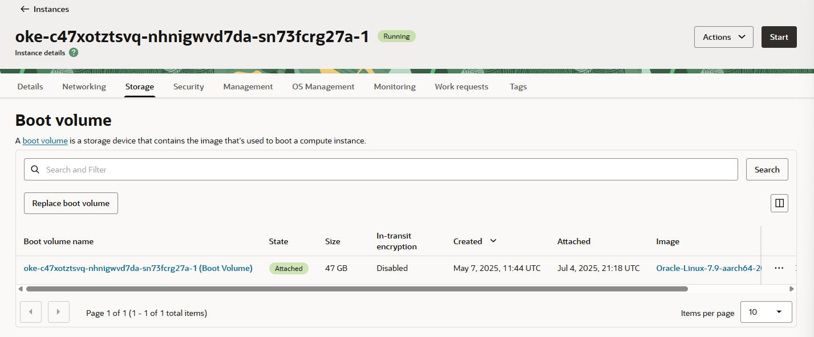
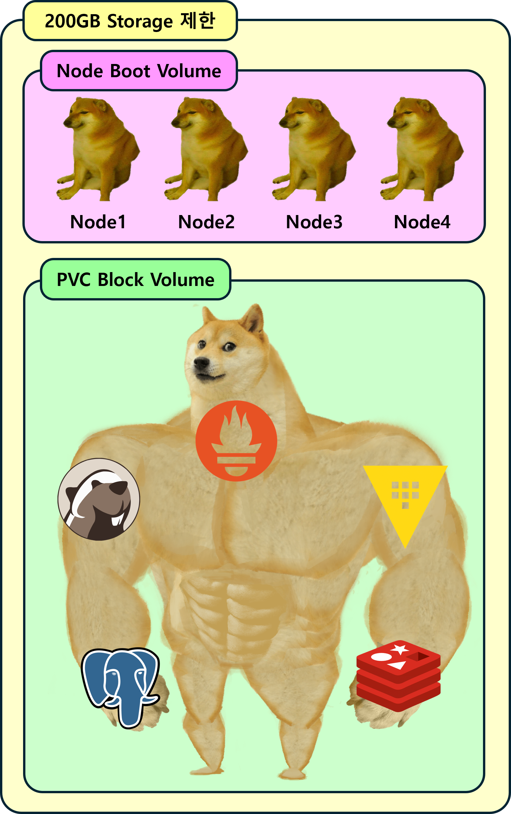
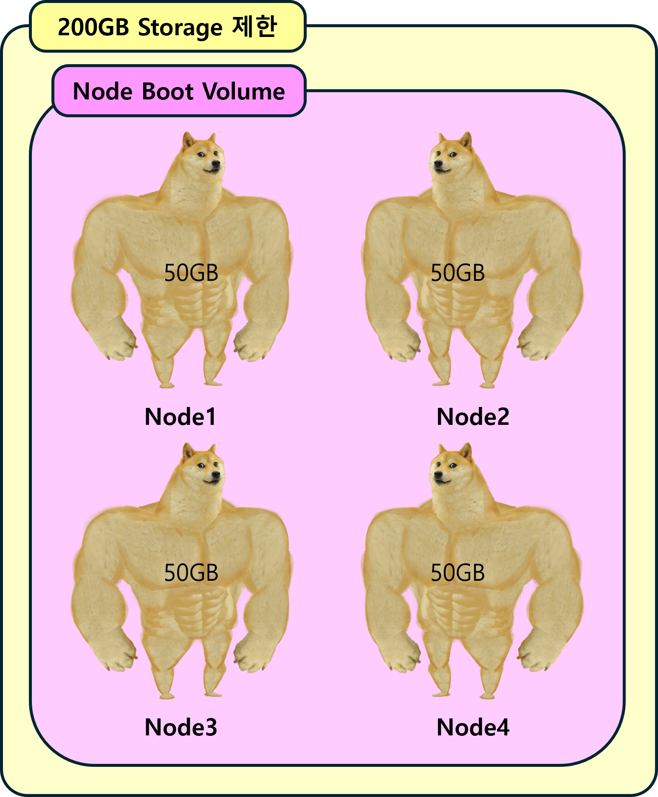
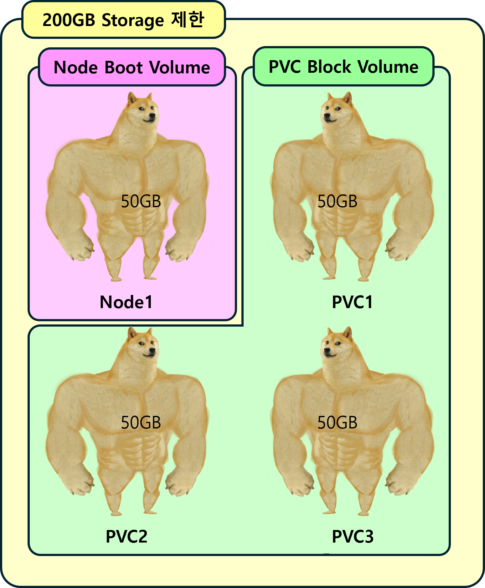
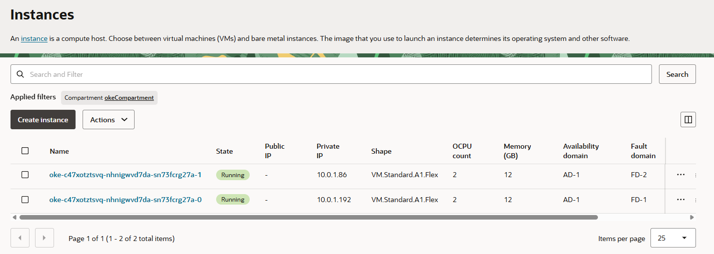
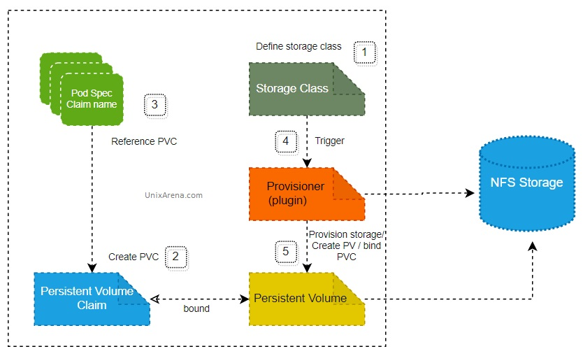
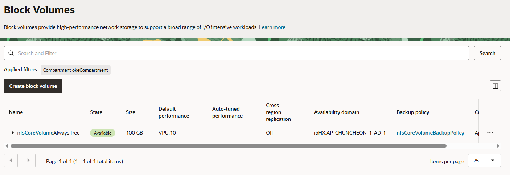
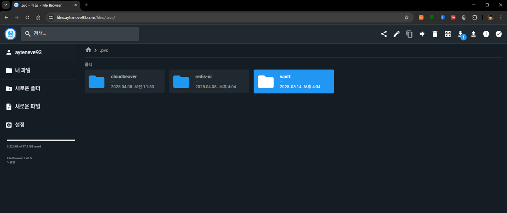

## 들어가기 앞서

### 자체 k8s를 운영하는 이유


- 다양한 기술을 테스트 & 학습
- 개인적으로 쓸 앱 배포

회사 자원을 사용해서 이런걸 해볼 순 없는 노릇이었고, 직접 k8s 클러스터를 보유 & 운영 하는 것이 가장 현실적인 해결책이었다.


<br><br>

### Oracle을 선택한 이유

현재 클러스터는 총 2개로, 하나는 On-Premise, 나머지 하나는 [OCI (Oracle Cloud Infrastructure)](https://www.oracle.com/kr/cloud/)에서 운영한다.

`OCI`는 `Oracle`에서 운영하는 `CP(Cloud Provider)`로 `Amazon`의 `AWS`, `Microsoft`의 `Azure`와 같은 서비스이다.


여느 클라우드와 마찬가지로 OCI에서도 `KaaS`를 제공하는데, 이를 [OKE (Oracle Kubernetes Engine)](https://www.oracle.com/kr/cloud/cloud-native/kubernetes-engine/)라고 부른다.

별로 특별할 건 없다. [EKS](https://aws.amazon.com/ko/eks/)나 [AKS](https://learn.microsoft.com/ko-kr/azure/aks/what-is-aks)에 비해 특별히 더 좋은 점이 있는 것도 아니다.

하지만 OCI에는 다른 CP들과는 다른 엄청난 장점이 하나 있다.

> Oracle에는 무려 `상시 무료 서비스`가 존재한다!

<p align='center'>
    
    <em>클러스터 하나를 운영하기에는 부족함이 없다. 정말 혜자다.</em>
</p>

예상컨데 Cloud 후발주자인 Oracle에서 사용자 좀 끌어 모아 보겠다고 일종의 프로모션의 개념으로 나온 것일테지만, 아무렴 어떠한가? 

AWS도 무료로 사용 가능한 건 1년이 한계이고, 그마저도 EKS는 Node 하나 없이 깡통 클러스터만 만들어놓고 숨만 쉬고 있어도 시간당 $0.1씩 과금 된다.

별 거 아닌거 같다고? 
 
**환율 1400원 기준으로 계산하면 한 달에 무려 10만원씩 나간다!**

적어도 내가 알기로 상시 무료 + k8s 운영이 가능한 CP는 Oracle이 유일하다.

이것이 내가 OCI를 택한 이유이다.

<br><br>

### 단점은?

당연히 단점도 있다. 크게 2가지이다.

- 레퍼런스가 너무 없다. 대부분의 개발자들은 그 존재조차 모르는 것 같다.
- 그럼 공식 문서라도 잘 되어 있어야 하는데 그것도 아니다.

  AWS에 익숙해져서 그런 것도 있겠지만 OCI의 공식 문서는 객관적으로 봐도 가독성이 매우 떨어진다.
  
  [공식 문서 사이트 링크](https://docs.oracle.com/en/)가 있으니 궁금한 사람은 부디 들어가서 탐험 해보길 바란다.

<br><br>

### OCI Always Free 제한사항

[OCI Free Tier](https://www.oracle.com/kr/cloud/free/#always-free)페이지에도 나와있는데, 모든 서비스가 무제한으로 사용 가능한 건 당연히 아니다.

클라스터 1개를 운영한다고 가정하고, k8s에서 가용 가능한 자원을 간단한게 요약하면 다음과 같다.

| 자원 유형 | 제한사항 |
|---------|----------|
| **Node** | Arm 기반 Ampere A1 코어 4개, 24GB 메모리 |
| **Persistent Volume** | 200GB | 
| **Load Balancer** | Flexible Network Load Balancer 1개 |

Node의 경우 Node 1개당 최소 1개의 코어는 필요하므로 최대 사용 가능한 Node 수는 4개이다. AMD Node도 있긴 한데, 사이즈가 너무 작아서 여기선 무시한다.

OKE로 만드는 클러스터도 1개까지는 무료이다. OKE는 KaaS이기 때문에 Control-Plane Node가 따로 필요 없다. 

> **따라서, 4개의 Arm Node는 모두 Worker Node로 쓸 수 있다! 그것도 공짜로!** <sub>_아마존, 보고 있나?_</sub>

위의 리소스 제한 안에서 클러스터를 구성하는 게 목표다.

<br><br>

## 문제의 시작

### Boot Volume 최소값 제한

당초 계획했던 대로 OKE로 클러스터와 ARM Node Pool을 생성했다. Node 수는 4개로 각각 1개의 OCPU와 6GB의 메모리를 할당했다.

<p align='center'>
    
    <em>k8s Node의 역할을 하는 Oracle Instance 중 하나의 Storage 정보</em>
</p>


Boot Volume은 문자 그대로 Linux 시스템이 부팅하는데 필요한 기본 디스크로, 윈도우로 치면 C드라이브 같은 존재이다.

문제는 다음과 같다.

- Boot Volume의 크기는 최소 47Gi (50GB) 이상 할당 해줘야 한다.

- 이 용량은 당초 Free Tier에서 제공되는 200GB에서 차감된다.

> **결론: 단순하게 Node 4개를 만든 것 만으로도 Free Tier의 200GB를 다 써버리게 된다.** 

<br><br>

### 심지어 PVC도 마찬가지

```yaml
apiVersion: v1
kind: PersistentVolumeClaim
metadata:
    name: my-pvc
spec:
    storageClassName: oci-bv # 이게 OCI에서 기본적으로 제공하는 Storage Class이다.
    accessModes:
        - ReadWriteOnce
    resources:
        requests:
            storage: 100Mi 
```

이처럼 OKE k8s 클러스터에 pvc 하나를 만든다고 가정해보자.

`oci-bv`는 Oracle에서 기본적으로 제공되는 Storage class로 OCI Block Volume을 저장소로 쓴다.

약 100MB 정도의 크기를 가지는 작은 PVC이다. 그럼 실제 만들어지는 OCI Block Volume의 크기도 100MB 정도여야 하지 않을까?

어림도 없다. 여기도 크기 제약이 걸려있어서 최소 47Gi(50GB) 이상을 할당 해줘야 한다.

> **결론: 극단적으로 Node를 1개만 쓴다고 가정해도, PVC는 3개가 한계이다. 각각 50GB씩...** <sub>_오라클, 보고 있나?_</sub>
>
> **심지어 Access Mode도 `ReadWriteOnce`만 사용 가능하다.**

<br><br>

### 상황을 정리하자면

1. **당초 계획**
   
    Node에는 최소한의 용량만, 나머지 대부분은 PVC로 할당

    <p align='center'>
        
    </p>

<br>

2. **Boot Volume 최소 크기 제한 50GB**

    Node 자체가 50GB씩 잡아먹는다.
    
    때문에, Node 수가 4개라면 그 자체만으로도 이미 200GB가 다 차버린다.

    <p align='center'>
        
        <em>심지어 PVC는 낄 틈도 없다 </em>
    </p>

<br>

3. **Block Volume(PVC)에도 최소 크기 제한 50GB**

    PVC도 최소 크기가 50GB이다.

    그러면 만일 Node를 하나만 둬서 Single Node Cluster로 구성한다 손 쳐도,

    할당 가능한 PVC는 3개가 한계이다.

    <p align='center'>
        
    </p>

<br><br>

## 해결방안

### NodePool의 스펙 및 수 조정
우선 Node에 50GB씩 기본 할당 되는 건 어쩔 도리가 없기 때문에 Node 수를 타협해야 한다.

클러스터로써 구색은 맞춰야 하므로 기존 4개에서 2개로 줄였다.

각각 OCPU는 2개, 메모리는 12GB씩 할당 해줬다.

<p align='center'>
    
    <em>이걸로 벌써 100GB가 날아갔다</em>
</p>

<br>

### 시스템 구성 요소

<p align='center'>
    
</p>

[NFS Subdir External Provisioner](https://github.com/kubernetes-sigs/nfs-subdir-external-provisioner)를 사용해서 별도의 `StorageClass`를 만들어줘야 한다.

NFS Storage, 즉 NFS 서버를 Source로 해서 StorageClass를 만들고, 해당 StorageClass를 통해

PVC를 생성하면, NFS 서버에 볼륨이 생성되고 데이터가 저장되는 구조이다.

주요 구성 요소를 배포 순서에 따라 나열하면 다음과 같다.

1. OCI Block Volume

    앞서 Node 2개를 배치했으므로, 사용 가능한 용량 제한은 100GB이다.

    <p align='center'>
        
    </p>

    남은 100GB를 모두 사용하는 OCI Block Volume 1개가 필요하다.


2. NFS Server

    1에서 생성한 OCI Block Volume을 PVC로 매핑 받아 NFS Storage를 제공하는 서비스이다.


3. NFS Subdir External Provisioner

    이번 포스트의 핵심으로, 2에서 생성한 NFS 서버를 Source로 StorageClass를 제공한다.

<br>

(선택) 추가로 [FileBrowser](https://github.com/filebrowser/filebrowser)와 SFTP도 함께 설치했다.

<br>

### 사용하는 도구
- **Terraform**: 인프라 자원 관리 (OCI 볼륨, 백업 정책)
- **Kubernetes Manifests**: NFS 서버, File Browser, SFTP 서비스
- **Helm**: NFS Subdir External Provisioner 설치

> 실제 구현은 CDKTF를 써서 하나의 Stack 파일로 구성했었다.
>
> [GitHub 링크](https://github.com/ApexCaptain/ApexCaptain.IaC/blob/main/src/terraform/stacks/k8s/oke/apps/nfs.stack.ts)로 들어가서 확인 가능하다.

<br><br>

### Terraform 인프라 구성

#### OCI 볼륨 생성

```hcl
# main.tf
resource "oci_core_volume" "nfs_core_volume" {
  compartment_id      = var.compartment_id
  availability_domain = var.availability_domain
  size_in_gbs         = 100
  display_name        = "nfs-core-volume"

  lifecycle {
    prevent_destroy = true
  }
}
```

<br>

#### 볼륨 백업 정책
```hcl
# backup_policy.tf
resource "oci_core_volume_backup_policy" "nfs_core_volume_backup_policy" {
  compartment_id = var.compartment_id
  display_name   = "nfs-volume-backup-policy"

  schedules {
    backup_type        = "INCREMENTAL"
    period             = "ONE_WEEK"
    retention_seconds  = 60 * 60 * 24 * 7 * 3  # 3주 보관
    day_of_week        = "SUNDAY"
    hour_of_day        = 2
    offset_seconds     = 0
    offset_type        = "STRUCTURED"
    time_zone          = "REGIONAL_DATA_CENTER_TIME"
  }

  schedules {
    backup_type        = "FULL"
    period             = "ONE_MONTH"
    retention_seconds  = 60 * 60 * 24 * 30 * 2  # 2달 보관
    day_of_month       = 1
    hour_of_day        = 3
    offset_seconds     = 0
    offset_type        = "STRUCTURED"
    time_zone          = "REGIONAL_DATA_CENTER_TIME"
  }
}
```

**백업 스케줄:**

- **증분 백업**: 매주 일요일 2시, 3주 보관
- **전체 백업**: 매월 1일 3시, 2달 보관

<br>

#### 백업 정책 할당

```hcl
# backup_policy_assignment.tf
resource "oci_core_volume_backup_policy_assignment" "nfs_core_volume_backup_policy_assignment" {
  asset_id  = oci_core_volume.nfs_core_volume.id
  policy_id = oci_core_volume_backup_policy.nfs_core_volume_backup_policy.id
}
```

<br>

#### 변수 정의

```hcl
# variables.tf
variable "compartment_id" {
  description = "OCI Compartment ID"
  type        = string
}

variable "availability_domain" {
  description = "OCI Availability Domain"
  type        = string 
}

```

<br>

#### 출력값 정의

```hcl
# outputs.tf
output "nfs_volume_id" {
  description = "NFS Core Volume OCID"
  value       = oci_core_volume.nfs_core_volume.id
}

```

`nfs_volume_id` 값은 PV를 만들 때 필요하다

<br>

#### `terraform.tfvars` 파일 생성


```bash
cat > terraform.tfvars << EOF
compartment_id      = "<< 배포할 OCI Compartment의 ID >>"
availability_domain = "<< AD 이름, 가령 ibHX:AP-CHUNCHEON-1-AD-1 >>"
EOF
```

<br>

#### Terraform 배포
```bash
# Terraform 초기화
terraform init

# 인프라 계획 확인
terraform plan -var-file="terraform.tfvars"

# 인프라 배포
terraform apply -var-file="terraform.tfvars"

# 출력값 확인 (볼륨 ID 등)
terraform output
```

<br><br>

### k8s Manifest

#### 네임스페이스 생성

```yaml
# namespace.yaml
apiVersion: v1
kind: Namespace
metadata:
  name: nfs-system
```

<br>

#### PersistentVolume 생성

```yaml
# persistentvolume.yaml
apiVersion: v1
kind: PersistentVolume
metadata:
  name: nfs-pv
  annotations:
    pv.kubernetes.io/provisioned-by: blockvolume.csi.oraclecloud.com
spec:
  storageClassName: oci-bv
  persistentVolumeReclaimPolicy: Retain
  capacity:
    storage: 100Gi
  accessModes:
    - ReadWriteOnce
  persistentVolumeSource:
    csi:
      driver: blockvolume.csi.oraclecloud.com
      volumeHandle: <OCI_VOLUME_OCID> # Terraform에서 Output 된 Volume ID값을 넣어준다.
                                      # ocid1.volume.oc1 어쩌구 하는 값이다. Web Console에서 복사해서 가져와도 된다.
      fsType: ext4
  nodeAffinity:
    required:
      nodeSelectorTerms:
        - matchExpressions:
            - key: failure-domain.beta.kubernetes.io/zone
              operator: In
              values:
                - <AVAILABILITY_DOMAIN>
```

<br>

#### PersistentVolumeClaim 생성

```yaml
# persistentvolumeclaim.yaml
apiVersion: v1
kind: PersistentVolumeClaim
metadata:
  name: nfs-pvc
  namespace: nfs-system
spec:
  volumeName: nfs-pv # 위에서 생서한 PV의 이름이다
  accessModes:
    - ReadWriteOnce
  resources:
    requests:
      storage: 100Gi
  storageClassName: oci-bv
```

<br>

#### ConfigMap (SFTP Pod용 SSH 키 관리, 선택사항)

```yaml
# configmap.yaml
apiVersion: v1
kind: ConfigMap
metadata:
  name: nfs-system-sftp-config
  namespace: nfs-system
data:
  ssh-public-key: |
    ssh-rsa AAAAB3NzaC1yc2EAAAADAQABAAACAQ... # SSH 공개키
```

<br>

#### Service 생성

```yaml
# service.yaml
apiVersion: v1
kind: Service
metadata:
  name: nfs-service
  namespace: nfs-system
spec:
  selector:
    app: nfs
  ports:
    - name: nfs
      port: 2049
      targetPort: 2049
      protocol: TCP
    # -- 선택 사항 -- #
    - name: file-browser
      port: 8080
      targetPort: 8080
      protocol: TCP
    - name: sftp
      port: 22
      targetPort: 22
      protocol: TCP
```

<br>

#### Deployment 생성

```yaml
# deployment.yaml
apiVersion: apps/v1
kind: Deployment
metadata:
  name: nfs-deployment
  namespace: nfs-system
spec:
  replicas: 1
  selector:
    matchLabels:
      app: nfs
  template:
    metadata:
      labels:
        app: nfs
    spec:
      # FileBrowser를 안 쓸 거라면 initContainers는 필요 없음   
      initContainers:
        - name: init-filebrowser-db
          image: busybox:1.35
          command:
            - /bin/sh
            - -c
            - |
              mkdir -p /exports/fb-database
              chown -R 1000:1000 /exports/fb-database
              chmod -R 755 /exports/fb-database
          volumeMounts:
            - name: nfs-storage
              mountPath: /exports

      containers:
        # NFS 서버 컨테이너 (핵심!!)
        - name: nfs-server
          image: itsthenetwork/nfs-server-alpine:latest-arm
          imagePullPolicy: Always
          ports:
            - containerPort: 2049
              protocol: TCP
          securityContext:
            capabilities:
              add:
                - SYS_ADMIN
                - SETPCAP
          command:
            - /bin/sh
            - -c
            - |
              mkdir -p /exports/services
              /usr/bin/nfsd.sh
          volumeMounts:
            - name: nfs-storage
              mountPath: /exports
          env:
            - name: SHARED_DIRECTORY
              value: /exports
            - name: SHARED_DIRECTORY_2
              value: /exports/services

        # File Browser 컨테이너(선택)
        - name: file-browser
          image: filebrowser/filebrowser
          imagePullPolicy: Always
          ports:
            - containerPort: 8080
              protocol: TCP
          securityContext:
            runAsUser: 1000
            runAsGroup: 1000
            fsGroup: 1000
          volumeMounts:
            - name: nfs-storage
              mountPath: /database
              subPath: fb-database
            - name: nfs-storage
              mountPath: /srv
              subPath: services
          env:
            - name: FB_NOAUTH
              value: 'true'
            - name: FB_DATABASE
              value: /database/database.db
            - name: FB_PORT
              value: '8080'

        # SFTP 컨테이너(선택)
        - name: sftp-server
          image: jmcombs/sftp
          imagePullPolicy: Always
          command:
            - sh
            - -c
            - |
              chmod o+w /home/sftpuser/data
              /entrypoint sftpuser::::data
          ports:
            - containerPort: 22
              protocol: TCP
          volumeMounts:
            - name: ssh-keys
              mountPath: /home/sftpuser/.ssh/keys
              readOnly: true
            - name: nfs-storage
              mountPath: /home/sftpuser/data
              subPath: services

      volumes:
        - name: nfs-storage
          persistentVolumeClaim:
            claimName: nfs-pvc
        - name: ssh-keys
          configMap:
            name: nfs-system-sftp-config
```

**컨테이너별 역할**

1. **NFS 서버**: Alpine 기반 NFS 서버로 `/exports` 디렉토리 공유
2. **File Browser**: 웹 기반 파일 관리 인터페이스 제공 (선택)
3. **SFTP 서버**: SSH 키 기반 파일 전송 서비스 (선택)

<br>

#### FileBrowser Ingress 구성 (선택)

```yaml
# ingress.yaml
apiVersion: networking.k8s.io/v1
kind: Ingress
metadata:
  name: nfs-ingress
  namespace: nfs-system
  annotations:
    nginx.ingress.kubernetes.io/backend-protocol: HTTP
    nginx.ingress.kubernetes.io/rewrite-target: /
spec:
  ingressClassName: nginx
  rules:   
    - host: files.example.com # 소유한 도메인으로 변경 
      http:
        paths:
          - path: /
            pathType: Prefix
            backend:
              service:
                name: nfs-service
                port:
                  number: 8080
```

<br>

#### k8s 리소스 배포

```bash
# 네임스페이스 생성
kubectl apply -f namespace.yaml

# ConfigMap 생성
kubectl apply -f configmap.yaml

# PersistentVolume 생성
kubectl apply -f persistentvolume.yaml

# PersistentVolumeClaim 생성
kubectl apply -f persistentvolumeclaim.yaml

# Service 생성
kubectl apply -f service.yaml

# Deployment 생성
kubectl apply -f deployment.yaml

# Ingress 생성 (선택)
kubectl apply -f ingress.yaml
```

<br><br>

### Helm

#### Helm 저장소 추가
```bash
helm repo add nfs-subdir-external-provisioner https://kubernetes-sigs.github.io/nfs-subdir-external-provisioner/
helm repo update
```

<br>

#### NFS Subdir External Provisioner Values 파일

```yaml
nfs:
  server: 'nfs-service.nfs-system.svc.cluster.local' # NFS 서버 서비스 주소
  path: '/services' # NFS 공유 경로

# StorageClass 설정
storageClass:
  storageClassName: 'nfs-client' # StorageClass 이름은 본인이 원하는데로 사용하면 된다
  accessModes: 'ReadWriteMany'
  # PVC 할당시 Storage에 어떤 경로로 저장 될 지 지정한다.
  # 예시의 경우 my-namespace에서 my-pvc라는 이름의 PVC 생성시 ./pvc/my-namespace/my-pvc로 저장
  pathPattern: '.pvc/$${.PVC.namespace}/$${.PVC.name}', 
```

<br>

#### Helm Chart 배포

```bash
helm install nfs-subdir-external-provisioner nfs-subdir-external-provisioner/nfs-subdir-external-provisioner \
  --namespace nfs-system \
  --values values.yaml \
  --wait

# 설치 상태 확인
helm list -n nfs-system
helm status nfs-subdir-external-provisioner -n nfs-system
```

<br><br>

### 검증 및 테스트

#### 리소스 상태 확인

```bash
# Pod 상태 확인
kubectl get pods -n nfs-system

# Service 확인
kubectl get svc -n nfs-system

# PVC 상태 확인
kubectl get pvc -n nfs-system

# StorageClass 확인
kubectl get storageclass
```

<br><br>

## 마치며

이제 다른 네임스페이스에서 PVC를 생성해보자.

FileBrowser와 ingress까지 설정했다면 웹상으로 접근해서 확인 할 수 있다.

ingress가 별도로 없다면 다음 명령어로 포트포워딩 해서 `localhost:8080`으로 접근해보자.

```bash
kubectl port-forward --address localhost -n nfs-system svc/nfs-service 8080:8080
```


<p align='center'>
    
    <em>PVC가 지정된 경로 (.pvc/namespace/pvc-name)에 생성됨을 알 수 있다.</em>
</p>

<br><br>

## 추후 계획

현재 [Hashicrop Vault](https://www.hashicorp.com/en/products/vault)가 배포되어 있는데, Node의 수가 2개 뿐이라 HA 구성이 안 되고 있다.

NFS Provisioner는 당연히 외부에 존재하는 NFS Storage를 사용할 수도 있다. 굳이 NFS 서버가 클러스터 내부에 존재 할 필요는 없다.

조만간 아예 독립적인 NAS 컴퓨터 한 대를 구매해서 NFS 서버를 구동, NFS Provisioner의 Source Stoarge로 사용할 예정이다. <sub>그래서 열심히 돈을 모으는 중이다...</sub>

이는 또 다른 클러스터인 On-Premise에도 적용 될 예정이다. On-Premise 클러스터는 [Longhorn](https://longhorn.io/)을 설치해서 PVC를 제공하고 있는데, 이래저래 마음에 안 드는 구석이 많아 심플하게 외부 NAS로 통합려고 한다.

Longhorn에 대해서는 조만간 포스팅 할 예정이다.


