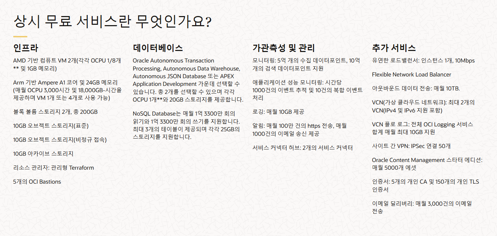

# 연관 포스트
- [Nfs subdir external provisioner](../nfs-subdir-external-provisioner/)
    
  OCI Block Volume 최소 크기 제한사항 해결 

 

## KaaS (Kubernetes as a Service)

### 정의

Kubernetes를 클라우드에서 관리형 서비스로 제공하는 모델이다.

### 특징

- 컨테이너화된 애플리케이션의 배포, 확장, 관리 등의 업무를 간소화
- 웹 콘솔, Terraform 등을 통해 k8s 클러스터를 자동화된 방식으로 구축 가능
- 클라우드와 통합된 StorageClass, LoadBalancer 제공

### 예시

가장 대표적인 Public Cloud Provider인 AWS, Azure, GCP에서는 다음과 같은 KaaS를 제공한다.

| 항목 | AWS EKS | Azure AKS | Google GKE |
|------|---------|-----------|------------|
| **지원 버전** | 1.16.8 (2020년 5월) | 1.18.1, 1.18.2 (2019년 5월) | 1.16.8 (2020년 4월) |
| **업데이트** | Master 및 Node 자동 업데이트 | Master 및 Node 온디맨드 업그레이드 | Master CLI 업그레이드, Node 수동 업데이트 |
| **CLI 지원** | 지원 | 지원 | 지원 |
| **리소스 모니터링** | Stackdriver | Azure Monitor | 타사 도구만 지원 |
| **Node 자동 확장** | 지원 | 프리뷰 단계 | 지원 |
| **Node 그룹** | 지원 | 미지원 | 지원 |
| **고가용성** | 지원 | 개발 중 | 지원 |
| **베어메탈 Node** | 미지원 | 미지원 | AWS 제공 |
| **Master 업데이트** | 자동 수행 | 수동 수행 | 수동 수행 |
| **Node 업그레이드** | 자동 수행 | 수동 수행 | 관리형/비관리형 그룹 |
| **On-Premise** | AWS Outposts | 지원 | Anthos GKE |

  

## Oracle Cloud Infrastructure

[Oracle Cloud Infrastructure(이하 OCI)](https://www.oracle.com/kr/cloud/)는 Oracle에서 운영하는 Cloud Provider이다.  
AWS, Azure 등과 마찬가지로 OCI 역시 [Oracle Kubernetes Engine(이하 OKE)](https://www.oracle.com/kr/cloud/cloud-native/kubernetes-engine/)라는 KaaS를 제공한다. 
 
 

### Oracle을 선택한 이유

OCI 자체는 다른 Cloud Provider들에 비해 특별한 장점이 있는 것은 아니다.  
하지만 개인적으로 Cloud에 k8s를 구성하길 희망한다면, 그에 부합하는 한 가지 커다란 이점이 있다.

> Oracle에는 무려 **상시 무료 서비스**가 존재한다!

    
    <em>클러스터 하나를 운영하기에는 부족함이 없다.</em>

AWS를 무료로 사용할 수 있는 기간은 1년이 한계이고, 그마저도 EKS는 포함되지도 않는다.  
EKS로는 Node 하나 없이 깡통 클러스터만 만들어 놔도 시간당 $0.1씩 과금된다. 

> **환율 1,400원 기준으로 계산하면 한 달에 무려 10만원씩 나간다!**

회사 차원에서 도입을 고려하는 경우라면, 이 정도 비용 격차는 그다지 큰 메리트는 아닐 것이다.  
오히려 후술한 단점들을 생각한다면 AWS나 Azure를 선택하는 것이 훨씬 합리적이다.

하지만 `개인 용도` + `학습`을 목표로 하는 나와 같은 입장의 방문자가 있다면 썩 괜찮은 선택지이다.

  

### 단점

- **레퍼런스 부족**: 어디서 정보를 찾기가 너무 힘들다. 대부분의 개발자들은 그 존재조차 모르는 것 같다.

- **부실한 공식 문서**: 그럼 공식 문서라도 깔끔하게 되어있어야 하는데 그것도 아니다.

  AWS에 익숙해져서 그런 것도 있겠지만, OCI의 공식 문서는 객관적으로 봐도 가독성이 매우 떨어진다.
  
  [공식 문서 사이트 링크](https://docs.oracle.com/en/)가 있으니 궁금한 사람은 부디 들어가서 탐험 해보길 바란다.

  

### OCI Always Free 제한사항

[OCI Free Tier](https://www.oracle.com/kr/cloud/free/#always-free) 페이지에도 나와있는데, 모든 서비스가 무제한으로 사용 가능한 건 당연히 아니다.  
클러스터 1개를 운영한다고 가정하고, k8s에서 가용 가능한 자원을 간단하게 요약하면 다음과 같다.

| 자원 유형 | 제한사항 |
|---------|----------|
| **Node** | Arm 기반 Ampere A1 코어 4개, 24GB 메모리 |
| **Persistent Volume** | 200GB | 
| **Load Balancer** | Flexible Network Load Balancer 1개 |

Node의 경우 Node 1개당 최소 1개의 코어는 필요하므로 최대 `사용 가능한 Arm Node 수는 4개`이다.  
AMD Node도 있긴 한데, 사이즈가 너무 작아서 여기선 무시한다.

OKE로 만드는 클러스터는 1개까지 무료로 사용 가능하다.  
OKE는 KaaS이기 때문에 별도로 Control-Plane Node가 필요 없다. 

> **따라서 4개의 Arm Node는 모두 Worker Node로 쓸 수 있다! 그것도 공짜로!** _아마존, 보고 있나?_

## 목표

- OCI Free Tier에 제한된 리소스 안에서 k8s 클러스터를 자체적으로 운영
- 추가 비용 X
- On-Premise 클러스터와 함께 멀티 클러스터 구성
