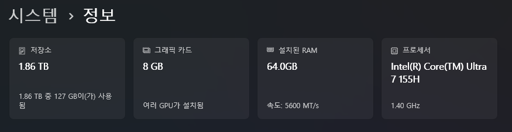

# 연관 포스트
- [Docling이란?](../docling/)

<br>

## 문제의 시작

회사에서 _간단한 RAG 애플리케이션_ 을 하나 만들라는 지시를 받았다.

여기엔 몇 가지 단서조항이 포함되어 있었는데, 문제가 되는 부분은 다음과 같다.

1. 운영 환경은 **`Windows 11 노트북`**

2. **`네트워크에 연결되지 않은 상태`** 에서 동작해야 함

3. Docker Desktop 설치하면 안 됨

4. 중국 기업에서 나온 모델은 사용하면 안 됨
    - 예를들어
        1. [DeepSeek](https://www.deepseek.com/)
        2. [QWEN](https://chat.qwen.ai/)

<p align='center'>
    
    <em>추석 연휴동안 작업 하려고 허락 받고 아예 집에 가져왔다.</em>
</p>

<br>

### 노트북 사양

<p align='center'>
    
</p>

- CPU/메모리는 괜찮다. 특히 메모리는 무려 64GB나 된다!
- 문제는 그래픽 카드인데, VRAM이 `8GB` 밖에 되지 않는다.

<br>

### 폐쇄망

이번 프로젝트에서 가장 큰 걸림돌이 바로 이것이다. 

> 네트워크가 안 되는 환경에서 구동 되어야 할 것

Ollama처럼 단순히 LLM을 설치하고 명령 받아서 처리만 해주는 컨테이너의 경우,
외부에서 제어만 잘 해주면 별다른 문제가 없겠으나 Docling처럼 AI가 애플리케이션
내부로 들어가서 겉에서 한 번 Wrapping된 형태라면 Offline 기능을 제공해주지 않는 이상 구현이 요원해진다.


<br>

## 해결방안

### 컨테이너 구성

우선 전체적으로 컨테이너가 어떻게 구성되어 있는지 정리해두었다.

Host OS가 Windows인 관계로, WSL 및 Docker와 Docker-Compose를 사용해서 컨테이너 환경을 마련했다.

단서조항에 `Docker Desktop은 설치하면 안 됨`이 있어서 Ubuntu 위에 직접 설치했다.

- **Application**
    - **Web**: React 기반의 웹 애플리케이션
    - **Backend**: NestJs 기반의 API 서버
- **Infrastructure**
    - **Ollama**
        - Image: [ollama/ollama](https://hub.docker.com/r/ollama/ollama)
        - 용도: 텍스트 생성 / Embedding
        - 사용된 모델
            - 텍스트 생성: [joonoh/HyperCLOVAX-SEED-Text-Instruct-1.5B:latest](https://ollama.com/joonoh/HyperCLOVAX-SEED-Text-Instruct-1.5B:latest)
            - 임베딩: [bona/bge-m3-korean:latest](https://ollama.com/bona/bge-m3-korean)
        - GPU 가속 : `O`
    - **Docling**
        - Image: [quay.io/docling-project/docling-serve](https://quay.io/repository/docling-project/docling-serve)  

            이 이미지는 CPU Only 모드로만 동작하는 Docling 컨테이너 이미지이다.  
            GPU 가속이 가능한 이미지로도 써봤는데, VRAM 제한 때문에 `CUDA Out of Memory` 이슈와 함께 먹통이 되어버렸다.

            결국 이 프로젝트에서 GPU는 Ollama 컨테이너만 쓰는 것으로 타협을 봤다.  
            VRAM에 여유가 있다면 다음의 Docker Image 중 하나를 골라 쓰면 된다.
            - [quay.io/docling-project/docling-serve-cu126](https://quay.io/repository/docling-project/docling-serve-cu126): CUDA 12.6
            - [quay.io/docling-project/docling-serve-cu128](https://quay.io/repository/docling-project/docling-serve-cu128): CUDA 12.8
        - 용도: Embedding 전처리
        - 사용된 모델
            - [ds4sd/CodeFormulaV2](https://huggingface.co/ds4sd/CodeFormulaV2): 수학 공식 분석
            - [HuggingFaceTB/SmolVLM-256M-Instruct](https://huggingface.co/HuggingFaceTB/SmolVLM-256M-Instruct): 이미지 분석
            - [sentence-transformers/all-MiniLM-L6-v2](https://huggingface.co/sentence-transformers/all-MiniLM-L6-v2): 문서 Chunking
        - GPU 가속 : `X`
    - **Chroma**
        - Image: [chromadb/chroma](https://hub.docker.com/r/chromadb/chroma)
        - 용도: VectorStore
- **Management**
    - **Watchtower**: 컨테이너 자동 업데이트
    - **AutoHeal**: HealthCheck Fail시 컨테이너 자동 리스타트

<br>

### 이미지에 AI Model을 내장하기

이번 문제의 핵심을 다시 한 번 요약하면 다음과 같다.

1. RAG 애플리케이션을 `Offline 상태`의 노트북 1개에서 동작시켜야 한다.

2. 여기서 핵심이 되는 컨테이너는 `Ollama`와 `Docling`이다.

3. 두 컨테이너는 모두 AI 모델을 동적으로 다운받아 동작하는 것을 기본으로 한다.

그럼, Ollama와 Docling에서 사용할 모델을 Docker Image에 내장하면 그만인 것 아닐까?

<br>

#### 방법 1) Docker Image에 모델 내장해서 올리기 

우선 아예 모델 다운로드가 포함된 Image를 만들어서 Registry에 올려보았다.

<p align='center'>
    
    <em>10GB가 넘는다. 심지어 필요한 모든 모델을 다 담은 것도 아니다.</em>
</p>

당연한 얘기지만, 모델이 포함된 만큼 정직하게 크기가 늘어나버렸다.  
이게 비단 Docker 이미지가 좀 무거워졌다 수준의 문제가 아니다.
1. CI/CD 파이프라인이 전반적으로 다 느려진다.

2. 이렇게 생성된 Image는 클라우드에서 제공하는 Container Registry에 올라가는데, 용량 때문에 비용 걱정도 해야 한다.

<br>

#### 방법 2) 빌드 타임에 AI 모델을 다운받도록 변경

생각해보니, 굳이 Image Registry에 올릴 필요는 없었다.

`Offline 환경에서 동작해야 한다`이지,  
`Offline 환경에서 설치해야 한다`의 개념은 아니지 않은가.

Docker Compose에 `image` 대신 `build`를 넣고 아예 Dockerfile 자체를 정의해주면 그만이다. 

그렇게 해서 나온 결과는 다음과 같다.

```yml
# docker-compose.yml
services:

  # ...... #

  # Infrastructure Services
  ollama:
    build:
      context: ./build/ollama
      dockerfile: Dockerfile
    container_name: ollama
    restart: unless-stopped

    # Docker Compose에서 GPU를 할당할 땐 이런식으로 한다.
    deploy:
      resources:
        reservations:
          devices:
            - driver: nvidia
              count: all
              capabilities: [gpu]
    volumes:
      - Ollama.Data:/root/.ollama
    logging:
      options:
        max-size: 50m

  docling:
    container_name: docling
    build:
      context: ./build/docling
      dockerfile: Dockerfile
    restart: unless-stopped
    environment:
      DOCLING_SERVE_ENABLE_UI: 'false'

      # (매우 중요!) 이 항목이 없으면 모델을 내장시켜도 Offline에서 자꾸 에러가 난다.
      HF_HUB_OFFLINE: 1 
    logging:
      options:
        max-size: 50m

  # ...... #

volumes:
  Ollama.Data:
```

`build` 디렉토리는 `docker-compose.yml`과 같은 경로에 배치 해두었다.  
`build` 디렉토리 내부 구조는 다음과 같다.
```bash
build
├── docling
│   └── Dockerfile
└── ollama
    ├── Dockerfile
    └── entrypoint.sh
```

각 파일들은 다음과 같이 작성했다.

1. `build/docling/Dockerfile`
    ```dockerfile
    FROM quay.io/docling-project/docling-serve-cpu

    # Docling의 기본 모델 다운로드
    RUN docling-tools models download

    # Hybrid Chunker용 추가 모델 다운로드
    RUN python3 -c "from transformers import AutoTokenizer, AutoModel; \
        AutoTokenizer.from_pretrained('sentence-transformers/all-MiniLM-L6-v2'); \
        AutoModel.from_pretrained('sentence-transformers/all-MiniLM-L6-v2');"

    # 공식/이미지 분석용 모델 다운로드
    RUN docling-tools models \
        download-hf-repo  \
            ds4sd/CodeFormulaV2 \
            HuggingFaceTB/SmolVLM-256M-Instruct 

    EXPOSE 5001
    ```

2. `build/ollama/Dockerfile`
    ```dockerfile
    FROM ollama/ollama

    COPY ./entrypoint.sh /entrypoint.sh

    RUN chmod +x /entrypoint.sh

    ENTRYPOINT ["/entrypoint.sh"]

    EXPOSE 11434
    ```
    Ollama는 Ollama 서버가 실행되고 나서야 모델을 받을 수 있으므로, 별도의 Entrypoint를 추가해줬다.

3. `build/ollama/entrypoint.sh`
    ```bash
    #!/bin/bash

    set -e

    echo "Starting Ollama server..."
    ollama serve & # 백그라운드에서 Ollama 실행
    SERVER_PID=$!

    echo "Waiting for Ollama server to be active..."
    until ollama list >/dev/null 2>&1; do # Ollama process가 정상적으로 동작 될 때까지 대기
    sleep 1
    done

    echo "Pulling models..."
    # For embedding
    ollama pull bona/bge-m3-korean:latest || true 
    # For text generation
    ollama pull joonoh/HyperCLOVAX-SEED-Text-Instruct-1.5B:latest || true

    trap "kill -TERM $SERVER_PID" SIGTERM SIGINT
    wait $SERVER_PID
    ```

<br>

## 마치며

위 방법 2를 사용해서 Offline에서도 임베딩부터 텍스트 생성까지 정상 동작하는게 확인되었다.

["Docling이란?" 포스트의 동작 테스트 문단](../docling/#동작-테스트)에 실제로 테스트 한 영상을 올려두었다.