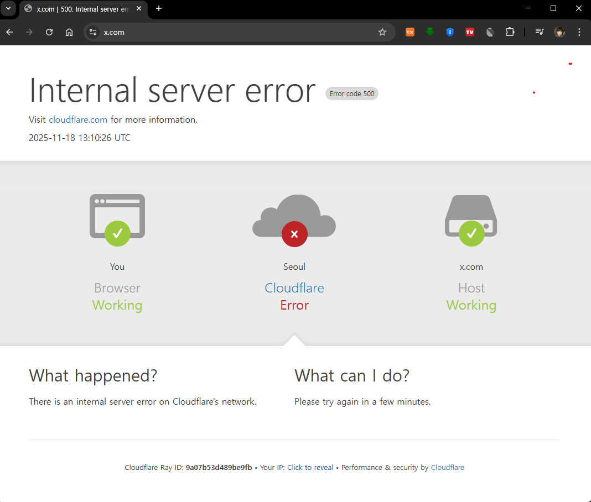
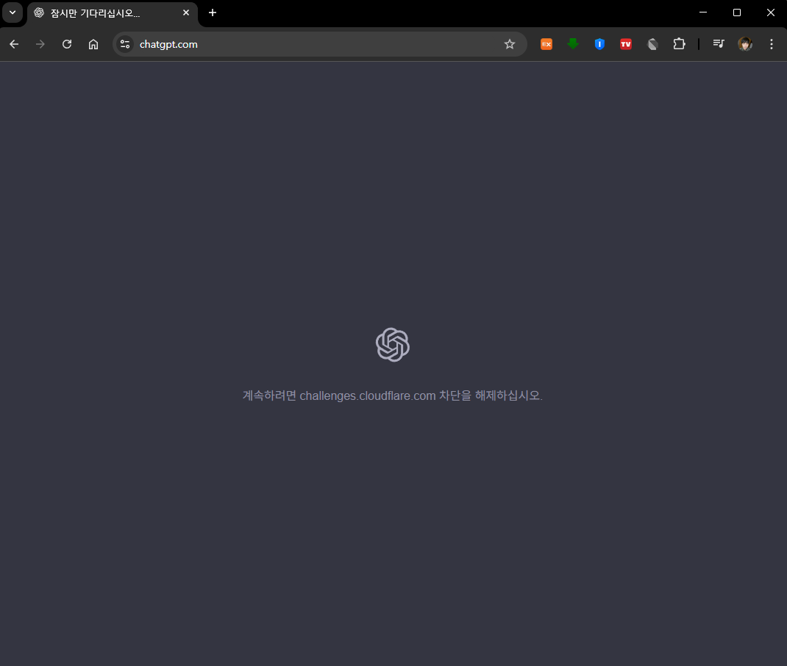
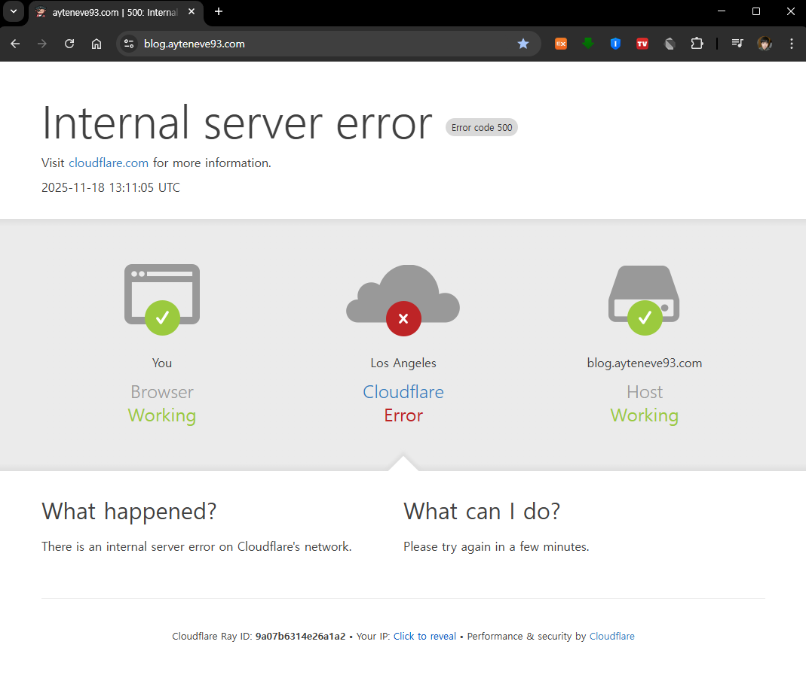
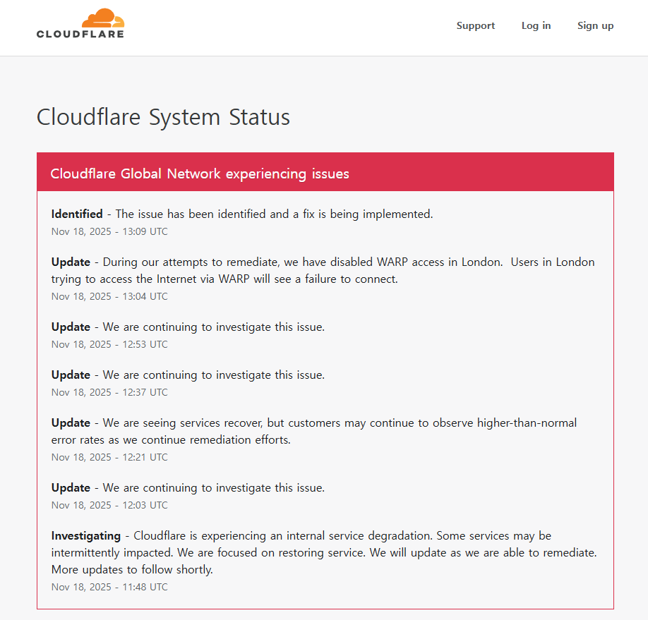
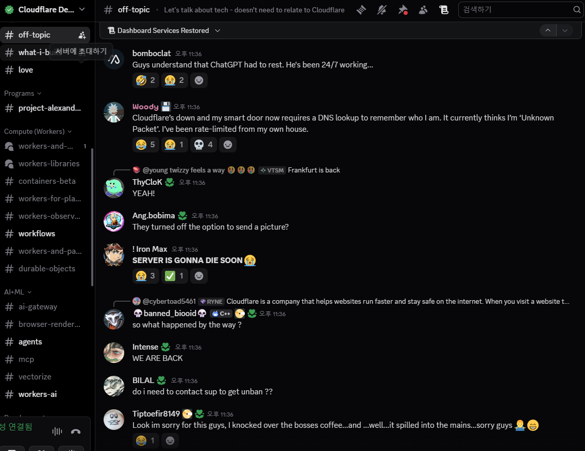

멀티 클러스터 메시 환경에서 Monitoring Stack 구현을 위해  
CDK for Terraform으로 Helm Chart를 k8s에 배포하는 중이었다.

> 그러다 돌연 **500 Internal Server Error** 발생했다.

무슨 일인가 조사해봤는데, 아무래도 Cloudflare 자체에 문제가 생긴 모양이다.

    

X(구: 트위터)도 안 들어가지고

    

GPT 페이지도 오류 나고

    

당연히 내 블로그도 에러가 난다. 😢

    

[Cloudflare Status 페이지](https://www.cloudflarestatus.com/)를 보니 지금 열심히 복구 작업 중인 모양이다.

    

디스코드 채널에도 들어가봤는데 하나같이 불만을 성토하는 채팅이 잔뜩이다.

 

다행히 한국은 업무시간 이후에 터진데다,  
회사에서는 Cloudflare를 사용하고 있지 않으므로 별다른 영향은 없으니 다행이다.

해결책이랄 것도 없다. 이건 그냥 복구될 때까지 기다리는 수밖에...  
추후 비슷한 일이 있을 경우를 대비해서 CDN을 이중화하거나 다른 인프라로 분산하는 것도 고려해야 할까?