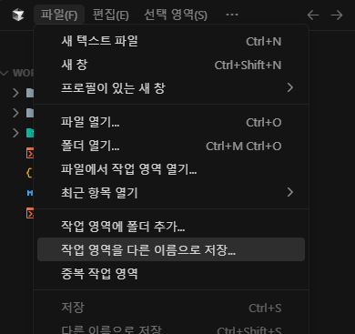
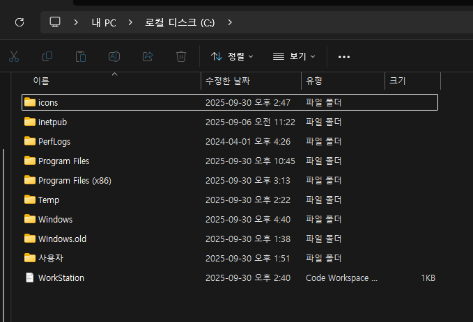
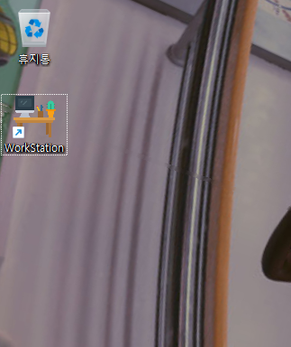
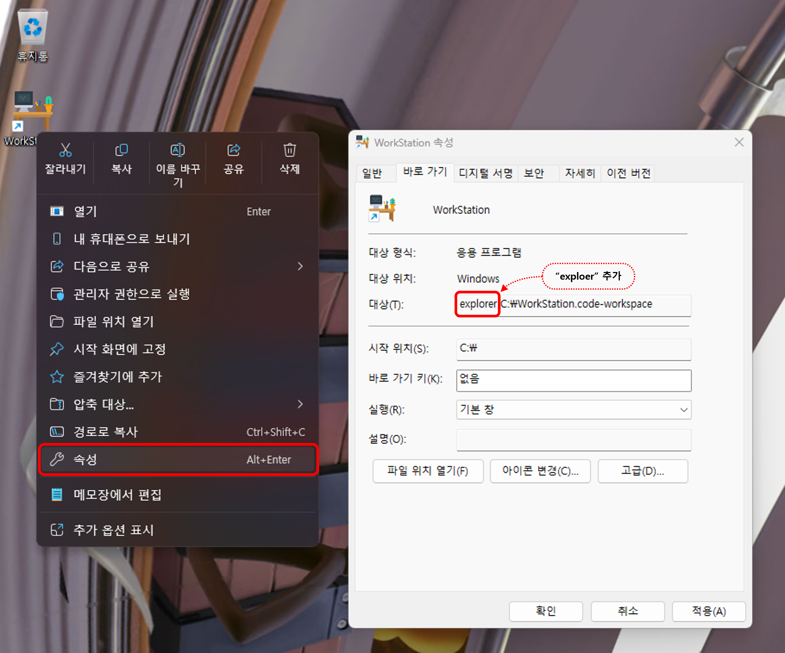

## 문제의 시작

윈도우 11로 업데이트 하면서 몇 가지 불편해진 점이 있다. 

예를들어 : 
- 여러 압축 파일을 각각의 폴더에 해제 할 수 있던 기능이 없어졌다.
- 파일이나 폴더를 `우클릭` -> `추가 옵션 표시`를 눌러줘야 기존에 쓰던 기능을 쓸 수 있다.

그중 하나가 바로가기 파일이 윈도우 작업 표시줄에 드래그 앤 드롭으로 추가가 안 된다는 것이다.

이번 포스트에선 `Cursor`나 `VsCode` 작업 영역(Workspace)의 바로가기를 만들고

이를 작업 표시줄에 추가하는 방법을 공유하겠다.

  

## 해결방안

### Workspace 파일 생성

`Cursor` 혹은 `VsCode`로 Workspace파일을 생성한 후 원하는 이름으로 변경한다.

    

생성한 Workspace 파일을 적당히 아무 위치로 옮겨준다. 

내 경우 `C:\`에 넣어줬다.

    

 

### 바로가기 생성
Workspace 파일의 바로가기를 만들어서 바탕화면으로 옮겨준다.

하는 김에 아이콘도 이쁜 걸로 바꿔줬다.

    

  

### 바로가기 파일 속성 편집
바로가기 파일 `우클릭` -> `속성` -> `대상` 값 앞에 `explorer`라고 추가해준다.

    

 

### 작업 표시줄에 바로가기 등록
편집한 바로가기 파일을 작업 표시줄에 추가한다.

    

  

## 마치며

    
    <em>집 메인 PC 바탕화면</em>

- 작업 표시줄 오른쪽의 3개 아이콘은 모두 서로 독립된 개발 서버로 연결되는 `Cursor Workspace`이다.
    

        
    

- 이중 하나를 누르면 `SSH`연결까지 자연스럽게 Cursor IDE로 접속된다.
    

        
    

- 윈도우 검색으로도 들어갈 수 있다.
    

        
    

- 추가한 파일 자체가 `바로가기`이기 때문에 비단 `VsCode`나 `Cursor`의 Workspace 뿐 아니라 모든 종류의 바로가기를 다 이런식으로 등록할 수 있다.