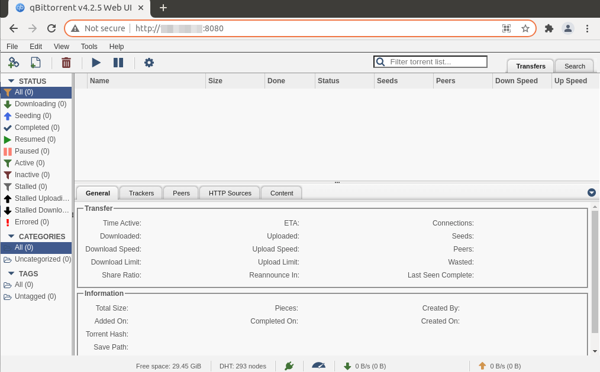
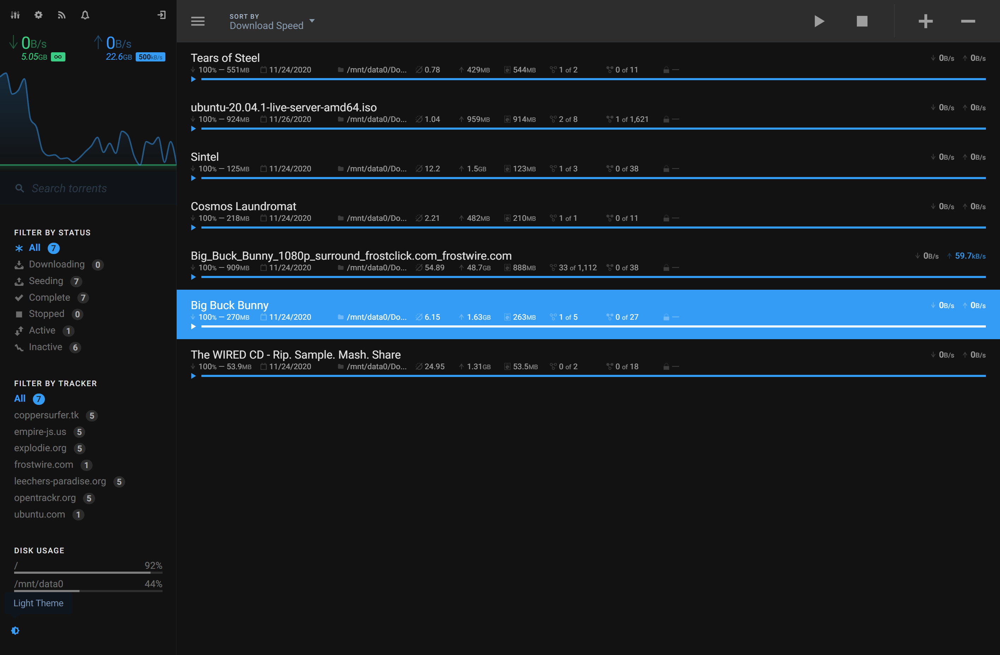
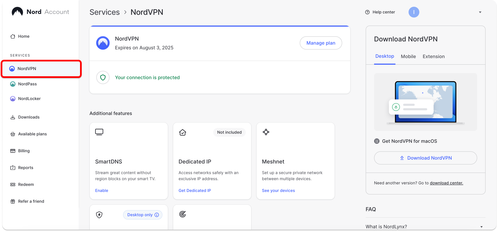
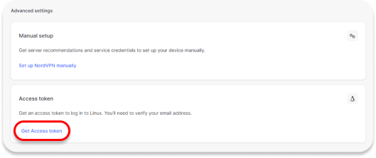
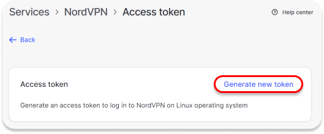
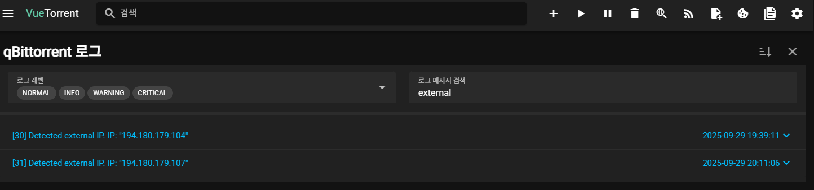
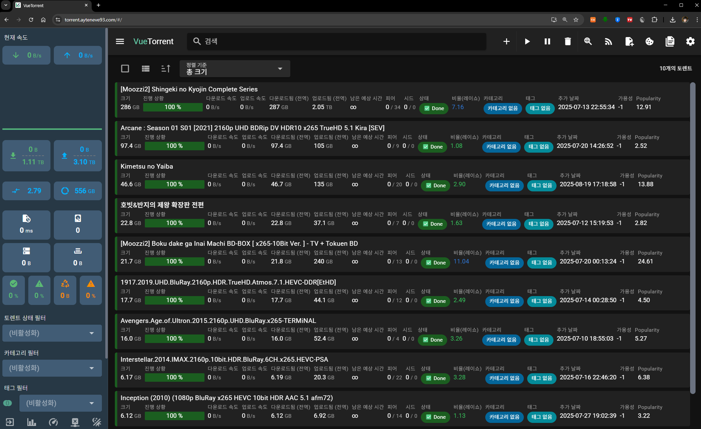

<br>

> **⚠ 주의** : 본 포스트에서는 k8s에 `VPN`으로 우회되는 `Torrent` 서버 구성에 대한 정보를 담고 있습니다.
>
> 부적절한 컨텐츠는 `VPN`이고 뭐고 **절대** 받지 맙시다! 👮

<br>

### 문제의 시작

- [**Jellyfin**](https://jellyfin.ayteneve93.com)으로 지인들과 편하게 미디어를 함께 보고 싶어졌다. <sub>_~귀칼이 그렇게 재밌다길래~_</sub>
- 미디어 콘텐츠를 구하는 가장 좋은 방법은 Torrent이다.
- 하지만 이를 위해 메인 PC를 하루종일 켜두고 싶지는 않다.
- 보안을 위해 VPN은 쓰되, 메인 PC 전체 트래픽을 VPN에 묶고 싶지는 않다.

### 해결방안
- k8s 클러스터에 [qBittorrent](https://hub.docker.com/r/linuxserver/qbittorrent) 배포
- VPN 구성을 위해 NordVPN의 서비스인 [NordLynx](https://hub.docker.com/r/bubuntux/nordlynx)를 적용
- qBittorrent의 기본 UI는 너무 못생겼으므로 UI도 VueTorrent로 변경 (선택)

  <p align='center'>
      
      <em>참고로 기본 UI는 이렇게 생겼다.</em>
  </p>
  <p align='center'>
      
      <em>VueTorrent UI는 이렇게 생겼다. 이쁘다!</em>
  </p>

#### 구성 개요

- **시크릿**: NordLynx 개인키(`nord-lynx-private-key`)를 담는 `Opaque` 타입 시크릿.
- **서비스(Service)**: `ClusterIP`로 qBittorrent 웹 및 토렌트 포트 노출.
- **디플로이먼트(Deployment)**:
  - 사이드카 컨테이너 `ghcr.io/bubuntux/nordlynx:latest` (VPN)
  - 메인 컨테이너 `lscr.io/linuxserver/qbittorrent:latest`
  - `initContainer`로 커널 파라미터 설정(`sysctl`)
  - `NET_ADMIN` capability 부여(터널 동작용)
  - `fsGroup: 1000`으로 퍼미션 정리

#### NordVPN Access Token 발급

  1. [NordVPN Dashboard](https://my.nordaccount.com/dashboard/)에 접속 후 좌상단 `NordVPN`을 클릭한다.
  <p align='left'>
      
  </p>
  2. 하단에 Get Access Token 버튼 클릭
  <p align='left'>
      
  </p>
  3. 등록된 이메일로 인증코드 전송
  <p align='left'>
      
  </p>
  4. 새 토큰을 생성한다
  <p align='left'>
      
  </p>

#### 네임스페이스 생성

```bash
kubectl create namespace torrent
```

#### 시크릿 생성

`<YOUR_PRIVATE_KEY>` 자리를 위에서 발급한 Access Token 값으로 교체한다.


```bash
kubectl -n torrent create secret generic torrent-nord-lynx-private-key \
  --from-literal=nord-lynx-private-key='<YOUR_PRIVATE_KEY>'
```


#### Service 생성

`service-qbittorrent.yaml`:

```yaml
apiVersion: v1
kind: Service
metadata:
  name: qbittorrent
  namespace: torrent
spec:
  type: ClusterIP
  selector:
    app: qbittorrent
  ports:
    - name: web
      port: 8080
      targetPort: 8080
      protocol: TCP
    - name: torrenting-tcp
      port: 6881
      targetPort: 6881
      protocol: TCP
    - name: torrenting-udp
      port: 6881
      targetPort: 6881
      protocol: UDP
```

적용:

```bash
kubectl apply -f service-qbittorrent.yaml
```

#### PVC 생성

StorageClass가 별도로 없다면 비워도 상관 없다.

가급적 `qbittorrent-complete`는 `HDD`에 `qbittorrent-incomplete`는 `SSD`에 저장하는 것이 좋다.

`pvc-qbittorrent.yaml`:

```yaml
# qBittorrent의 설정을 저장하는 PVC
apiVersion: v1
kind: PersistentVolumeClaim
metadata:
  name: qbittorrent-config
  namespace: torrent
spec:
  accessModes:
    - ReadWriteOnce
  resources:
    requests:
      storage: 1Gi
  storageClassName: <your-storage-class> # 클러스터 StorageClass 명에 맞게 수정
---

# 다운로드가 완료 된 파일들이 저장될 PVC
apiVersion: v1
kind: PersistentVolumeClaim
metadata:
  name: qbittorrent-complete
  namespace: torrent
spec:
  accessModes:
    - ReadWriteOnce
  resources:
    requests:
      storage: 500Gi # 용량은 본인이 원하는 만큼 할당
  storageClassName: <your-storage-class> 
---

# 아직 다운로드 중인 파일들이 저장될 PVC
apiVersion: v1
kind: PersistentVolumeClaim
metadata:
  name: qbittorrent-incomplete
  namespace: torrent
spec:
  accessModes:
    - ReadWriteOnce
  resources:
    requests:
      storage: 200Gi # 용량은 본인이 원하는 만큼 할당
  storageClassName: <your-storage-class> 
```

적용:

```bash
kubectl apply -f pvc-qbittorrent.yaml
```


#### Deployment 생성

`deployment-qbittorrent.yaml`:

```yaml
apiVersion: apps/v1
kind: Deployment
metadata:
  name: qbittorrent
  namespace: torrent
spec:
  replicas: 1
  selector:
    matchLabels:
      app: qbittorrent
  template:
    metadata:
      labels:
        app: qbittorrent
        sidecar.istio.io/inject: 'false' # Istio Sidecar와 NordLynx간의 충돌이 있다.
    spec:
      securityContext:
        fsGroup: 1000
      initContainers:
        - name: init-sysctl
          image: busybox
          command:
            - /bin/sh
            - -c
            - |
              sysctl -w net.ipv6.conf.all.disable_ipv6=1 &&
              sysctl -w net.ipv4.conf.all.src_valid_mark=1
          securityContext:
            privileged: true
      containers:
        - name: nordlynx
          image: ghcr.io/bubuntux/nordlynx:latest
          imagePullPolicy: Always
          env:
            - name: TZ
              value: Asia/Seoul
            - name: NET_LOCAL
              value: '10.244.0.0/16' # 클러스터 Pod CIDR에 맞게 수정
            - name: ALLOW_LIST
              value: qbittorrent.torrent.svc.cluster.local
            - name: DNS
              value: '1.1.1.1,8.8.8.8'
            - name: PRIVATE_KEY
              valueFrom:
                secretKeyRef:
                  name: torrent-nord-lynx-private-key
                  key: nord-lynx-private-key
            - name: QUERY
              value: 'filters[servers_groups][identifier]=legacy_p2p'
            - name: COUNTRY_CODE
              value: JP # 우회를 원하는 국가 코드 기입
          securityContext:
            capabilities:
              add:
                - NET_ADMIN
        - name: web
          image: lscr.io/linuxserver/qbittorrent:latest
          imagePullPolicy: Always
          ports:
            - containerPort: 8080
              protocol: TCP
            - containerPort: 6881
              protocol: TCP
            - containerPort: 6881
              protocol: UDP
          env:
            - name: PUID
              value: '1000'
            - name: PGID
              value: '1000'
            - name: TZ
              value: Asia/Seoul
            - name: WEBUI_PORT
              value: '8080'
            - name: TORRENTING_PORT
              value: '6881'
            # VueTorrent UI 적용
            - name: DOCKER_MODS
              value: ghcr.io/gabe565/linuxserver-mod-vuetorrent
          volumeMounts:
            - name: qbittorrent-config
              mountPath: /config
            - name: qbittorrent-complete
              mountPath: /downloads
            - name: qbittorrent-incomplete
              mountPath: /downloads/incomplete
      volumes:
        # qBittorrent 설정 파일
        - name: qbittorrent-config
          persistentVolumeClaim:
            claimName: qbittorrent-config
        # 다운로드가 완료된 파일들
        - name: qbittorrent-complete
          persistentVolumeClaim:
            claimName: qbittorrent-complete
        # 다운로드 중인 파일들
        - name: qbittorrent-incomplete
          persistentVolumeClaim:
            claimName: qbittorrent-incomplete
```

적용:

```bash
kubectl apply -f deployment-qbittorrent.yaml
```

#### 마치며

- `NET_LOCAL`은 클러스터 Pod CIDR에 맞춘다.
- `PRIVATE_KEY`는 위 시크릿 참조와 일치시킨다.
- `initContainer`는 커널 파라미터를 조정하므로 `privileged`가 필요하다.
- `NET_ADMIN` capability가 없으면 VPN 터널이 정상 동작하지 않는다.
- VPN 네트워크가 끊어지면 모든 토렌트 서비스가 셧다운 된다.
- Service Type은 Cluster IP로 설정했는데, 이는 Nginx Ingress Controller와 연결하기 위함이다. 필요에 따라 NodePort등을 사용해서 접근 할 수 있도록 하자.

<p align='center'>
    
    <em>WebUI에서 로그를 검색해보면 정상적으로 VPN IP가 할당되었음을 알 수 있다.</em>
</p>

<p align='center'>
    
    <em>최종적으론 이렇게 나온다</em>
</p>