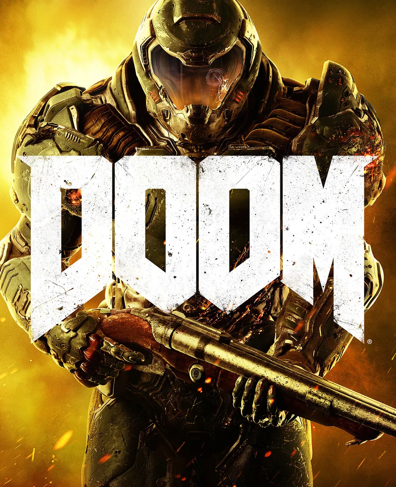
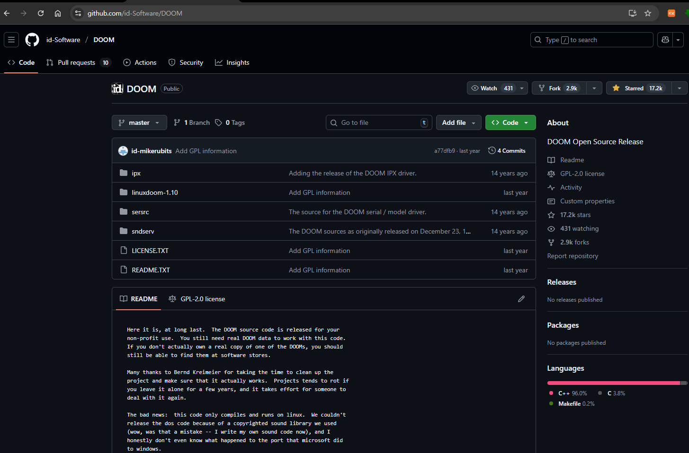
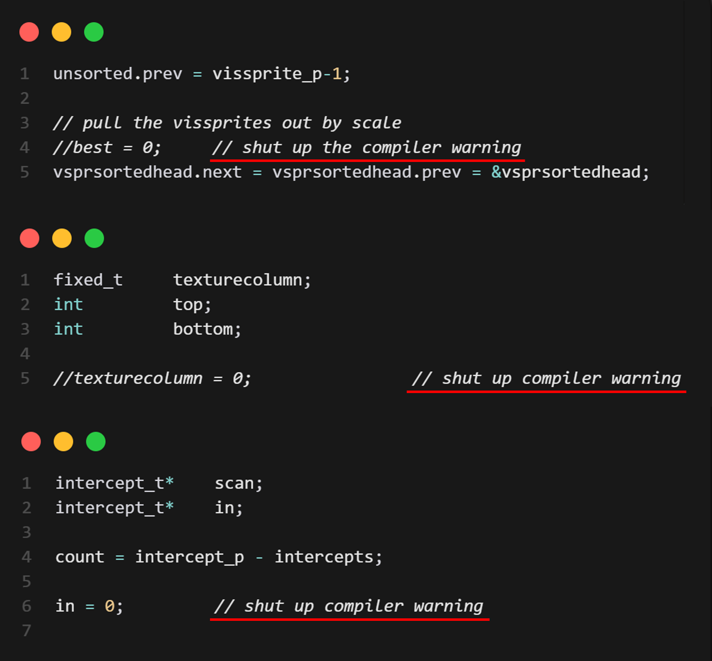
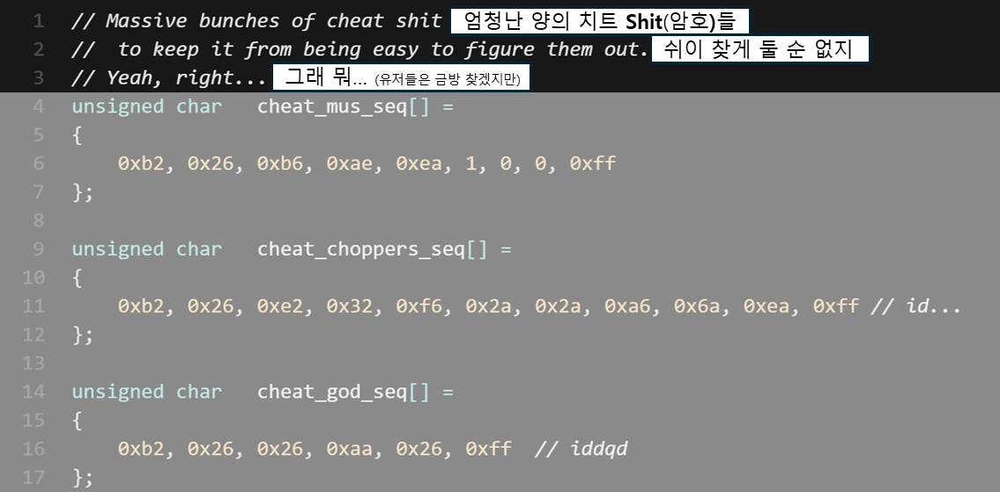
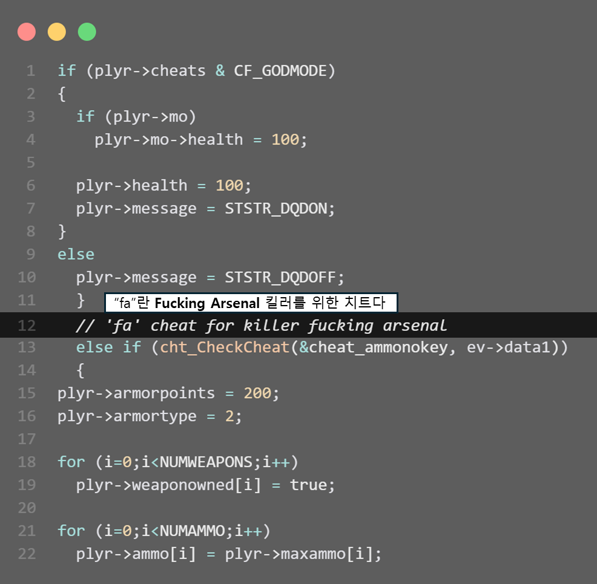
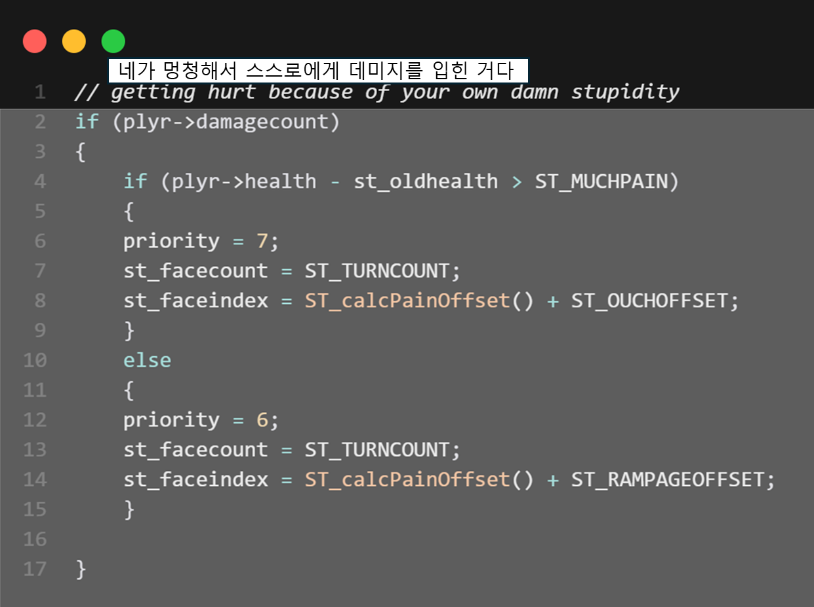
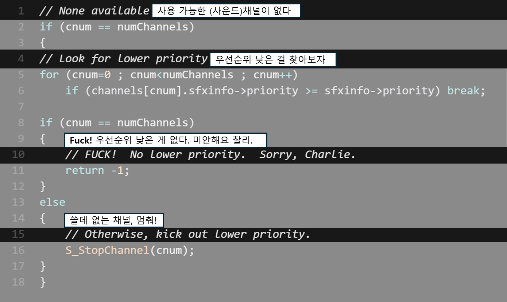
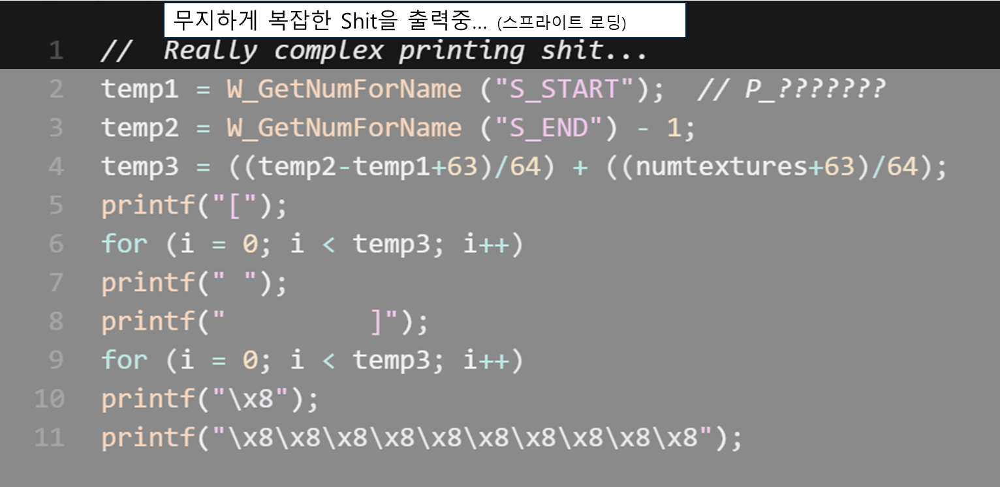
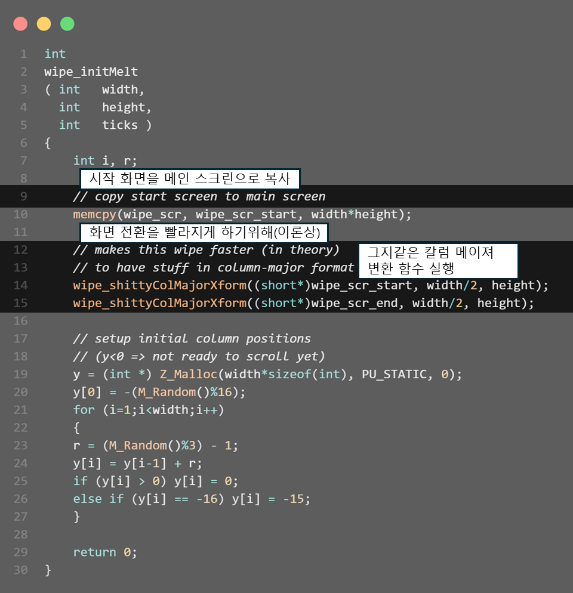
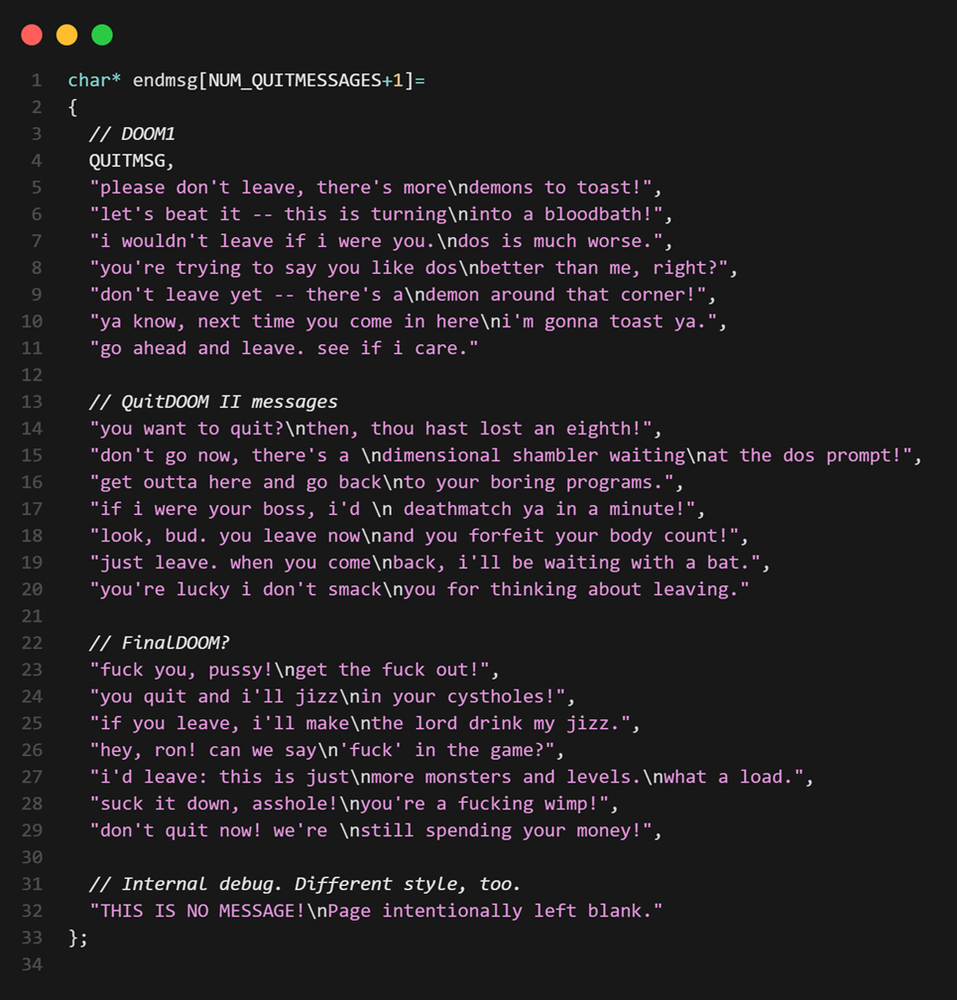

 

    

# DOOM

`1993년 12월 10일`에 발매된 이 게임은 FPS라는 게임 장르의 기본적인 플레이 방법을 문자 그대로 **정립**했다 라는 평가를 받고 있다.

개발자들 사이에서 유독 더 인기가 많은데, 이는 오리지널 소스코드를 모두 [깃허브](https://github.com/id-Software/DOOM)에 공개하는 대인배와 같은 행보를 보였던 까닭이다.

    

역사의 한 획을 그었던 **전설의 게임 둠(DOOM)**.

이번 포스트에선 둠의 공개된 소스코드를 통해 [id Software](https://www.idsoftware.com/) 90년대 상남자 개발자들의 코딩 스타일을 살펴보자. 

 

    
     
    <em>컴파일러 경고 따위 상남자들의 기개 앞에선 무의미 하다</em>

 

    
     
    <em>독특하게 무언가를 지칭하는 대명사 "it" 앞에는 항상 "sh"를 붙여주는 관습이 있는 모양이다</em>

 

    
     
    <em>별도 축약어가 있다면 주석에 반드시 "무엇의" 줄임말인지 적어두자</em>

 

    
     
    <em>조건문 진입 전에 어떤 상황에 실행되는 건지 간략하게 주석 처리 해주는 좋은 관습이다</em>

 

    
     
    <em>조건문의 분기가 많아도 마찬가지다. 반복문에도 적어두자</em>

 

    
     
    <em>복잡한 로직 전 코드의 역할이 무엇인지 명시</em>

 

    
     
    <em>함수명을 지을 땐 함수의 명확한 역할을 내포하는게 좋다</em>

 

    
     
    <em>이건 주석이 아니라 게임 종료시 나오는 메시지이다</em>ㅤ(번역할 엄두가 안 난다)

  

## 마치며

이처럼 DOOM의 소스코드는 90년대 개발자들의 자유분방한 코딩 스타일을 그대로 보여준다.

요즘은 코드 리뷰와 협업 도구가 발달해서 이런 주석을 보기 힘들지만, 당시에는 이런 것이 개발자들의 일상이었다.

 

 > 지금 다니는 회사에서도 이러한 방식을 참고해 코드를 작성해보자.
 >
 > 시니어 엔지니어의 애정어린 관심을 독차지 할 수 있을 것이다.
